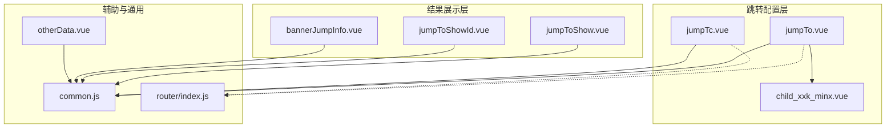
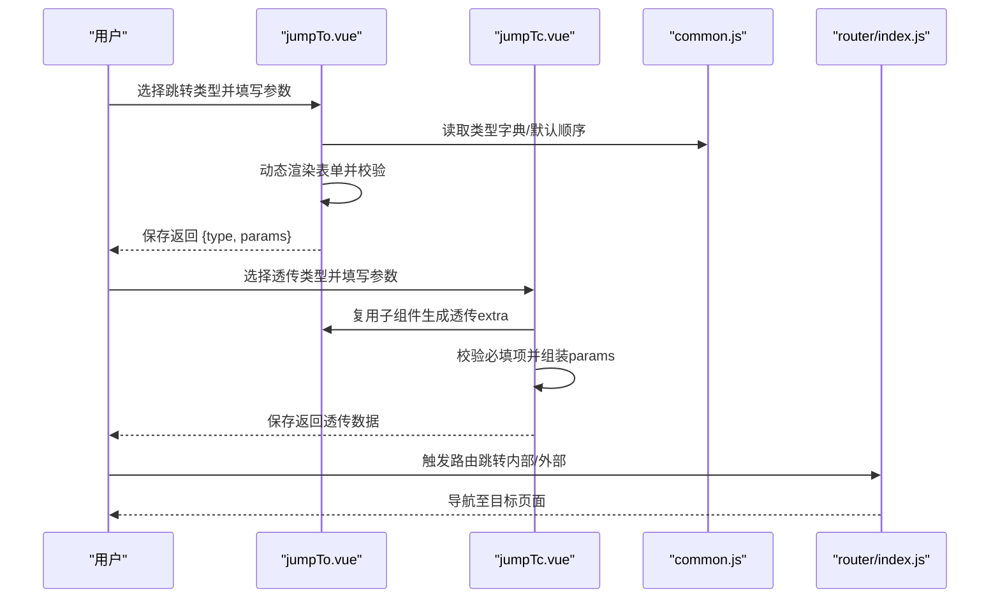
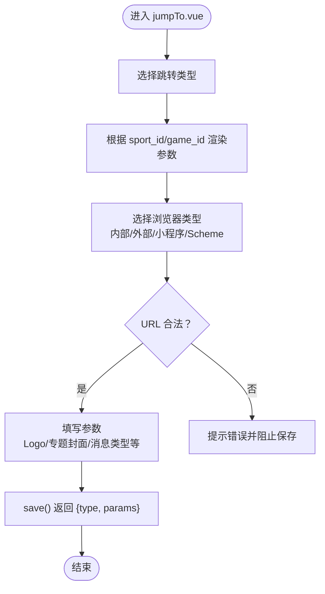
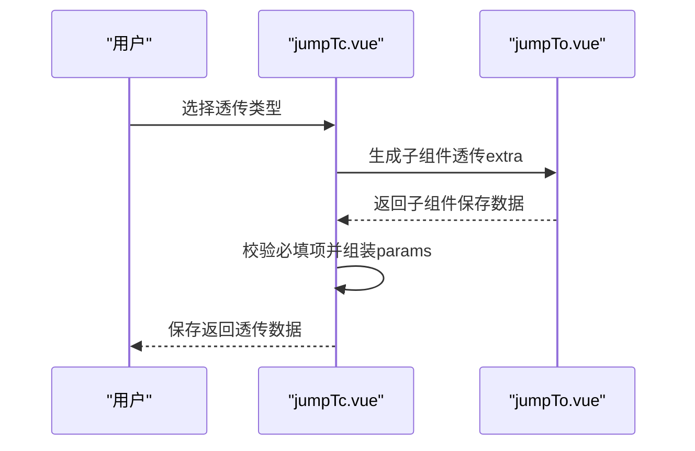
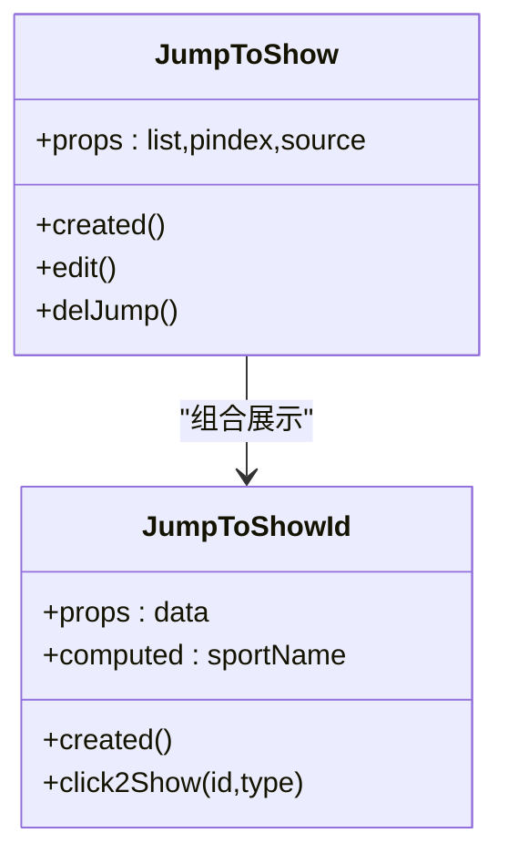
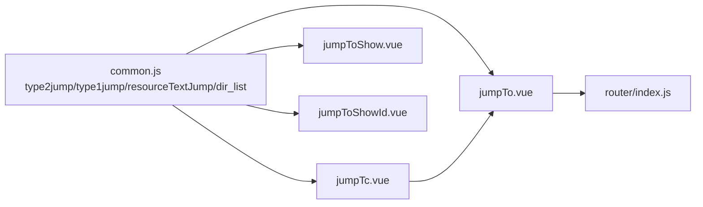

# 跳转导航组件

<cite>
**本文引用的文件**
- [jumpTo.vue](file://src/components/jumpTo/jumpTo.vue)
- [jumpTc.vue](file://src/components/jumpTo/jumpTc.vue)
- [jumpToShow.vue](file://src/components/jumpTo/jumpToShow.vue)
- [jumpToShowId.vue](file://src/components/jumpTo/jumpToShowId.vue)
- [bannerJumpInfo.vue](file://src/components/jumpTo/bannerJumpInfo.vue)
- [child_xxk_minx.vue](file://src/components/jumpTo/child_xxk_minx.vue)
- [otherData.vue](file://src/components/jumpTo/otherData.vue)
- [common.js](file://src/utils/dict/common.js)
- [index.js](file://src/router/index.js)
</cite>

## 目录
1. [简介](#简介)
2. [项目结构](#项目结构)
3. [核心组件](#核心组件)
4. [架构总览](#架构总览)
5. [详细组件分析](#详细组件分析)
6. [依赖关系分析](#依赖关系分析)
7. [性能考量](#性能考量)
8. [故障排查指南](#故障排查指南)
9. [结论](#结论)
10. [附录](#附录)

## 简介
本技术文档围绕“跳转导航组件”展开，系统性梳理其设计架构、实现策略与扩展能力，覆盖页面跳转、外部链接跳转、内部路由跳转、透传跳转、参数传递与目标页面解析等核心功能。文档同时阐述组件与路由系统的集成方式、导航守卫的应用边界、以及在不同业务场景下的使用案例与最佳实践。

## 项目结构
跳转导航组件位于 components/jumpTo 目录，围绕“跳转配置 + 结果展示 + 透传配置”的三层结构组织：
- 跳转配置层：jumpTo.vue、jumpTc.vue、child_xxk_minx.vue
- 结果展示层：jumpToShow.vue、jumpToShowId.vue、bannerJumpInfo.vue
- 辅助与通用：otherData.vue、common.js（字典与类型定义）、router/index.js（路由入口）

图表来源
- [jumpTo.vue:1-200](file://src/components/jumpTo/jumpTo.vue#L1-L200)
- [jumpTc.vue:1-200](file://src/components/jumpTo/jumpTc.vue#L1-L200)
- [jumpToShow.vue:1-120](file://src/components/jumpTo/jumpToShow.vue#L1-L120)
- [jumpToShowId.vue:1-120](file://src/components/jumpTo/jumpToShowId.vue#L1-L120)
- [bannerJumpInfo.vue:1-120](file://src/components/jumpTo/bannerJumpInfo.vue#L1-L120)
- [child_xxk_minx.vue:1-113](file://src/components/jumpTo/child_xxk_minx.vue#L1-L113)
- [otherData.vue:1-120](file://src/components/jumpTo/otherData.vue#L1-L120)
- [common.js:400-523](file://src/utils/dict/common.js#L400-L523)
- [index.js:31-177](file://src/router/index.js#L31-L177)

章节来源
- [jumpTo.vue:1-200](file://src/components/jumpTo/jumpTo.vue#L1-L200)
- [jumpTc.vue:1-200](file://src/components/jumpTo/jumpTc.vue#L1-L200)
- [common.js:400-523](file://src/utils/dict/common.js#L400-L523)
- [index.js:31-177](file://src/router/index.js#L31-L177)

## 核心组件
- jumpTo.vue：通用跳转配置面板，支持多种跳转类型（网页、帖子、文章、比赛、比分页、教练、足彩文章、资料库队伍/队员/赛事、用户、消息列表、资讯、专题、预测号文章/专家号、充值页、热门话题、社区圈子、资讯频道、重要节目、小工具、明细、专家号榜单/天梯、解盘直播、设置、我的足迹、我的好友等），并根据类型动态渲染参数表单，支持浏览器类型、URL、高度、导航栏、标题栏颜色、小程序参数、Logo、专题封面等。
- jumpTc.vue：透传跳转配置面板，支持维护状态、未读消息、用户下线、用户升级、APP弹窗消息、网页消息弹窗、完成订单、实时分析等透传场景，内部复用 jumpTo.vue 作为子组件以生成透传参数。
- jumpToShow.vue / jumpToShowId.vue：跳转结果可视化展示，按类型展示标签、图标、标题、参数摘要与操作按钮（编辑/删除）。
- bannerJumpInfo.vue：横幅跳转信息展示，针对不同类型输出对应字段与可点击跳转。
- child_xxk_minx.vue：二级栏目（match/tab）映射逻辑，依据 sport_id/game_id/type 动态生成 tab 列表。
- otherData.vue：通用跳转数据展示与快速跳转（编辑/查看）。
- common.js：跳转类型字典 type2jump、透传类型 type1jump、资源搜索映射 resourceTextJump、默认跳转顺序 jumpListDefault、图片目录 dir_list 等。
- router/index.js：路由常量与异步路由，为跳转组件提供导航目标的上下文。

章节来源
- [jumpTo.vue:1-200](file://src/components/jumpTo/jumpTo.vue#L1-L200)
- [jumpTc.vue:1-200](file://src/components/jumpTo/jumpTc.vue#L1-L200)
- [jumpToShow.vue:1-120](file://src/components/jumpTo/jumpToShow.vue#L1-L120)
- [jumpToShowId.vue:1-120](file://src/components/jumpTo/jumpToShowId.vue#L1-L120)
- [bannerJumpInfo.vue:1-120](file://src/components/jumpTo/bannerJumpInfo.vue#L1-L120)
- [child_xxk_minx.vue:1-113](file://src/components/jumpTo/child_xxk_minx.vue#L1-L113)
- [otherData.vue:1-120](file://src/components/jumpTo/otherData.vue#L1-L120)
- [common.js:400-523](file://src/utils/dict/common.js#L400-L523)
- [index.js:31-177](file://src/router/index.js#L31-L177)

## 架构总览
跳转组件采用“配置-校验-保存-展示”的闭环流程：
- 配置层：根据 type 与 sport_id/game_id 动态渲染参数表单，支持浏览器类型、URL、Logo、专题封面、消息类型、频道、工具箱、专家号榜单等。
- 校验层：在 jumpTc.vue 的 save() 中对透传场景进行必填校验与参数组装。
- 保存层：jumpTo.vue 提供 save() 返回标准化的 {type, params} 对象；jumpTc.vue 在不同透传类型下分别格式化 params。
- 展示层：jumpToShow.vue/jumpToShowId.vue 与 bannerJumpInfo.vue 将最终跳转对象渲染为可读信息与可点击操作。

图表来源
- [jumpTo.vue:799-825](file://src/components/jumpTo/jumpTo.vue#L799-L825)
- [jumpTc.vue:334-523](file://src/components/jumpTo/jumpTc.vue#L334-L523)
- [common.js:400-523](file://src/utils/dict/common.js#L400-L523)
- [index.js:31-177](file://src/router/index.js#L31-L177)

章节来源
- [jumpTo.vue:799-825](file://src/components/jumpTo/jumpTo.vue#L799-L825)
- [jumpTc.vue:334-523](file://src/components/jumpTo/jumpTc.vue#L334-L523)
- [common.js:400-523](file://src/utils/dict/common.js#L400-L523)
- [index.js:31-177](file://src/router/index.js#L31-L177)

## 详细组件分析

### jumpTo.vue：通用跳转配置
- 设计要点
  - 通过 type2jump 与 jumpListDefault 控制跳转类型下拉顺序与显示名称。
  - 根据 sport_id/game_id 动态渲染运动类型与游戏类型，支持二级栏目（match/tab）映射。
  - 支持浏览器类型（内部/外部/小程序/Scheme）、URL 校验、高度、导航栏、标题栏颜色、小程序颜色与标题色等。
  - 支持 Logo 上传与专题封面上传，统一使用 dir_list。
  - 支持资源搜索组件联动，按类型映射 resourceTextJump。
- 参数传递与目标解析
  - 保存时返回 {type, params}，其中 params 包含各业务参数（如 post_id、match_id、intelligence_id、sport_id、game_id、tab、msg_type、channel_id、tool_id、tab_id、kind、uid 等）。
  - 初始化时支持 propData 分层数据，避免深层嵌套丢失响应式。
- 与路由系统集成
  - 内部跳转通过 router.push 或内部组件打开；外部跳转通过 window.open 或 Scheme 跳转。
  - 与 router/index.js 的常量路由配合，确保跳转目标合法。

图表来源
- [jumpTo.vue:1-200](file://src/components/jumpTo/jumpTo.vue#L1-L200)
- [jumpTo.vue:799-825](file://src/components/jumpTo/jumpTo.vue#L799-L825)
- [common.js:400-523](file://src/utils/dict/common.js#L400-L523)

章节来源
- [jumpTo.vue:1-200](file://src/components/jumpTo/jumpTo.vue#L1-L200)
- [jumpTo.vue:799-825](file://src/components/jumpTo/jumpTo.vue#L799-L825)
- [common.js:400-523](file://src/utils/dict/common.js#L400-L523)

### jumpTc.vue：透传跳转配置
- 设计要点
  - 透传类型由 type1jump 定义，涵盖维护状态、未读消息、用户下线、用户升级、APP 弹窗消息、网页消息弹窗、完成订单、实时分析等。
  - 复用 jumpTo.vue 作为子组件生成透传 extra，支持确定/取消按钮文案与额外跳转。
  - save() 方法对必填项进行校验，组装 params 并返回标准化透传数据。
- 参数传递与目标解析
  - 不同透传类型对 params 的要求不同（如 uid、msg_count、inbox_count、level、credit、url、pay_type、yop_pay_type、product_id、data 等）。
  - 实时分析场景预设默认 params（如 type=5、sport_id=1），并允许外部初始化。

图表来源
- [jumpTc.vue:1-200](file://src/components/jumpTo/jumpTc.vue#L1-L200)
- [jumpTc.vue:334-523](file://src/components/jumpTo/jumpTc.vue#L334-L523)

章节来源
- [jumpTc.vue:1-200](file://src/components/jumpTo/jumpTc.vue#L1-L200)
- [jumpTc.vue:334-523](file://src/components/jumpTo/jumpTc.vue#L334-L523)

### jumpToShow.vue / jumpToShowId.vue：跳转结果展示
- 设计要点
  - jumpToShow.vue：展示跳转列表，支持 logo、标签、标题、编辑/删除操作。
  - jumpToShowId.vue：按类型渲染参数摘要（如比赛ID、资讯ID、专题ID、消息类型、工具箱 tab、专家号组别等），并提供快速跳转。
- 与权限/路由结合
  - 使用 sportTypeName、PERLT、predictTypeStr、matchJumpMoudelType 等字典进行标签化展示。
  - 针对部分类型提供 click2Show 快速跳转至详情页。

图表来源
- [jumpToShow.vue:1-120](file://src/components/jumpTo/jumpToShow.vue#L1-L120)
- [jumpToShowId.vue:1-120](file://src/components/jumpTo/jumpToShowId.vue#L1-L120)

章节来源
- [jumpToShow.vue:1-120](file://src/components/jumpTo/jumpToShow.vue#L1-L120)
- [jumpToShowId.vue:1-120](file://src/components/jumpTo/jumpToShowId.vue#L1-L120)

### bannerJumpInfo.vue：横幅跳转信息展示
- 设计要点
  - 针对不同 type 输出对应字段与可点击跳转（如帖子、文章、雷速号、比赛、资讯、专题等）。
  - 支持权限控制（如无权限时以红色显示，有权限时蓝色可点击）。

章节来源
- [bannerJumpInfo.vue:1-120](file://src/components/jumpTo/bannerJumpInfo.vue#L1-L120)

### child_xxk_minx.vue：二级栏目映射
- 设计要点
  - 根据 sport_id 与 game_id 映射 match/tab 列表，支持足球、篮球、网球、电竞（LOL/CSGO/DOTA/KOG）等。
  - 依据 type（比赛/队伍/球员/赛事）决定是否显示二级栏目。

章节来源
- [child_xxk_minx.vue:1-113](file://src/components/jumpTo/child_xxk_minx.vue#L1-L113)

### otherData.vue：通用跳转数据展示
- 设计要点
  - 面向“无呼出弹窗功能”的跳转类型，直接展示数据键值。
  - 提供编辑/查看能力（如编辑帖子、查看文章、查看用户信息）。

章节来源
- [otherData.vue:1-120](file://src/components/jumpTo/otherData.vue#L1-L120)

## 依赖关系分析
- 字典与类型
  - type2jump：跳转类型映射，决定下拉顺序与显示名称。
  - type1jump：透传类型映射。
  - resourceTextJump：资源搜索组件类型映射。
  - jumpListDefault：默认跳转顺序。
  - dir_list：图片上传目录映射。
- 组件耦合
  - jumpTc.vue 复用 jumpTo.vue 生成透传 extra，降低重复逻辑。
  - jumpToShow.vue/jumpToShowId.vue 依赖 common.js 的字典进行标签化展示。
- 路由集成
  - jumpTo.vue 与 router/index.js 协作，确保内部跳转目标合法。

图表来源
- [common.js:400-523](file://src/utils/dict/common.js#L400-L523)
- [jumpTo.vue:1-200](file://src/components/jumpTo/jumpTo.vue#L1-L200)
- [jumpTc.vue:1-200](file://src/components/jumpTo/jumpTc.vue#L1-L200)
- [jumpToShow.vue:1-120](file://src/components/jumpTo/jumpToShow.vue#L1-L120)
- [jumpToShowId.vue:1-120](file://src/components/jumpTo/jumpToShowId.vue#L1-L120)
- [index.js:31-177](file://src/router/index.js#L31-L177)

章节来源
- [common.js:400-523](file://src/utils/dict/common.js#L400-L523)
- [jumpTo.vue:1-200](file://src/components/jumpTo/jumpTo.vue#L1-L200)
- [jumpTc.vue:1-200](file://src/components/jumpTo/jumpTc.vue#L1-L200)
- [jumpToShow.vue:1-120](file://src/components/jumpTo/jumpToShow.vue#L1-L120)
- [jumpToShowId.vue:1-120](file://src/components/jumpTo/jumpToShowId.vue#L1-L120)
- [index.js:31-177](file://src/router/index.js#L31-L177)

## 性能考量
- 动态渲染与条件展示：通过 v-if/v-show 按类型与 sport_id/game_id 条件渲染，减少不必要的 DOM 开销。
- 响应式数据：emitData 与 params 分离，避免深层嵌套导致的性能问题；提供 init() 时的深拷贝以保证响应式。
- 透传组件复用：jumpTc.vue 复用 jumpTo.vue 生成 extra，避免重复逻辑与重复渲染。
- 图片上传：统一 dir_list，便于缓存与资源管理。

## 故障排查指南
- 透传类型必填校验失败
  - 现象：保存透传数据时报错“请选择用户”或“请填写确定/取消按钮文案”等。
  - 排查：检查 jumpTc.vue 的 save() 校验分支，确认 uid、文案、图片等必填项是否填写。
- 浏览器类型与 URL 校验
  - 现象：保存网页跳转时报错“请填写 http/https 开头的 URL”或“请填写非 http/https 开头的 Scheme URL”。
  - 排查：检查 jumpTo.vue 的 selectBrowser 逻辑与 URL 校验规则。
- 二级栏目不显示
  - 现象：选择运动类型后未出现二级栏目。
  - 排查：确认 child_xxk_minx.vue 的 showXXK() 返回值与 sport_id/game_id 是否满足条件。
- 结果展示标签缺失
  - 现象：jumpToShowId.vue 中某些类型未显示标签。
  - 排查：检查 common.js 中对应字典（如 sportTypeName、predictTypeStr、matchJumpMoudelType）是否存在映射。

章节来源
- [jumpTc.vue:334-523](file://src/components/jumpTo/jumpTc.vue#L334-L523)
- [jumpTo.vue:799-825](file://src/components/jumpTo/jumpTo.vue#L799-L825)
- [child_xxk_minx.vue:58-113](file://src/components/jumpTo/child_xxk_minx.vue#L58-L113)
- [jumpToShowId.vue:350-408](file://src/components/jumpTo/jumpToShowId.vue#L350-L408)

## 结论
跳转导航组件通过清晰的配置-校验-保存-展示闭环，实现了对多种跳转类型的统一管理与灵活扩展。其与字典系统、路由系统及资源上传体系紧密协作，既满足运营侧的多样化需求，又保持了良好的可维护性与可扩展性。建议在实际业务中遵循“先配置、再校验、后保存、最后展示”的流程，确保跳转行为的一致性与安全性。

## 附录
- 使用场景与最佳实践
  - 网页跳转：优先使用内部跳转，必要时使用外部跳转或 Scheme；注意 URL 校验与浏览器类型选择。
  - 资源跳转：利用资源搜索组件联动，确保资源 ID 与类型一致。
  - 透传跳转：严格遵循 jumpTc.vue 的校验规则，确保 uid、文案、图片等必填项完整。
  - 结果展示：在 jumpToShow.vue/jumpToShowId.vue 中提供清晰的标签与可点击操作，提升可读性与可操作性。
- 扩展建议
  - 新增跳转类型：在 type2jump 与 jumpListDefault 中新增映射与顺序，补充 jumpTo.vue 的表单渲染逻辑。
  - 新增透传类型：在 type1jump 中新增映射，在 jumpTc.vue 的 save() 中补充校验与组装逻辑。
  - 自定义展示：在 jumpToShow.vue/jumpToShowId.vue 中增加新的类型分支与标签映射。