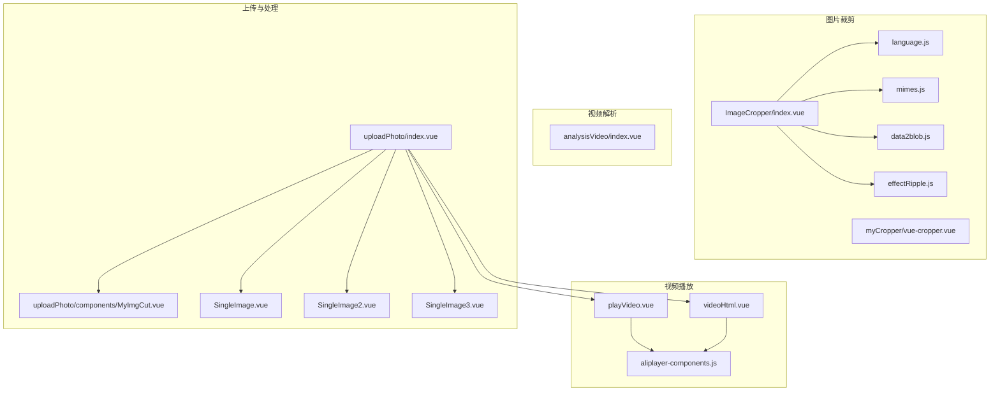
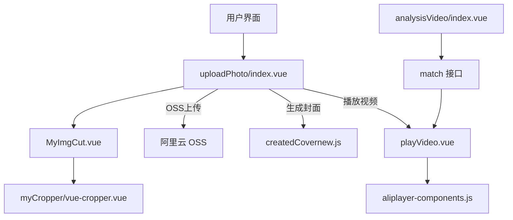
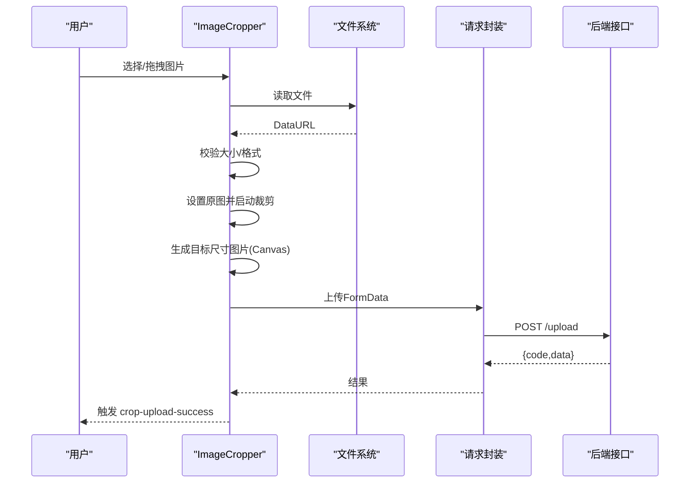
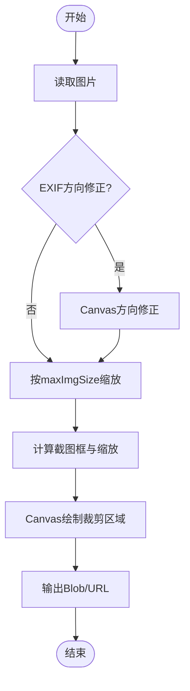
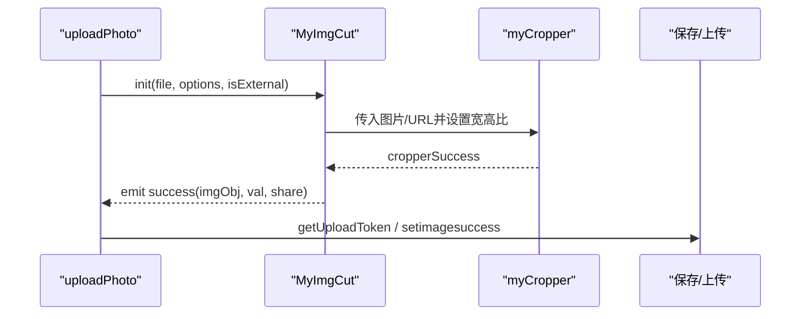
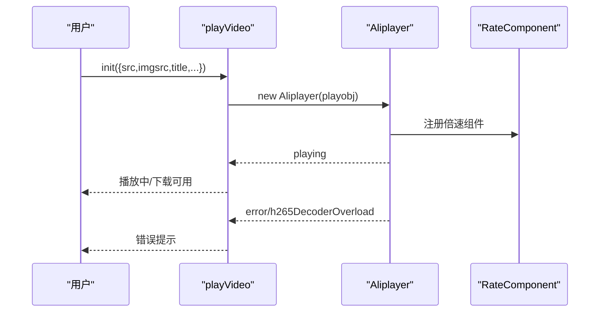
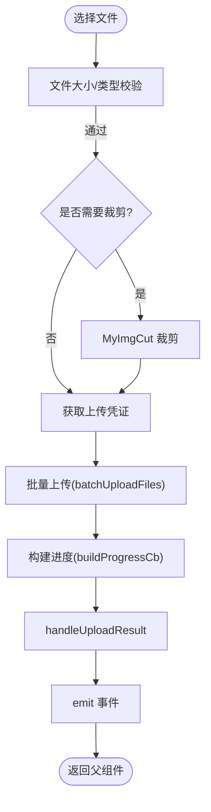
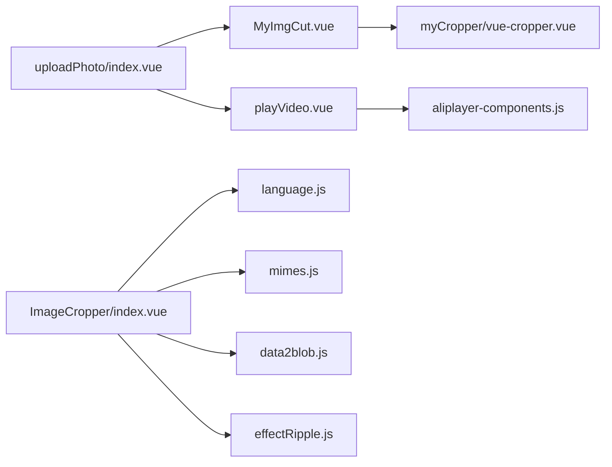

# 通用工具组件

<cite>
**本文引用的文件**
- [ImageCropper/index.vue](file://src/components/ImageCropper/index.vue)
- [myCropper/vue-cropper.vue](file://src/components/myCropper/vue-cropper.vue)
- [ImageCropper/utils/language.js](file://src/components/ImageCropper/utils/language.js)
- [ImageCropper/utils/mimes.js](file://src/components/ImageCropper/utils/mimes.js)
- [ImageCropper/utils/data2blob.js](file://src/components/ImageCropper/utils/data2blob.js)
- [ImageCropper/utils/effectRipple.js](file://src/components/ImageCropper/utils/effectRipple.js)
- [analysisVideo/index.vue](file://src/components/analysisVideo/index.vue)
- [playVideo.vue](file://src/components/leisu/playVideo.vue)
- [videoHtml.vue](file://src/components/leisu/videoHtml.vue)
- [aliplayer-components.js](file://src/utils/aliplayer-components.js)
- [SingleImage.vue](file://src/components/Upload/SingleImage.vue)
- [SingleImage2.vue](file://src/components/Upload/SingleImage2.vue)
- [SingleImage3.vue](file://src/components/Upload/SingleImage3.vue)
- [uploadPhoto/index.vue](file://src/components/uploadPhoto/index.vue)
- [uploadPhoto/components/MyImgCut.vue](file://src/components/uploadPhoto/components/MyImgCut.vue)
</cite>

## 目录
1. [简介](#简介)
2. [项目结构](#项目结构)
3. [核心组件](#核心组件)
4. [架构总览](#架构总览)
5. [详细组件分析](#详细组件分析)
6. [依赖关系分析](#依赖关系分析)
7. [性能考虑](#性能考虑)
8. [故障排查指南](#故障排查指南)
9. [结论](#结论)
10. [附录](#附录)

## 简介
本技术文档聚焦于项目中的通用工具组件，涵盖图片裁剪、视频播放与视频处理等常用能力。通过对组件的结构、数据流、事件机制与扩展性进行系统化梳理，帮助开发者快速理解与集成这些工具组件，并在不同业务场景中高效落地。

## 项目结构
围绕“通用工具组件”，项目中主要涉及以下模块：
- 图片裁剪：ImageCropper（基础版）、myCropper（增强版）
- 视频播放：playVideo（对话框播放器）、videoHtml（内嵌播放器）
- 视频解析：analysisVideo（解析工具）
- 上传与处理：uploadPhoto（通用上传组件）、SingleImage 系列（单图上传）

图表来源
- [ImageCropper/index.vue:1-1779](file://src/components/ImageCropper/index.vue#L1-L1779)
- [myCropper/vue-cropper.vue:1-2018](file://src/components/myCropper/vue-cropper.vue#L1-L2018)
- [ImageCropper/utils/language.js:1-233](file://src/components/ImageCropper/utils/language.js#L1-L233)
- [ImageCropper/utils/mimes.js:1-8](file://src/components/ImageCropper/utils/mimes.js#L1-L8)
- [ImageCropper/utils/data2blob.js:1-20](file://src/components/ImageCropper/utils/data2blob.js#L1-L20)
- [ImageCropper/utils/effectRipple.js:1-40](file://src/components/ImageCropper/utils/effectRipple.js#L1-L40)
- [playVideo.vue:1-227](file://src/components/leisu/playVideo.vue#L1-L227)
- [videoHtml.vue:1-188](file://src/components/leisu/videoHtml.vue#L1-L188)
- [aliplayer-components.js:1-6336](file://src/utils/aliplayer-components.js#L1-L6336)
- [uploadPhoto/index.vue:1-1369](file://src/components/uploadPhoto/index.vue#L1-L1369)
- [uploadPhoto/components/MyImgCut.vue:1-407](file://src/components/uploadPhoto/components/MyImgCut.vue#L1-L407)
- [SingleImage.vue:1-135](file://src/components/Upload/SingleImage.vue#L1-L135)
- [SingleImage2.vue:1-131](file://src/components/Upload/SingleImage2.vue#L1-L131)
- [SingleImage3.vue:1-158](file://src/components/Upload/SingleImage3.vue#L1-L158)

章节来源
- [ImageCropper/index.vue:1-1779](file://src/components/ImageCropper/index.vue#L1-L1779)
- [myCropper/vue-cropper.vue:1-2018](file://src/components/myCropper/vue-cropper.vue#L1-L2018)
- [analysisVideo/index.vue:1-97](file://src/components/analysisVideo/index.vue#L1-L97)
- [playVideo.vue:1-227](file://src/components/leisu/playVideo.vue#L1-L227)
- [videoHtml.vue:1-188](file://src/components/leisu/videoHtml.vue#L1-L188)
- [uploadPhoto/index.vue:1-1369](file://src/components/uploadPhoto/index.vue#L1-L1369)
- [uploadPhoto/components/MyImgCut.vue:1-407](file://src/components/uploadPhoto/components/MyImgCut.vue#L1-L407)
- [SingleImage.vue:1-135](file://src/components/Upload/SingleImage.vue#L1-L135)
- [SingleImage2.vue:1-131](file://src/components/Upload/SingleImage2.vue#L1-L131)
- [SingleImage3.vue:1-158](file://src/components/Upload/SingleImage3.vue#L1-L158)

## 核心组件
- 图片裁剪组件
  - ImageCropper：支持拖拽/点击选择、预览、旋转、缩放、方形/圆形预览、多语言、跨域上传等。
  - myCropper：基于 Canvas 的增强裁剪，支持 EXIF 方向修正、多点触控缩放、固定宽高比、截图框拖动与调整。
  - MyImgCut（uploadPhoto 子组件）：封装裁剪弹窗、水印、原图上传、宽高比锁定等。
- 视频播放组件
  - playVideo：对话框内播放，支持倍速、封面、下载、错误处理、自动重试。
  - videoHtml：内嵌播放器，支持响应式尺寸、封面、错误处理。
  - aliplayer-components：播放器组件库（倍速等）。
- 视频解析组件
  - analysisVideo：解析 Scheme 地址，支持导入。
- 上传与处理组件
  - uploadPhoto：通用上传组件，支持图片/视频/音频/json 动画，批量上传、进度弹窗、封面生成、裁剪集成。
  - SingleImage 系列：基于 Element Upload 的单图上传封装，支持七牛 Token 获取与上传。

章节来源
- [ImageCropper/index.vue:144-226](file://src/components/ImageCropper/index.vue#L144-L226)
- [myCropper/vue-cropper.vue:119-299](file://src/components/myCropper/vue-cropper.vue#L119-L299)
- [uploadPhoto/components/MyImgCut.vue:118-148](file://src/components/uploadPhoto/components/MyImgCut.vue#L118-L148)
- [playVideo.vue:54-71](file://src/components/leisu/playVideo.vue#L54-L71)
- [videoHtml.vue:29-31](file://src/components/leisu/videoHtml.vue#L29-L31)
- [analysisVideo/index.vue:40-51](file://src/components/analysisVideo/index.vue#L40-L51)
- [uploadPhoto/index.vue:184-330](file://src/components/uploadPhoto/index.vue#L184-L330)
- [SingleImage.vue:31-77](file://src/components/Upload/SingleImage.vue#L31-L77)

## 架构总览
整体架构围绕“选择/裁剪/上传/播放”闭环展开，上传组件与裁剪组件解耦，播放组件独立于上传链路，解析组件提供外部资源接入能力。

图表来源
- [uploadPhoto/index.vue:174-186](file://src/components/uploadPhoto/index.vue#L174-L186)
- [uploadPhoto/components/MyImgCut.vue:118-148](file://src/components/uploadPhoto/components/MyImgCut.vue#L118-L148)
- [myCropper/vue-cropper.vue:119-299](file://src/components/myCropper/vue-cropper.vue#L119-L299)
- [playVideo.vue:54-71](file://src/components/leisu/playVideo.vue#L54-L71)
- [aliplayer-components.js:1-6336](file://src/utils/aliplayer-components.js#L1-L6336)
- [analysisVideo/index.vue:39-42](file://src/components/analysisVideo/index.vue#L39-L42)

## 详细组件分析

### 图片裁剪组件（ImageCropper）
- 功能特性
  - 支持拖拽/点击选择图片、预览、旋转、缩放、方形/圆形预览。
  - 多语言、跨域上传、错误提示、步骤化 UI（选择/裁剪/上传）。
  - 生成指定宽高的图片并转 Blob 上传。
- 配置参数
  - 基础：field、ki、value、url、params、headers、withCredentials。
  - 裁剪：width、height、noRotate、noCircle、noSquare。
  - 限制：maxSize、langType、langExt、imgFormat。
- 事件与回调
  - 输入关闭：input(false)、close。
  - 上传成功：crop-upload-success。
  - 裁剪成功：crop-success。
- 数据流与算法
  - 读取文件 -> 校验 -> 设置原图 -> 启动裁剪 -> 生成目标尺寸图片 -> 上传。
  - 缩放与旋转采用 Canvas 变换，预览容器按比例适配。

图表来源
- [ImageCropper/index.vue:443-539](file://src/components/ImageCropper/index.vue#L443-L539)
- [ImageCropper/index.vue:750-800](file://src/components/ImageCropper/index.vue#L750-L800)
- [ImageCropper/utils/data2blob.js:8-19](file://src/components/ImageCropper/utils/data2blob.js#L8-L19)

章节来源
- [ImageCropper/index.vue:144-226](file://src/components/ImageCropper/index.vue#L144-L226)
- [ImageCropper/index.vue:443-539](file://src/components/ImageCropper/index.vue#L443-L539)
- [ImageCropper/index.vue:750-800](file://src/components/ImageCropper/index.vue#L750-L800)
- [ImageCropper/utils/language.js:1-233](file://src/components/ImageCropper/utils/language.js#L1-L233)
- [ImageCropper/utils/mimes.js:1-8](file://src/components/ImageCropper/utils/mimes.js#L1-L8)
- [ImageCropper/utils/data2blob.js:1-20](file://src/components/ImageCropper/utils/data2blob.js#L1-L20)
- [ImageCropper/utils/effectRipple.js:1-40](file://src/components/ImageCropper/utils/effectRipple.js#L1-L40)

### 图片裁剪组件（myCropper）
- 功能特性
  - 基于 Canvas 的裁剪，支持 EXIF 方向修正、多点触控缩放、固定宽高比、截图框拖动与调整。
  - 支持输出 JPEG/PNG 等类型、DPR 输出、高清预览。
- 配置参数
  - 基础：img、outputSize、outputType、info、canScale、autoCrop、autoCropWidth、autoCropHeight。
  - 约束：fixed、fixedNumber、fixedBox、full、canMove、canMoveBox、original、centerBox、high、infoTrue、maxImgSize、enlarge、mode。
- 事件与回调
  - 图片加载：imgLoad、img-load。
  - 图片移动：imgMoving、img-moving。
  - 截图框变更：watch cropW/cropH/cropOffsertX/Y/scale/x/y 等。
- 数据流与算法
  - 读取图片 -> EXIF 方向修正 -> 缩放到 maxImgSize -> 计算缩放与偏移 -> 截取 -> 输出 Blob。

图表来源
- [myCropper/vue-cropper.vue:474-534](file://src/components/myCropper/vue-cropper.vue#L474-L534)
- [myCropper/vue-cropper.vue:591-652](file://src/components/myCropper/vue-cropper.vue#L591-L652)
- [myCropper/vue-cropper.vue:754-800](file://src/components/myCropper/vue-cropper.vue#L754-L800)

章节来源
- [myCropper/vue-cropper.vue:119-299](file://src/components/myCropper/vue-cropper.vue#L119-L299)
- [myCropper/vue-cropper.vue:474-534](file://src/components/myCropper/vue-cropper.vue#L474-L534)
- [myCropper/vue-cropper.vue:591-652](file://src/components/myCropper/vue-cropper.vue#L591-L652)
- [myCropper/vue-cropper.vue:754-800](file://src/components/myCropper/vue-cropper.vue#L754-L800)

### 图片裁剪组件（uploadPhoto/MyImgCut）
- 功能特性
  - 封装裁剪弹窗、水印、原图上传、宽高比锁定、描述 SEO。
  - 支持外部 URL 转 Base64、比例换算、滑块调节水印大小。
- 集成点
  - 与 uploadPhoto 组件联动，作为裁剪入口与结果回传。
- 事件与回调
  - 成功：success(imgObj, val, share)。
  - 替换：replaceUPload。
  - 错误：error。

图表来源
- [uploadPhoto/components/MyImgCut.vue:242-288](file://src/components/uploadPhoto/components/MyImgCut.vue#L242-L288)
- [uploadPhoto/components/MyImgCut.vue:290-296](file://src/components/uploadPhoto/components/MyImgCut.vue#L290-L296)
- [uploadPhoto/index.vue:629-647](file://src/components/uploadPhoto/index.vue#L629-L647)

章节来源
- [uploadPhoto/components/MyImgCut.vue:118-148](file://src/components/uploadPhoto/components/MyImgCut.vue#L118-L148)
- [uploadPhoto/components/MyImgCut.vue:242-288](file://src/components/uploadPhoto/components/MyImgCut.vue#L242-L288)
- [uploadPhoto/components/MyImgCut.vue:290-296](file://src/components/uploadPhoto/components/MyImgCut.vue#L290-L296)
- [uploadPhoto/index.vue:629-647](file://src/components/uploadPhoto/index.vue#L629-L647)

### 视频播放组件（playVideo）
- 功能特性
  - 对话框内播放，支持封面、自动播放、preload、倍速组件、下载、错误处理。
  - 本地缓存倍速，关闭时释放播放器。
- 集成点
  - 通过 props 接收视频源、标题、费用标识等。
- 事件与回调
  - playing、videoUnavailable、h265DecoderOverload、error。

图表来源
- [playVideo.vue:86-204](file://src/components/leisu/playVideo.vue#L86-L204)
- [playVideo.vue:171-202](file://src/components/leisu/playVideo.vue#L171-L202)

章节来源
- [playVideo.vue:54-71](file://src/components/leisu/playVideo.vue#L54-L71)
- [playVideo.vue:86-204](file://src/components/leisu/playVideo.vue#L86-L204)
- [playVideo.vue:171-202](file://src/components/leisu/playVideo.vue#L171-L202)

### 视频播放组件（videoHtml）
- 功能特性
  - 内嵌播放器，支持响应式宽高、封面、错误处理。
  - 支持切换大/小播放器模式，自动计算宽高。
- 集成点
  - 通过 props 接收 rowData、费用标识、播放器 ID 等。

章节来源
- [videoHtml.vue:31-42](file://src/components/leisu/videoHtml.vue#L31-L42)
- [videoHtml.vue:101-184](file://src/components/leisu/videoHtml.vue#L101-L184)

### 视频解析组件（analysisVideo）
- 功能特性
  - 解析 Scheme 地址，支持导入到父组件。
- 集成点
  - 通过 API 获取 Scheme，触发 importVideo 事件。

章节来源
- [analysisVideo/index.vue:40-51](file://src/components/analysisVideo/index.vue#L40-L51)
- [analysisVideo/index.vue:62-94](file://src/components/analysisVideo/index.vue#L62-L94)

### 上传与处理组件（uploadPhoto）
- 功能特性
  - 支持图片/视频/音频/json 动画上传，多种交互模式（按钮/富文本/拖拽）。
  - 批量上传、进度弹窗、封面生成、裁剪集成、水印、原图上传。
- 配置参数
  - uploadBtn/fwb/btnName/btnNameDisabled/size/watermark/dirName/limit/cropping/multiple/need/quantity/sourceOfParent/resourceDel/isUseFlie。
- 事件与回调
  - upImg/successOBJ/videoSuccess/videoSuccessObj/audioSuccess/audioSuccessObj/fileList/editImg/editOBJ/delImg/delvideo/delaudio/successFile。
- 数据流与算法
  - onchange -> 校验 -> [裁剪] -> getUploadToken -> batchUploadFiles -> handleUploadResult -> emit。

图表来源
- [uploadPhoto/index.vue:698-731](file://src/components/uploadPhoto/index.vue#L698-L731)
- [uploadPhoto/index.vue:745-800](file://src/components/uploadPhoto/index.vue#L745-L800)
- [uploadPhoto/index.vue:174-186](file://src/components/uploadPhoto/index.vue#L174-L186)

章节来源
- [uploadPhoto/index.vue:184-330](file://src/components/uploadPhoto/index.vue#L184-L330)
- [uploadPhoto/index.vue:698-731](file://src/components/uploadPhoto/index.vue#L698-L731)
- [uploadPhoto/index.vue:745-800](file://src/components/uploadPhoto/index.vue#L745-L800)

### 单图上传组件（SingleImage 系列）
- 功能特性
  - 基于 Element Upload 的单图上传，支持七牛 Token 获取与上传。
- 集成点
  - 通过 beforeUpload 获取 token/key，on-success 回填 URL。

章节来源
- [SingleImage.vue:31-77](file://src/components/Upload/SingleImage.vue#L31-L77)
- [SingleImage2.vue:28-76](file://src/components/Upload/SingleImage2.vue#L28-L76)
- [SingleImage3.vue:36-85](file://src/components/Upload/SingleImage3.vue#L36-L85)

## 依赖关系分析
- 组件耦合
  - uploadPhoto 与 MyImgCut 强耦合，MyImgCut 依赖 myCropper。
  - playVideo 与 videoHtml 依赖 aliplayer-components。
  - ImageCropper 依赖 utils 下的语言、MIME、Blob 转换与波纹效果。
- 外部依赖
  - 阿里云 OSS 上传（batchUploadFiles）、七牛 Token（getToken）。
  - Element UI Upload 组件。

图表来源
- [uploadPhoto/index.vue:174-186](file://src/components/uploadPhoto/index.vue#L174-L186)
- [uploadPhoto/components/MyImgCut.vue:118-148](file://src/components/uploadPhoto/components/MyImgCut.vue#L118-L148)
- [myCropper/vue-cropper.vue:119-299](file://src/components/myCropper/vue-cropper.vue#L119-L299)
- [playVideo.vue:54-71](file://src/components/leisu/playVideo.vue#L54-L71)
- [ImageCropper/index.vue:144-226](file://src/components/ImageCropper/index.vue#L144-L226)
- [ImageCropper/utils/language.js:1-233](file://src/components/ImageCropper/utils/language.js#L1-L233)
- [ImageCropper/utils/mimes.js:1-8](file://src/components/ImageCropper/utils/mimes.js#L1-L8)
- [ImageCropper/utils/data2blob.js:1-20](file://src/components/ImageCropper/utils/data2blob.js#L1-L20)
- [ImageCropper/utils/effectRipple.js:1-40](file://src/components/ImageCropper/utils/effectRipple.js#L1-L40)

章节来源
- [uploadPhoto/index.vue:174-186](file://src/components/uploadPhoto/index.vue#L174-L186)
- [playVideo.vue:54-71](file://src/components/leisu/playVideo.vue#L54-L71)
- [ImageCropper/index.vue:144-226](file://src/components/ImageCropper/index.vue#L144-L226)

## 性能考虑
- 图片裁剪
  - 使用 Canvas 进行缩放与旋转，建议在移动端控制图片尺寸，避免超大图片导致内存压力。
  - EXIF 方向修正与缩放后生成 Blob，注意内存释放与 URL revoke。
- 视频播放
  - 启用 preload 与 stash 缓冲，合理设置 enableStashBufferForFlv 与 stashInitialSizeForFlv。
  - 在弱设备上避免过高分辨率与高码率视频，必要时降级。
- 上传
  - 批量上传限制并发（如 limit=3），结合进度弹窗提升用户体验。
  - 对大文件进行分片或服务端直传策略，减少前端压力。

## 故障排查指南
- 图片裁剪
  - 无法选择文件：检查浏览器支持与拖拽事件绑定。
  - 生成图片空白：确认 Canvas 绘制顺序与透明背景填充。
  - 上传失败：检查 headers、withCredentials、后端签名逻辑。
- 视频播放
  - 编码不支持：监听 videoUnavailable/h265DecoderOverload，提示用户更换浏览器或设备。
  - 播放报错：捕获 error，根据错误码提示或自动重试。
- 上传
  - 七牛/oss 上传失败：检查 token/key、目录权限、网络状态。
  - 进度不更新：确认 buildProgressCb 与 handleUploadResult 的回调链路。

章节来源
- [playVideo.vue:171-202](file://src/components/leisu/playVideo.vue#L171-L202)
- [uploadPhoto/index.vue:698-731](file://src/components/uploadPhoto/index.vue#L698-L731)

## 结论
本项目提供了完善的通用工具组件体系：图片裁剪覆盖基础与增强场景，视频播放具备对话框与内嵌两种形态，视频解析与上传组件形成完整的媒体处理闭环。通过清晰的参数配置、事件机制与扩展点，开发者可在不同业务场景中灵活组合与定制，快速实现高质量的媒体处理体验。

## 附录
- 集成建议
  - 图片：优先使用 uploadPhoto + MyImgCut，结合 OSS 与裁剪水印。
  - 视频：内嵌场景用 videoHtml，弹窗场景用 playVideo。
  - 解析：analysisVideo 作为外部资源接入入口。
- 扩展建议
  - 增加上传队列与断点续传（OSS/七牛）。
  - 增强裁剪水印的动态配置与模板化。
  - 增加视频转码与封面生成的后台任务对接。