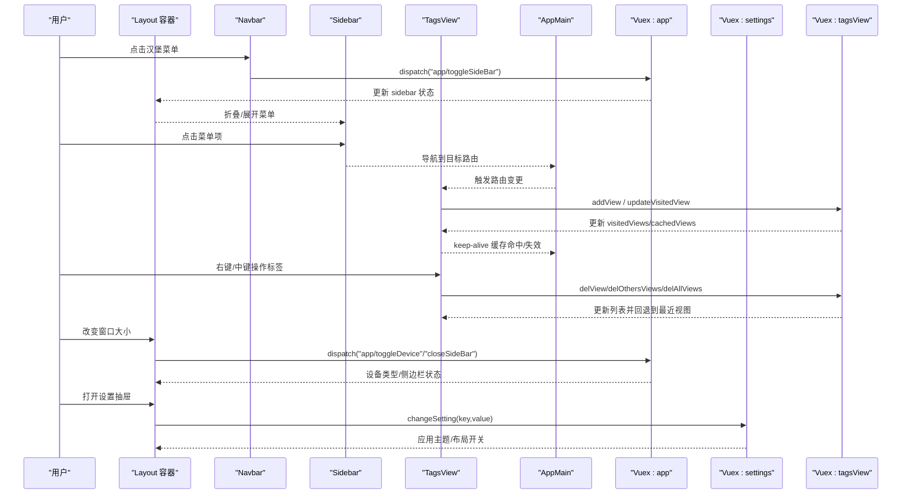
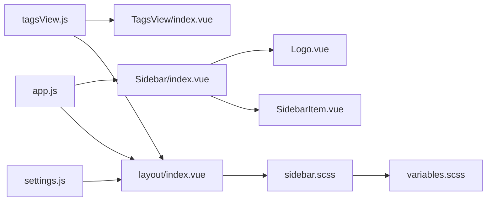

# 布局组件

<cite>
**本文引用的文件**
- [src/layout/index.vue](file://src/layout/index.vue)
- [src/layout/components/AppMain.vue](file://src/layout/components/AppMain.vue)
- [src/layout/components/Navbar.vue](file://src/layout/components/Navbar.vue)
- [src/layout/components/Sidebar/index.vue](file://src/layout/components/Sidebar/index.vue)
- [src/layout/components/Sidebar/SidebarItem.vue](file://src/layout/components/Sidebar/SidebarItem.vue)
- [src/layout/components/Sidebar/Logo.vue](file://src/layout/components/Sidebar/Logo.vue)
- [src/layout/components/TagsView/index.vue](file://src/layout/components/TagsView/index.vue)
- [src/layout/components/TagsView/ScrollPane.vue](file://src/layout/components/TagsView/ScrollPane.vue)
- [src/layout/components/Settings/index.vue](file://src/layout/components/Settings/index.vue)
- [src/layout/mixin/ResizeHandler.js](file://src/layout/mixin/ResizeHandler.js)
- [src/styles/sidebar.scss](file://src/styles/sidebar.scss)
- [src/styles/variables.scss](file://src/styles/variables.scss)
- [src/store/modules/app.js](file://src/store/modules/app.js)
- [src/store/modules/settings.js](file://src/store/modules/settings.js)
- [src/store/modules/tagsView.js](file://src/store/modules/tagsView.js)
</cite>

## 目录
1. [简介](#简介)
2. [项目结构](#项目结构)
3. [核心组件](#核心组件)
4. [架构总览](#架构总览)
5. [组件详解](#组件详解)
6. [依赖关系分析](#依赖关系分析)
7. [性能与响应式](#性能与响应式)
8. [故障排查](#故障排查)
9. [结论](#结论)
10. [附录：配置与扩展](#附录配置与扩展)

## 简介
本文件系统性梳理 Leisu Admin 的布局框架，围绕 Layout 主容器、AppMain 主内容区、Sidebar 侧边栏、Navbar 顶部导航、TagsView 标签页等核心组件，阐述其架构设计、数据流与交互机制，并给出响应式适配、主题切换、菜单折叠展开、权限过滤、以及可定制化与性能优化建议。

## 项目结构
布局相关代码集中在 src/layout 目录，采用“容器 + 组件”分层组织：
- 容器层：layout/index.vue 负责整体布局拼装与响应式处理
- 子组件层：AppMain、Navbar、Sidebar、TagsView、Settings 等
- 辅助层：ResizeHandler 混入、Sidebar/TagsView 子组件（如 Logo、SidebarItem、ScrollPane）
- 样式层：sidebar.scss、variables.scss 等
- 状态层：store/modules 下的 app、settings、tagsView

```mermaid
graph TB
L["Layout 容器<br/>src/layout/index.vue"] --> S["Sidebar 侧边栏<br/>src/layout/components/Sidebar/index.vue"]
L --> M["AppMain 主内容区<br/>src/layout/components/AppMain.vue"]
L --> N["Navbar 顶部导航<br/>src/layout/components/Navbar.vue"]
L --> T["TagsView 标签页<br/>src/layout/components/TagsView/index.vue"]
L --> SG["Settings 设置抽屉<br/>src/layout/components/Settings/index.vue"]
S --> SI["SidebarItem 菜单项<br/>src/layout/components/Sidebar/SidebarItem.vue"]
S --> SL["Logo 标识<br/>src/layout/components/Sidebar/Logo.vue"]
T --> TP["ScrollPane 横向滚动<br/>src/layout/components/TagsView/ScrollPane.vue"]
L -.-> RH["ResizeHandler 响应式混入<br/>src/layout/mixin/ResizeHandler.js"]
L -.-> ST_APP["Vuex: app 模块<br/>src/store/modules/app.js"]
L -.-> ST_SET["Vuex: settings 模块<br/>src/store/modules/settings.js"]
L -.-> ST_TAGS["Vuex: tagsView 模块<br/>src/store/modules/tagsView.js"]
S -.-> VAR["样式变量<br/>src/styles/variables.scss"]
L -.-> SCSS["侧边栏样式<br/>src/styles/sidebar.scss"]
```

图表来源
- [src/layout/index.vue:1-124](file://src/layout/index.vue#L1-L124)
- [src/layout/components/Sidebar/index.vue:1-82](file://src/layout/components/Sidebar/index.vue#L1-L82)
- [src/layout/components/AppMain.vue:1-122](file://src/layout/components/AppMain.vue#L1-L122)
- [src/layout/components/Navbar.vue:1-148](file://src/layout/components/Navbar.vue#L1-L148)
- [src/layout/components/TagsView/index.vue:1-294](file://src/layout/components/TagsView/index.vue#L1-L294)
- [src/layout/components/Settings/index.vue:1-109](file://src/layout/components/Settings/index.vue#L1-L109)
- [src/layout/mixin/ResizeHandler.js:1-46](file://src/layout/mixin/ResizeHandler.js#L1-L46)
- [src/styles/sidebar.scss:1-210](file://src/styles/sidebar.scss#L1-L210)
- [src/styles/variables.scss:1-36](file://src/styles/variables.scss#L1-L36)
- [src/store/modules/app.js:1-65](file://src/store/modules/app.js#L1-L65)
- [src/store/modules/settings.js:1-35](file://src/store/modules/settings.js#L1-L35)
- [src/store/modules/tagsView.js:1-182](file://src/store/modules/tagsView.js#L1-L182)

章节来源
- [src/layout/index.vue:1-124](file://src/layout/index.vue#L1-L124)

## 核心组件
- Layout 容器：负责拼装 Sidebar、AppMain、Navbar、TagsView、Settings，并通过计算属性绑定 class 控制侧边栏与头部固定行为；集成 ResizeHandler 实现响应式设备切换与侧边栏自动收起。
- AppMain：承载路由视图，支持 keep-alive 缓存与特定 iframe 场景；根据路由元信息决定是否以 iframe 打开外部资源。
- Navbar：左侧汉堡菜单用于切换侧边栏，右侧显示用户信息与登出入口，集成了面包屑组件。
- Sidebar：基于 Element Menu 渲染权限路由，支持折叠、Logo 显示、动态过滤机器人相关路由。
- TagsView：多页签管理，支持刷新、关闭、关闭其他、关闭全部，支持 affix 固定标签，滚动定位当前标签。
- Settings：右侧设置抽屉，支持主题色选择、开启/关闭 TagsView、固定头部、显示侧边栏 Logo。
- ResizeHandler：监听窗口尺寸变化，移动端自动关闭侧边栏并切换设备类型。

章节来源
- [src/layout/index.vue:18-78](file://src/layout/index.vue#L18-L78)
- [src/layout/components/AppMain.vue:19-71](file://src/layout/components/AppMain.vue#L19-L71)
- [src/layout/components/Navbar.vue:28-53](file://src/layout/components/Navbar.vue#L28-L53)
- [src/layout/components/Sidebar/index.vue:21-80](file://src/layout/components/Sidebar/index.vue#L21-L80)
- [src/layout/components/TagsView/index.vue:28-198](file://src/layout/components/TagsView/index.vue#L28-L198)
- [src/layout/components/Settings/index.vue:30-81](file://src/layout/components/Settings/index.vue#L30-L81)
- [src/layout/mixin/ResizeHandler.js:6-45](file://src/layout/mixin/ResizeHandler.js#L6-L45)

## 架构总览
下图展示布局组件间的数据流与交互：Layout 作为根容器，通过 Vuex 管理设备、侧边栏状态与全局设置；Sidebar 基于权限路由生成菜单；TagsView 跟随路由变化维护访问历史；Navbar 触发侧边栏切换与用户登出；Settings 动态修改主题与布局开关；ResizeHandler 在窗口变化时统一调度。

图表来源
- [src/layout/index.vue:34-78](file://src/layout/index.vue#L34-L78)
- [src/layout/components/Navbar.vue:42-51](file://src/layout/components/Navbar.vue#L42-L51)
- [src/layout/components/Sidebar/index.vue:58-79](file://src/layout/components/Sidebar/index.vue#L58-L79)
- [src/layout/components/TagsView/index.vue:106-197](file://src/layout/components/TagsView/index.vue#L106-L197)
- [src/layout/components/Settings/index.vue:38-80](file://src/layout/components/Settings/index.vue#L38-L80)
- [src/layout/mixin/ResizeHandler.js:14-43](file://src/layout/mixin/ResizeHandler.js#L14-L43)
- [src/store/modules/app.js:40-57](file://src/store/modules/app.js#L40-L57)
- [src/store/modules/settings.js:22-26](file://src/store/modules/settings.js#L22-L26)
- [src/store/modules/tagsView.js:90-174](file://src/store/modules/tagsView.js#L90-L174)

## 组件详解

### Layout 容器
- 结构职责：拼装 Sidebar、AppMain、Navbar、TagsView、Settings；根据 sidebar/device 状态动态类名；移动端点击遮罩关闭侧边栏；监听侧边栏过渡结束事件触发 window.resize。
- 关键点：
  - 计算 classObj 控制 hideSidebar/openSidebar/withoutAnimation。
  - 通过 ResizeMixin 自动适配移动端并关闭侧边栏。
  - 通过 store 控制是否显示设置抽屉、TagsView、固定头部。

章节来源
- [src/layout/index.vue:18-78](file://src/layout/index.vue#L18-L78)
- [src/layout/mixin/ResizeHandler.js:14-43](file://src/layout/mixin/ResizeHandler.js#L14-L43)

### AppMain 主内容区
- 功能：在路由切换时进行过渡动画与 keep-alive 缓存；对特定路由名以 iframe 打开外部站点；支持根据屏幕高度动态调整高度。
- 关键点：
  - 使用 keep-alive 缓存 visitedViews 中的组件名称。
  - 根据路由元信息判断是否以 iframe 打开外部链接。
  - 通过 mixin 获取高度，结合样式计算保证内容区占满剩余空间。

章节来源
- [src/layout/components/AppMain.vue:19-71](file://src/layout/components/AppMain.vue#L19-L71)

### Navbar 顶部导航
- 功能：左侧汉堡菜单切换侧边栏；右侧显示用户名与组别；下拉登出并刷新页面。
- 关键点：
  - 通过 mapGetters 获取 sidebar 状态与设备信息。
  - 登出后强制刷新，确保清除会话状态。

章节来源
- [src/layout/components/Navbar.vue:28-53](file://src/layout/components/Navbar.vue#L28-L53)

### Sidebar 侧边栏
- 功能：基于权限路由渲染菜单树；支持折叠、Logo 显示；根据当前路由哈希动态过滤机器人相关路由。
- 关键点：
  - 使用 Element Menu 渲染，支持 vertical 模式与唯一展开。
  - activeMenu 优先取路由元信息中的 activeMenu，否则取当前路径。
  - routerSwitch 根据 hash 判断是否仅显示机器人模块路由。
  - isCollapse 由 sidebar.opened 决定，配合样式实现折叠动画。

章节来源
- [src/layout/components/Sidebar/index.vue:21-80](file://src/layout/components/Sidebar/index.vue#L21-L80)
- [src/layout/components/Sidebar/SidebarItem.vue:124-161](file://src/layout/components/Sidebar/SidebarItem.vue#L124-L161)
- [src/layout/components/Sidebar/Logo.vue:12-25](file://src/layout/components/Sidebar/Logo.vue#L12-L25)

### TagsView 标签页
- 功能：记录访问过的路由，支持右键/中键菜单：刷新、关闭当前、关闭其他、关闭全部；自动滚动定位当前标签；支持 affix 固定标签。
- 关键点：
  - initTags 遍历权限路由，筛选 affix 标签并写入 store。
  - addTags 将当前路由加入 visitedViews；moveToCurrentTag 滚动到可视区域。
  - refreshSelectedTag 先删除缓存再重定向到 /redirect 复现路由以刷新。
  - closeOthersTags/ closeAllTags 与 toLastView 协作保证关闭后回到合理视图。

章节来源
- [src/layout/components/TagsView/index.vue:28-198](file://src/layout/components/TagsView/index.vue#L28-L198)
- [src/layout/components/TagsView/ScrollPane.vue:8-67](file://src/layout/components/TagsView/ScrollPane.vue#L8-L67)

### Settings 设置抽屉
- 功能：主题色选择、开启/关闭 TagsView、固定头部、显示侧边栏 Logo；通过 changeSetting 动态更新 settings 模块。
- 关键点：
  - 三个开关均双向绑定至 store.settings 对应字段。
  - 主题色通过 ThemePicker 组件回调触发 changeSetting。

章节来源
- [src/layout/components/Settings/index.vue:30-81](file://src/layout/components/Settings/index.vue#L30-L81)

### ResizeHandler 响应式混入
- 功能：监听 resize 事件，移动端自动切换设备类型并关闭侧边栏；路由切换时若处于移动端且侧边栏打开则自动关闭。
- 关键点：
  - $_isMobile 依据 body 包围盒宽度阈值判断。
  - $_resizeHandler 在窗口可见时执行设备切换与侧边栏关闭逻辑。

章节来源
- [src/layout/mixin/ResizeHandler.js:6-45](file://src/layout/mixin/ResizeHandler.js#L6-L45)

## 依赖关系分析
- 组件耦合：
  - Layout 依赖 Sidebar、AppMain、Navbar、TagsView、Settings；通过 store 管理状态。
  - Sidebar 依赖 permission_routes 与 sidebar 状态；内部使用 SidebarItem 递归渲染。
  - TagsView 依赖 visitedViews/cachedViews 与路由元信息；ScrollPane 提供横向滚动能力。
  - Settings 依赖 ThemePicker 与 settings 模块。
- 数据流：
  - 从用户交互（点击、路由变化）到 store（mutations/actions），再到组件视图更新。
  - Sidebar 的菜单渲染受权限路由与当前 hash 影响，体现“权限 + 动态过滤”的组合策略。
- 样式依赖：
  - sidebar.scss 与 variables.scss 提供菜单宽度、颜色、折叠动画等基础样式。
  - Layout 通过 classObj 与样式联动，实现侧边栏宽度与头部固定宽度的动态计算。

图表来源
- [src/store/modules/app.js:1-65](file://src/store/modules/app.js#L1-L65)
- [src/store/modules/settings.js:1-35](file://src/store/modules/settings.js#L1-L35)
- [src/store/modules/tagsView.js:1-182](file://src/store/modules/tagsView.js#L1-L182)
- [src/layout/index.vue:18-33](file://src/layout/index.vue#L18-L33)
- [src/layout/components/Sidebar/index.vue:21-28](file://src/layout/components/Sidebar/index.vue#L21-L28)
- [src/styles/sidebar.scss:1-210](file://src/styles/sidebar.scss#L1-L210)
- [src/styles/variables.scss:1-36](file://src/styles/variables.scss#L1-L36)

## 性能与响应式
- 性能优化建议：
  - 路由切换动画：保持默认 transition 名称一致，避免过度复杂动画导致卡顿。
  - keep-alive 缓存：合理利用 tagsView.cachedViews，避免非必要组件频繁重建。
  - 滚动性能：TagsView 的横向滚动通过原生 wheel 事件处理，注意节流或限制滚动步进。
  - 图标与菜单：Element Menu 的 collapse-transition 关闭可减少折叠动画开销，但需权衡体验。
- 响应式策略：
  - 移动端自动关闭侧边栏并切换设备类型，避免大屏样式在小屏上溢出。
  - 侧边栏宽度与头部宽度通过 SCSS 变量与 calc 动态计算，确保布局稳定。
  - 移动端侧边栏采用 transform 隐藏，降低对文档流影响。

章节来源
- [src/layout/mixin/ResizeHandler.js:14-43](file://src/layout/mixin/ResizeHandler.js#L14-L43)
- [src/styles/sidebar.scss:146-173](file://src/styles/sidebar.scss#L146-L173)
- [src/layout/components/Sidebar/index.vue:10-13](file://src/layout/components/Sidebar/index.vue#L10-L13)

## 故障排查
- 侧边栏不随路由变化折叠：
  - 检查 ResizeHandler 是否正确监听路由变化并在移动端关闭侧边栏。
- TagsView 不显示或无法关闭：
  - 确认路由是否有 name；initTags 仅对有 name 的 affix 标签初始化；右键菜单需确保 selectedTag 正确赋值。
- 主题切换无效：
  - 确认 Settings 的 changeSetting 已触发；检查 settings 模块是否正确写入 state。
- 菜单高亮异常：
  - activeMenu 优先级来自路由元信息 activeMenu，确认路由配置是否正确。
- 移动端点击遮罩无反应：
  - 检查 Layout 的 drawer-bg 点击事件与 store.dispatch('app/closeSideBar') 是否生效。

章节来源
- [src/layout/mixin/ResizeHandler.js:8-12](file://src/layout/mixin/ResizeHandler.js#L8-L12)
- [src/layout/components/TagsView/index.vue:97-104](file://src/layout/components/TagsView/index.vue#L97-L104)
- [src/layout/components/Settings/index.vue:43-48](file://src/layout/components/Settings/index.vue#L43-L48)
- [src/layout/components/Sidebar/index.vue:36-44](file://src/layout/components/Sidebar/index.vue#L36-L44)
- [src/layout/index.vue:68-70](file://src/layout/index.vue#L68-L70)

## 结论
该布局框架以容器组件为核心，通过 Vuex 管理设备、侧边栏与设置状态，结合权限路由与 TagsView 实现灵活的导航与页签管理。Sidebar 的动态过滤与 Navbar 的用户交互完善了后台管理场景的可用性；Settings 提供主题与布局开关，满足个性化需求。配合 ResizeHandler 的响应式处理与 sidebar.scss 的样式体系，整体具备良好的扩展性与稳定性。

## 附录：配置与扩展
- 菜单配置
  - 权限路由：Sidebar 基于 permission_routes 渲染；可通过路由元信息控制菜单标题、图标、激活路径与 affix 固定。
  - 动态过滤：根据 hash 判断是否仅显示机器人模块路由，便于业务隔离。
- 主题配置
  - 通过 Settings 的主题色选择器与 settings 模块的 changeSetting 动态切换主题；样式变量集中于 variables.scss。
- 国际化支持
  - 菜单标题与标签页标题来源于路由元信息 title；可在路由层按语言注入对应文案。
- 扩展建议
  - 新增菜单：在权限路由中添加条目，确保有 name 与 meta.title；如需固定可设 affix。
  - 新增设置项：在 Settings 中新增开关并映射到 settings 模块；在 Layout 或样式中消费新状态。
  - 性能增强：对 TagsView 的滚动与 keep-alive 缓存策略进行监控；对大型菜单启用懒加载或分组折叠。

章节来源
- [src/layout/components/Sidebar/index.vue:58-72](file://src/layout/components/Sidebar/index.vue#L58-L72)
- [src/layout/components/Settings/index.vue:38-80](file://src/layout/components/Settings/index.vue#L38-L80)
- [src/styles/variables.scss:26-35](file://src/styles/variables.scss#L26-L35)
- [src/store/modules/settings.js:14-26](file://src/store/modules/settings.js#L14-L26)