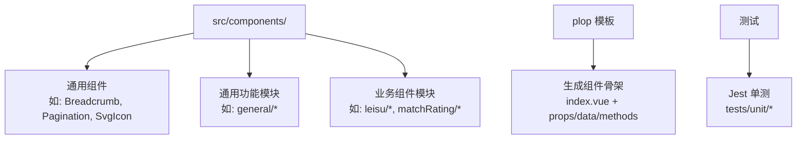
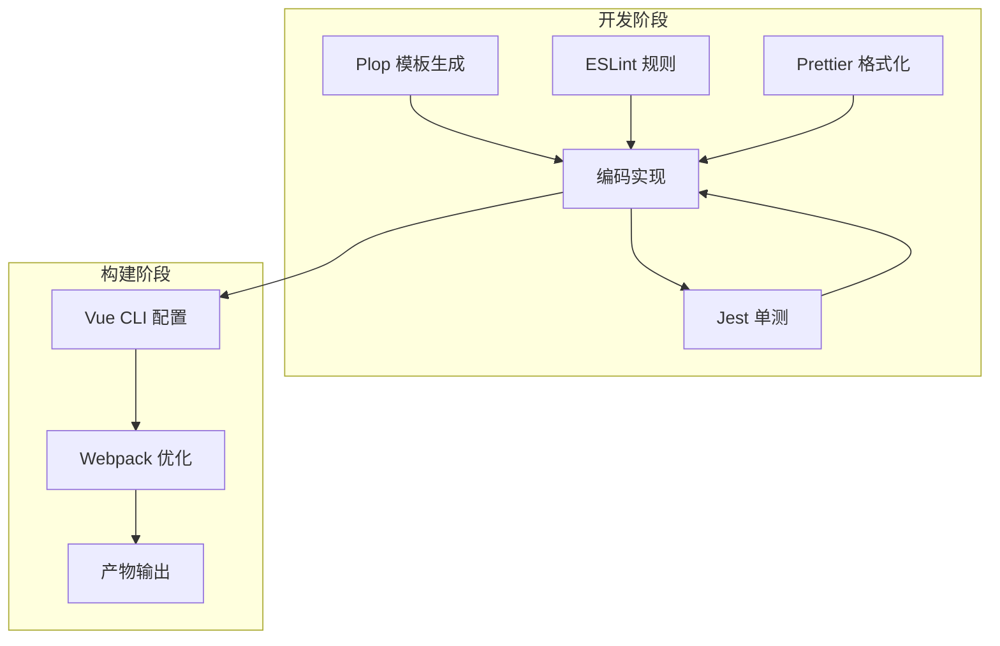
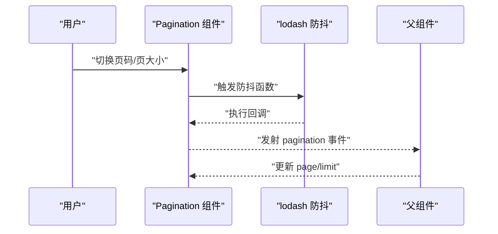
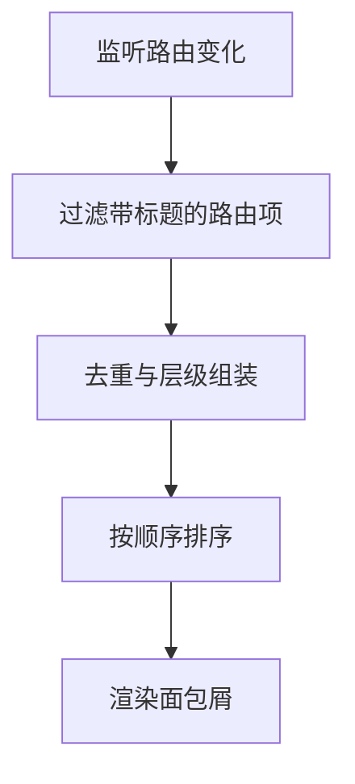
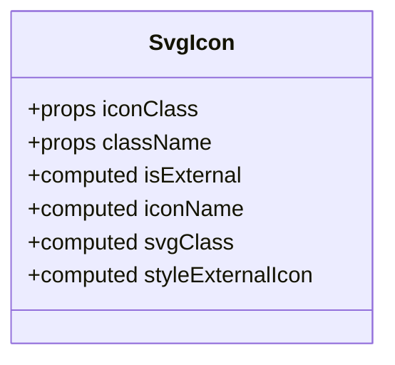
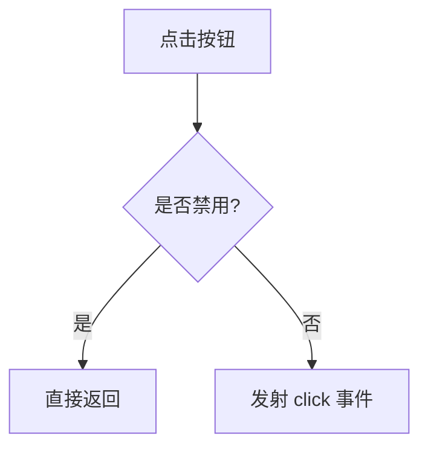
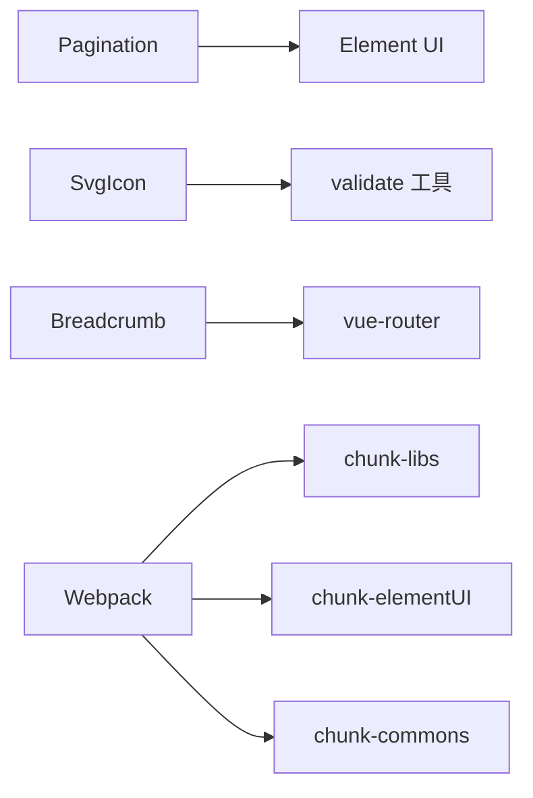

# 组件开发规范

<cite>
**本文引用的文件**
- [package.json](file://package.json)
- [.prettierrc](file://.prettierrc)
- [.eslintrc.js](file://.eslintrc.js)
- [babel.config.js](file://babel.config.js)
- [vue.config.js](file://vue.config.js)
- [plopfile.js](file://plopfile.js)
- [plop-templates/component/prompt.js](file://plop-templates/component/prompt.js)
- [plop-templates/component/index.hbs](file://plop-templates/component/index.hbs)
- [plop-templates/utils.js](file://plop-templates/utils.js)
- [src/components/Breadcrumb/index.vue](file://src/components/Breadcrumb/index.vue)
- [src/components/Pagination/index.vue](file://src/components/Pagination/index.vue)
- [src/components/SvgIcon/index.vue](file://src/components/SvgIcon/index.vue)
- [src/components/general/page.vue](file://src/components/general/page.vue)
- [src/components/general/newButton.vue](file://src/components/general/newButton.vue)
- [tests/unit/components/Hamburger.spec.js](file://tests/unit/components/Hamburger.spec.js)
- [tests/unit/components/SvgIcon.spec.js](file://tests/unit/components/SvgIcon.spec.js)
- [jest.config.js](file://jest.config.js)
</cite>

## 目录
1. 引言
2. 项目结构
3. 核心组件
4. 架构总览
5. 详细组件分析
6. 依赖分析
7. 性能考虑
8. 故障排查指南
9. 结论
10. 附录

## 引言
本规范旨在为 Leisu Admin 项目的组件开发提供统一标准与最佳实践，覆盖命名规范、文件组织、代码风格、API 设计、开发流程、工具链支持、版本管理、文档与测试质量保障等方面。通过规范化流程与工具链，提升团队协作效率与代码可维护性。

## 项目结构
- 组件集中于 src/components 下，按功能域进一步细分（如 general、Charts、leisu 等），便于复用与治理。
- 通用基础组件（如 Pagination、SvgIcon）位于根级 components 目录；业务组件（如 leisu、matchRating）置于对应子目录。
- 测试位于 tests/unit，遵循 Jest 配置与断言约定。
- 工具链通过 plop 模板生成器统一初始化组件骨架，确保一致性。

图表来源
- [src/components/Breadcrumb/index.vue:1-85](file://src/components/Breadcrumb/index.vue#L1-L85)
- [src/components/Pagination/index.vue:1-113](file://src/components/Pagination/index.vue#L1-L113)
- [src/components/SvgIcon/index.vue:1-63](file://src/components/SvgIcon/index.vue#L1-L63)
- [plop-templates/component/prompt.js:1-56](file://plop-templates/component/prompt.js#L1-L56)
- [plop-templates/component/index.hbs:1-27](file://plop-templates/component/index.hbs#L1-L27)
- [jest.config.js:1-25](file://jest.config.js#L1-L25)

章节来源
- [package.json:1-139](file://package.json#L1-L139)
- [vue.config.js:1-155](file://vue.config.js#L1-L155)

## 核心组件
- Breadcrumb：基于路由动态生成面包屑，使用过渡动画与层级排序逻辑。
- Pagination：封装 Element UI 分页，提供双向绑定的 page/limit 与防抖事件处理。
- SvgIcon：统一 SVG 图标渲染，支持内联与外部图标两种模式。
- general/page：简化版分页组件，提供最小可用能力。
- general/newButton：自定义按钮，支持尺寸、状态、组合样式等。

章节来源
- [src/components/Breadcrumb/index.vue:1-85](file://src/components/Breadcrumb/index.vue#L1-L85)
- [src/components/Pagination/index.vue:1-113](file://src/components/Pagination/index.vue#L1-L113)
- [src/components/SvgIcon/index.vue:1-63](file://src/components/SvgIcon/index.vue#L1-L63)
- [src/components/general/page.vue:1-61](file://src/components/general/page.vue#L1-L61)
- [src/components/general/newButton.vue:1-114](file://src/components/general/newButton.vue#L1-L114)

## 架构总览
组件开发围绕“模板生成—规范约束—测试驱动—构建优化”的闭环展开。模板生成器负责快速产出一致的组件骨架；ESLint/Prettier 确保风格统一；Jest 提供单元测试保障；Vue CLI/Webpack 配置优化打包与运行体验。

图表来源
- [plopfile.js:1-8](file://plopfile.js#L1-L8)
- [plop-templates/component/prompt.js:1-56](file://plop-templates/component/prompt.js#L1-L56)
- [plop-templates/component/index.hbs:1-27](file://plop-templates/component/index.hbs#L1-L27)
- [.eslintrc.js:1-268](file://.eslintrc.js#L1-L268)
- [.prettierrc:1-13](file://.prettierrc#L1-L13)
- [jest.config.js:1-25](file://jest.config.js#L1-L25)
- [vue.config.js:1-155](file://vue.config.js#L1-L155)

## 详细组件分析

### 组件命名与文件组织规范
- 命名：组件名称采用 PascalCase，文件夹与入口文件同名，统一为 index.vue。
- 组织：通用组件置于 src/components；业务组件按领域划分至子目录；避免跨模块耦合。
- 导出：组件应提供明确的入口导出，便于在视图层按需引入。

章节来源
- [.eslintrc.js:29-29](file://.eslintrc.js#L29-L29)
- [plop-templates/component/prompt.js:40-44](file://plop-templates/component/prompt.js#L40-L44)
- [plop-templates/component/index.hbs:10-10](file://plop-templates/component/index.hbs#L10-L10)

### API 设计原则
- Props 定义
  - 明确类型与默认值，必要时提供校验。
  - 使用布尔型开关属性时，优先使用语义化名称并提供合理默认。
  - 对外暴露的配置项尽量收敛，避免过度散乱。
- 事件规范
  - 事件命名采用 kebab-case，语义清晰，避免缩写。
  - 双向绑定场景使用 update:propName 形式，配合 v-model 场景。
- 插槽设计
  - 仅在必要时提供具名插槽，保持接口简洁。
  - 插槽内容尽量无副作用，避免强依赖父作用域状态。
- 方法暴露
  - 将内部复杂逻辑封装为私有方法，对外暴露稳定的方法或事件。
  - 需要外部调用的公开方法，应在文档中明确签名与行为。

章节来源
- [src/components/Pagination/index.vue:26-67](file://src/components/Pagination/index.vue#L26-L67)
- [src/components/SvgIcon/index.vue:12-44](file://src/components/SvgIcon/index.vue#L12-L44)
- [src/components/general/newButton.vue:9-61](file://src/components/general/newButton.vue#L9-L61)

### 开发流程规范
- 需求分析：明确组件职责、输入输出、交互边界与性能预期。
- 设计评审：对 Props/事件/插槽进行评审，形成接口契约文档。
- 编码实现：使用 plop 快速生成骨架，遵循 ESLint/Prettier 规范，完成核心逻辑与样式。
- 测试验证：补充单元测试，覆盖关键分支与边界条件。
- 文档与发布：完善组件注释与使用说明，纳入版本管理与发布流程。

章节来源
- [plopfile.js:1-8](file://plopfile.js#L1-L8)
- [plop-templates/component/prompt.js:1-56](file://plop-templates/component/prompt.js#L1-L56)
- [jest.config.js:1-25](file://jest.config.js#L1-L25)

### 代码风格与格式化
- ESLint：启用 Vue 推荐规则集，限制每行属性数量、强制命名大小写、禁止未使用变量等。
- Prettier：统一缩进宽度、引号策略、尾逗号、打印宽度等，确保团队一致的视觉风格。
- 脚本：通过 npm scripts 提供 lint、test:unit 等命令，便于 CI/CD 集成。

章节来源
- [.eslintrc.js:1-268](file://.eslintrc.js#L1-L268)
- [.prettierrc:1-13](file://.prettierrc#L1-L13)
- [package.json:7-20](file://package.json#L7-L20)

### 组件开发工具链
- 代码生成模板
  - plop 模板：提供交互式选择 blocks，自动生成 index.vue 骨架。
  - 模板文件：包含基础 template/script/style 结构，便于快速起步。
- 开发辅助
  - ESLint/Prettier：在编辑器中集成，保存即格式化与提示。
  - Vue Devtools：辅助调试组件状态与事件流。
- 调试技巧
  - 利用 Jest 断言与快照，定位 UI 变更问题。
  - 使用浏览器开发者工具检查事件冒泡与样式覆盖。

章节来源
- [plopfile.js:1-8](file://plopfile.js#L1-L8)
- [plop-templates/component/prompt.js:1-56](file://plop-templates/component/prompt.js#L1-L56)
- [plop-templates/component/index.hbs:1-27](file://plop-templates/component/index.hbs#L1-L27)
- [jest.config.js:1-25](file://jest.config.js#L1-L25)

### 测试策略与质量保证
- 单元测试
  - 使用 Jest + Vue Test Utils，针对组件行为与属性变更进行断言。
  - 示例：按钮点击事件触发、分页事件回调、SVG href 属性正确性。
- 覆盖范围
  - 收集 src/components 与 src/utils 的覆盖率，排除不必要文件。
- 运行与报告
  - 通过 npm test:unit 执行测试，生成 lcov 与文本摘要报告。

章节来源
- [tests/unit/components/Hamburger.spec.js:1-19](file://tests/unit/components/Hamburger.spec.js#L1-L19)
- [tests/unit/components/SvgIcon.spec.js:1-23](file://tests/unit/components/SvgIcon.spec.js#L1-L23)
- [jest.config.js:16-22](file://jest.config.js#L16-L22)

### 典型组件实现要点

#### 分页组件（Pagination）
- 关键点：双向绑定 page/limit、防抖处理、滚动行为控制、布局与尺寸配置。
- 事件：pagination（含 page/limit 参数）、size-change/current-change。
- 复杂度：事件处理为 O(1)，计算属性读取为 O(1)。

图表来源
- [src/components/Pagination/index.vue:86-99](file://src/components/Pagination/index.vue#L86-L99)

章节来源
- [src/components/Pagination/index.vue:1-113](file://src/components/Pagination/index.vue#L1-L113)

#### 面包屑组件（Breadcrumb）
- 关键点：根据路由 matched 生成层级列表，去重与排序，支持过渡动画。
- 复杂度：过滤与排序为 O(n log n)，遍历为 O(n)。

图表来源
- [src/components/Breadcrumb/index.vue:18-67](file://src/components/Breadcrumb/index.vue#L18-L67)

章节来源
- [src/components/Breadcrumb/index.vue:1-85](file://src/components/Breadcrumb/index.vue#L1-L85)

#### SVG 图标组件（SvgIcon）
- 关键点：区分内联与外部图标，动态拼接 href，透传事件与样式类。
- 复杂度：计算属性 O(1)，渲染开销极低。

图表来源
- [src/components/SvgIcon/index.vue:12-44](file://src/components/SvgIcon/index.vue#L12-L44)

章节来源
- [src/components/SvgIcon/index.vue:1-63](file://src/components/SvgIcon/index.vue#L1-L63)

#### 通用按钮（newButton）
- 关键点：支持组合样式（首/中/尾按钮）、禁用态、尺寸与激活态。
- 复杂度：计算属性 O(1)，事件处理 O(1)。

图表来源
- [src/components/general/newButton.vue:54-61](file://src/components/general/newButton.vue#L54-L61)

章节来源
- [src/components/general/newButton.vue:1-114](file://src/components/general/newButton.vue#L1-L114)

## 依赖分析
- 组件间依赖：通用组件（如 Pagination、SvgIcon）被大量视图与业务组件复用；业务组件模块内部保持低耦合。
- 外部依赖：Element UI、Lodash、Axios 等通过依赖管理统一版本。
- 构建优化：Webpack 分包策略将第三方库、Element UI、公共组件拆分为独立 chunk，提升缓存命中率。

图表来源
- [src/components/Pagination/index.vue:23-24](file://src/components/Pagination/index.vue#L23-L24)
- [src/components/SvgIcon/index.vue:10-10](file://src/components/SvgIcon/index.vue#L10-L10)
- [src/components/Breadcrumb/index.vue:33-33](file://src/components/Breadcrumb/index.vue#L33-L33)
- [vue.config.js:127-149](file://vue.config.js#L127-L149)

章节来源
- [package.json:37-96](file://package.json#L37-L96)
- [vue.config.js:1-155](file://vue.config.js#L1-L155)

## 性能考虑
- 渲染性能
  - 合理使用计算属性与防抖，减少不必要的重渲染。
  - 控制组件嵌套深度，避免深层作用域穿透。
- 事件与滚动
  - 分页组件已采用防抖，建议在高频交互场景继续沿用。
  - 需要滚动回到顶部的场景，保留可选的滚动逻辑以便复用。
- 资源加载
  - 通过 Webpack 分包策略减少初始包体积，按需加载非关键资源。
  - 图标统一使用 SVG Sprite，降低请求次数。

章节来源
- [src/components/Pagination/index.vue:86-99](file://src/components/Pagination/index.vue#L86-L99)
- [vue.config.js:127-151](file://vue.config.js#L127-L151)

## 故障排查指南
- 常见问题
  - Props 类型不匹配：检查类型定义与默认值，确保父组件传入符合预期。
  - 事件未触发：确认事件名拼写与大小写，检查 v-on 与 emit 是否一致。
  - 样式冲突：使用 scoped 与局部样式隔离，必要时引入深度选择器。
- 调试步骤
  - 使用 Jest 快速定位逻辑错误与边界条件。
  - 在浏览器中检查组件树与事件流，确认 props 与事件传递链路。
- 质量保障
  - 通过 ESLint/Prettier 与提交前检查，减少回归风险。
  - 保持测试覆盖率，尤其是关键路径与异常分支。

章节来源
- [tests/unit/components/Hamburger.spec.js:1-19](file://tests/unit/components/Hamburger.spec.js#L1-L19)
- [tests/unit/components/SvgIcon.spec.js:1-23](file://tests/unit/components/SvgIcon.spec.js#L1-L23)
- [.eslintrc.js:1-268](file://.eslintrc.js#L1-L268)
- [.prettierrc:1-13](file://.prettierrc#L1-L13)

## 结论
通过统一的命名与组织规范、严格的 API 设计、完善的工具链与测试体系，以及合理的构建优化策略，Leisu Admin 的组件开发可以实现高一致性、高可维护性与高可扩展性。建议在新组件开发中严格遵循本规范，并持续迭代模板与测试用例，以保障整体质量。

## 附录
- 版本管理建议
  - 使用语义化版本，变更记录包含破坏性变更、新增与修复。
  - 发布前执行 lint、test、构建校验，确保产物质量。
- 文档编写
  - 组件 README 或注释中明确 Props/Events/Slots/Methods 的用途与示例。
  - 提供常见使用场景与注意事项，便于其他开发者快速上手。