# 组件系统

<cite>
**本文引用的文件**
- [src/layout/index.vue](file://src/layout/index.vue)
- [src/layout/components/index.js](file://src/layout/components/index.js)
- [src/layout/components/AppMain.vue](file://src/layout/components/AppMain.vue)
- [src/layout/components/Navbar.vue](file://src/layout/components/Navbar.vue)
- [src/layout/components/Sidebar/index.vue](file://src/layout/components/Sidebar/index.vue)
- [src/layout/components/TagsView/index.vue](file://src/layout/components/TagsView/index.vue)
- [src/layout/components/TagsView/ScrollPane.vue](file://src/layout/components/TagsView/ScrollPane.vue)
- [src/layout/mixin/ResizeHandler.js](file://src/layout/mixin/ResizeHandler.js)
- [src/components/Pagination/index.vue](file://src/components/Pagination/index.vue)
- [src/components/Upload/SingleImage.vue](file://src/components/Upload/SingleImage.vue)
- [src/components/DragDialog/index.vue](file://src/components/DragDialog/index.vue)
- [src/components/Charts/LineMarker.vue](file://src/components/Charts/LineMarker.vue)
- [src/components/Charts/mixins/resize.js](file://src/components/Charts/mixins/resize.js)
- [src/components/general/page.vue](file://src/components/general/page.vue)
- [src/components/general/newButton.vue](file://src/components/general/newButton.vue)
- [src/components/Breadcrumb/index.vue](file://src/components/Breadcrumb/index.vue)
- [src/components/Hamburger/index.vue](file://src/components/Hamburger/index.vue)
- [src/components/SvgIcon/index.vue](file://src/components/SvgIcon/index.vue)
- [src/components/RightPanel/index.vue](file://src/components/RightPanel/index.vue)
- [src/store/modules/tagsView.js](file://src/store/modules/tagsView.js)
- [src/store/modules/app.js](file://src/store/modules/app.js)
</cite>

## 目录
1. [简介](#简介)
2. [项目结构](#项目结构)
3. [核心组件](#核心组件)
4. [架构总览](#架构总览)
5. [详细组件分析](#详细组件分析)
6. [依赖关系分析](#依赖关系分析)
7. [性能考量](#性能考量)
8. [故障排查指南](#故障排查指南)
9. [结论](#结论)
10. [附录](#附录)

## 简介
本文件面向 Leisu Admin 项目的前端组件体系，系统梳理基于 Vue.js 的组件化设计与实现，覆盖布局组件、通用组件与业务组件三大类，重点阐述：
- 布局组件：Layout 框架、Sidebar 侧边栏、Navbar 顶部导航、TagsView 标签页等的架构与使用方式
- 通用组件：表格/分页、表单/上传、图表、对话框等的实现细节与配置项
- 业务组件：数据展示、操作控制、对话框等的封装策略
- 组件通信：props、事件、插槽、provide/inject 等高级特性在项目中的应用
- 开发规范与最佳实践：命名约定、API 设计、性能优化与可复用性/扩展性

## 项目结构
项目采用“按功能域分层 + 组件模块化”的组织方式：
- 布局层：src/layout 提供全局布局骨架与子组件聚合导出
- 通用组件：src/components 下按功能拆分（如 Pagination、Upload、Charts、DragDialog 等）
- 业务组件：src/components/general、src/components/leisu 等目录下封装常用业务 UI
- 状态管理：src/store/modules 下集中管理 tagsView、app 等状态
- 路由与视图：src/views 下按业务模块划分页面级视图

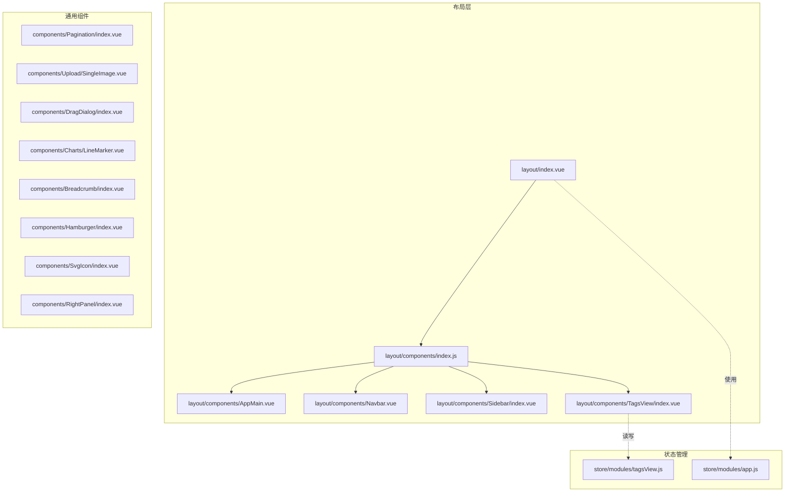

**图表来源**
- [src/layout/index.vue:1-124](file://src/layout/index.vue#L1-L124)
- [src/layout/components/index.js:1-6](file://src/layout/components/index.js#L1-L6)
- [src/layout/components/AppMain.vue:1-122](file://src/layout/components/AppMain.vue#L1-L122)
- [src/layout/components/Navbar.vue:1-148](file://src/layout/components/Navbar.vue#L1-L148)
- [src/layout/components/Sidebar/index.vue:1-82](file://src/layout/components/Sidebar/index.vue#L1-L82)
- [src/layout/components/TagsView/index.vue:1-294](file://src/layout/components/TagsView/index.vue#L1-L294)
- [src/components/Pagination/index.vue:1-113](file://src/components/Pagination/index.vue#L1-L113)
- [src/components/Upload/SingleImage.vue:1-135](file://src/components/Upload/SingleImage.vue#L1-L135)
- [src/components/DragDialog/index.vue:1-47](file://src/components/DragDialog/index.vue#L1-L47)
- [src/components/Charts/LineMarker.vue:1-228](file://src/components/Charts/LineMarker.vue#L1-L228)
- [src/components/Breadcrumb/index.vue:1-85](file://src/components/Breadcrumb/index.vue#L1-L85)
- [src/components/Hamburger/index.vue:1-45](file://src/components/Hamburger/index.vue#L1-L45)
- [src/components/SvgIcon/index.vue:1-63](file://src/components/SvgIcon/index.vue#L1-L63)
- [src/components/RightPanel/index.vue:1-146](file://src/components/RightPanel/index.vue#L1-L146)
- [src/store/modules/tagsView.js:1-182](file://src/store/modules/tagsView.js#L1-L182)
- [src/store/modules/app.js:1-65](file://src/store/modules/app.js#L1-L65)

**章节来源**
- [src/layout/index.vue:1-124](file://src/layout/index.vue#L1-L124)
- [src/layout/components/index.js:1-6](file://src/layout/components/index.js#L1-L6)

## 核心组件
本节聚焦布局组件与通用组件的关键实现与使用要点。

- Layout 框架
  - 负责整体容器、侧边栏开关动画、移动端遮罩、固定头部宽度计算、右侧设置面板挂载等
  - 关键点：通过 ResizeMixin 处理窗口尺寸变化；根据设备类型与侧边栏状态动态切换样式类名；支持点击遮罩关闭侧边栏

- 侧边栏 Sidebar
  - 基于 Element UI Menu 渲染路由菜单，支持折叠、主题色、唯一展开、禁用过渡
  - 动态过滤路由：根据当前路径是否包含特定前缀（如机器人相关）切换菜单集合
  - 高亮逻辑：优先使用路由元信息中的 activeMenu，否则以当前路径为准

- 顶部导航 Navbar
  - 集成面包屑、汉堡菜单、用户头像下拉
  - 登录状态来自 Vuex，提供退出登录动作（刷新页面）

- 标签页 TagsView
  - 支持新增、刷新、关闭、关闭其他、关闭全部、右键上下文菜单
  - 自动滚动到当前标签，支持 affix 固定标签
  - 通过 Store 管理 visitedViews 与 cachedViews，配合 keep-alive 实现缓存

- 通用组件
  - 分页 Pagination：支持双向绑定页码/页大小、布局自定义、自动滚动、防抖回调
  - 单图上传 SingleImage：集成七牛 Token 获取、预览、删除
  - 拖拽对话框 DragDialog：透传属性与事件、提供可拖拽能力
  - 图表 LineMarker：基于 ECharts，内置响应式 mixin，销毁时释放实例
  - 面包屑 Breadcrumb：根据路由层级生成面包屑
  - 汉堡菜单 Hamburger：图标旋转状态切换
  - SVG 图标 SvgIcon：支持内联 SVG 与外链 mask 图标
  - 右侧面板 RightPanel：可吸附在右侧，支持点击外部关闭

**章节来源**
- [src/layout/index.vue:18-78](file://src/layout/index.vue#L18-L78)
- [src/layout/components/Sidebar/index.vue:27-80](file://src/layout/components/Sidebar/index.vue#L27-L80)
- [src/layout/components/Navbar.vue:28-53](file://src/layout/components/Navbar.vue#L28-L53)
- [src/layout/components/TagsView/index.vue:32-198](file://src/layout/components/TagsView/index.vue#L32-L198)
- [src/components/Pagination/index.vue:26-101](file://src/components/Pagination/index.vue#L26-L101)
- [src/components/Upload/SingleImage.vue:31-77](file://src/components/Upload/SingleImage.vue#L31-L77)
- [src/components/DragDialog/index.vue:15-46](file://src/components/DragDialog/index.vue#L15-L46)
- [src/components/Charts/LineMarker.vue:9-43](file://src/components/Charts/LineMarker.vue#L9-L43)
- [src/components/Breadcrumb/index.vue:11-68](file://src/components/Breadcrumb/index.vue#L11-L68)
- [src/components/Hamburger/index.vue:16-30](file://src/components/Hamburger/index.vue#L16-L30)
- [src/components/SvgIcon/index.vue:8-45](file://src/components/SvgIcon/index.vue#L8-L45)
- [src/components/RightPanel/index.vue:15-76](file://src/components/RightPanel/index.vue#L15-L76)

## 架构总览
下图展示布局组件与通用组件之间的组合关系及数据流：

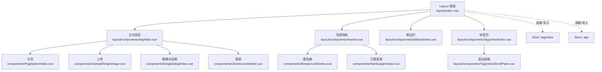

**图表来源**
- [src/layout/index.vue:18-33](file://src/layout/index.vue#L18-L33)
- [src/layout/components/AppMain.vue:19-41](file://src/layout/components/AppMain.vue#L19-L41)
- [src/layout/components/Navbar.vue:28-41](file://src/layout/components/Navbar.vue#L28-L41)
- [src/layout/components/Sidebar/index.vue:27-54](file://src/layout/components/Sidebar/index.vue#L27-L54)
- [src/layout/components/TagsView/index.vue:28-54](file://src/layout/components/TagsView/index.vue#L28-L54)
- [src/components/Breadcrumb/index.vue:11-28](file://src/components/Breadcrumb/index.vue#L11-L28)
- [src/components/Hamburger/index.vue:16-30](file://src/components/Hamburger/index.vue#L16-L30)
- [src/components/Pagination/index.vue:26-85](file://src/components/Pagination/index.vue#L26-L85)
- [src/components/Upload/SingleImage.vue:31-77](file://src/components/Upload/SingleImage.vue#L31-L77)
- [src/components/DragDialog/index.vue:15-46](file://src/components/DragDialog/index.vue#L15-L46)
- [src/components/Charts/LineMarker.vue:9-43](file://src/components/Charts/LineMarker.vue#L9-L43)
- [src/store/modules/tagsView.js:1-182](file://src/store/modules/tagsView.js#L1-L182)
- [src/store/modules/app.js:1-65](file://src/store/modules/app.js#L1-L65)

## 详细组件分析

### 布局组件系统

#### Layout 框架
- 职责：统一容器、侧边栏开关、移动端遮罩、固定头部宽度、右侧设置面板
- 关键交互：监听侧边栏过渡结束事件，触发 window.resize；点击遮罩关闭侧边栏
- 样式联动：根据 sidebar.opened、withoutAnimation、device 切换类名，影响固定头部宽度与移动端定位

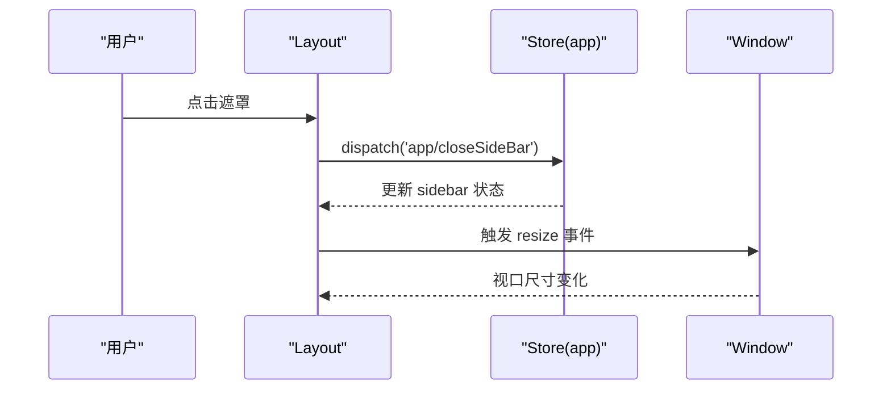

**图表来源**
- [src/layout/index.vue:52-77](file://src/layout/index.vue#L52-L77)
- [src/store/modules/app.js:40-57](file://src/store/modules/app.js#L40-L57)

**章节来源**
- [src/layout/index.vue:18-78](file://src/layout/index.vue#L18-L78)
- [src/store/modules/app.js:1-65](file://src/store/modules/app.js#L1-L65)

#### Sidebar 侧边栏
- 菜单渲染：遍历权限路由，支持根据路径前缀过滤（如机器人相关）
- 折叠与高亮：基于 sidebar.opened 决定折叠状态；activeMenu 优先使用路由元信息
- 主题适配：从样式变量注入背景、文本、激活色

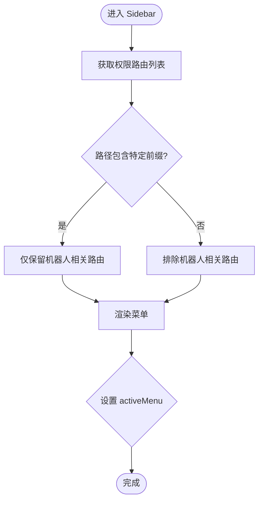

**图表来源**
- [src/layout/components/Sidebar/index.vue:55-80](file://src/layout/components/Sidebar/index.vue#L55-L80)

**章节来源**
- [src/layout/components/Sidebar/index.vue:27-80](file://src/layout/components/Sidebar/index.vue#L27-L80)

#### Navbar 顶部导航
- 集成面包屑与汉堡菜单，右侧显示用户名与组别，提供退出登录
- 登录状态来自 Vuex；退出登录后刷新页面

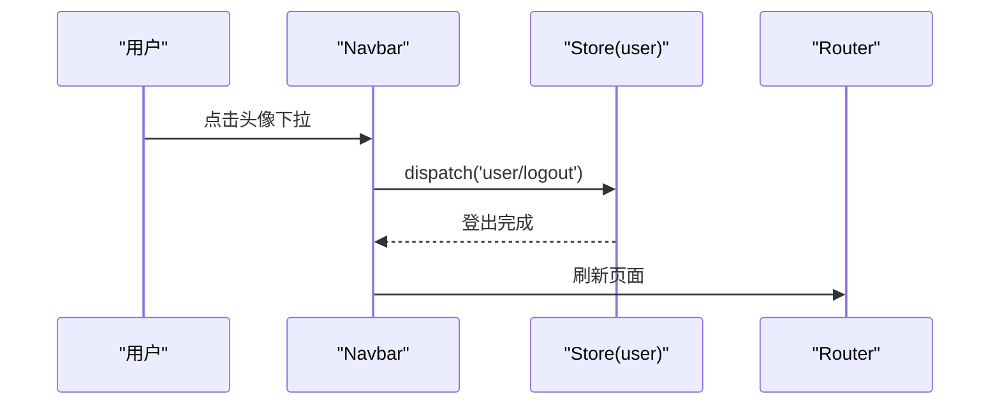

**图表来源**
- [src/layout/components/Navbar.vue:42-51](file://src/layout/components/Navbar.vue#L42-L51)
- [src/store/modules/app.js:40-57](file://src/store/modules/app.js#L40-L57)

**章节来源**
- [src/layout/components/Navbar.vue:28-53](file://src/layout/components/Navbar.vue#L28-L53)

#### TagsView 标签页
- 新增/刷新/关闭/关闭其他/关闭全部；右键菜单支持刷新、关闭当前、关闭其他、关闭所有
- 自动滚动到当前标签；支持 affix 固定标签；通过 Store 管理 visitedViews 与 cachedViews

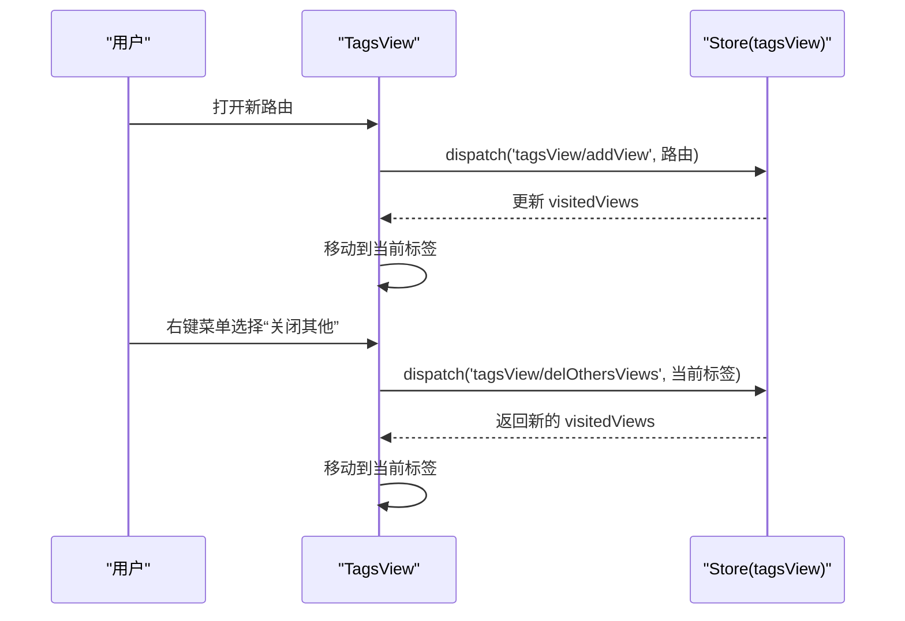

**图表来源**
- [src/layout/components/TagsView/index.vue:106-158](file://src/layout/components/TagsView/index.vue#L106-L158)
- [src/store/modules/tagsView.js:90-174](file://src/store/modules/tagsView.js#L90-L174)

**章节来源**
- [src/layout/components/TagsView/index.vue:32-198](file://src/layout/components/TagsView/index.vue#L32-L198)
- [src/store/modules/tagsView.js:1-182](file://src/store/modules/tagsView.js#L1-182)

### 通用组件库

#### 分页组件 Pagination
- 支持 total、page、limit、pageSizes、layout、background、autoScroll、hidden、pagerCount 等 props
- 使用 v-model 形式的双向绑定（update:page、update:limit），内部使用防抖处理 size-change 与 current-change
- 可通过 v-bind 透传原生属性给 Element Pagination

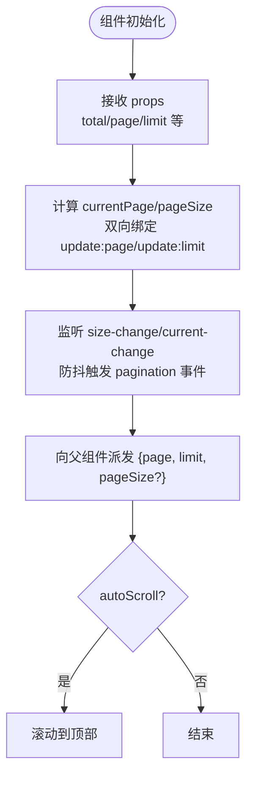

**图表来源**
- [src/components/Pagination/index.vue:26-101](file://src/components/Pagination/index.vue#L26-L101)

**章节来源**
- [src/components/Pagination/index.vue:26-101](file://src/components/Pagination/index.vue#L26-L101)

#### 单图上传 SingleImage
- 集成上传 Token 获取流程，生成临时 URL，成功后回填图片地址
- 支持删除图片，清空输入值

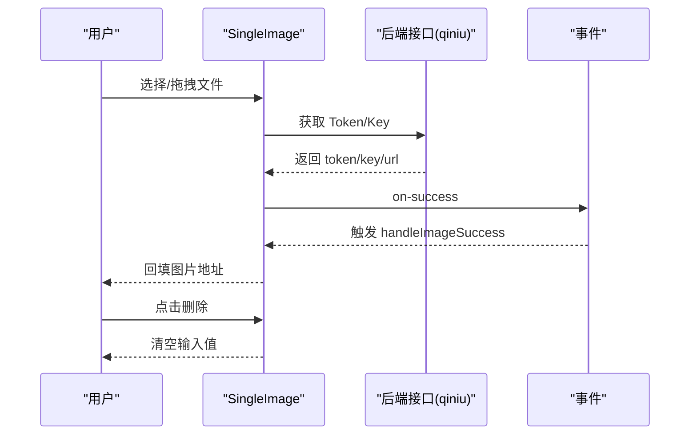

**图表来源**
- [src/components/Upload/SingleImage.vue:50-77](file://src/components/Upload/SingleImage.vue#L50-L77)

**章节来源**
- [src/components/Upload/SingleImage.vue:31-77](file://src/components/Upload/SingleImage.vue#L31-L77)

#### 拖拽对话框 DragDialog
- 透传 $attrs/$listeners，提供 v-dialogDrag 指令支持拖拽
- 通过 visible 计算属性与 update:visible 实现 .sync 语法糖

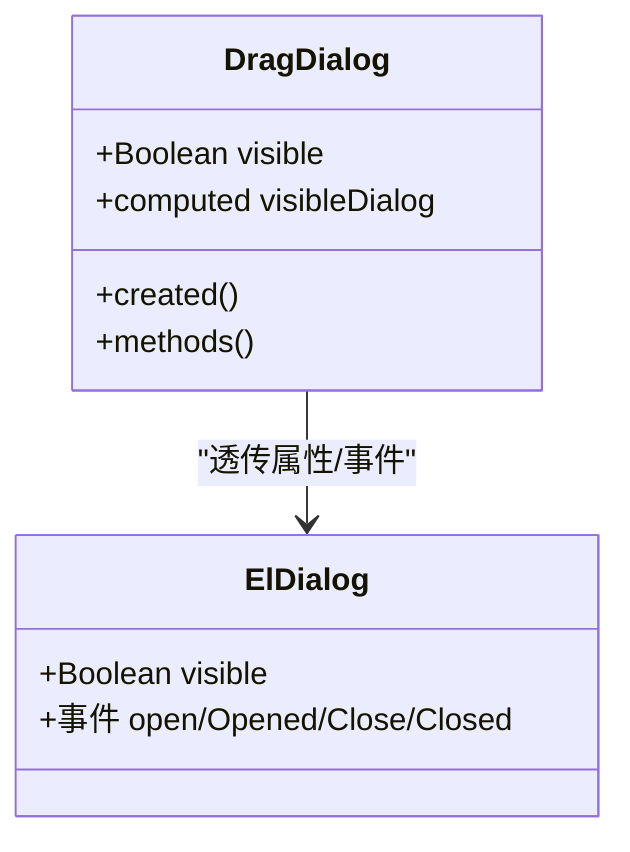

**图表来源**
- [src/components/DragDialog/index.vue:15-46](file://src/components/DragDialog/index.vue#L15-L46)

**章节来源**
- [src/components/DragDialog/index.vue:15-46](file://src/components/DragDialog/index.vue#L15-L46)

#### 图表组件 LineMarker
- 基于 ECharts 初始化图表，设置标题、提示、图例、网格、坐标轴与系列
- 使用 resize mixin 实现响应式；组件销毁时释放实例

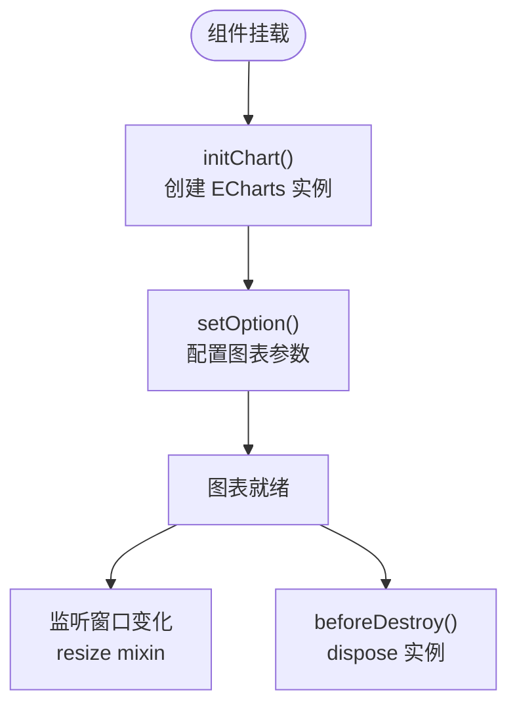

**图表来源**
- [src/components/Charts/LineMarker.vue:34-43](file://src/components/Charts/LineMarker.vue#L34-L43)
- [src/components/Charts/mixins/resize.js](file://src/components/Charts/mixins/resize.js)

**章节来源**
- [src/components/Charts/LineMarker.vue:9-43](file://src/components/Charts/LineMarker.vue#L9-L43)

#### 面包屑 Breadcrumb
- 根据路由 matched 结果过滤带 title 的路由，生成层级顺序并渲染

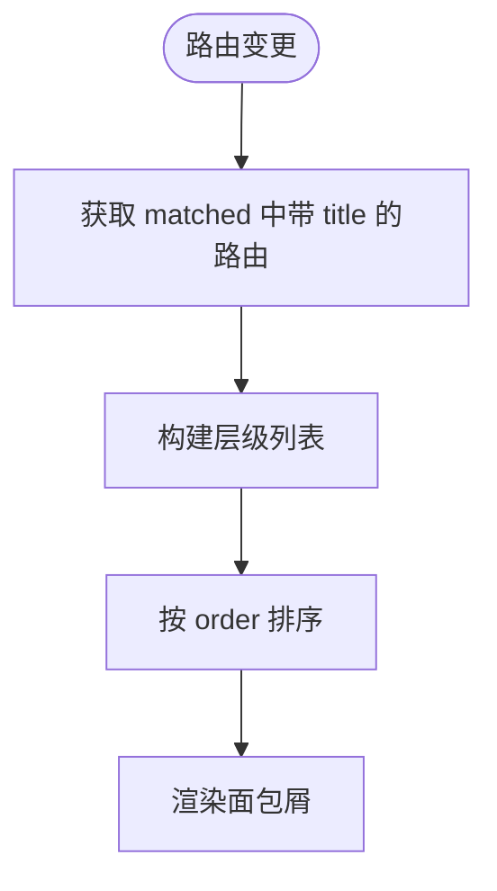

**图表来源**
- [src/components/Breadcrumb/index.vue:29-68](file://src/components/Breadcrumb/index.vue#L29-L68)

**章节来源**
- [src/components/Breadcrumb/index.vue:11-68](file://src/components/Breadcrumb/index.vue#L11-L68)

#### 汉堡菜单 Hamburger
- 通过 toggleClick 事件向上冒泡，供父组件切换侧边栏

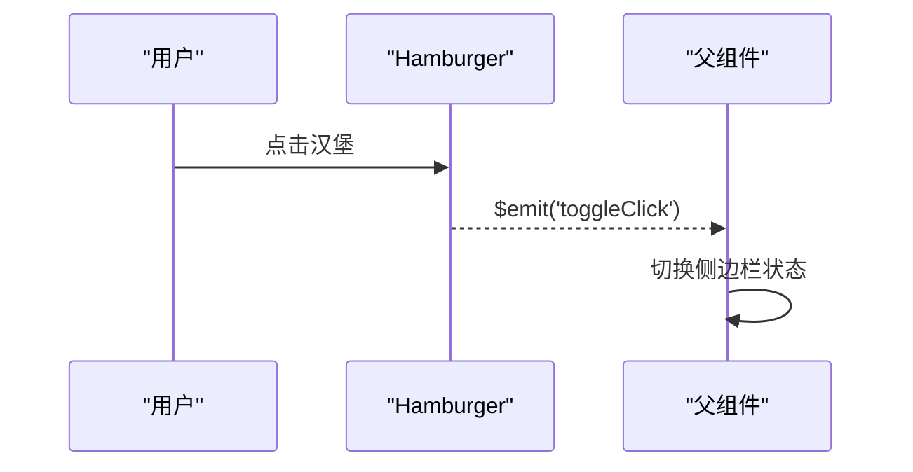

**图表来源**
- [src/components/Hamburger/index.vue:25-29](file://src/components/Hamburger/index.vue#L25-L29)

**章节来源**
- [src/components/Hamburger/index.vue:16-30](file://src/components/Hamburger/index.vue#L16-L30)

#### SVG 图标 SvgIcon
- 支持内联 SVG 与外链 mask 图标，计算 className 与 mask 样式

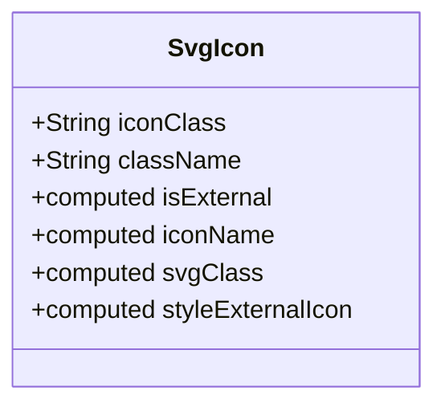

**图表来源**
- [src/components/SvgIcon/index.vue:8-45](file://src/components/SvgIcon/index.vue#L8-L45)

**章节来源**
- [src/components/SvgIcon/index.vue:8-45](file://src/components/SvgIcon/index.vue#L8-L45)

#### 右侧面板 RightPanel
- 右侧吸附面板，支持点击外部关闭、插入到 body、控制 body 滚动

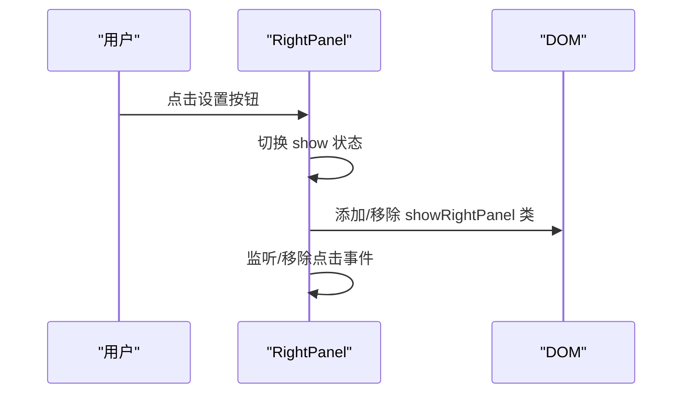

**图表来源**
- [src/components/RightPanel/index.vue:40-76](file://src/components/RightPanel/index.vue#L40-L76)

**章节来源**
- [src/components/RightPanel/index.vue:15-76](file://src/components/RightPanel/index.vue#L15-L76)

### 业务组件设计模式
- 数据展示组件：如 LineMarker、图表 mixin、面包屑等，强调数据驱动与响应式
- 操作控制组件：如 Pagination、Hamburger、RightPanel，强调交互反馈与状态同步
- 对话框组件：DragDialog 通过指令与事件透传，实现可拖拽与生命周期事件暴露
- 上传组件：SingleImage 封装 Token 获取与回填流程，便于复用

**章节来源**
- [src/components/Pagination/index.vue:26-101](file://src/components/Pagination/index.vue#L26-L101)
- [src/components/Upload/SingleImage.vue:31-77](file://src/components/Upload/SingleImage.vue#L31-L77)
- [src/components/DragDialog/index.vue:15-46](file://src/components/DragDialog/index.vue#L15-L46)
- [src/components/Charts/LineMarker.vue:9-43](file://src/components/Charts/LineMarker.vue#L9-L43)
- [src/components/Breadcrumb/index.vue:11-68](file://src/components/Breadcrumb/index.vue#L11-L68)
- [src/components/Hamburger/index.vue:16-30](file://src/components/Hamburger/index.vue#L16-L30)
- [src/components/RightPanel/index.vue:15-76](file://src/components/RightPanel/index.vue#L15-L76)

## 依赖关系分析
- 组件间依赖
  - Layout 依赖 Sidebar、Navbar、TagsView、AppMain、RightPanel
  - AppMain 依赖 KeepAlive 与 Store 中的 cachedViews
  - TagsView 依赖 Store 中的 visitedViews 与 cachedViews
  - Sidebar 依赖 Store 中的 permission_routes 与 sidebar 状态
- 状态依赖
  - app 模块管理侧边栏开关、设备类型、尺寸等
  - tagsView 模块管理标签页集合与缓存集合

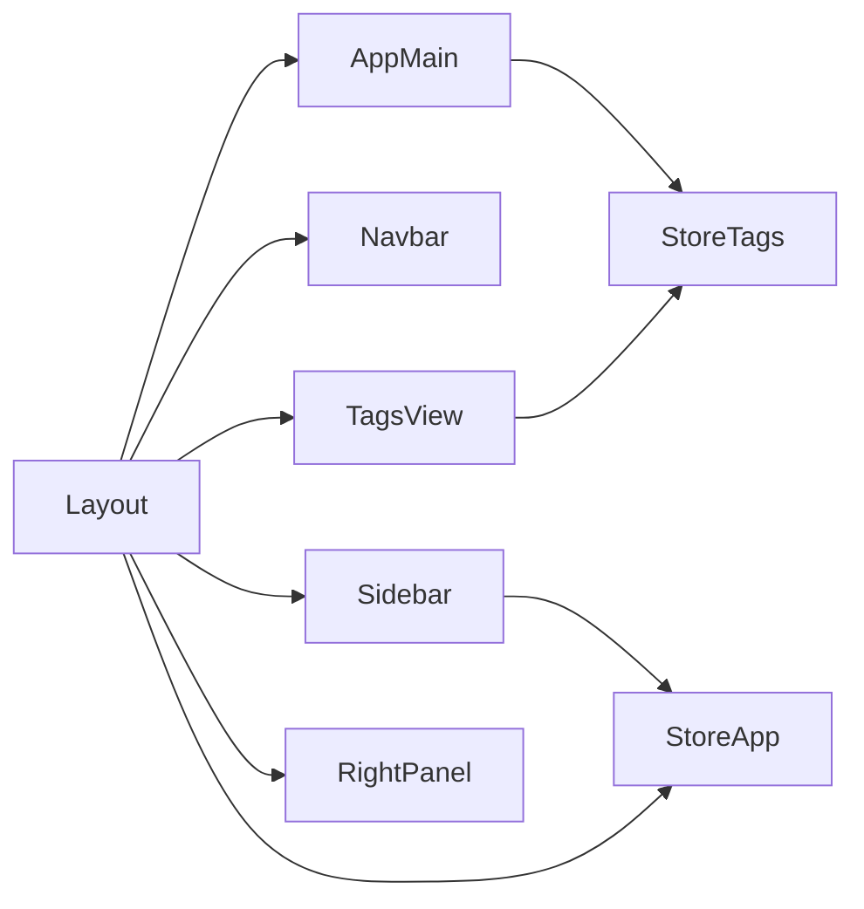

**图表来源**
- [src/layout/index.vue:18-33](file://src/layout/index.vue#L18-L33)
- [src/layout/components/AppMain.vue:34-41](file://src/layout/components/AppMain.vue#L34-L41)
- [src/layout/components/TagsView/index.vue:47-54](file://src/layout/components/TagsView/index.vue#L47-L54)
- [src/layout/components/Sidebar/index.vue:34-54](file://src/layout/components/Sidebar/index.vue#L34-L54)
- [src/store/modules/tagsView.js:1-182](file://src/store/modules/tagsView.js#L1-L182)
- [src/store/modules/app.js:1-65](file://src/store/modules/app.js#L1-L65)

**章节来源**
- [src/store/modules/tagsView.js:1-182](file://src/store/modules/tagsView.js#L1-L182)
- [src/store/modules/app.js:1-65](file://src/store/modules/app.js#L1-L65)

## 性能考量
- 响应式与销毁
  - 图表组件在 beforeDestroy 中释放实例，避免内存泄漏
  - ResizeHandler mixin 在布局组件中统一处理窗口尺寸变化
- 缓存与复用
  - AppMain 使用 keep-alive + cachedViews 缓存页面组件，减少重复渲染
  - TagsView 通过 cachedViews 控制缓存集合
- 事件防抖
  - Pagination 在 size-change 与 current-change 上使用防抖，降低频繁触发带来的性能压力
- DOM 操作
  - RightPanel 插入到 body 并通过类名控制滚动，避免影响布局层级

**章节来源**
- [src/components/Charts/LineMarker.vue:37-43](file://src/components/Charts/LineMarker.vue#L37-L43)
- [src/layout/mixin/ResizeHandler.js](file://src/layout/mixin/ResizeHandler.js)
- [src/layout/components/AppMain.vue:5,35-41:5-41](file://src/layout/components/AppMain.vue#L5-L41)
- [src/components/Pagination/index.vue:87-99](file://src/components/Pagination/index.vue#L87-L99)
- [src/components/RightPanel/index.vue:52-76](file://src/components/RightPanel/index.vue#L52-L76)

## 故障排查指南
- 侧边栏无法关闭
  - 检查 Layout 是否正确触发 closeSideBar；确认 clickOutside 事件是否绑定
  - 参考：[src/layout/index.vue:68-70](file://src/layout/index.vue#L68-L70)，[src/store/modules/app.js:44-46](file://src/store/modules/app.js#L44-L46)
- 标签页不刷新或无法关闭
  - 确认 TagsView 是否正确调用 Store 的 delView/delOthersViews/delAllViews；检查 affix 标签是否被误删
  - 参考：[src/layout/components/TagsView/index.vue:138-158](file://src/layout/components/TagsView/index.vue#L138-L158)，[src/store/modules/tagsView.js:102-174](file://src/store/modules/tagsView.js#L102-L174)
- 图表不显示或内存占用高
  - 确保在 beforeDestroy 中 dispose 实例；检查 resize mixin 是否生效
  - 参考：[src/components/Charts/LineMarker.vue:37-43](file://src/components/Charts/LineMarker.vue#L37-L43)，[src/components/Charts/mixins/resize.js](file://src/components/Charts/mixins/resize.js)
- 分页回调未触发
  - 检查是否正确监听 pagination 事件；确认防抖时间是否过短导致误触
  - 参考：[src/components/Pagination/index.vue:87-99](file://src/components/Pagination/index.vue#L87-L99)
- 上传失败或 Token 获取异常
  - 检查后端接口返回的 token/key/url；确认上传组件是否正确回填
  - 参考：[src/components/Upload/SingleImage.vue:60-77](file://src/components/Upload/SingleImage.vue#L60-L77)

**章节来源**
- [src/layout/index.vue:68-70](file://src/layout/index.vue#L68-L70)
- [src/store/modules/app.js:44-46](file://src/store/modules/app.js#L44-L46)
- [src/layout/components/TagsView/index.vue:138-158](file://src/layout/components/TagsView/index.vue#L138-L158)
- [src/store/modules/tagsView.js:102-174](file://src/store/modules/tagsView.js#L102-L174)
- [src/components/Charts/LineMarker.vue:37-43](file://src/components/Charts/LineMarker.vue#L37-L43)
- [src/components/Pagination/index.vue:87-99](file://src/components/Pagination/index.vue#L87-L99)
- [src/components/Upload/SingleImage.vue:60-77](file://src/components/Upload/SingleImage.vue#L60-L77)

## 结论
Leisu Admin 的组件体系以布局为核心，围绕 Layout 展开 Sidebar、Navbar、TagsView、AppMain 等子组件，并通过 Store 实现状态共享与联动。通用组件覆盖分页、上传、图表、对话框等高频场景，具备良好的可复用性与扩展性。建议在后续迭代中：
- 明确组件 API 设计规范，统一 props 命名与默认值
- 强化错误边界与加载状态，提升用户体验
- 对复杂组件引入单元测试与可视化测试，保障稳定性

## 附录
- 组件通信机制
  - Props：用于自上而下的数据传递（如 Pagination 的 total/page/limit）
  - 事件：通过 $emit 向父组件传递状态变化（如 Hamburger 的 toggleClick、Pagination 的 pagination）
  - 插槽：通过具名/匿名插槽实现内容扩展（如 DragDialog 的 title/footer）
  - Provide/Inject：可在需要跨层级共享配置时使用（本项目主要通过 Vuex 与 props/$emit 解决）

- 开发规范与最佳实践
  - 命名约定：组件文件名采用帕斯卡命名；props 使用 camelCase；事件使用 kebab-case
  - API 设计：保持单一职责；提供必要的默认值与校验；对外暴露稳定事件与插槽
  - 性能优化：合理使用 keep-alive 与缓存；对高频事件使用防抖；及时释放资源（如图表实例）
  - 可复用性与扩展性：抽象通用能力（如 resize mixin）、提供可配置的主题变量、支持插槽扩展