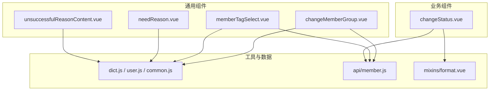
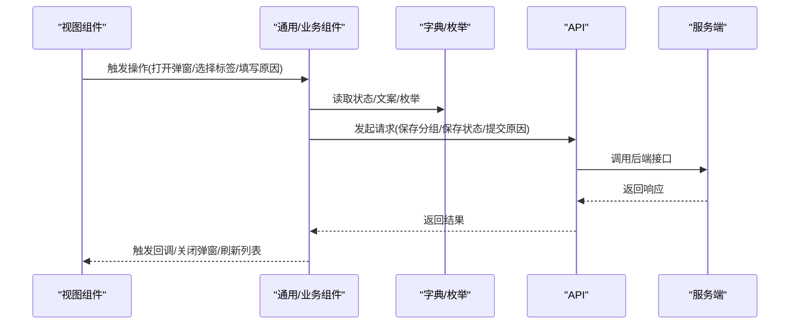
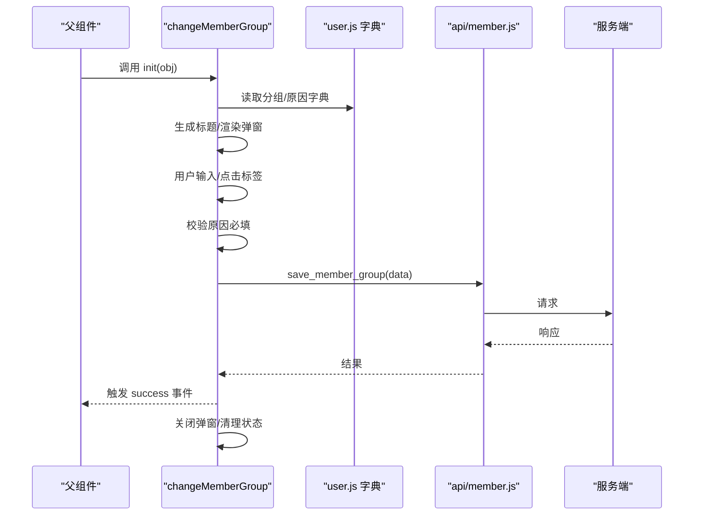
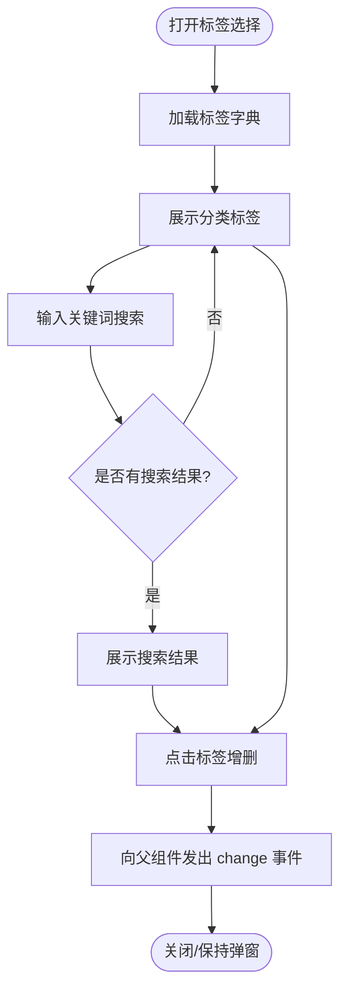
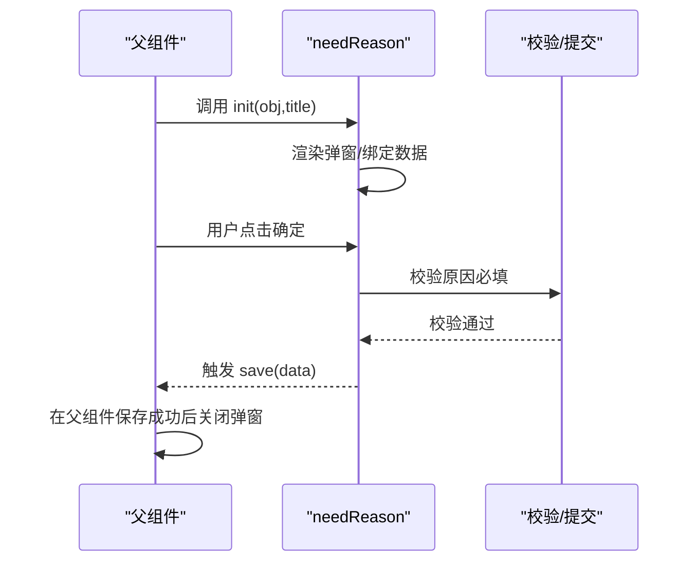
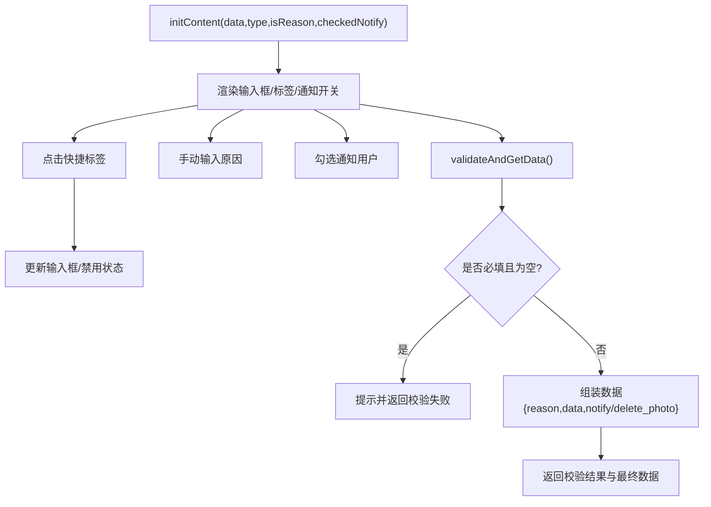
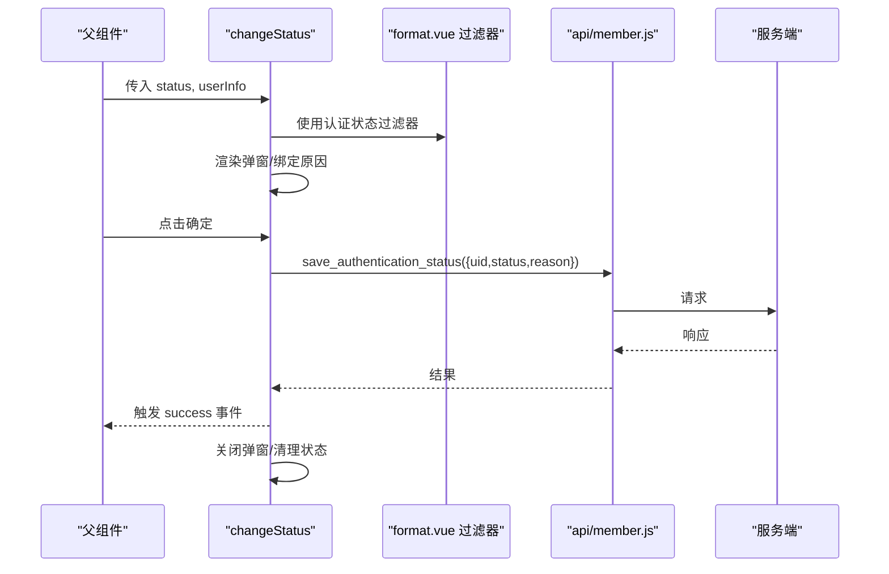
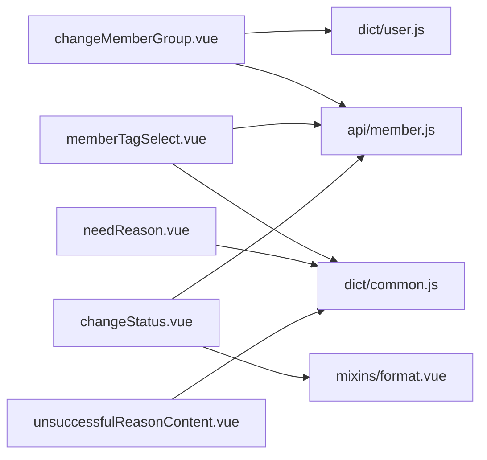

# 业务操作组件

<cite>
**本文引用的文件**
- [src/components/general/changeMemberGroup.vue](file://src/components/general/changeMemberGroup.vue)
- [src/components/general/memberTagSelect.vue](file://src/components/general/memberTagSelect.vue)
- [src/components/general/needReason.vue](file://src/components/general/needReason.vue)
- [src/components/general/unsuccessfulReasonContent.vue](file://src/components/general/unsuccessfulReasonContent.vue)
- [src/components/leisu/changeStatus.vue](file://src/components/leisu/changeStatus.vue)
- [src/api/member.js](file://src/api/member.js)
- [src/utils/dict.js](file://src/utils/dict.js)
- [src/utils/dict/user.js](file://src/utils/dict/user.js)
- [src/utils/dict/common.js](file://src/utils/dict/common.js)
- [src/mixins/format.vue](file://src/mixins/format.vue)
</cite>

## 目录
1. [简介](#简介)
2. [项目结构](#项目结构)
3. [核心组件](#核心组件)
4. [架构总览](#架构总览)
5. [详细组件分析](#详细组件分析)
6. [依赖关系分析](#依赖关系分析)
7. [性能考量](#性能考量)
8. [故障排查指南](#故障排查指南)
9. [结论](#结论)
10. [附录](#附录)

## 简介
本文件面向 Leisu Admin 的业务操作组件，围绕“成员分组变更”“成员标签选择”“原因说明”“操作状态”等主题，系统梳理通用组件与业务组件的职责边界、数据流转、状态管理与扩展能力，并给出典型业务流程示例，帮助开发者与运营人员理解并正确使用这些组件。

## 项目结构
- 通用业务组件位于 src/components/general，涵盖“原因说明”“成员标签选择”“成员分组变更”等通用交互。
- 业务专用组件位于 src/components/leisu，例如“实名认证状态变更”组件。
- 数据字典与枚举集中于 src/utils/dict*，为组件提供文案、状态映射与快捷原因等。
- API 层位于 src/api/member.js，封装用户相关接口。
- 格式化混入位于 src/mixins/format.vue，提供过滤器与格式化能力。

图表来源
- [src/components/general/changeMemberGroup.vue:1-107](file://src/components/general/changeMemberGroup.vue#L1-L107)
- [src/components/general/memberTagSelect.vue:1-117](file://src/components/general/memberTagSelect.vue#L1-L117)
- [src/components/general/needReason.vue:1-75](file://src/components/general/needReason.vue#L1-L75)
- [src/components/general/unsuccessfulReasonContent.vue:1-135](file://src/components/general/unsuccessfulReasonContent.vue#L1-L135)
- [src/components/leisu/changeStatus.vue:1-74](file://src/components/leisu/changeStatus.vue#L1-L74)
- [src/utils/dict.js:1-11](file://src/utils/dict.js#L1-L11)
- [src/utils/dict/user.js:1-245](file://src/utils/dict/user.js#L1-L245)
- [src/utils/dict/common.js:332-352](file://src/utils/dict/common.js#L332-L352)
- [src/api/member.js:127-134](file://src/api/member.js#L127-L134)
- [src/mixins/format.vue:773-783](file://src/mixins/format.vue#L773-L783)

章节来源
- [src/components/general/changeMemberGroup.vue:1-107](file://src/components/general/changeMemberGroup.vue#L1-L107)
- [src/components/general/memberTagSelect.vue:1-117](file://src/components/general/memberTagSelect.vue#L1-L117)
- [src/components/general/needReason.vue:1-75](file://src/components/general/needReason.vue#L1-L75)
- [src/components/general/unsuccessfulReasonContent.vue:1-135](file://src/components/general/unsuccessfulReasonContent.vue#L1-L135)
- [src/components/leisu/changeStatus.vue:1-74](file://src/components/leisu/changeStatus.vue#L1-L74)
- [src/utils/dict.js:1-11](file://src/utils/dict.js#L1-L11)
- [src/utils/dict/user.js:1-245](file://src/utils/dict/user.js#L1-L245)
- [src/utils/dict/common.js:332-352](file://src/utils/dict/common.js#L332-L352)
- [src/api/member.js:127-134](file://src/api/member.js#L127-L134)
- [src/mixins/format.vue:773-783](file://src/mixins/format.vue#L773-L783)

## 核心组件
- 成员分组变更组件：用于弹窗式选择目标分组并填写原因，支持快速标签选择；完成后调用保存接口并触发父级回调。
- 成员标签选择组件：提供标签选择面板，支持搜索与分组浏览，输出选中标签集合供父组件使用。
- 原因说明组件：通用弹窗输入组件，要求必填原因，支持外部传入初始标题与数据。
- 不成功原因内容组件：全功能原因输入组件，内置标签快捷选择、是否通知用户等开关，负责统一校验与组装数据。
- 实名认证状态变更组件：用于变更用户实名认证状态，要求填写变更原因并调用相应接口。

章节来源
- [src/components/general/changeMemberGroup.vue:1-107](file://src/components/general/changeMemberGroup.vue#L1-L107)
- [src/components/general/memberTagSelect.vue:1-117](file://src/components/general/memberTagSelect.vue#L1-L117)
- [src/components/general/needReason.vue:1-75](file://src/components/general/needReason.vue#L1-L75)
- [src/components/general/unsuccessfulReasonContent.vue:1-135](file://src/components/general/unsuccessfulReasonContent.vue#L1-L135)
- [src/components/leisu/changeStatus.vue:1-74](file://src/components/leisu/changeStatus.vue#L1-L74)

## 架构总览
组件与数据层的交互遵循“视图组件 -> 工具/字典 -> API -> 后端”的链路。通用组件通过字典提供文案与枚举，业务组件通过混入提供格式化能力，API 层封装具体请求。

图表来源
- [src/components/general/changeMemberGroup.vue:73-92](file://src/components/general/changeMemberGroup.vue#L73-L92)
- [src/components/general/needReason.vue:57-69](file://src/components/general/needReason.vue#L57-L69)
- [src/components/general/unsuccessfulReasonContent.vue:76-101](file://src/components/general/unsuccessfulReasonContent.vue#L76-L101)
- [src/components/leisu/changeStatus.vue:58-70](file://src/components/leisu/changeStatus.vue#L58-L70)
- [src/api/member.js:127-134](file://src/api/member.js#L127-L134)
- [src/utils/dict/user.js:17-32](file://src/utils/dict/user.js#L17-L32)
- [src/utils/dict/common.js:332-352](file://src/utils/dict/common.js#L332-L352)

## 详细组件分析

### 成员分组变更组件（changeMemberGroup）
- 功能要点
  - 弹窗输入原因，支持点击快捷标签拼接原因。
  - 初始化时根据目标分组生成标题，确保操作意图明确。
  - 校验原因必填，调用保存接口，成功后提示并触发父组件回调，关闭弹窗。
- 数据与状态
  - 使用用户分组字典与分组变更原因字典，保证文案一致性。
  - 通过 props 接收目标分组与初始数据，合并后提交。
- 业务扩展
  - 可通过字典新增原因类别，无需改动组件逻辑。
  - 可在父组件监听 success 事件进行后续刷新或埋点。

图表来源
- [src/components/general/changeMemberGroup.vue:60-92](file://src/components/general/changeMemberGroup.vue#L60-L92)
- [src/utils/dict/user.js:1-32](file://src/utils/dict/user.js#L1-L32)
- [src/api/member.js:127-134](file://src/api/member.js#L127-L134)

章节来源
- [src/components/general/changeMemberGroup.vue:1-107](file://src/components/general/changeMemberGroup.vue#L1-L107)
- [src/utils/dict/user.js:1-32](file://src/utils/dict/user.js#L1-L32)
- [src/api/member.js:127-134](file://src/api/member.js#L127-L134)

### 成员标签选择组件（memberTagSelect）
- 功能要点
  - 提供标签选择弹窗，支持按分类浏览与关键词搜索。
  - 输出当前选中标签集合，父组件可据此筛选或查询。
  - 通过 store 获取标签字典，避免重复请求。
- 数据与状态
  - 通过 props 接收标签分类与当前选中集合。
  - 内部维护搜索关键词与搜索结果，点击标签增删。
- 业务扩展
  - 可扩展标签分类维度，调整选项结构即可。
  - 可增加“全选”逻辑或“清空”按钮。

图表来源
- [src/components/general/memberTagSelect.vue:68-114](file://src/components/general/memberTagSelect.vue#L68-L114)
- [src/utils/dict/common.js:653-662](file://src/utils/dict/common.js#L653-L662)

章节来源
- [src/components/general/memberTagSelect.vue:1-117](file://src/components/general/memberTagSelect.vue#L1-L117)
- [src/utils/dict/common.js:653-662](file://src/utils/dict/common.js#L653-L662)

### 原因说明组件（needReason）
- 功能要点
  - 通用弹窗输入组件，要求必填原因。
  - 支持外部传入标题与初始数据，保存时将原因合并到传入数据并向上抛出。
- 使用场景
  - 适用于需要“必填原因”的各类业务操作，如封禁、隐藏、删除等前置说明。
- 业务扩展
  - 可通过外部属性控制是否必填、占位文案等。

图表来源
- [src/components/general/needReason.vue:51-69](file://src/components/general/needReason.vue#L51-L69)

章节来源
- [src/components/general/needReason.vue:1-75](file://src/components/general/needReason.vue#L1-L75)

### 不成功原因内容组件（unsuccessfulReasonContent）
- 功能要点
  - 内置原因输入、快捷标签、是否通知用户等开关。
  - 统一校验与组装数据，对外暴露 initContent 与 validateAndGetData 方法。
  - 通过字典提供删除原因列表，支持“其他”时自动启用输入框。
- 使用场景
  - 适用于内容审核、删除/隐藏、举报处理等需要标准化原因与通知策略的场景。
- 业务扩展
  - 可通过外部属性控制是否显示通知开关、是否必填等。
  - 可扩展 actionType 以支持更多操作类型。

图表来源
- [src/components/general/unsuccessfulReasonContent.vue:56-115](file://src/components/general/unsuccessfulReasonContent.vue#L56-L115)
- [src/utils/dict/common.js:332-352](file://src/utils/dict/common.js#L332-L352)

章节来源
- [src/components/general/unsuccessfulReasonContent.vue:1-135](file://src/components/general/unsuccessfulReasonContent.vue#L1-L135)
- [src/utils/dict/common.js:332-352](file://src/utils/dict/common.js#L332-L352)

### 实名认证状态变更组件（changeStatus）
- 功能要点
  - 弹窗展示变更前后状态与对象信息，要求填写变更原因。
  - 调用保存认证状态接口，成功后提示并触发父组件回调。
- 数据与状态
  - 使用格式化混入提供认证状态过滤器，保证文案一致。
- 业务扩展
  - 可扩展状态枚举与文案，无需改动组件逻辑。

图表来源
- [src/components/leisu/changeStatus.vue:57-70](file://src/components/leisu/changeStatus.vue#L57-L70)
- [src/mixins/format.vue:773-783](file://src/mixins/format.vue#L773-L783)
- [src/api/member.js:119-126](file://src/api/member.js#L119-L126)

章节来源
- [src/components/leisu/changeStatus.vue:1-74](file://src/components/leisu/changeStatus.vue#L1-L74)
- [src/mixins/format.vue:773-783](file://src/mixins/format.vue#L773-L783)
- [src/api/member.js:119-126](file://src/api/member.js#L119-L126)

## 依赖关系分析
- 组件耦合
  - 通用组件与字典强关联，便于统一文案与枚举。
  - 业务组件与混入弱耦合，仅使用过滤器能力。
- 外部依赖
  - API 层封装具体请求，组件只负责调用与结果处理。
- 潜在问题
  - 字典与 API 的枚举需保持一致，避免文案与行为不一致。
  - 标签选择组件依赖 store 中的标签字典，需确保 store 初始化完成。

图表来源
- [src/components/general/changeMemberGroup.vue:35-36](file://src/components/general/changeMemberGroup.vue#L35-L36)
- [src/components/general/memberTagSelect.vue:73-77](file://src/components/general/memberTagSelect.vue#L73-L77)
- [src/components/general/needReason.vue:29-30](file://src/components/general/needReason.vue#L29-L30)
- [src/components/general/unsuccessfulReasonContent.vue](file://src/components/general/unsuccessfulReasonContent.vue#L24)
- [src/components/leisu/changeStatus.vue:34-35](file://src/components/leisu/changeStatus.vue#L34-L35)
- [src/utils/dict/user.js:1-32](file://src/utils/dict/user.js#L1-L32)
- [src/utils/dict/common.js:332-352](file://src/utils/dict/common.js#L332-L352)
- [src/mixins/format.vue:773-783](file://src/mixins/format.vue#L773-L783)
- [src/api/member.js:127-134](file://src/api/member.js#L127-L134)

章节来源
- [src/components/general/changeMemberGroup.vue:35-36](file://src/components/general/changeMemberGroup.vue#L35-L36)
- [src/components/general/memberTagSelect.vue:73-77](file://src/components/general/memberTagSelect.vue#L73-L77)
- [src/components/general/needReason.vue:29-30](file://src/components/general/needReason.vue#L29-L30)
- [src/components/general/unsuccessfulReasonContent.vue](file://src/components/general/unsuccessfulReasonContent.vue#L24)
- [src/components/leisu/changeStatus.vue:34-35](file://src/components/leisu/changeStatus.vue#L34-L35)
- [src/utils/dict/user.js:1-32](file://src/utils/dict/user.js#L1-L32)
- [src/utils/dict/common.js:332-352](file://src/utils/dict/common.js#L332-L352)
- [src/mixins/format.vue:773-783](file://src/mixins/format.vue#L773-L783)
- [src/api/member.js:127-134](file://src/api/member.js#L127-L134)

## 性能考量
- 组件渲染
  - 标签选择组件采用分组与搜索分离，减少一次性渲染压力。
  - 快捷标签点击拼接原因，避免频繁双向绑定。
- 数据请求
  - 标签字典通过 store 获取，避免重复请求。
  - 分组变更与状态变更均采用弹窗异步提交，降低主线程阻塞。
- 优化建议
  - 对标签字典进行分页或懒加载，避免超大字典导致内存压力。
  - 对原因输入进行防抖或延迟校验，提升交互流畅度。

## 故障排查指南
- 常见问题
  - 原因未填写：通用原因组件会提示必填；检查父组件是否正确传递数据与校验逻辑。
  - 标签未生效：确认 store 中标签字典已初始化；检查父组件传入的标签集合是否正确。
  - 分组变更失败：检查接口返回码与提示；确认传入数据包含必要字段。
  - 认证状态变更文案不一致：检查格式化过滤器是否正确映射状态值。
- 排查步骤
  - 打开浏览器控制台，查看网络请求与错误提示。
  - 在组件中加入日志，打印传入数据与返回结果。
  - 对照字典与 API 的枚举，确保一致。

章节来源
- [src/components/general/needReason.vue:57-69](file://src/components/general/needReason.vue#L57-L69)
- [src/components/general/unsuccessfulReasonContent.vue:76-101](file://src/components/general/unsuccessfulReasonContent.vue#L76-L101)
- [src/components/general/memberTagSelect.vue:73-82](file://src/components/general/memberTagSelect.vue#L73-L82)
- [src/components/general/changeMemberGroup.vue:73-92](file://src/components/general/changeMemberGroup.vue#L73-L92)
- [src/mixins/format.vue:773-783](file://src/mixins/format.vue#L773-L783)

## 结论
上述业务操作组件覆盖了用户管理、内容审核、状态变更等常见场景，具备良好的可扩展性与可维护性。通过字典与混入的抽象，组件实现了文案与状态的一致性；通过 API 层封装，组件专注于交互与数据组装。建议在实际使用中结合业务需求扩展字典与接口，确保组件与后端保持同步。

## 附录
- 业务流程示例（成员分组变更）
  - 父组件调用子组件 init，传入目标分组与用户数据。
  - 子组件渲染弹窗，用户填写原因并可点击快捷标签。
  - 子组件校验后调用保存接口，成功后触发回调并关闭弹窗。
- 业务流程示例（内容审核）
  - 父组件调用原因内容组件的 initContent，传入上下文数据与操作类型。
  - 子组件渲染输入框与快捷标签，用户勾选“通知用户”等选项。
  - 子组件统一校验并组装数据，父组件保存成功后关闭弹窗。

章节来源
- [src/components/general/changeMemberGroup.vue:68-92](file://src/components/general/changeMemberGroup.vue#L68-L92)
- [src/components/general/unsuccessfulReasonContent.vue:103-115](file://src/components/general/unsuccessfulReasonContent.vue#L103-L115)
- [src/api/member.js:127-134](file://src/api/member.js#L127-L134)