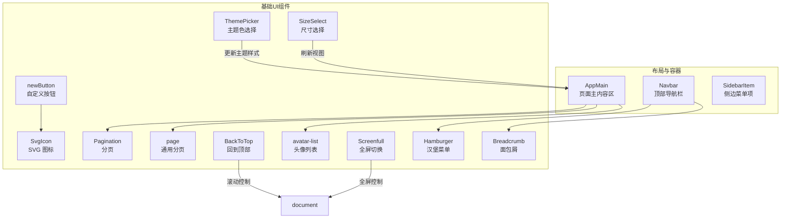
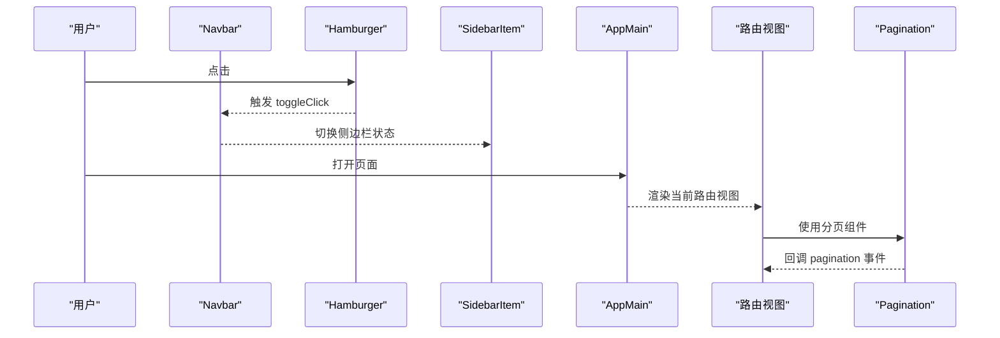
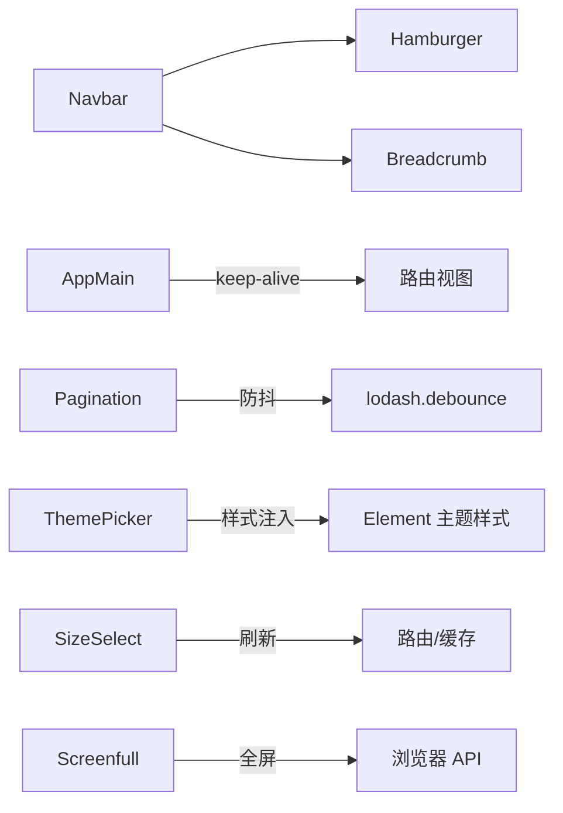

# 基础UI组件

<cite>
**本文引用的文件**
- [src/components/general/newButton.vue](file://src/components/general/newButton.vue)
- [src/components/SvgIcon/index.vue](file://src/components/SvgIcon/index.vue)
- [src/components/Pagination/index.vue](file://src/components/Pagination/index.vue)
- [src/components/Breadcrumb/index.vue](file://src/components/Breadcrumb/index.vue)
- [src/components/BackToTop/index.vue](file://src/components/BackToTop/index.vue)
- [src/components/Hamburger/index.vue](file://src/components/Hamburger/index.vue)
- [src/components/Screenfull/index.vue](file://src/components/Screenfull/index.vue)
- [src/components/ThemePicker/index.vue](file://src/components/ThemePicker/index.vue)
- [src/components/SizeSelect/index.vue](file://src/components/SizeSelect/index.vue)
- [src/layout/components/AppMain.vue](file://src/layout/components/AppMain.vue)
- [src/layout/components/Navbar.vue](file://src/layout/components/Navbar.vue)
- [src/layout/components/Sidebar/SidebarItem.vue](file://src/layout/components/Sidebar/SidebarItem.vue)
- [src/components/general/page.vue](file://src/components/general/page.vue)
- [src/components/general/avatar-list.vue](file://src/components/general/avatar-list.vue)
</cite>

## 目录
1. [简介](#简介)
2. [项目结构](#项目结构)
3. [核心组件](#核心组件)
4. [架构总览](#架构总览)
5. [详细组件分析](#详细组件分析)
6. [依赖分析](#依赖分析)
7. [性能考虑](#性能考虑)
8. [故障排查指南](#故障排查指南)
9. [结论](#结论)
10. [附录](#附录)

## 简介
本文件聚焦于 Leisu Admin 项目的“基础 UI 组件”，涵盖页面容器与导航、通用按钮、图标、分页、面包屑、返回顶部、汉堡菜单、全屏切换、主题选择器与尺寸选择器等。文档从组件职责、属性配置、事件处理、样式定制、响应式与主题化等方面进行系统梳理，并通过图示展示关键流程与关系，帮助开发者快速理解并正确使用这些组件。

## 项目结构
基础 UI 组件主要分布在以下位置：
- 通用业务组件：src/components/general/*.vue（如 newButton、page、avatar-list）
- 通用基础组件：src/components/*/*.vue（如 SvgIcon、Pagination、Breadcrumb、BackToTop、Hamburger、Screenfull、ThemePicker、SizeSelect）
- 页面容器与布局：src/layout/components/*/*.vue（如 AppMain、Navbar、Sidebar/SidebarItem）

图表来源
- [src/layout/components/AppMain.vue:1-122](file://src/layout/components/AppMain.vue#L1-L122)
- [src/layout/components/Navbar.vue:1-148](file://src/layout/components/Navbar.vue#L1-L148)
- [src/layout/components/Sidebar/SidebarItem.vue:1-206](file://src/layout/components/Sidebar/SidebarItem.vue#L1-L206)
- [src/components/general/newButton.vue:1-114](file://src/components/general/newButton.vue#L1-L114)
- [src/components/SvgIcon/index.vue:1-63](file://src/components/SvgIcon/index.vue#L1-L63)
- [src/components/Pagination/index.vue:1-113](file://src/components/Pagination/index.vue#L1-L113)
- [src/components/Breadcrumb/index.vue:1-85](file://src/components/Breadcrumb/index.vue#L1-L85)
- [src/components/BackToTop/index.vue:1-112](file://src/components/BackToTop/index.vue#L1-L112)
- [src/components/Hamburger/index.vue:1-45](file://src/components/Hamburger/index.vue#L1-L45)
- [src/components/Screenfull/index.vue:1-61](file://src/components/Screenfull/index.vue#L1-L61)
- [src/components/ThemePicker/index.vue:1-175](file://src/components/ThemePicker/index.vue#L1-L175)
- [src/components/SizeSelect/index.vue:1-58](file://src/components/SizeSelect/index.vue#L1-L58)
- [src/components/general/page.vue:1-61](file://src/components/general/page.vue#L1-L61)
- [src/components/general/avatar-list.vue:1-61](file://src/components/general/avatar-list.vue#L1-L61)

章节来源
- [src/layout/components/AppMain.vue:1-122](file://src/layout/components/AppMain.vue#L1-L122)
- [src/layout/components/Navbar.vue:1-148](file://src/layout/components/Navbar.vue#L1-L148)
- [src/layout/components/Sidebar/SidebarItem.vue:1-206](file://src/layout/components/Sidebar/SidebarItem.vue#L1-L206)

## 核心组件
本节对基础 UI 组件进行分类与要点总结，便于快速查阅与复用。

- 页面容器与布局
  - AppMain：承载路由视图、缓存与过渡动画；支持 iframe 嵌入场景；与 keep-alive 配合实现标签页缓存。
  - Navbar：顶部导航条，集成汉堡菜单、面包屑与用户下拉菜单。
  - SidebarItem：递归渲染侧边菜单，支持收藏、展开/折叠、外链判断与路径解析。

- 基础交互组件
  - newButton：可配置边框、尺寸、状态与组合按钮样式，支持禁用态与点击事件。
  - SvgIcon：统一 SVG 图标渲染，支持内联与外链图标，透传事件监听器。
  - Pagination：基于 Element Pagination 封装，提供防抖回调、自动滚动与布局配置。
  - page：简化版分页，仅提供核心参数与事件，适合轻量场景。
  - avatar-list：头像列表展示，支持 tooltip 提示与图片查看器。

- 导航与反馈组件
  - Breadcrumb：根据路由生成面包屑，过滤无标题或隐藏项，支持过渡动画。
  - BackToTop：监听滚动高度显示/隐藏，平滑回到顶部，支持自定义样式与动画名。
  - Hamburger：汉堡菜单图标，支持激活态旋转与点击事件。
  - Screenfull：全屏切换，检测浏览器兼容性并提示。

- 主题与尺寸
  - ThemePicker：预设主题色，动态编译并注入 Element 主题样式，支持实时预览。
  - SizeSelect：切换 Element 全局尺寸，触发缓存页刷新以适配新尺寸。

章节来源
- [src/layout/components/AppMain.vue:1-122](file://src/layout/components/AppMain.vue#L1-L122)
- [src/layout/components/Navbar.vue:1-148](file://src/layout/components/Navbar.vue#L1-L148)
- [src/layout/components/Sidebar/SidebarItem.vue:1-206](file://src/layout/components/Sidebar/SidebarItem.vue#L1-L206)
- [src/components/general/newButton.vue:1-114](file://src/components/general/newButton.vue#L1-L114)
- [src/components/SvgIcon/index.vue:1-63](file://src/components/SvgIcon/index.vue#L1-L63)
- [src/components/Pagination/index.vue:1-113](file://src/components/Pagination/index.vue#L1-L113)
- [src/components/general/page.vue:1-61](file://src/components/general/page.vue#L1-L61)
- [src/components/general/avatar-list.vue:1-61](file://src/components/general/avatar-list.vue#L1-L61)
- [src/components/Breadcrumb/index.vue:1-85](file://src/components/Breadcrumb/index.vue#L1-L85)
- [src/components/BackToTop/index.vue:1-112](file://src/components/BackToTop/index.vue#L1-L112)
- [src/components/Hamburger/index.vue:1-45](file://src/components/Hamburger/index.vue#L1-L45)
- [src/components/Screenfull/index.vue:1-61](file://src/components/Screenfull/index.vue#L1-L61)
- [src/components/ThemePicker/index.vue:1-175](file://src/components/ThemePicker/index.vue#L1-L175)
- [src/components/SizeSelect/index.vue:1-58](file://src/components/SizeSelect/index.vue#L1-L58)

## 架构总览
基础 UI 组件在应用中的协作关系如下：

图表来源
- [src/layout/components/Navbar.vue:1-148](file://src/layout/components/Navbar.vue#L1-L148)
- [src/layout/components/Sidebar/SidebarItem.vue:1-206](file://src/layout/components/Sidebar/SidebarItem.vue#L1-L206)
- [src/layout/components/AppMain.vue:1-122](file://src/layout/components/AppMain.vue#L1-L122)
- [src/components/Pagination/index.vue:1-113](file://src/components/Pagination/index.vue#L1-L113)

## 详细组件分析

### 页面容器组件
- AppMain
  - 职责：承载路由视图、缓存与过渡动画；支持 iframe 嵌入场景；与 keep-alive 配合实现标签页缓存。
  - 关键点：通过计算属性 cachedViews 控制 keep-alive include；根据路由 meta 判断是否 iframe 并设置高度；与固定头部/标签页联动。
  - 适用场景：作为页面主内容区，承载业务视图与通用分页组件。

- Navbar
  - 职责：顶部导航条，集成汉堡菜单、面包屑与用户下拉菜单。
  - 关键点：左侧汉堡菜单与面包屑；右侧用户信息与登出操作；与 Vuex 状态联动。

- SidebarItem
  - 职责：递归渲染侧边菜单，支持收藏、展开/折叠、外链判断与路径解析。
  - 关键点：根据子项数量决定直接展示还是展开子菜单；支持收藏功能与本地存储；路径解析考虑外链与相对路径。

章节来源
- [src/layout/components/AppMain.vue:1-122](file://src/layout/components/AppMain.vue#L1-L122)
- [src/layout/components/Navbar.vue:1-148](file://src/layout/components/Navbar.vue#L1-L148)
- [src/layout/components/Sidebar/SidebarItem.vue:1-206](file://src/layout/components/Sidebar/SidebarItem.vue#L1-L206)

### 按钮组件
- newButton
  - 属性
    - noborder：布尔，移除边框
    - width/height：字符串，按钮尺寸
    - type：字符串，样式类型（如 mini）
    - active：布尔，高亮态
    - isFirst/isMiddle/isFinally：布尔，组合按钮的首/中/尾样式
    - disabled：布尔，禁用态
  - 事件
    - click：点击事件（仅在未禁用时触发）
  - 样式
    - 支持禁用态、无边框、激活态、组合按钮圆角裁切
  - 使用建议
    - 组合按钮时，按顺序设置 isFirst/isMiddle/isFinally 实现圆角拼接
    - 通过 type 与 active 控制主题态与尺寸

章节来源
- [src/components/general/newButton.vue:1-114](file://src/components/general/newButton.vue#L1-L114)

### 图标组件
- SvgIcon
  - 属性
    - iconClass：字符串，图标名称（支持内联与外链）
    - className：字符串，额外类名
  - 行为
    - 内联图标：使用 <use href="#icon-..."> 渲染
    - 外链图标：通过 mask 渲染背景色图标
    - 透传所有原生事件监听器
  - 样式
    - 默认尺寸 1em，垂直居中，填充当前颜色
  - 使用建议
    - 与图标库配合，确保 iconClass 与定义一致
    - 外链图标注意跨域与 mask 兼容性

章节来源
- [src/components/SvgIcon/index.vue:1-63](file://src/components/SvgIcon/index.vue#L1-L63)

### 分页组件
- Pagination
  - 属性
    - total：总数
    - page/limit：当前页与每页条数（支持 .sync）
    - pageSizes/layout/background/pagerCount：Element 分页参数
    - autoScroll/hidden：滚动与显示控制
  - 事件
    - pagination：返回 {page, limit} 或带 pageSize 标记的对象
  - 行为
    - 使用 lodash.debounce 防抖处理 size-change 与 current-change
    - 可选自动滚动（注释掉）
  - 适用场景：大数据表格、列表分页

- page（通用分页）
  - 属性
    - total：总数
  - 事件
    - on-change：返回 [page_num, page_size]
  - 行为
    - 简化版布局（total, prev, pager, next），默认 pageSizes=[15,50,100,300,500]

章节来源
- [src/components/Pagination/index.vue:1-113](file://src/components/Pagination/index.vue#L1-L113)
- [src/components/general/page.vue:1-61](file://src/components/general/page.vue#L1-L61)

### 面包屑组件
- Breadcrumb
  - 行为
    - 监听路由变化，过滤含 meta.title 的路由层级
    - 限制最多三级（祖先链路），去重并排序
    - 使用过渡组实现动画
  - 适用场景：多级嵌套路由的路径导航

章节来源
- [src/components/Breadcrumb/index.vue:1-85](file://src/components/Breadcrumb/index.vue#L1-L85)

### 返回顶部组件
- BackToTop
  - 属性
    - visibilityHeight：可见高度阈值
    - backPosition：回到顶部位置
    - customStyle：自定义样式对象
    - transitionName：过渡动画名
  - 行为
    - 监听滚动显示/隐藏
    - 使用缓动函数平滑滚动至顶部
  - 适用场景：长页面快速回到顶部

章节来源
- [src/components/BackToTop/index.vue:1-112](file://src/components/BackToTop/index.vue#L1-L112)

### 汉堡菜单组件
- Hamburger
  - 属性
    - isActive：布尔，激活态（旋转）
  - 事件
    - toggleClick：点击事件
  - 适用场景：移动端/小屏侧边栏开关

章节来源
- [src/components/Hamburger/index.vue:1-45](file://src/components/Hamburger/index.vue#L1-L45)

### 全屏组件
- Screenfull
  - 行为
    - 检测浏览器全屏能力，不支持时提示
    - 绑定 screenfull 事件监听状态变化
  - 适用场景：需要全屏展示的报表或图表

章节来源
- [src/components/Screenfull/index.vue:1-61](file://src/components/Screenfull/index.vue#L1-L61)

### 主题选择器
- ThemePicker
  - 行为
    - 预设主题色，监听主题变化
    - 动态获取 Element 主题样式，生成色阶集群
    - 替换已有样式中的颜色变量并注入新样式
    - 触发 change 事件
  - 适用场景：动态主题切换与预览

章节来源
- [src/components/ThemePicker/index.vue:1-175](file://src/components/ThemePicker/index.vue#L1-L175)

### 尺寸选择器
- SizeSelect
  - 行为
    - 下拉选择 Element 尺寸（default/medium/small/mini）
    - 更新全局 $ELEMENT.size 与 Vuex 状态
    - 刷新当前路由以使缓存页重新渲染
  - 适用场景：全局尺寸切换

章节来源
- [src/components/SizeSelect/index.vue:1-58](file://src/components/SizeSelect/index.vue#L1-L58)

### 头像列表组件
- avatar-list
  - 属性
    - list：数组，头像数据
    - avatarKey/nameKey：字段映射
  - 行为
    - 使用 tooltip 显示名称
    - 使用图片查看器预览大图
  - 适用场景：用户头像堆叠展示

章节来源
- [src/components/general/avatar-list.vue:1-61](file://src/components/general/avatar-list.vue#L1-L61)

## 依赖分析
- 组件间耦合
  - Navbar 依赖 Hamburger 与 Breadcrumb
  - AppMain 依赖路由视图与 keep-alive 缓存策略
  - Pagination 依赖 Element UI 与 lodash.debounce
  - ThemePicker 依赖 Element UI 主题样式与运行时注入
  - SizeSelect 依赖 Vuex 与路由跳转以刷新缓存页
- 外部依赖
  - Element UI：分页、下拉、颜色选择器等
  - screenfull：全屏 API
  - lodash：防抖
  - Vue 生态：keep-alive、transition、router-view

图表来源
- [src/components/Pagination/index.vue:1-113](file://src/components/Pagination/index.vue#L1-L113)
- [src/components/ThemePicker/index.vue:1-175](file://src/components/ThemePicker/index.vue#L1-L175)
- [src/components/SizeSelect/index.vue:1-58](file://src/components/SizeSelect/index.vue#L1-L58)
- [src/components/Screenfull/index.vue:1-61](file://src/components/Screenfull/index.vue#L1-L61)

## 性能考虑
- 防抖优化
  - Pagination 对 size-change 与 current-change 使用防抖，降低频繁回调带来的重渲染压力。
- 缓存与复用
  - AppMain 使用 keep-alive 缓存视图，减少重复渲染；SizeSelect 刷新路由以确保缓存页按新尺寸重新渲染。
- 样式注入
  - ThemePicker 仅替换匹配的颜色变量，避免全量重绘；通过一次性注入新样式提升切换效率。
- 滚动与动画
  - BackToTop 使用缓动函数与定时器平滑滚动，避免卡顿；过渡动画采用 CSS 过渡，性能稳定。

## 故障排查指南
- 分页不触发回调
  - 检查是否使用了 .sync 修饰符或手动更新 page/limit；确认事件名是否为 pagination。
  - 参考路径：[分页事件处理:87-99](file://src/components/Pagination/index.vue#L87-L99)
- 主题切换无效
  - 确认已正确引入 Element 主题样式；检查主题色是否在预设列表中；观察控制台是否有样式注入错误。
  - 参考路径：[主题样式注入逻辑:62-80](file://src/components/ThemePicker/index.vue#L62-L80)
- 尺寸切换后样式未生效
  - 确认 SizeSelect 是否正确更新 $ELEMENT.size 与 Vuex；检查路由刷新逻辑是否执行。
  - 参考路径：[尺寸切换与刷新:33-53](file://src/components/SizeSelect/index.vue#L33-L53)
- 全屏不可用
  - 浏览器不支持 screenfull 时会提示；可在点击前检查 enabled 状态。
  - 参考路径：[全屏能力检测:24-32](file://src/components/Screenfull/index.vue#L24-L32)
- 汉堡菜单点击无反应
  - 确认父组件是否正确绑定 toggleClick 事件；检查 isActive 状态是否同步。
  - 参考路径：[汉堡菜单事件:25-28](file://src/components/Hamburger/index.vue#L25-L28)
- 面包屑为空
  - 确保路由 meta 中存在 title；检查是否被过滤或隐藏。
  - 参考路径：[面包屑生成逻辑:30-67](file://src/components/Breadcrumb/index.vue#L30-L67)

章节来源
- [src/components/Pagination/index.vue:1-113](file://src/components/Pagination/index.vue#L1-L113)
- [src/components/ThemePicker/index.vue:1-175](file://src/components/ThemePicker/index.vue#L1-L175)
- [src/components/SizeSelect/index.vue:1-58](file://src/components/SizeSelect/index.vue#L1-L58)
- [src/components/Screenfull/index.vue:1-61](file://src/components/Screenfull/index.vue#L1-L61)
- [src/components/Hamburger/index.vue:1-45](file://src/components/Hamburger/index.vue#L1-L45)
- [src/components/Breadcrumb/index.vue:1-85](file://src/components/Breadcrumb/index.vue#L1-L85)

## 结论
Leisu Admin 的基础 UI 组件围绕“布局容器 + 通用交互 + 主题与尺寸”构建，具备良好的可复用性与扩展性。通过统一的事件与属性约定、合理的防抖与缓存策略，以及主题与尺寸的动态切换能力，能够满足后台管理系统的常见需求。建议在业务组件中优先复用这些基础组件，并遵循其属性与事件规范，以保证一致性与可维护性。

## 附录
- 组件组合与扩展建议
  - 组合按钮：使用 newButton 的 isFirst/isMiddle/isFinally 实现圆角拼接，结合 SvgIcon 提升可读性。
  - 分页：在大数据场景优先使用 Pagination；轻量场景可用 page。
  - 主题与尺寸：通过 ThemePicker 与 SizeSelect 实现全局主题与尺寸切换，注意缓存页刷新。
  - 导航：Navbar + Breadcrumb + SidebarItem 形成完整的导航体系，面包屑与侧边菜单保持一致的 meta.title。