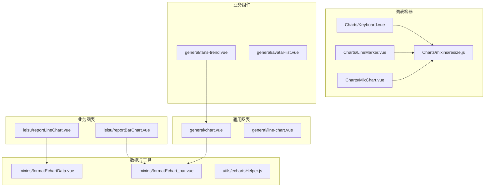
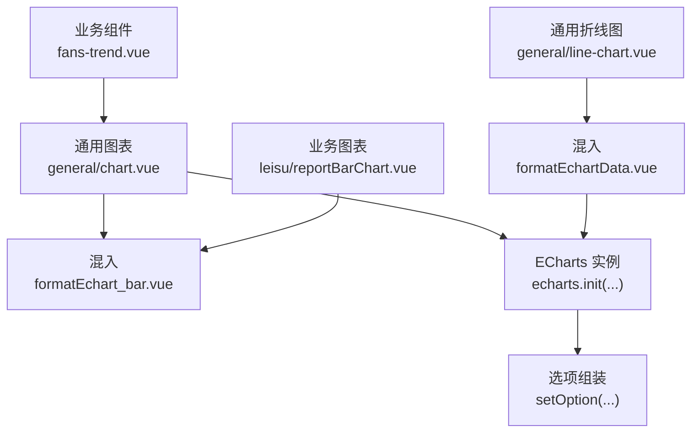
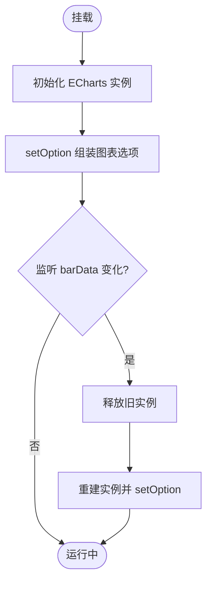
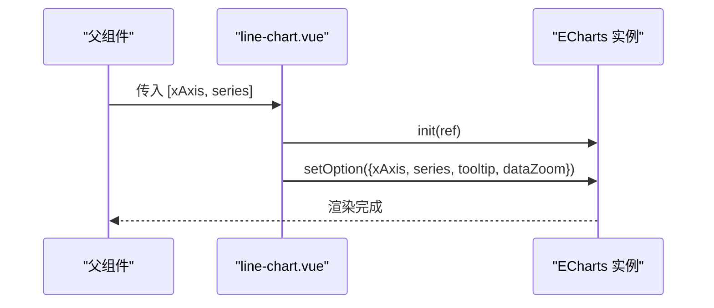
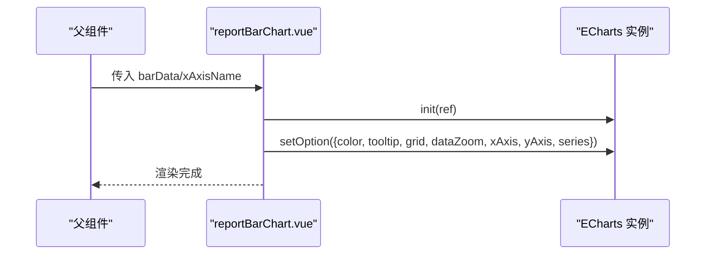
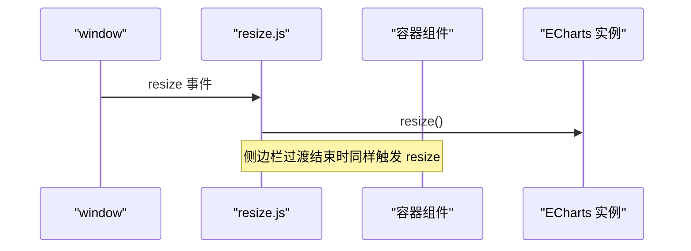
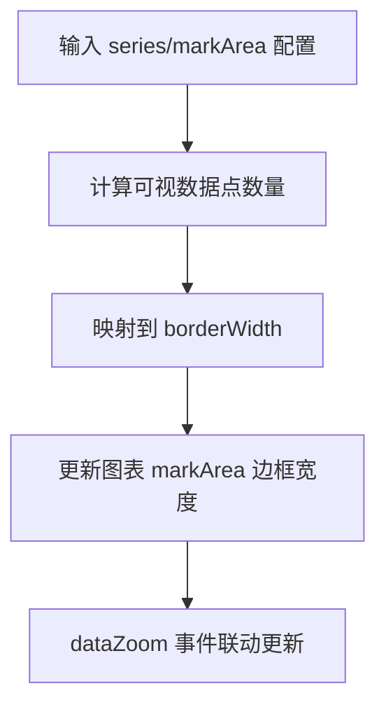
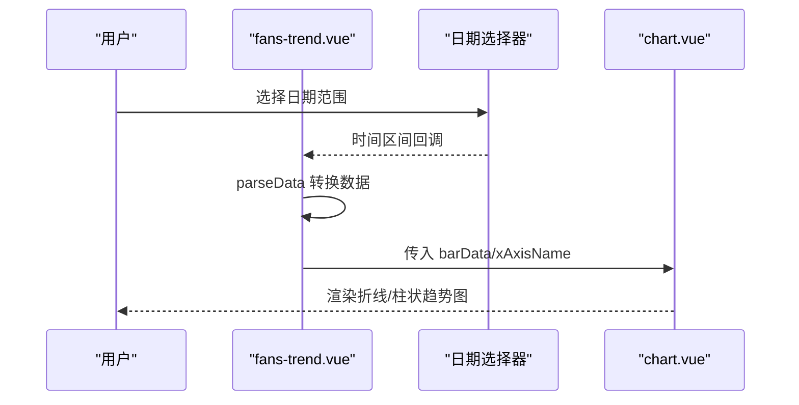
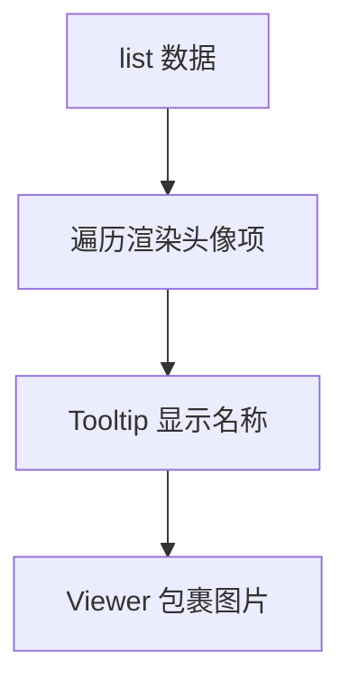
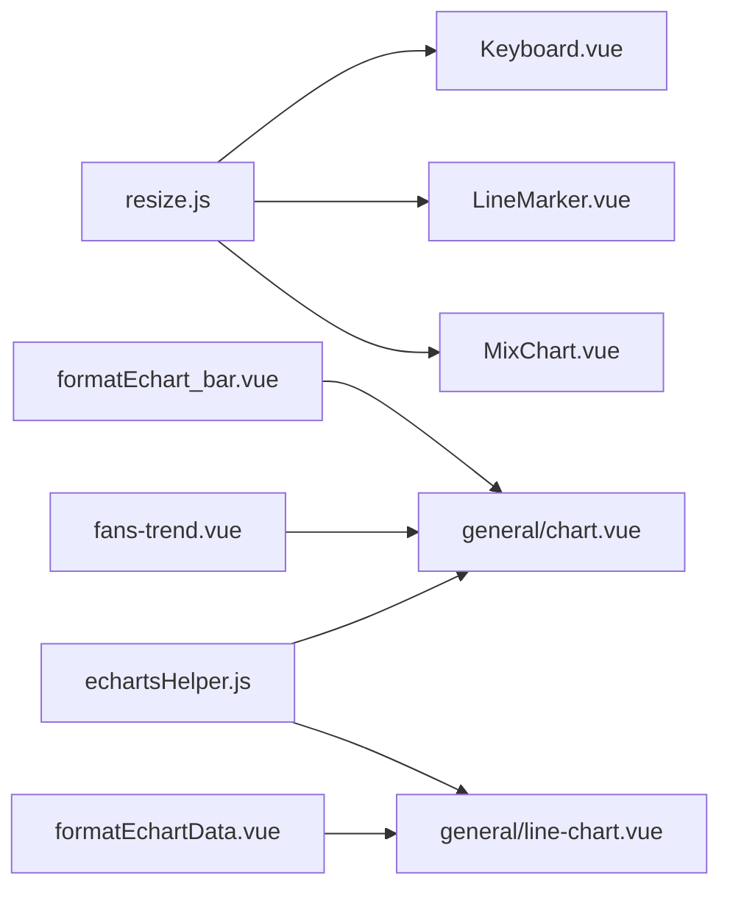

# 数据展示组件

<cite>
**本文引用的文件**
- [chart.vue](file://src/components/general/chart.vue)
- [fans-trend.vue](file://src/components/general/fans-trend.vue)
- [avatar-list.vue](file://src/components/general/avatar-list.vue)
- [line-chart.vue](file://src/components/general/line-chart.vue)
- [reportBarChart.vue](file://src/components/leisu/reportBarChart.vue)
- [reportLineChart.vue](file://src/components/leisu/reportLineChart.vue)
- [Keyboard.vue](file://src/components/Charts/Keyboard.vue)
- [LineMarker.vue](file://src/components/Charts/LineMarker.vue)
- [MixChart.vue](file://src/components/Charts/MixChart.vue)
- [resize.js](file://src/components/Charts/mixins/resize.js)
- [echartsHelper.js](file://src/utils/echartsHelper.js)
- [formatEchartData.vue](file://src/mixins/formatEchartData.vue)
- [formatEchart_bar.vue](file://src/mixins/formatEchart_bar.vue)
</cite>

## 目录
1. [简介](#简介)
2. [项目结构](#项目结构)
3. [核心组件](#核心组件)
4. [架构总览](#架构总览)
5. [详细组件分析](#详细组件分析)
6. [依赖关系分析](#依赖关系分析)
7. [性能考量](#性能考量)
8. [故障排查指南](#故障排查指南)
9. [结论](#结论)
10. [附录](#附录)

## 简介
本文件聚焦 Leisu Admin 项目中的数据展示组件，系统性梳理图表组件、粉丝趋势组件与头像列表组件的实现原理、数据格式、配置项、交互与样式定制，并提供可复用的使用范式与扩展路径。内容覆盖：
- 图表组件：折线图、柱状图、混合图、趋势分析等
- 数据绑定与响应式更新机制
- 性能优化策略与可扩展性设计
- 自定义图表类型的实现方式与最佳实践

## 项目结构
围绕数据可视化，项目在以下目录提供组件与工具：
- 通用图表组件：general/chart.vue、general/line-chart.vue
- 业务图表组件：leisu/reportBarChart.vue、leisu/reportLineChart.vue
- 图表容器与混入：Charts/Keyboard.vue、Charts/LineMarker.vue、Charts/MixChart.vue、Charts/mixins/resize.js
- 数据格式化与辅助工具：mixins/formatEchartData.vue、mixins/formatEchart_bar.vue、utils/echartsHelper.js
- 业务场景组件：general/fans-trend.vue（粉丝趋势）、general/avatar-list.vue（头像列表）

**图表来源**
- [chart.vue:1-119](file://src/components/general/chart.vue#L1-L119)
- [line-chart.vue:1-104](file://src/components/general/line-chart.vue#L1-L104)
- [reportBarChart.vue:1-197](file://src/components/leisu/reportBarChart.vue#L1-L197)
- [reportLineChart.vue:1-68](file://src/components/leisu/reportLineChart.vue#L1-L68)
- [Keyboard.vue:1-228](file://src/components/Charts/Keyboard.vue#L1-L228)
- [LineMarker.vue:1-228](file://src/components/Charts/LineMarker.vue#L1-L228)
- [MixChart.vue:1-272](file://src/components/Charts/MixChart.vue#L1-L272)
- [resize.js:1-35](file://src/components/Charts/mixins/resize.js#L1-L35)
- [formatEchartData.vue:1-252](file://src/mixins/formatEchartData.vue#L1-L252)
- [formatEchart_bar.vue:1-115](file://src/mixins/formatEchart_bar.vue#L1-L115)
- [echartsHelper.js:1-138](file://src/utils/echartsHelper.js#L1-L138)
- [fans-trend.vue:1-116](file://src/components/general/fans-trend.vue#L1-L116)
- [avatar-list.vue:1-61](file://src/components/general/avatar-list.vue#L1-L61)

**章节来源**
- [chart.vue:1-119](file://src/components/general/chart.vue#L1-L119)
- [line-chart.vue:1-104](file://src/components/general/line-chart.vue#L1-L104)
- [reportBarChart.vue:1-197](file://src/components/leisu/reportBarChart.vue#L1-L197)
- [reportLineChart.vue:1-68](file://src/components/leisu/reportLineChart.vue#L1-L68)
- [Keyboard.vue:1-228](file://src/components/Charts/Keyboard.vue#L1-L228)
- [LineMarker.vue:1-228](file://src/components/Charts/LineMarker.vue#L1-L228)
- [MixChart.vue:1-272](file://src/components/Charts/MixChart.vue#L1-L272)
- [resize.js:1-35](file://src/components/Charts/mixins/resize.js#L1-L35)
- [formatEchartData.vue:1-252](file://src/mixins/formatEchartData.vue#L1-L252)
- [formatEchart_bar.vue:1-115](file://src/mixins/formatEchart_bar.vue#L1-L115)
- [echartsHelper.js:1-138](file://src/utils/echartsHelper.js#L1-L138)
- [fans-trend.vue:1-116](file://src/components/general/fans-trend.vue#L1-L116)
- [avatar-list.vue:1-61](file://src/components/general/avatar-list.vue#L1-L61)

## 核心组件
- 通用柱状图组件：提供基础柱状图能力，支持数据绑定、缩放、提示框与网格布局。
- 通用折线图组件：提供折线图能力，支持双Y轴、缩放、提示框与网格布局。
- 业务图表组件：按业务场景封装的柱状/折线图，集成主题色与样式。
- 图表容器组件：封装 ECharts 初始化、销毁与响应式尺寸处理。
- 数据格式化混入：统一组装 ECharts 选项、格式化多线数据、排序与汇总。
- 工具函数：动态 markArea 边框宽度、可视区域数据点计算与联动更新。

**章节来源**
- [chart.vue:1-119](file://src/components/general/chart.vue#L1-L119)
- [line-chart.vue:1-104](file://src/components/general/line-chart.vue#L1-L104)
- [reportBarChart.vue:1-197](file://src/components/leisu/reportBarChart.vue#L1-L197)
- [reportLineChart.vue:1-68](file://src/components/leisu/reportLineChart.vue#L1-L68)
- [Keyboard.vue:1-228](file://src/components/Charts/Keyboard.vue#L1-L228)
- [LineMarker.vue:1-228](file://src/components/Charts/LineMarker.vue#L1-L228)
- [MixChart.vue:1-272](file://src/components/Charts/MixChart.vue#L1-L272)
- [formatEchartData.vue:1-252](file://src/mixins/formatEchartData.vue#L1-L252)
- [formatEchart_bar.vue:1-115](file://src/mixins/formatEchart_bar.vue#L1-L115)
- [echartsHelper.js:1-138](file://src/utils/echartsHelper.js#L1-L138)

## 架构总览
数据展示组件采用“容器 + 混入 + 工具”的分层设计：
- 容器组件负责生命周期管理、ECharts 实例创建与销毁、响应式尺寸适配。
- 混入提供统一的数据格式化与 ECharts 选项组装逻辑。
- 工具函数提供动态样式与交互增强（如 markArea 边框随缩放变化）。
- 业务组件通过 props 注入数据，完成最终渲染。

**图表来源**
- [fans-trend.vue:1-116](file://src/components/general/fans-trend.vue#L1-L116)
- [chart.vue:1-119](file://src/components/general/chart.vue#L1-L119)
- [reportBarChart.vue:1-197](file://src/components/leisu/reportBarChart.vue#L1-L197)
- [line-chart.vue:1-104](file://src/components/general/line-chart.vue#L1-L104)
- [formatEchart_bar.vue:1-115](file://src/mixins/formatEchart_bar.vue#L1-L115)
- [formatEchartData.vue:1-252](file://src/mixins/formatEchartData.vue#L1-L252)

## 详细组件分析

### 通用柱状图组件（chart.vue）
- 职责：基于 ECharts 渲染柱状图，支持 X/Y 轴、提示框、缩放、网格布局。
- 关键属性：
  - barName：图表标识，用于生成 DOM 引用与 key。
  - barData：系列数组，每个元素包含 type、name、data 等。
  - xAxisName：X 轴分类数据。
- 生命周期：
  - mounted：延迟初始化，确保 DOM 就绪。
  - beforeDestroy：释放实例，避免内存泄漏。
- 数据绑定与更新：
  - 通过 watch 监听 barData 深度变化，自动重新 setOption。
- 样式与交互：
  - 提供颜色数组与区域样式数组，支持主题色。
  - 支持 dataZoom 滑块与提示框格式化。

**图表来源**
- [chart.vue:1-119](file://src/components/general/chart.vue#L1-L119)

**章节来源**
- [chart.vue:1-119](file://src/components/general/chart.vue#L1-L119)

### 通用折线图组件（line-chart.vue）
- 职责：渲染折线图，支持双 Y 轴、提示框、缩放与网格布局。
- 输入数据格式：二维数组 [xAxis, series]，其中 series 为多个折线系列。
- 交互特性：提示框为 axisPointer 类型，支持滑动缩放。

**图表来源**
- [line-chart.vue:1-104](file://src/components/general/line-chart.vue#L1-L104)

**章节来源**
- [line-chart.vue:1-104](file://src/components/general/line-chart.vue#L1-L104)

### 业务图表组件（reportBarChart.vue / reportLineChart.vue）
- 折线图组件（reportLineChart.vue）：
  - 集成 format 混入，统一颜色与区域样式。
  - series 默认设置较小的符号尺寸与区域样式。
- 柱状图组件（reportBarChart.vue）：
  - 通过 props 接收 barData 与 xAxisName，设置每列最大宽度。
  - 监听 barData 深度变化，必要时重建实例以保证渲染一致性。

**图表来源**
- [reportBarChart.vue:1-197](file://src/components/leisu/reportBarChart.vue#L1-L197)
- [reportLineChart.vue:1-68](file://src/components/leisu/reportLineChart.vue#L1-L68)

**章节来源**
- [reportBarChart.vue:1-197](file://src/components/leisu/reportBarChart.vue#L1-L197)
- [reportLineChart.vue:1-68](file://src/components/leisu/reportLineChart.vue#L1-L68)

### 图表容器组件与响应式混入（Keyboard.vue / LineMarker.vue / MixChart.vue / resize.js）
- 容器组件：
  - 统一管理 ECharts 实例的创建与销毁。
  - 通过 props 控制尺寸与 ID，便于复用。
- 响应式混入（resize.js）：
  - 监听窗口 resize 与侧边栏过渡结束事件，触发图表 resize。
  - 使用防抖优化性能。

**图表来源**
- [resize.js:1-35](file://src/components/Charts/mixins/resize.js#L1-L35)
- [Keyboard.vue:1-228](file://src/components/Charts/Keyboard.vue#L1-L228)
- [LineMarker.vue:1-228](file://src/components/Charts/LineMarker.vue#L1-L228)
- [MixChart.vue:1-272](file://src/components/Charts/MixChart.vue#L1-L272)

**章节来源**
- [resize.js:1-35](file://src/components/Charts/mixins/resize.js#L1-L35)
- [Keyboard.vue:1-228](file://src/components/Charts/Keyboard.vue#L1-L228)
- [LineMarker.vue:1-228](file://src/components/Charts/LineMarker.vue#L1-L228)
- [MixChart.vue:1-272](file://src/components/Charts/MixChart.vue#L1-L272)

### 数据格式化与辅助工具（formatEchartData.vue / formatEchart_bar.vue / echartsHelper.js）
- formatEchartData.vue：
  - 提供 assemble 方法，统一组装 ECharts 选项（grid、legend、tooltip、xAxis、yAxis、series）。
  - 提供 format_oneline 与 format_moreline，用于单线与多线数据格式化与补零。
- formatEchart_bar.vue：
  - 提供颜色与区域颜色数组，以及 assemble_bar 方法，用于横向/纵向柱状图的选项组装。
- echartsHelper.js：
  - 动态 markArea 边框宽度：根据可视数据点数量计算 borderWidth 并更新。
  - 提供 enableDynamicMarkAreaBorderWidth 与 createSeriesWithDynamicMarkArea，便于在图表上启用动态 markArea 边框宽度。

**图表来源**
- [formatEchartData.vue:1-252](file://src/mixins/formatEchartData.vue#L1-L252)
- [formatEchart_bar.vue:1-115](file://src/mixins/formatEchart_bar.vue#L1-L115)
- [echartsHelper.js:1-138](file://src/utils/echartsHelper.js#L1-L138)

**章节来源**
- [formatEchartData.vue:1-252](file://src/mixins/formatEchartData.vue#L1-L252)
- [formatEchart_bar.vue:1-115](file://src/mixins/formatEchart_bar.vue#L1-L115)
- [echartsHelper.js:1-138](file://src/utils/echartsHelper.js#L1-L138)

### 粉丝趋势组件（fans-trend.vue）
- 场景：以折线图展示粉丝趋势，支持日期范围选择与默认时间区间。
- 数据流程：
  - 通过 props 注入默认时间区间或使用组件内部默认值。
  - 日期选择器变更时，向上抛出时间区间，同时更新内部 xName 与 barOption。
  - parseData 将服务端返回的数组转换为折线与柱状系列及 X 轴名称。
- 依赖：通用图表组件 chart.vue。

**图表来源**
- [fans-trend.vue:1-116](file://src/components/general/fans-trend.vue#L1-L116)
- [chart.vue:1-119](file://src/components/general/chart.vue#L1-L119)

**章节来源**
- [fans-trend.vue:1-116](file://src/components/general/fans-trend.vue#L1-L116)
- [chart.vue:1-119](file://src/components/general/chart.vue#L1-L119)

### 头像列表组件（avatar-list.vue）
- 场景：展示一组头像，支持自定义头像字段与名称字段。
- 特性：使用 Element UI Tooltip 提示名称；通过 Viewer 组件包裹图片，提升交互体验。
- 适用：用户列表、专家列表、团队成员等场景。

**图表来源**
- [avatar-list.vue:1-61](file://src/components/general/avatar-list.vue#L1-L61)

**章节来源**
- [avatar-list.vue:1-61](file://src/components/general/avatar-list.vue#L1-L61)

## 依赖关系分析
- 容器组件依赖混入与 ECharts：
  - 容器组件通过 props 接收尺寸与 ID，内部使用 ECharts 初始化实例。
  - resize 混入提供响应式适配，避免图表失真。
- 数据格式化混入与工具函数：
  - 通过统一的 assemble/format 方法，减少重复代码，提升一致性。
  - echartsHelper.js 提供动态样式增强，适用于复杂交互场景。
- 业务组件对通用组件的依赖：
  - fans-trend.vue 依赖 chart.vue，形成“业务场景 → 通用图表”的复用链路。

**图表来源**
- [resize.js:1-35](file://src/components/Charts/mixins/resize.js#L1-L35)
- [Keyboard.vue:1-228](file://src/components/Charts/Keyboard.vue#L1-L228)
- [LineMarker.vue:1-228](file://src/components/Charts/LineMarker.vue#L1-L228)
- [MixChart.vue:1-272](file://src/components/Charts/MixChart.vue#L1-L272)
- [formatEchart_bar.vue:1-115](file://src/mixins/formatEchart_bar.vue#L1-L115)
- [formatEchartData.vue:1-252](file://src/mixins/formatEchartData.vue#L1-L252)
- [echartsHelper.js:1-138](file://src/utils/echartsHelper.js#L1-L138)
- [chart.vue:1-119](file://src/components/general/chart.vue#L1-L119)
- [line-chart.vue:1-104](file://src/components/general/line-chart.vue#L1-L104)
- [fans-trend.vue:1-116](file://src/components/general/fans-trend.vue#L1-L116)

**章节来源**
- [resize.js:1-35](file://src/components/Charts/mixins/resize.js#L1-L35)
- [Keyboard.vue:1-228](file://src/components/Charts/Keyboard.vue#L1-L228)
- [LineMarker.vue:1-228](file://src/components/Charts/LineMarker.vue#L1-L228)
- [MixChart.vue:1-272](file://src/components/Charts/MixChart.vue#L1-L272)
- [formatEchart_bar.vue:1-115](file://src/mixins/formatEchart_bar.vue#L1-L115)
- [formatEchartData.vue:1-252](file://src/mixins/formatEchartData.vue#L1-L252)
- [echartsHelper.js:1-138](file://src/utils/echartsHelper.js#L1-L138)
- [chart.vue:1-119](file://src/components/general/chart.vue#L1-L119)
- [line-chart.vue:1-104](file://src/components/general/line-chart.vue#L1-L104)
- [fans-trend.vue:1-116](file://src/components/general/fans-trend.vue#L1-L116)

## 性能考量
- 防抖与节流：
  - resize 混入使用防抖，降低频繁 resize 导致的重绘压力。
- 实例生命周期管理：
  - 容器组件在 beforeDestroy 中释放实例，避免内存泄漏。
- 数据更新策略：
  - 通用组件通过深度监听数据变化，必要时重建实例，确保渲染一致性。
- 动态样式优化：
  - echartsHelper.js 根据可视数据点数量动态调整 markArea 边框宽度，避免在大数据量时视觉过重。

**章节来源**
- [resize.js:1-35](file://src/components/Charts/mixins/resize.js#L1-L35)
- [chart.vue:1-119](file://src/components/general/chart.vue#L1-L119)
- [reportBarChart.vue:1-197](file://src/components/leisu/reportBarChart.vue#L1-L197)
- [echartsHelper.js:1-138](file://src/utils/echartsHelper.js#L1-L138)

## 故障排查指南
- 图表不显示或空白：
  - 检查容器尺寸是否正确设置，确认 mounted 后已初始化实例。
  - 确认 props 数据格式符合 ECharts 期望（series、xAxis、yAxis）。
- 图表尺寸异常：
  - 确认 resize 混入已引入且未被移除；检查侧边栏过渡事件是否触发。
- 数据更新无效：
  - 确认是否使用了深度监听（deep: true）；对于复杂对象建议重建实例。
- markArea 边框不随缩放变化：
  - 确认已启用动态边框宽度功能，并在 dataZoom 事件中更新。

**章节来源**
- [resize.js:1-35](file://src/components/Charts/mixins/resize.js#L1-L35)
- [chart.vue:1-119](file://src/components/general/chart.vue#L1-L119)
- [reportBarChart.vue:1-197](file://src/components/leisu/reportBarChart.vue#L1-L197)
- [echartsHelper.js:1-138](file://src/utils/echartsHelper.js#L1-L138)

## 结论
Leisu Admin 的数据展示组件通过“容器 + 混入 + 工具”的架构实现了高内聚、低耦合与强复用。通用图表组件与业务图表组件配合数据格式化混入与工具函数，能够快速支撑折线图、柱状图、趋势分析等常见场景；同时，响应式适配与性能优化策略保障了在复杂业务下的稳定表现。建议在新增图表类型时优先复用现有混入与工具，遵循统一的数据格式与样式规范，以降低维护成本并提升一致性。

## 附录
- 数据格式要求（示例）
  - series：数组，元素包含 name、type、data 等字段。
  - xAxis：数组或对象，描述 X 轴类别或数值。
  - yAxis：数组或对象，描述 Y 轴配置。
- 配置选项要点
  - color：颜色数组，用于系列配色。
  - tooltip：提示框配置，支持 formatter 自定义。
  - dataZoom：滑动缩放配置，支持实时与滑块模式。
  - grid：网格布局，控制内外边距与包含标签。
- 交互功能
  - 响应式尺寸：resize 混入自动适配。
  - 动态 markArea：根据可视数据点数量动态调整边框宽度。
- 样式定制
  - 通过混入提供的颜色数组与区域样式数组进行主题定制。
  - 业务组件可覆盖默认颜色，满足不同场景需求。
- 扩展方法与自定义图表类型
  - 基于现有容器组件封装新的图表类型，复用生命周期与销毁逻辑。
  - 使用 formatEchartData 或 formatEchart_bar 的组装方法，快速生成 ECharts 选项。
  - 对于复杂交互，结合 echartsHelper.js 提供的动态样式工具，增强用户体验。