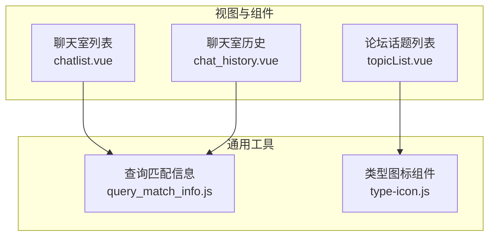
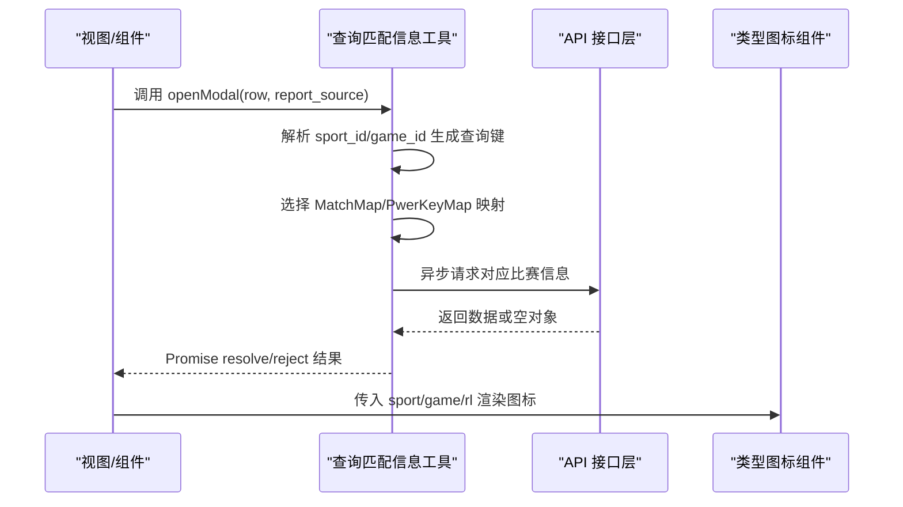
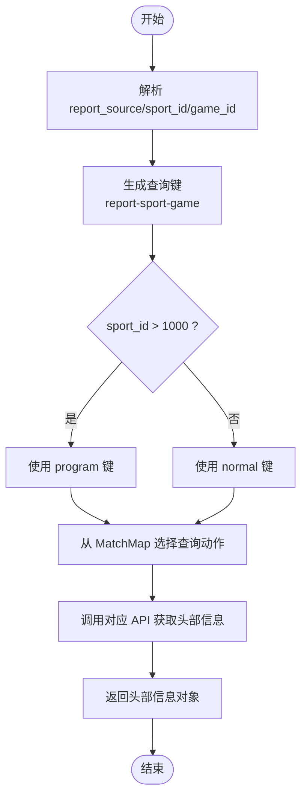
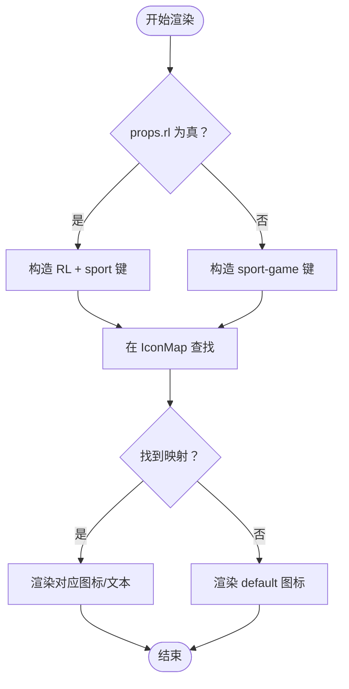
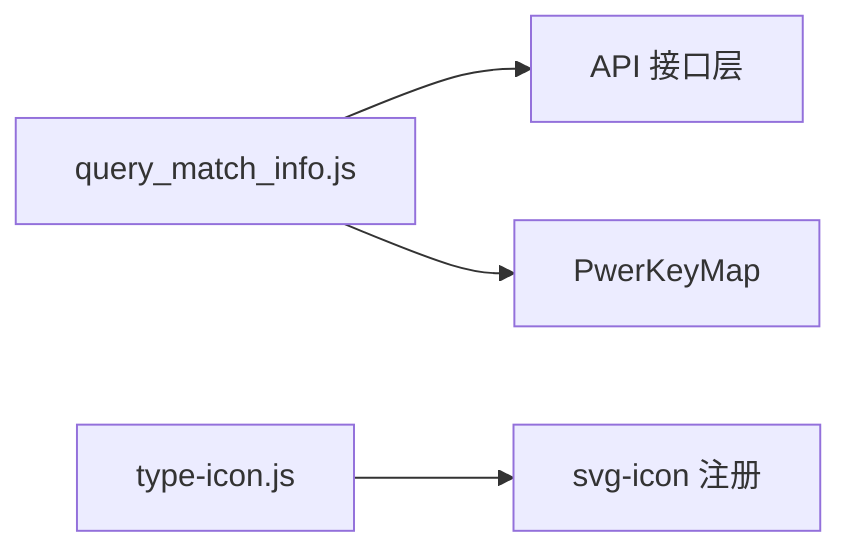

# 组件工具函数

<cite>
**本文引用的文件**
- [src/components/general/query_match_info.js](file://src/components/general/query_match_info.js)
- [src/components/leisu/peopleInfo/chat/components/query_match_info.js](file://src/components/leisu/peopleInfo/chat/components/query_match_info.js)
- [src/components/general/type-icon.js](file://src/components/general/type-icon.js)
- [src/views/chat_room/chatlist.vue](file://src/views/chat_room/chatlist.vue)
- [src/components/leisu/peopleInfo/chat/components/chat_history.vue](file://src/components/leisu/peopleInfo/chat/components/chat_history.vue)
- [src/views/forum/topicList.vue](file://src/views/forum/topicList.vue)
</cite>

## 目录
1. [简介](#简介)
2. [项目结构](#项目结构)
3. [核心组件](#核心组件)
4. [架构总览](#架构总览)
5. [详细组件分析](#详细组件分析)
6. [依赖关系分析](#依赖关系分析)
7. [性能考量](#性能考量)
8. [故障排查指南](#故障排查指南)
9. [结论](#结论)
10. [附录](#附录)

## 简介
本文件聚焦 Leisu Admin 项目中的两类通用组件工具函数：查询匹配信息工具函数与类型图标映射工具函数。前者负责根据“信息来源+体育类型+游戏类型”组合定位到对应的查询映射，并通过异步 API 获取比赛头部信息；后者则依据体育与游戏标识动态渲染对应图标或文本。文档将从实现原理、数据处理逻辑、匹配算法、结果格式化、图标配置与显示逻辑、使用示例、设计模式与可扩展性、错误处理与性能优化等方面进行系统化说明。

## 项目结构
围绕两类工具函数的相关文件分布如下：
- 查询匹配信息工具函数
  - 主实现：src/components/general/query_match_info.js
  - 聊天室专用实现（差异版）：src/components/leisu/peopleInfo/chat/components/query_match_info.js
- 类型图标映射工具函数
  - 图标组件：src/components/general/type-icon.js
- 使用示例
  - 聊天室列表页：src/views/chat_room/chatlist.vue
  - 聊天室历史记录页：src/components/leisu/peopleInfo/chat/components/chat_history.vue
  - 论坛话题列表页：src/views/forum/topicList.vue

图表来源
- [src/components/general/query_match_info.js:1-191](file://src/components/general/query_match_info.js#L1-L191)
- [src/components/general/type-icon.js:1-50](file://src/components/general/type-icon.js#L1-L50)
- [src/views/chat_room/chatlist.vue:430-849](file://src/views/chat_room/chatlist.vue#L430-L849)
- [src/components/leisu/peopleInfo/chat/components/chat_history.vue:25-170](file://src/components/leisu/peopleInfo/chat/components/chat_history.vue#L25-L170)
- [src/views/forum/topicList.vue:90-170](file://src/views/forum/topicList.vue#L90-L170)

章节来源
- [src/components/general/query_match_info.js:1-191](file://src/components/general/query_match_info.js#L1-L191)
- [src/components/general/type-icon.js:1-50](file://src/components/general/type-icon.js#L1-L50)
- [src/views/chat_room/chatlist.vue:430-849](file://src/views/chat_room/chatlist.vue#L430-L849)
- [src/components/leisu/peopleInfo/chat/components/chat_history.vue:25-170](file://src/components/leisu/peopleInfo/chat/components/chat_history.vue#L25-L170)
- [src/views/forum/topicList.vue:90-170](file://src/views/forum/topicList.vue#L90-L170)

## 核心组件
- 查询匹配信息工具函数
  - 功能：根据 report_source、sport_id、game_id 生成查询键，选择匹配映射，异步获取并返回比赛头部信息；同时提供权限键提取能力。
  - 关键导出：QueryModalHeaderInfo（默认导出）、QueryPwerKey（命名导出）、openModal（命名导出）。
- 类型图标映射工具函数
  - 功能：基于 sport 与 game 的组合映射到具体图标或文本，支持 RL 场景的特殊渲染。
  - 关键导出：默认导出（functional 组件），接收 sport、game、rl 三个属性。

章节来源
- [src/components/general/query_match_info.js:120-191](file://src/components/general/query_match_info.js#L120-L191)
- [src/components/general/type-icon.js:1-50](file://src/components/general/type-icon.js#L1-L50)

## 架构总览
两类工具函数在系统中的交互路径如下：

图表来源
- [src/views/chat_room/chatlist.vue:742-792](file://src/views/chat_room/chatlist.vue#L742-L792)
- [src/components/general/query_match_info.js:129-191](file://src/components/general/query_match_info.js#L129-L191)
- [src/components/general/type-icon.js:16-49](file://src/components/general/type-icon.js#L16-L49)

## 详细组件分析

### 查询匹配信息工具函数
- 设计要点
  - 键生成策略：report_source-sport-game 组合键，当 sport_id > 1000 时统一走 program 路径。
  - 匹配映射：使用 Map 存储查询动作与权限键，便于扩展新类型。
  - 异步查询：按组合键选择对应 API，限制查询字段与关键字，返回首条数据作为头部信息。
  - 权限控制：通过 QueryPwerKey 生成权限键，结合 openModal 的权限判断决定是否拉取头部信息。
- 数据处理逻辑
  - 输入：report_source、sport_id、game_id、query_id。
  - 中间：解析 sport_id 与 game_id，生成查询键；若超过阈值则归一到 program；从 MatchMap 选取查询函数执行；从 PwerKeyMap 选取权限键。
  - 输出：Promise resolve 返回头部信息对象，reject 返回错误码与基础信息。
- 匹配算法
  - 键空间有限且明确，采用 Map 查找 O(1) 复杂度；默认分支兜底保证健壮性。
- 结果格式化
  - 返回对象包含头部字段（如名称、时间等），由各 API 返回结构决定；未命中时返回空对象。
- 错误处理
  - openModal 对权限不足与无历史列表权限分别返回不同错误码，调用方据此决定降级行为。
- 性能优化建议
  - 缓存：对常用查询键增加内存缓存，避免重复请求。
  - 批量：在批量场景下合并请求或去重。
  - 超时：为异步请求设置超时与重试策略。
  - 分页：若头部信息需要分页，应考虑懒加载与防抖。
- 可扩展性
  - 新增类型：在 MatchMap 与 PwerKeyMap 中新增键值对；确保 API 层有对应接口。
  - 新增组合：遵循“report_source-sport-game”规范，保持键的一致性。
  - 默认分支：保持 default 分支存在，避免异常路径崩溃。

图表来源
- [src/components/general/query_match_info.js:129-146](file://src/components/general/query_match_info.js#L129-L146)

章节来源
- [src/components/general/query_match_info.js:1-191](file://src/components/general/query_match_info.js#L1-L191)

### 类型图标映射工具函数
- 设计要点
  - functional 组件：无状态、轻量渲染，适合纯展示。
  - 属性输入：sport、game、rl（直播场景开关）。
  - 映射表：Map 将 "sport-game" 或 "RL+sport" 映射到具体图标或文本节点。
- 图标配置与颜色规则
  - 配置：IconMap 中定义了多类 sport-game 组合与 RL 场景映射，分别指向 svg-icon 或内联文本。
  - 颜色：组件本身不直接注入颜色，颜色由外部样式与 icon-class 决定。
- 显示逻辑
  - 当 props.rl 为真时，优先按 RL1/RL2 等键查找图标；否则按 "sport-game" 查找；未命中则使用 default。
- 可扩展性
  - 新增图标：在 IconMap 中新增键值对；确保 icon-class 对应的 SVG 已注册。
  - 文本图标：可通过自定义节点实现非 SVG 图标（如缩放文本）。

图表来源
- [src/components/general/type-icon.js:16-49](file://src/components/general/type-icon.js#L16-L49)

章节来源
- [src/components/general/type-icon.js:1-50](file://src/components/general/type-icon.js#L1-L50)

## 依赖关系分析
- 查询匹配信息工具函数
  - 依赖 API 层接口：football/basketball/tennis/lol/csgo/dota/match_program。
  - 依赖权限键：PwerKeyMap 用于判定是否有权拉取头部信息。
- 类型图标组件
  - 依赖全局 svg-icon 注册与样式。
  - 依赖外部传入的 sport、game、rl 属性。

图表来源
- [src/components/general/query_match_info.js:1-118](file://src/components/general/query_match_info.js#L1-L118)
- [src/components/general/type-icon.js:16-39](file://src/components/general/type-icon.js#L16-L39)

章节来源
- [src/components/general/query_match_info.js:1-118](file://src/components/general/query_match_info.js#L1-L118)
- [src/components/general/type-icon.js:16-39](file://src/components/general/type-icon.js#L16-L39)

## 性能考量
- 查询匹配信息
  - 建议对高频查询键做本地缓存，减少网络请求次数。
  - 在批量渲染场景中，采用防抖/节流策略，避免频繁触发 openModal。
  - 对 API 调用设置超时与失败重试，提升稳定性。
- 类型图标
  - functional 组件本身开销低，但大量渲染时仍建议复用与避免不必要的重新计算。
  - 合理拆分图标资源，按需引入，减少初始包体。

## 故障排查指南
- openModal 返回错误码
  - -1：当前类型无权限键，降级为仅展示基础信息。
  - -2：无历史列表权限，引导跳转至外部链接。
- 头部信息为空
  - 检查 report_source 与 sport_id/game_id 组合是否正确。
  - 确认对应 API 是否返回数据，或 MatchMap 是否覆盖该组合。
- 图标不显示
  - 确认 icon-class 是否已注册；RL 场景下检查 RL1/RL2 键是否存在映射。
- 调用方处理
  - 在调用 openModal 的组件中，区分 resolve 与 reject 分支，分别处理成功与失败场景。

章节来源
- [src/views/chat_room/chatlist.vue:773-792](file://src/views/chat_room/chatlist.vue#L773-L792)
- [src/components/general/query_match_info.js:164-191](file://src/components/general/query_match_info.js#L164-L191)

## 结论
两类工具函数分别承担“查询头部信息”与“图标渲染”的职责，均采用 Map 映射与默认兜底策略，具备良好的可扩展性与可维护性。通过合理的权限控制、缓存与超时机制，可在保证用户体验的同时降低后端压力。未来新增类型时，只需在映射表中补充键值对，并确保 API 层具备对应接口即可。

## 附录

### 实际使用示例与调用方式
- 聊天室列表页
  - 导入：从通用工具导入 openModal。
  - 调用：在点击房间时，解析房间标识为 sport_id/game_id/match_id，随后调用 openModal 并根据返回结果初始化聊天组件。
  - 参考路径：[src/views/chat_room/chatlist.vue:742-792](file://src/views/chat_room/chatlist.vue#L742-L792)
- 聊天室历史记录页
  - 导入：TypeIcon 与 QueryHeaderInfo/QueryPwerKey。
  - 渲染：表格列中使用 TypeIcon 展示图标；点击“比赛信息”列时调用 QueryHeaderInfo 获取头部信息并初始化聊天组件。
  - 参考路径：[src/components/leisu/peopleInfo/chat/components/chat_history.vue:27-110](file://src/components/leisu/peopleInfo/chat/components/chat_history.vue#L27-L110)
- 论坛话题列表页
  - 导入：TypeIcon。
  - 渲染：在表格列中直接使用 TypeIcon 展示图标。
  - 参考路径：[src/views/forum/topicList.vue:90-170](file://src/views/forum/topicList.vue#L90-L170)

### 参数传递与结果格式
- openModal
  - 入参：row（含 sport_id、game_id、match_id 等）、report_source（默认 1）。
  - 出参：Promise，resolve 返回 [错误码, 合并后的头部信息对象, 历史权限标志]；reject 返回 [错误码, 基础信息对象, 历史权限标志]。
- QueryModalHeaderInfo
  - 入参：report_source、sport_id、game_id、query_id。
  - 出参：Promise，resolve 返回头部信息对象。
- QueryPwerKey
  - 入参：report_source、sport_id、game_id。
  - 出参：字符串权限键。
- TypeIcon
  - 入参：sport、game、rl。
  - 出参：渲染节点（svg-icon 或文本）。

章节来源
- [src/views/chat_room/chatlist.vue:742-792](file://src/views/chat_room/chatlist.vue#L742-L792)
- [src/components/leisu/peopleInfo/chat/components/chat_history.vue:94-110](file://src/components/leisu/peopleInfo/chat/components/chat_history.vue#L94-L110)
- [src/views/forum/topicList.vue:90-170](file://src/views/forum/topicList.vue#L90-L170)
- [src/components/general/query_match_info.js:129-191](file://src/components/general/query_match_info.js#L129-L191)
- [src/components/general/type-icon.js:16-49](file://src/components/general/type-icon.js#L16-L49)