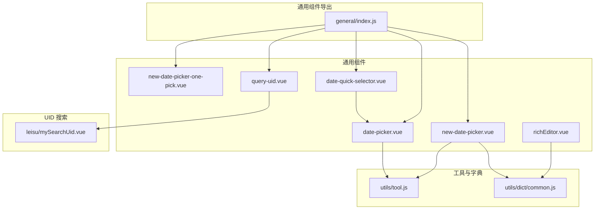
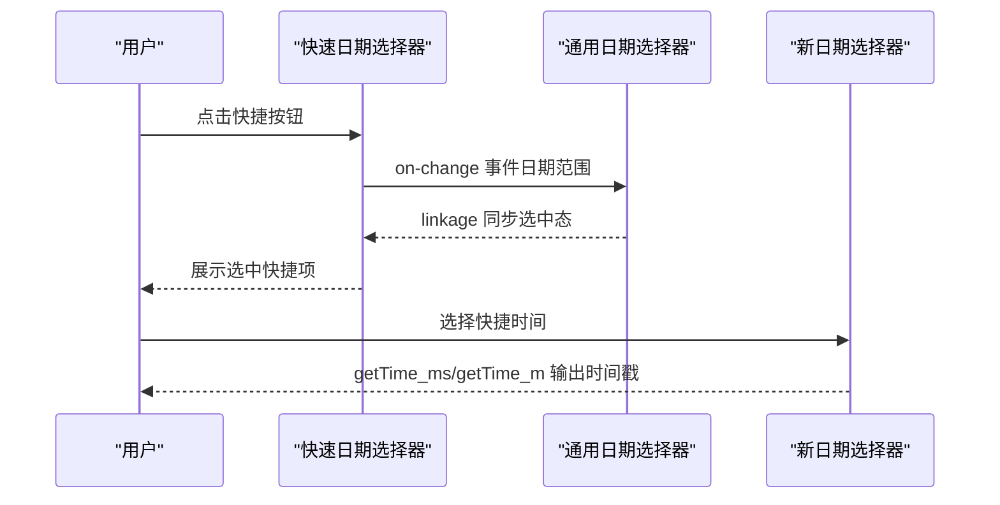
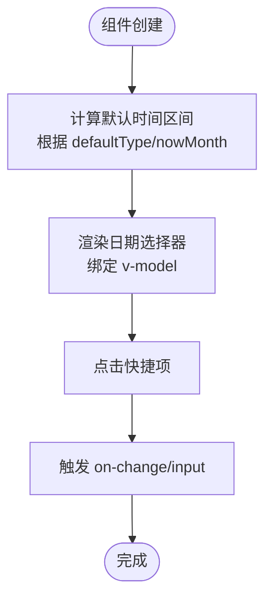
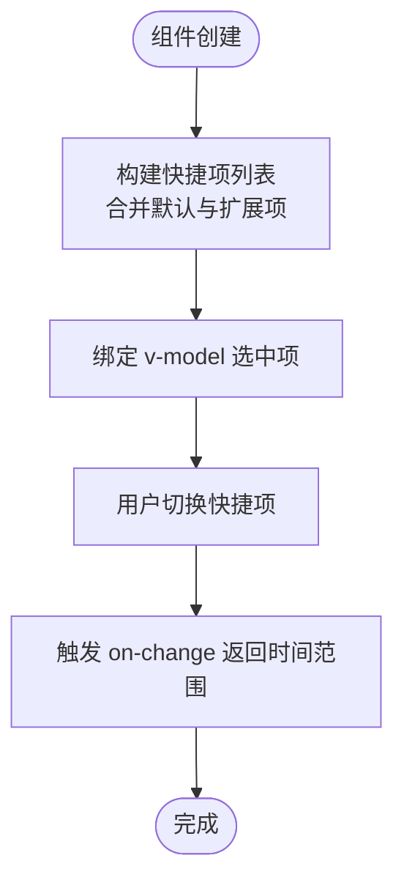
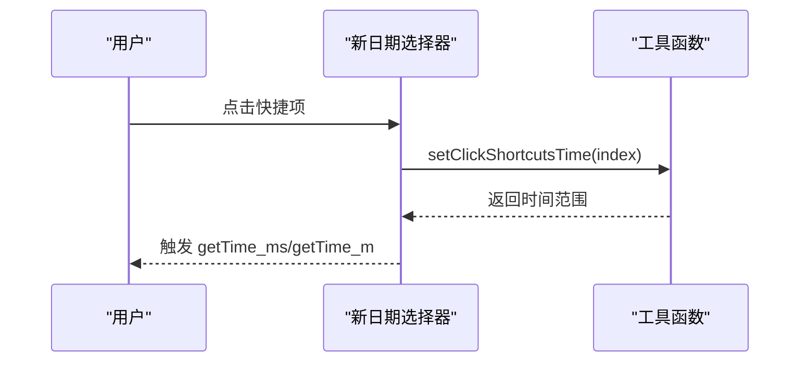
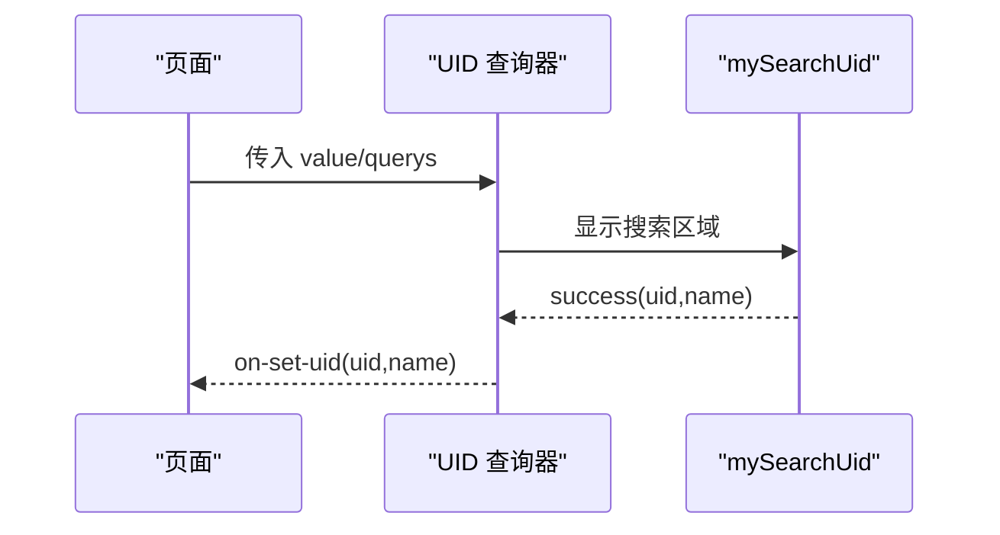
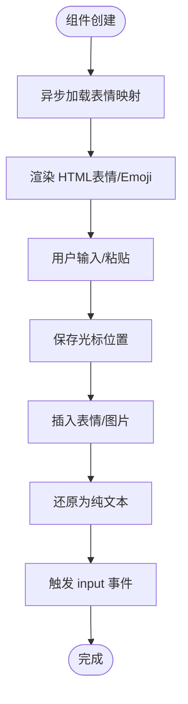
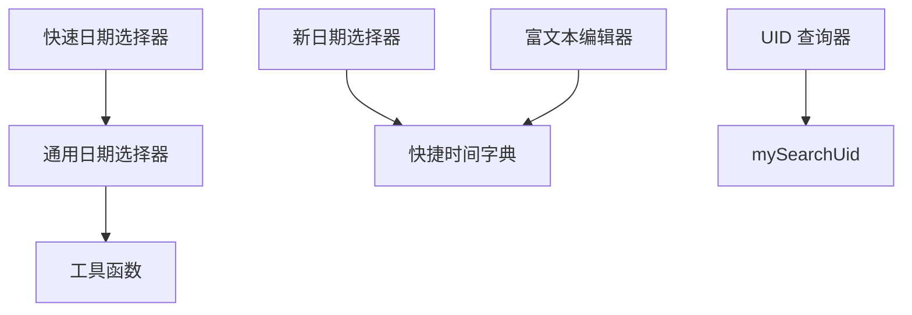

# 表单输入组件

<cite>
**本文档引用的文件**
- [src/components/general/date-picker.vue](file://src/components/general/date-picker.vue)
- [src/components/general/date-quick-selector.vue](file://src/components/general/date-quick-selector.vue)
- [src/components/general/new-date-picker.vue](file://src/components/general/new-date-picker.vue)
- [src/components/general/new-date-picker-one-pick.vue](file://src/components/general/new-date-picker-one-pick.vue)
- [src/components/general/query-uid.vue](file://src/components/general/query-uid.vue)
- [src/components/leisu/mySearchUid.vue](file://src/components/leisu/mySearchUid.vue)
- [src/components/general/richEditor.vue](file://src/components/general/richEditor.vue)
- [src/utils/tool.js](file://src/utils/tool.js)
- [src/utils/dict/common.js](file://src/utils/dict/common.js)
- [src/components/general/index.js](file://src/components/general/index.js)
</cite>

## 目录
1. [简介](#简介)
2. [项目结构](#项目结构)
3. [核心组件](#核心组件)
4. [架构总览](#架构总览)
5. [详细组件分析](#详细组件分析)
6. [依赖分析](#依赖分析)
7. [性能考虑](#性能考虑)
8. [故障排查指南](#故障排查指南)
9. [结论](#结论)
10. [附录](#附录)

## 简介
本文件面向 Leisu Admin 项目的表单输入组件，重点覆盖以下组件：
- 日期选择器（通用范围选择与快捷联动）
- 快速日期选择器（快捷按钮组）
- UID 查询器（基于 mySearchUid 的封装）
- 富文本编辑器（表情插入、内容渲染与回显）

文档将从数据绑定、验证规则、事件回调、配置选项、使用示例与扩展能力等方面进行系统化说明，帮助开发者快速集成与定制。

## 项目结构
与表单输入组件相关的文件主要位于 components/general 与 components/leisu 下，同时依赖 utils 中的工具函数与字典配置。

图表来源
- [src/components/general/date-picker.vue:1-338](file://src/components/general/date-picker.vue#L1-L338)
- [src/components/general/new-date-picker.vue:1-191](file://src/components/general/new-date-picker.vue#L1-L191)
- [src/components/general/new-date-picker-one-pick.vue:1-153](file://src/components/general/new-date-picker-one-pick.vue#L1-L153)
- [src/components/general/date-quick-selector.vue:1-114](file://src/components/general/date-quick-selector.vue#L1-L114)
- [src/components/general/query-uid.vue:1-44](file://src/components/general/query-uid.vue#L1-L44)
- [src/components/leisu/mySearchUid.vue:1-230](file://src/components/leisu/mySearchUid.vue#L1-L230)
- [src/components/general/richEditor.vue:1-220](file://src/components/general/richEditor.vue#L1-L220)
- [src/components/general/index.js:1-41](file://src/components/general/index.js#L1-L41)
- [src/utils/tool.js:854-870](file://src/utils/tool.js#L854-L870)
- [src/utils/dict/common.js:228-230](file://src/utils/dict/common.js#L228-L230)

章节来源
- [src/components/general/index.js:1-41](file://src/components/general/index.js#L1-L41)

## 核心组件
- 日期选择器（通用范围选择）：支持快捷时间、默认时间、区间选择、初始化事件等。
- 新日期选择器（快捷时间）：内置快捷时间列表，支持毫秒/秒两种输出。
- 单日时间选择器：单选日期时间，支持快捷按钮。
- 快速日期选择器：快捷按钮组，联动日期选择器。
- UID 查询器：根据传入的值动态显示 mySearchUid 并回传 UID。
- 富文本编辑器：contenteditable 编辑区域，表情插入与回显。

章节来源
- [src/components/general/date-picker.vue:1-338](file://src/components/general/date-picker.vue#L1-L338)
- [src/components/general/new-date-picker.vue:1-191](file://src/components/general/new-date-picker.vue#L1-L191)
- [src/components/general/new-date-picker-one-pick.vue:1-153](file://src/components/general/new-date-picker-one-pick.vue#L1-L153)
- [src/components/general/date-quick-selector.vue:1-114](file://src/components/general/date-quick-selector.vue#L1-L114)
- [src/components/general/query-uid.vue:1-44](file://src/components/general/query-uid.vue#L1-L44)
- [src/components/leisu/mySearchUid.vue:1-230](file://src/components/leisu/mySearchUid.vue#L1-L230)
- [src/components/general/richEditor.vue:1-220](file://src/components/general/richEditor.vue#L1-L220)

## 架构总览
组件间协作关系如下：
- 快速日期选择器与通用日期选择器通过事件联动，实现快捷时间与日期面板的双向同步。
- UID 查询器内部使用 mySearchUid，对外暴露 on-set-uid 事件。
- 新日期选择器依赖工具函数生成快捷时间范围，并通过事件输出毫秒/秒时间戳。
- 富文本编辑器依赖表情字典与 store 中的表情映射，实现表情渲染与插入。

图表来源
- [src/components/general/date-quick-selector.vue:93-105](file://src/components/general/date-quick-selector.vue#L93-L105)
- [src/components/general/date-picker.vue:311-323](file://src/components/general/date-picker.vue#L311-L323)
- [src/components/general/new-date-picker.vue:130-171](file://src/components/general/new-date-picker.vue#L130-L171)

## 详细组件分析

### 通用日期选择器（daterange）
- 数据绑定
  - v-model 绑定默认时间区间，默认为当天 00:00:00 至 23:59:59。
  - 支持通过 props 传入 defaultType 控制默认时间区间类型。
- 快捷时间
  - 内置快捷项：前天、昨天、今天、明天、近三天、近一周、本周、上周、近一月、本月、上月、近半年、近一年、本年度。
  - 支持联动快速日期选择器，通过 linkage 方法同步选中态。
- 事件回调
  - on-init/on-change/input：初始化与变更时触发。
  - changefunc：处理选择变化，统一格式化为当天 00:00:00/23:59:59。
- 配置选项
  - defaultType：默认时间区间类型（0~5、10 等）。
  - type：选择类型（daterange）。
  - nowMonth：用于计算“本月/上月”的偏移。
  - size/typeValue/init：尺寸、默认值与初始化行为。
- 使用示例
  - 在页面中引入组件，绑定 v-model，监听 on-change 或 input 获取时间区间。
  - 与快速日期选择器配合，调用 linkage 同步快捷项选中。

图表来源
- [src/components/general/date-picker.vue:66-102](file://src/components/general/date-picker.vue#L66-L102)
- [src/components/general/date-picker.vue:104-233](file://src/components/general/date-picker.vue#L104-L233)
- [src/components/general/date-picker.vue:237-244](file://src/components/general/date-picker.vue#L237-L244)
- [src/components/general/date-picker.vue:311-323](file://src/components/general/date-picker.vue#L311-L323)

章节来源
- [src/components/general/date-picker.vue:1-338](file://src/components/general/date-picker.vue#L1-L338)

### 快速日期选择器（快捷按钮组）
- 数据绑定
  - v-model 绑定选中索引，支持插槽扩展按钮。
- 快捷项
  - 默认项：昨天、今天。
  - 可通过 extendList 扩展更多快捷项，value 支持毫秒差或固定区间。
- 事件回调
  - on-change：选中项变化时触发，返回日期范围。
  - linkage：接收外部日期选择器的时间，自动选中对应快捷项。
- 配置选项
  - defaultSelected：默认选中项索引。
  - extendList：扩展快捷项列表。
  - default：是否启用默认项。
- 使用示例
  - 在页面中引入组件，绑定 v-model，监听 on-change 获取选中快捷项对应的时间范围。
  - 调用 linkage 与通用日期选择器联动。

图表来源
- [src/components/general/date-quick-selector.vue:72-86](file://src/components/general/date-quick-selector.vue#L72-L86)
- [src/components/general/date-quick-selector.vue:93-105](file://src/components/general/date-quick-selector.vue#L93-L105)

章节来源
- [src/components/general/date-quick-selector.vue:1-114](file://src/components/general/date-quick-selector.vue#L1-L114)

### 新日期选择器（快捷时间 + 输出）
- 数据绑定
  - v-model 绑定当前选择值，支持数组或时间戳。
- 快捷时间
  - 依赖字典 quickTimeTextList 与工具函数 setClickShortcutsTime 生成快捷项。
  - 支持禁用未来日期（maxtime）。
- 事件回调
  - getTime_ms/getTime_m：输出毫秒/秒时间戳，支持 pickStr 标识来源。
  - clear：清空事件。
- 配置选项
  - type：支持 daterange、datetimerange、monthrange。
  - defaultTime/format/unlinkPanels：默认时间、格式与面板联动。
  - defaultValue/maxtime：默认值与最大允许时间。
- 使用示例
  - 在页面中引入组件，绑定 v-model，监听 getTime_ms/getTime_m 获取时间戳。
  - 通过 pickStr 识别快捷来源，结合业务逻辑处理。

图表来源
- [src/components/general/new-date-picker.vue:89-126](file://src/components/general/new-date-picker.vue#L89-L126)
- [src/components/general/new-date-picker.vue:130-171](file://src/components/general/new-date-picker.vue#L130-L171)
- [src/utils/tool.js:862-870](file://src/utils/tool.js#L862-L870)
- [src/utils/dict/common.js:228-230](file://src/utils/dict/common.js#L228-L230)

章节来源
- [src/components/general/new-date-picker.vue:1-191](file://src/components/general/new-date-picker.vue#L1-L191)
- [src/utils/tool.js:854-870](file://src/utils/tool.js#L854-L870)
- [src/utils/dict/common.js:228-230](file://src/utils/dict/common.js#L228-L230)

### 单日时间选择器（单选日期时间）
- 数据绑定
  - v-model 绑定当前值，支持 value-format。
- 快捷时间
  - 内置前天、昨天、今天、明天快捷项。
- 事件回调
  - input/change：输入变化时触发。
- 配置选项
  - type/format/value-format/placeholder/disabled/clearable/size：控制类型、格式、占位与禁用状态。
- 使用示例
  - 在页面中引入组件，绑定 v-model，监听 change/input 获取时间值。

章节来源
- [src/components/general/new-date-picker-one-pick.vue:1-153](file://src/components/general/new-date-picker-one-pick.vue#L1-L153)

### UID 查询器
- 数据绑定
  - v-model 接收当前值，querys 指定触发显示的值集合。
- 事件回调
  - on-set-uid：从 mySearchUid 成功回调中回传 UID 与名称。
- 依赖
  - mySearchUid：提供 UID 搜索与结果展示。
- 使用示例
  - 在页面中引入组件，传入 value 与 querys，监听 on-set-uid 获取 UID。

图表来源
- [src/components/general/query-uid.vue:1-44](file://src/components/general/query-uid.vue#L1-L44)
- [src/components/leisu/mySearchUid.vue:172-209](file://src/components/leisu/mySearchUid.vue#L172-L209)

章节来源
- [src/components/general/query-uid.vue:1-44](file://src/components/general/query-uid.vue#L1-L44)
- [src/components/leisu/mySearchUid.vue:1-230](file://src/components/leisu/mySearchUid.vue#L1-L230)

### 富文本编辑器
- 数据绑定
  - v-model 绑定富文本内容，内部以 contenteditable 实现。
- 表情与回显
  - 依赖表情字典与 store 中的表情映射，支持渲染表情与 Emoji。
  - 支持将表情节点还原为文本代码，用于提交。
- 事件回调
  - input：内容变化时触发，回传纯文本。
  - setGifEmoticon：插入 GIF 表情时触发。
- 交互行为
  - 保存光标位置，插入表情后恢复光标。
  - 支持表情 popover 选择与插入。
- 使用示例
  - 在页面中引入组件，绑定 v-model，监听 input 获取纯文本内容。

图表来源
- [src/components/general/richEditor.vue:48-60](file://src/components/general/richEditor.vue#L48-L60)
- [src/components/general/richEditor.vue:68-95](file://src/components/general/richEditor.vue#L68-L95)
- [src/components/general/richEditor.vue:164-176](file://src/components/general/richEditor.vue#L164-L176)
- [src/utils/dict/common.js:13-14](file://src/utils/dict/common.js#L13-L14)

章节来源
- [src/components/general/richEditor.vue:1-220](file://src/components/general/richEditor.vue#L1-L220)
- [src/utils/dict/common.js:13-14](file://src/utils/dict/common.js#L13-L14)

## 依赖分析
- 通用日期选择器
  - 依赖工具函数（闰年、上月天数）与 props 配置。
- 新日期选择器
  - 依赖字典中的快捷时间文本列表与工具函数生成快捷时间范围。
- 快速日期选择器
  - 与通用日期选择器通过事件联动，实现快捷项与日期面板的双向同步。
- UID 查询器
  - 依赖 mySearchUid 组件，通过事件回传 UID。
- 富文本编辑器
  - 依赖表情字典与 store 中的表情映射，依赖工具函数进行文本与 HTML 转换。

图表来源
- [src/components/general/date-picker.vue:246-289](file://src/components/general/date-picker.vue#L246-L289)
- [src/components/general/new-date-picker.vue:89-126](file://src/components/general/new-date-picker.vue#L89-L126)
- [src/components/general/date-quick-selector.vue:93-105](file://src/components/general/date-quick-selector.vue#L93-L105)
- [src/components/general/query-uid.vue:10-11](file://src/components/general/query-uid.vue#L10-L11)
- [src/components/leisu/mySearchUid.vue:166-209](file://src/components/leisu/mySearchUid.vue#L166-L209)
- [src/components/general/richEditor.vue:48-60](file://src/components/general/richEditor.vue#L48-L60)

章节来源
- [src/utils/tool.js:810-852](file://src/utils/tool.js#L810-L852)
- [src/utils/dict/common.js:228-230](file://src/utils/dict/common.js#L228-L230)

## 性能考虑
- 日期组件
  - 快捷时间计算采用惰性 getter，避免跨天后时间滞留。
  - 通用日期选择器默认时间区间在组件创建时一次性计算，减少运行时开销。
- 富文本编辑器
  - 表情映射异步加载完成后才进行渲染，避免首屏闪烁。
  - 插入表情时仅替换选区内容，减少 DOM 重排。
- UID 查询器
  - 仅在 value 匹配 querys 时显示搜索区域，避免不必要的渲染。

## 故障排查指南
- 日期选择器快捷项不生效
  - 检查 props 中 defaultType 与 nowMonth 是否正确。
  - 确认快捷项生成逻辑与 pickerOptions 是否正确注入。
- 快速日期选择器与通用日期选择器不同步
  - 确认调用 linkage 并传入正确的起止时间字符串。
- 新日期选择器输出时间戳不一致
  - 检查 type 与 defaultTime 设置，确认 getTime_ms 与 getTime_m 的使用场景。
- 富文本编辑器表情不显示
  - 确认表情映射已加载完成（isEmojiReady），检查 store 中的表情数据。
- UID 查询器不显示搜索框
  - 检查 value 是否在 querys 中，确认 v-show 条件逻辑。

章节来源
- [src/components/general/date-picker.vue:237-244](file://src/components/general/date-picker.vue#L237-L244)
- [src/components/general/date-quick-selector.vue:98-105](file://src/components/general/date-quick-selector.vue#L98-L105)
- [src/components/general/new-date-picker.vue:130-171](file://src/components/general/new-date-picker.vue#L130-L171)
- [src/components/general/richEditor.vue:48-60](file://src/components/general/richEditor.vue#L48-L60)
- [src/components/general/query-uid.vue:29-35](file://src/components/general/query-uid.vue#L29-L35)

## 结论
本文档系统梳理了 Leisu Admin 项目中的表单输入组件，涵盖日期选择器、快速日期选择器、UID 查询器与富文本编辑器。通过对数据绑定、事件回调、配置选项与使用示例的详细说明，开发者可以快速集成并扩展这些组件，满足多样化的表单输入需求。

## 附录
- 组件导出清单
  - 通用组件集中导出，便于按需引入与统一管理。
- 快捷时间字典
  - 快捷时间文本列表与生成函数，支撑日期组件的快捷功能。
- 工具函数
  - 日期计算、闰年判断、表情映射等工具，为组件提供基础能力。

章节来源
- [src/components/general/index.js:1-41](file://src/components/general/index.js#L1-L41)
- [src/utils/dict/common.js:228-230](file://src/utils/dict/common.js#L228-L230)
- [src/utils/tool.js:810-852](file://src/utils/tool.js#L810-L852)