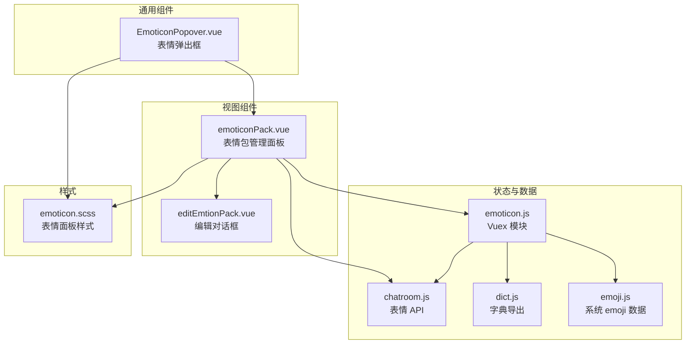
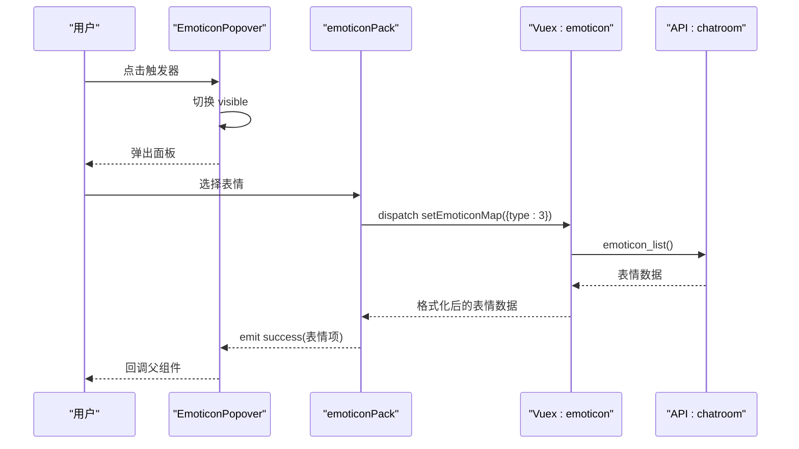
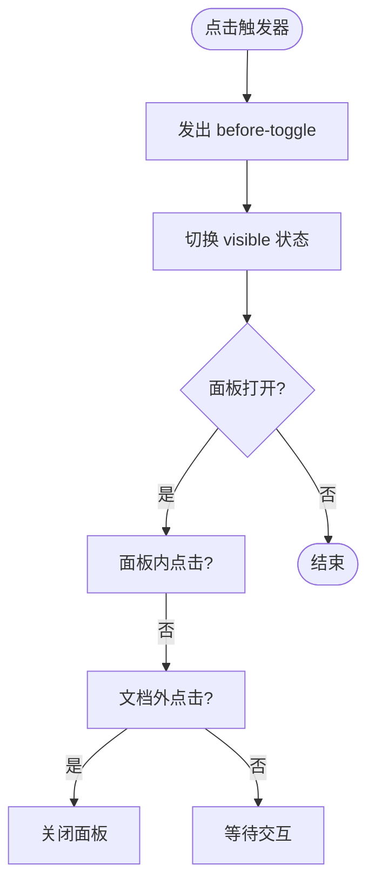
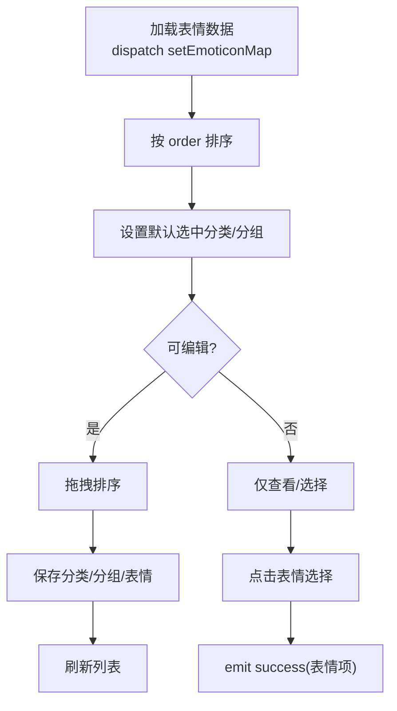
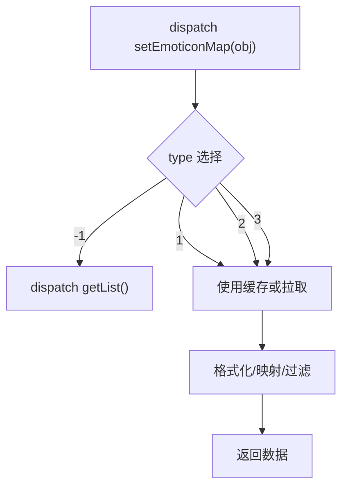
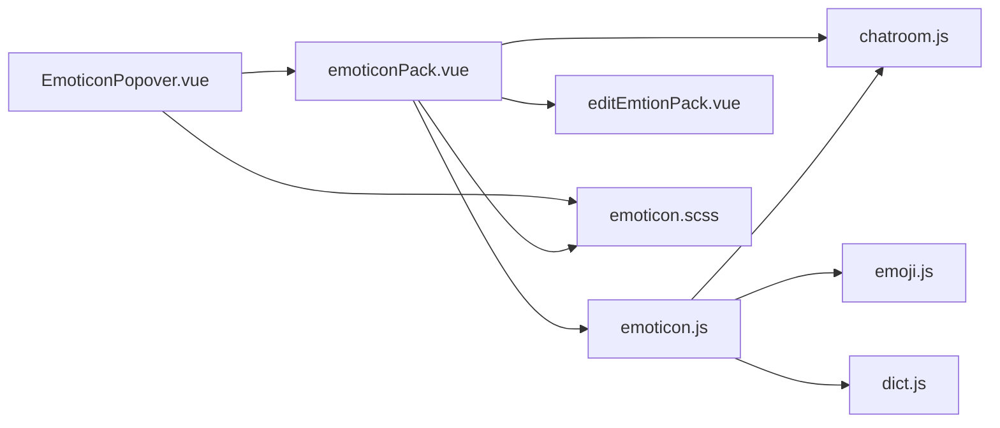

# 表情内容组件

<cite>
**本文引用的文件**
- [EmoticonPopover.vue](file://src/components/general/EmoticonPopover.vue)
- [emoticon.js](file://src/store/modules/emoticon.js)
- [emoticonPack.vue](file://src/views/chat_room/emoticonPack.vue)
- [chatroom.js](file://src/api/chatroom.js)
- [emoji.js](file://src/views/push/components/emoji.js)
- [dict.js](file://src/utils/dict.js)
- [emoticon.scss](file://src/styles/emoticon.scss)
- [editEmtionPack.vue](file://src/views/chat_room/components/editEmtionPack.vue)
</cite>

## 目录
1. [简介](#简介)
2. [项目结构](#项目结构)
3. [核心组件](#核心组件)
4. [架构总览](#架构总览)
5. [详细组件分析](#详细组件分析)
6. [依赖关系分析](#依赖关系分析)
7. [性能考量](#性能考量)
8. [故障排查指南](#故障排查指南)
9. [结论](#结论)
10. [附录](#附录)

## 简介
本文件聚焦 Leisu Admin 项目中的“表情内容组件”，围绕以下目标展开：
- 表情弹出框的触发、显隐控制与点击外部关闭策略
- 表情数据加载、格式化与缓存机制
- 表情选择器的选择反馈与事件传播
- 表情包管理组件的三级结构（分类-分组-表情）、拖拽排序、编辑与保存
- 系统 emoji 的注入与富文本回显映射
- 样式体系与交互体验设计原则（键盘导航、无障碍、移动端适配）

## 项目结构
表情相关内容主要分布在如下模块：
- 通用弹出框组件：用于承载表情面板
- 表情包管理视图：负责表情数据的展示、编辑与持久化
- 状态管理：统一的表情数据缓存与格式化
- API 层：表情列表与保存接口
- 样式层：表情面板的布局与交互态样式
- 辅助工具：系统 emoji 数据与事件重点表情注入

图表来源
- [EmoticonPopover.vue:1-87](file://src/components/general/EmoticonPopover.vue#L1-L87)
- [emoticonPack.vue:1-601](file://src/views/chat_room/emoticonPack.vue#L1-L601)
- [emoticon.js:1-156](file://src/store/modules/emoticon.js#L1-L156)
- [chatroom.js:273-310](file://src/api/chatroom.js#L273-L310)
- [emoji.js:1-264](file://src/views/push/components/emoji.js#L1-L264)
- [dict.js:1-11](file://src/utils/dict.js#L1-L11)
- [emoticon.scss:1-91](file://src/styles/emoticon.scss#L1-L91)
- [editEmtionPack.vue:1-226](file://src/views/chat_room/components/editEmtionPack.vue#L1-L226)

章节来源
- [EmoticonPopover.vue:1-87](file://src/components/general/EmoticonPopover.vue#L1-L87)
- [emoticonPack.vue:1-601](file://src/views/chat_room/emoticonPack.vue#L1-L601)
- [emoticon.js:1-156](file://src/store/modules/emoticon.js#L1-L156)
- [chatroom.js:273-310](file://src/api/chatroom.js#L273-L310)
- [emoji.js:1-264](file://src/views/push/components/emoji.js#L1-L264)
- [dict.js:1-11](file://src/utils/dict.js#L1-L11)
- [emoticon.scss:1-91](file://src/styles/emoticon.scss#L1-L91)
- [editEmtionPack.vue:1-226](file://src/views/chat_room/components/editEmtionPack.vue#L1-L226)

## 核心组件
- 表情弹出框（EmoticonPopover）：提供手动触发的弹出面板，支持点击外部关闭、面板内点击不关闭、向父组件传递选择结果
- 表情包管理（emoticonPack）：三级结构的表情管理界面，支持拖拽排序、编辑、删除、保存
- 状态管理（emoticon 模块）：表情数据的缓存、格式化（系统 emoji 注入、事件重点表情插入）、按场景返回不同数据形态
- API（chatroom）：表情列表、保存分类/分组/表情、删除接口
- 样式（emoticon.scss）：表情面板的标签页、滚动区域、图片项等样式
- 编辑对话框（editEmtionPack）：统一的编辑/新增弹窗，支持图片上传与字段校验

章节来源
- [EmoticonPopover.vue:16-79](file://src/components/general/EmoticonPopover.vue#L16-L79)
- [emoticonPack.vue:297-599](file://src/views/chat_room/emoticonPack.vue#L297-L599)
- [emoticon.js:83-148](file://src/store/modules/emoticon.js#L83-L148)
- [chatroom.js:273-310](file://src/api/chatroom.js#L273-L310)
- [emoticon.scss:1-91](file://src/styles/emoticon.scss#L1-L91)
- [editEmtionPack.vue:105-225](file://src/views/chat_room/components/editEmtionPack.vue#L105-L225)

## 架构总览
表情组件的调用链路如下：
- 触发器点击 -> 弹出框显隐 -> 加载表情数据 -> 渲染面板 -> 用户选择 -> 向父组件回调
- 表情数据来源：Vuex 动作 setEmoticonMap -> API 接口 -> 格式化函数 -> 返回不同形态数据
- 管理端操作：拖拽排序 -> 编辑/新增 -> 保存到后端 -> 刷新本地缓存

图表来源
- [EmoticonPopover.vue:44-77](file://src/components/general/EmoticonPopover.vue#L44-L77)
- [emoticonPack.vue:474-506](file://src/views/chat_room/emoticonPack.vue#L474-L506)
- [emoticon.js:96-148](file://src/store/modules/emoticon.js#L96-L148)
- [chatroom.js:273-278](file://src/api/chatroom.js#L273-L278)

## 详细组件分析

### 表情弹出框（EmoticonPopover）
- 触发与显隐
  - 手动触发模式，点击触发器先发出 before-toggle 事件，再切换 visible
  - 面板内点击与文档级点击监听，确保点击面板外部自动关闭
- 事件传播
  - 成功选择后，关闭面板并向父组件抛出 success 事件
- 可配置项
  - 宽度、是否可编辑、触发按钮类型/尺寸/文字、禁用状态、隐藏的 tab 类型数组

图表来源
- [EmoticonPopover.vue:44-77](file://src/components/general/EmoticonPopover.vue#L44-L77)

章节来源
- [EmoticonPopover.vue:16-79](file://src/components/general/EmoticonPopover.vue#L16-L79)

### 表情包管理（emoticonPack）
- 结构与交互
  - 三级结构：分类（type）-> 分组（groups）-> 表情（items）
  - 支持拖拽排序（draggable），编辑/新增/删除
  - 不同场景下的展示差异：unEdit=true 时仅显示名称，不可编辑
- 数据加载与排序
  - 根据 unEdit 选择不同场景：type=3（列表 tab）或 type=-1（原始列表）
  - 加载后对 groups/items/order 进行升序排序，并设置默认选中项
- 保存流程
  - 分类保存：按当前顺序写入 order
  - 分组保存：按当前顺序写入 order
  - 表情保存：按当前顺序写入 order
- 删除流程
  - 分组删除：删除分组及其包含的表情
  - 表情删除：仅删除该表情
- 选择反馈
  - unEdit=true 时，点击表情项会通过 success 事件返回表情项（含 type）

图表来源
- [emoticonPack.vue:474-506](file://src/views/chat_room/emoticonPack.vue#L474-L506)
- [emoticonPack.vue:533-597](file://src/views/chat_room/emoticonPack.vue#L533-L597)
- [emoticonPack.vue:326-331](file://src/views/chat_room/emoticonPack.vue#L326-L331)

章节来源
- [emoticonPack.vue:297-599](file://src/views/chat_room/emoticonPack.vue#L297-L599)

### 状态管理（emoticon 模块）
- 数据缓存
  - 使用深拷贝写入原始列表，避免组件直接修改缓存
- 场景化格式化
  - type=-1：强制拉取最新原始列表
  - type=1：wangEditor 专用格式（系统 emoji 置顶 + 业务分组前插事件重点）
  - type=2：richEditor 回显映射（code->表情项）
  - type=3：列表 tab 用数据（未过滤）
- 隐藏 tab
  - 支持按 hideTab 过滤指定 type 的分组
- 事件重点表情
  - 从字典导入 iconEventImportant，注入到业务 type=2 的分组前

图表来源
- [emoticon.js:124-148](file://src/store/modules/emoticon.js#L124-L148)
- [emoticon.js:96-110](file://src/store/modules/emoticon.js#L96-L110)
- [emoticon.js:27-81](file://src/store/modules/emoticon.js#L27-L81)
- [emoticon.js:18-20](file://src/store/modules/emoticon.js#L18-L20)
- [dict.js:1-11](file://src/utils/dict.js#L1-L11)

章节来源
- [emoticon.js:1-156](file://src/store/modules/emoticon.js#L1-L156)

### API 层（chatroom）
- 表情列表：获取表情包完整数据
- 保存分类/分组/表情：按顺序写入 order
- 删除：支持分组与表情删除
- 与表情包管理组件的对应关系清晰，便于扩展

章节来源
- [chatroom.js:273-310](file://src/api/chatroom.js#L273-L310)

### 样式体系（emoticon.scss）
- 标签页容器与按钮、内容区域的激活态样式
- 二级滚动区域与图片项网格布局
- 鼠标悬停与交互态颜色

章节来源
- [emoticon.scss:1-91](file://src/styles/emoticon.scss#L1-L91)

### 编辑对话框（editEmtionPack）
- 统一的编辑/新增弹窗，支持图片上传与字段校验
- 根据 editableTabs 与 show 字段判断新增/编辑与表单项
- 保存成功后通过 success 事件回传数据给父组件

章节来源
- [editEmtionPack.vue:105-225](file://src/views/chat_room/components/editEmtionPack.vue#L105-L225)

## 依赖关系分析
- 组件耦合
  - EmoticonPopover 仅依赖 emoticonPack 子组件与 Element UI 的 popover
  - emoticonPack 依赖 Vuex 模块、API、编辑对话框与混入（格式化、高度计算）
- 外部依赖
  - draggable：拖拽排序
  - viewer：图片预览（非 unEdit 模式）
  - drag-dialog：编辑弹窗容器
  - uploadPhoto：图片上传组件
- 数据流
  - 从 API -> Vuex -> 组件渲染 -> 用户交互 -> API 提交 -> Vuex 缓存更新

图表来源
- [EmoticonPopover.vue:17-21](file://src/components/general/EmoticonPopover.vue#L17-L21)
- [emoticonPack.vue:298-299](file://src/views/chat_room/emoticonPack.vue#L298-L299)
- [emoticon.js:1-3](file://src/store/modules/emoticon.js#L1-L3)
- [chatroom.js:273-310](file://src/api/chatroom.js#L273-L310)
- [emoji.js:1-264](file://src/views/push/components/emoji.js#L1-L264)
- [dict.js:1-11](file://src/utils/dict.js#L1-L11)
- [editEmtionPack.vue:108-111](file://src/views/chat_room/components/editEmtionPack.vue#L108-L111)
- [emoticon.scss:1-91](file://src/styles/emoticon.scss#L1-L91)

## 性能考量
- 数据缓存与深拷贝
  - 使用深拷贝避免组件直接修改 Vuex 缓存，减少不必要的响应式开销
- 懒加载与分页
  - 当前实现为一次性加载全部表情数据；若数据量增长，建议引入分页或虚拟滚动
- DOM 事件去抖
  - 文档级点击监听在组件生命周期内注册/销毁，避免重复绑定
- 图片渲染
  - 非 unEdit 模式启用图片预览，注意大图资源的懒加载与错误兜底

## 故障排查指南
- 无法选择表情
  - 检查 EmoticonPopover 是否正确接收 visible 与回调
  - 确认 emoticonPack 的 unEdit 与 hideTab 参数是否导致面板为空
- 保存失败
  - 校验分类/分组/表情的 order 是否正确写入
  - 查看网络请求与后端返回状态
- 编辑弹窗不显示
  - 确认 editEmtionPack 的 init 调用与 dialogFormVisible 控制
- 样式异常
  - 检查 emoticon.scss 的标签页与滚动区域样式是否被覆盖

章节来源
- [EmoticonPopover.vue:44-77](file://src/components/general/EmoticonPopover.vue#L44-L77)
- [emoticonPack.vue:533-597](file://src/views/chat_room/emoticonPack.vue#L533-L597)
- [editEmtionPack.vue:197-219](file://src/views/chat_room/components/editEmtionPack.vue#L197-L219)
- [emoticon.scss:1-91](file://src/styles/emoticon.scss#L1-L91)

## 结论
表情内容组件通过“弹出框 + 管理面板 + 状态管理 + API”的分层设计，实现了完整的表情选择、编辑与持久化能力。系统 emoji 的注入与事件重点表情的插入提升了编辑器的可用性。未来可在大数据量场景下引入懒加载与虚拟滚动，进一步提升性能与交互流畅度。

## 附录
- 用户体验设计原则
  - 键盘导航：为标签页与列表提供 Tab/Enter 选择与方向键切换
  - 无障碍：为图片提供 alt 文本，为按钮提供 aria-label
  - 移动端适配：面板宽度自适应，滚动区域与点击热区增大
- 交互优化策略
  - 面板外点击自动关闭，避免焦点丢失
  - 成功选择后立即关闭面板，减少层级嵌套
  - 编辑弹窗采用统一校验规则，减少无效提交