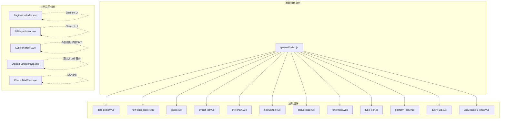
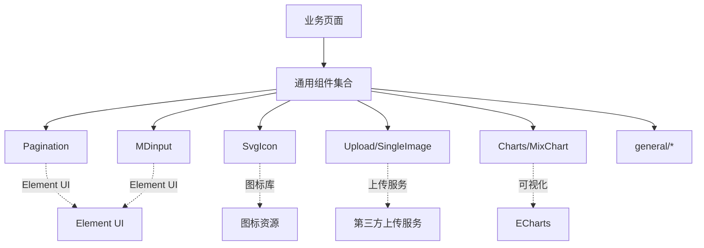
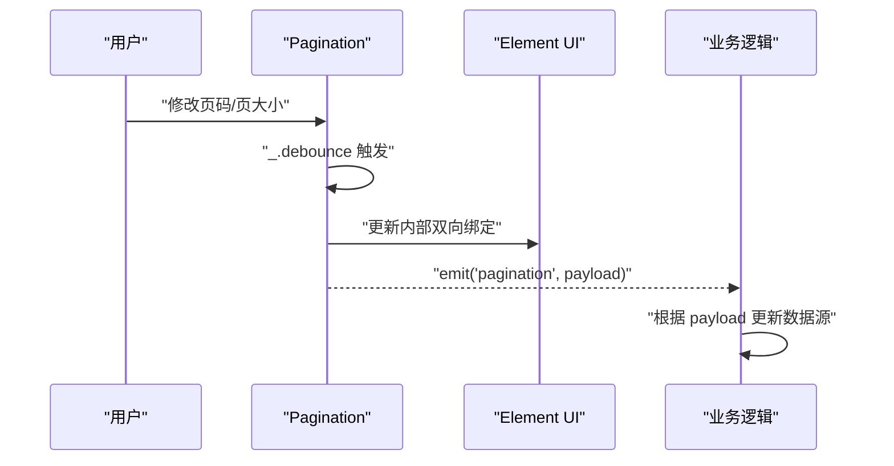
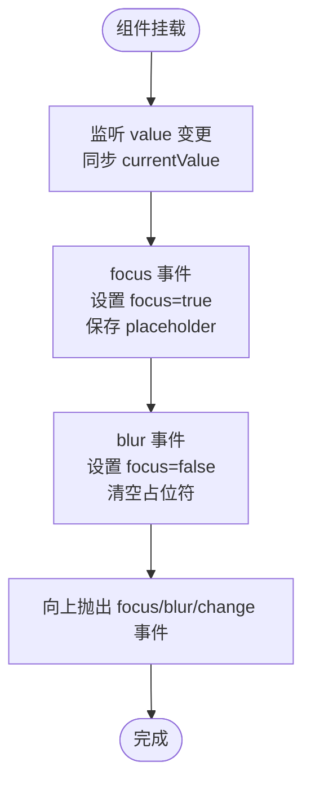
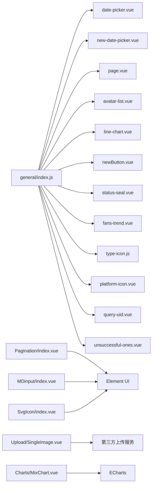

# 通用组件

<cite>
**本文档引用的文件**
- [general/index.js](file://src/components/general/index.js)
- [Pagination/index.vue](file://src/components/Pagination/index.vue)
- [MDinput/index.vue](file://src/components/MDinput/index.vue)
- [SvgIcon/index.vue](file://src/components/SvgIcon/index.vue)
- [Upload/SingleImage.vue](file://src/components/Upload/SingleImage.vue)
- [Charts/MixChart.vue](file://src/components/Charts/MixChart.vue)
- [general/date-picker.vue](file://src/components/general/date-picker.vue)
- [general/new-date-picker.vue](file://src/components/general/new-date-picker.vue)
- [general/page.vue](file://src/components/general/page.vue)
- [general/avatar-list.vue](file://src/components/general/avatar-list.vue)
- [general/line-chart.vue](file://src/components/general/line-chart.vue)
- [general/newButton.vue](file://src/components/general/newButton.vue)
- [general/status-seal.vue](file://src/components/general/status-seal.vue)
- [general/fans-trend.vue](file://src/components/general/fans-trend.vue)
- [general/type-icon.js](file://src/components/general/type-icon.js)
- [general/platform-icon.vue](file://src/components/general/platform-icon.vue)
- [general/query-uid.vue](file://src/components/general/query-uid.vue)
- [general/unsuccessful-ones.vue](file://src/components/general/unsuccessful-ones.vue)
</cite>

## 目录
1. [简介](#简介)
2. [项目结构](#项目结构)
3. [核心组件](#核心组件)
4. [架构总览](#架构总览)
5. [详细组件分析](#详细组件分析)
6. [依赖分析](#依赖分析)
7. [性能考虑](#性能考虑)
8. [故障排查指南](#故障排查指南)
9. [结论](#结论)
10. [附录](#附录)

## 简介
本文件系统化梳理 Leisu Admin 项目的通用组件库，覆盖基础 UI、数据展示、表单输入与操作控制等类别，明确各组件的职责边界、API 接口、事件与插槽使用方式，并提供可复用设计原则、扩展机制与性能优化建议。目标是帮助开发者快速理解与高效使用通用组件，提升开发效率与一致性。

## 项目结构
通用组件主要分布在以下位置：
- 通用组件聚合导出：src/components/general/index.js
- 通用组件目录：src/components/general/*.vue、*.js
- 其他常用组件：Pagination、MDinput、SvgIcon、Upload、Charts 等

**图示来源**
- [general/index.js:1-41](file://src/components/general/index.js#L1-L41)
- [Pagination/index.vue:1-113](file://src/components/Pagination/index.vue#L1-L113)
- [MDinput/index.vue:1-361](file://src/components/MDinput/index.vue#L1-L361)
- [SvgIcon/index.vue:1-63](file://src/components/SvgIcon/index.vue#L1-L63)
- [Upload/SingleImage.vue:1-135](file://src/components/Upload/SingleImage.vue#L1-L135)
- [Charts/MixChart.vue:1-272](file://src/components/Charts/MixChart.vue#L1-L272)

**章节来源**
- [general/index.js:1-41](file://src/components/general/index.js#L1-L41)

## 核心组件
- 分页组件：Pagination
- 输入组件：MDinput
- 图标组件：SvgIcon
- 上传组件：SingleImage
- 图表组件：MixChart、line-chart
- 日期选择器：date-picker、new-date-picker
- 通用展示：avatar-list、status-seal、platform-icon、type-icon
- 交互按钮：newButton
- 页面级分页：page
- 功能容器：fans-trend、unsuccessful-ones
- 查询辅助：query-uid

这些组件通过统一的导出入口集中管理，便于按需引入与版本升级。

**章节来源**
- [Pagination/index.vue:1-113](file://src/components/Pagination/index.vue#L1-L113)
- [MDinput/index.vue:1-361](file://src/components/MDinput/index.vue#L1-L361)
- [SvgIcon/index.vue:1-63](file://src/components/SvgIcon/index.vue#L1-L63)
- [Upload/SingleImage.vue:1-135](file://src/components/Upload/SingleImage.vue#L1-L135)
- [Charts/MixChart.vue:1-272](file://src/components/Charts/MixChart.vue#L1-L272)
- [general/date-picker.vue:1-338](file://src/components/general/date-picker.vue#L1-L338)
- [general/new-date-picker.vue:1-191](file://src/components/general/new-date-picker.vue#L1-L191)
- [general/page.vue:1-61](file://src/components/general/page.vue#L1-L61)
- [general/avatar-list.vue:1-61](file://src/components/general/avatar-list.vue#L1-L61)
- [general/line-chart.vue:1-104](file://src/components/general/line-chart.vue#L1-L104)
- [general/newButton.vue:1-114](file://src/components/general/newButton.vue#L1-L114)
- [general/status-seal.vue:1-55](file://src/components/general/status-seal.vue#L1-L55)
- [general/fans-trend.vue:1-116](file://src/components/general/fans-trend.vue#L1-L116)
- [general/type-icon.js:1-50](file://src/components/general/type-icon.js#L1-L50)
- [general/platform-icon.vue:1-91](file://src/components/general/platform-icon.vue#L1-L91)
- [general/query-uid.vue:1-44](file://src/components/general/query-uid.vue#L1-L44)
- [general/unsuccessful-ones.vue:1-98](file://src/components/general/unsuccessful-ones.vue#L1-L98)

## 架构总览
通用组件库遵循“低耦合、高内聚”的设计原则，通过以下机制实现可复用与扩展：
- 统一导出：通过 general/index.js 聚合导出，简化引入路径
- 属性驱动：大量使用 props 配置，减少模板硬编码
- 事件解耦：通过自定义事件向外抛出状态变化，便于上层组合
- 插槽与透传：支持 $slots/$attrs 透传，增强组合能力
- 外部依赖隔离：对 Element UI、ECharts、第三方上传服务等采用局部封装

**图示来源**
- [general/index.js:1-41](file://src/components/general/index.js#L1-L41)
- [Pagination/index.vue:1-113](file://src/components/Pagination/index.vue#L1-L113)
- [MDinput/index.vue:1-361](file://src/components/MDinput/index.vue#L1-L361)
- [SvgIcon/index.vue:1-63](file://src/components/SvgIcon/index.vue#L1-L63)
- [Upload/SingleImage.vue:1-135](file://src/components/Upload/SingleImage.vue#L1-L135)
- [Charts/MixChart.vue:1-272](file://src/components/Charts/MixChart.vue#L1-L272)

## 详细组件分析

### 分页组件：Pagination
- 职责：基于 Element UI 分页封装，提供防抖与滚动行为控制
- 关键属性
  - total：总数
  - page：当前页（双向绑定）
  - limit：每页条数（双向绑定）
  - pageSizes：页大小选项
  - layout：布局字符串
  - background：是否启用背景
  - autoScroll：切换页码后是否自动滚动
  - hidden：是否隐藏
  - pagerCount：分页按钮数量（奇数，5~21）
- 事件
  - pagination({page, limit, pageSize?})：页码或页大小变化
- 插槽与透传：透传 $attrs 到 ElPagination
- 性能要点：使用防抖函数降低频繁变更带来的重渲染

**图示来源**
- [Pagination/index.vue:86-99](file://src/components/Pagination/index.vue#L86-L99)

**章节来源**
- [Pagination/index.vue:1-113](file://src/components/Pagination/index.vue#L1-L113)

### 输入组件：MDinput
- 职责：Material Design 风格输入框，支持多种原生输入类型
- 关键属性
  - icon/name/type/value/placeholder/readOnly/disabled/min/max/step/minlength/maxlength/required/autoComplete/validateEvent
- 事件
  - input(value)：模型更新
  - change(value)：变更事件
  - focus/blur：聚焦/失焦
- 行为特性
  - 计算类名以实现浮动标签动画
  - 当作为 ElFormItem 子项时，联动 form 的校验事件
- 最佳实践
  - 与 ElForm/ElFormItem 组合使用，开启 validateEvent
  - 合理设置 placeholder 与必填项

**图示来源**
- [MDinput/index.vue:163-196](file://src/components/MDinput/index.vue#L163-L196)

**章节来源**
- [MDinput/index.vue:1-361](file://src/components/MDinput/index.vue#L1-L361)

### 图标组件：SvgIcon
- 职责：统一图标渲染，支持外部 SVG 与内部 SVG
- 关键属性
  - iconClass：图标名称（内部为 #icon-xxx；外部为 URL）
  - className：额外类名
- 行为特性
  - isExternal 判断外部图标，使用 mask 渲染
  - 透传 $listeners，支持点击等事件
- 最佳实践
  - 内部图标统一通过 iconClass 引用
  - 外部图标注意跨域与缓存

**章节来源**
- [SvgIcon/index.vue:1-63](file://src/components/SvgIcon/index.vue#L1-L63)

### 上传组件：SingleImage
- 职责：单图上传与预览，集成 Token 获取与图片裁剪提示
- 关键属性
  - value：当前图片地址（双向绑定）
- 事件
  - input：值变更
- 方法
  - emitInput：触发 input
  - rmImage：移除图片
  - handleImageSuccess：上传成功回调
  - beforeUpload：生成上传参数（Token/Key/URL）
- 最佳实践
  - 与后端上传服务对接时，确保 Token 有效期与 Key 唯一性
  - 提供占位图与错误回退

**章节来源**
- [Upload/SingleImage.vue:1-135](file://src/components/Upload/SingleImage.vue#L1-L135)

### 图表组件：MixChart
- 职责：基于 ECharts 的混合图表，内置响应式 mixin
- 关键属性
  - className/width/height/id：容器样式与尺寸
- 生命周期
  - mounted 初始化图表
  - beforeDestroy 释放实例
- 最佳实践
  - 在父组件中通过 ref 调用 setOption 更新数据
  - 使用 resize mixin 保证窗口变化时图表自适应

**章节来源**
- [Charts/MixChart.vue:1-272](file://src/components/Charts/MixChart.vue#L1-L272)

### 日期选择器：date-picker（旧版）
- 职责：快捷时间区间选择，支持多种默认区间与月份区间
- 关键属性
  - defaultType：默认区间类型（0~5、10 等）
  - size/type/init/typeValue/nowMonth
- 事件
  - on-init/on-change/input：初始化与变更回调
- 方法
  - setData：设置时间区间
  - reset：重置为默认区间
  - changefunc：格式化时间并向上抛出

**章节来源**
- [general/date-picker.vue:1-338](file://src/components/general/date-picker.vue#L1-L338)

### 日期选择器：new-date-picker（新版）
- 职责：快捷时间选择、格式化输出（毫秒/秒）、禁用未来时间
- 关键属性
  - startPlaceholder/endPlaceholder/clearable/size/type/defaultTime/format/unlinkPanels
  - defaultValue/maxtime
- 事件
  - getTime_ms/getTime_m：输出毫秒与秒两种粒度
  - clear：清空
- 方法
  - setData/reset：设置与重置
  - changefunc：根据输入类型区分 Date 数组与时间戳数组

**章节来源**
- [general/new-date-picker.vue:1-191](file://src/components/general/new-date-picker.vue#L1-L191)

### 页面级分页：page
- 职责：简化场景下的分页展示，仅包含总数、上一页、页码、下一页
- 关键属性
  - total：总数
- 事件
  - on-change：[page, size] 回调

**章节来源**
- [general/page.vue:1-61](file://src/components/general/page.vue#L1-L61)

### 头像列表：avatar-list
- 职责：头像堆叠展示，支持 Tooltip
- 关键属性
  - list：头像数据数组
  - avatarKey/nameKey：字段映射
- 最佳实践
  - 通过 nameKey 显示悬浮提示
  - 控制头像尺寸与边距，避免溢出

**章节来源**
- [general/avatar-list.vue:1-61](file://src/components/general/avatar-list.vue#L1-L61)

### 折线图：line-chart
- 职责：通用折线/柱状图封装，支持双 Y 轴与数据缩放
- 关键方法
  - initChart(data)：初始化并设置 Option
  - setOption([xAxis, series])：动态更新
- 最佳实践
  - 父组件传入标准化数据结构
  - 注意 series 的 barMaxWidth 与颜色配置

**章节来源**
- [general/line-chart.vue:1-104](file://src/components/general/line-chart.vue#L1-L104)

### 新按钮：newButton
- 职责：组合按钮样式，支持激活态、禁用态与分组边框
- 关键属性
  - width/height/type/active/noborder/isFirst/isMiddle/isFinally/disabled
- 事件
  - click：点击事件（禁用时阻止）

**章节来源**
- [general/newButton.vue:1-114](file://src/components/general/newButton.vue#L1-L114)

### 状态印章：status-seal
- 职责：绝对定位的状态标识（命中/未命中/封禁/半赢/半输）
- 关键属性
  - width/height/status/position

**章节来源**
- [general/status-seal.vue:1-55](file://src/components/general/status-seal.vue#L1-L55)

### 平台图标：platform-icon
- 职责：平台类型到图标的映射（功能型组件）
- 关键属性
  - type：平台类型
- 最佳实践
  - 通过 type 映射不同 SVG 或文本

**章节来源**
- [general/platform-icon.vue:1-91](file://src/components/general/platform-icon.vue#L1-L91)

### 类型图标：type-icon
- 职责：体育类型与游戏类型的图标映射（功能型组件）
- 关键属性
  - sport/game/rl：组合键
- 最佳实践
  - 使用 sport-game 组合作为键，rl 模式支持 RL 前缀

**章节来源**
- [general/type-icon.js:1-50](file://src/components/general/type-icon.js#L1-L50)

### 功能容器：fans-trend
- 职责：粉丝趋势弹窗容器，内含日期选择与图表
- 关键属性
  - title/sourceTime：标题与默认时间
- 方法
  - init：打开弹窗并设置默认时间
  - resetDatePicker：重置时间选择
  - getData/setData/parseData：数据注入与转换
  - datePickerChangeFunc：时间变更回调

**章节来源**
- [general/fans-trend.vue:1-116](file://src/components/general/fans-trend.vue#L1-L116)

### 删除/隐藏容器：unsuccessful-ones
- 职责：统一的二次确认弹窗容器，仅负责展示与数据透传
- 关键属性
  - value：控制显隐（配合 v-if 实现销毁/重建）
- 方法
  - init(title, data, type, isReason)：初始化并透传参数
  - handleConfirm：调用内容组件 validateAndGetData 并抛出 on-save
  - handleCancel：关闭并抛出 close

**章节来源**
- [general/unsuccessful-ones.vue:1-98](file://src/components/general/unsuccessful-ones.vue#L1-L98)

### 查询 UID 辅助：query-uid
- 职责：根据查询类型动态显示查询区域
- 关键属性
  - value：当前查询类型
  - querys：允许显示的类型集合
- 事件
  - on-set-uid：查询成功回调

**章节来源**
- [general/query-uid.vue:1-44](file://src/components/general/query-uid.vue#L1-L44)

## 依赖分析
- Element UI：Pagination、MDinput、SvgIcon、Upload、AvatarList、Page、newButton、unsuccessful-ones 等广泛使用
- ECharts：MixChart、line-chart
- 第三方上传服务：SingleImage（示例对接 httpbin.org）
- 工具函数：通用工具（如时间格式化、字典配置等）

**图示来源**
- [general/index.js:1-41](file://src/components/general/index.js#L1-L41)
- [Pagination/index.vue:1-113](file://src/components/Pagination/index.vue#L1-L113)
- [MDinput/index.vue:1-361](file://src/components/MDinput/index.vue#L1-L361)
- [SvgIcon/index.vue:1-63](file://src/components/SvgIcon/index.vue#L1-L63)
- [Upload/SingleImage.vue:1-135](file://src/components/Upload/SingleImage.vue#L1-L135)
- [Charts/MixChart.vue:1-272](file://src/components/Charts/MixChart.vue#L1-L272)

**章节来源**
- [general/index.js:1-41](file://src/components/general/index.js#L1-L41)

## 性能考虑
- 防抖与节流
  - Pagination 使用防抖处理页码/页大小变更，减少频繁请求
- DOM 销毁与重建
  - unsuccessful-ones 通过 v-if 控制子组件生命周期，避免状态残留
- 图表渲染
  - MixChart/line-chart 仅在数据变化时更新 Option，避免重复初始化
- 图标与上传
  - SvgIcon 支持外部图标时使用 mask，减少 DOM 结构复杂度
  - SingleImage 仅在需要时渲染预览区域，避免不必要的计算

[本节为通用指导，无需特定文件引用]

## 故障排查指南
- 分页组件
  - 症状：页码跳变导致多次请求
  - 处理：确认是否正确使用 update:page/update:limit 双向绑定
  - 参考：[Pagination/index.vue:68-84](file://src/components/Pagination/index.vue#L68-L84)
- 输入组件
  - 症状：表单校验不触发
  - 处理：确保在 ElFormItem 下使用，且 validateEvent 为 true
  - 参考：[MDinput/index.vue:172-194](file://src/components/MDinput/index.vue#L172-L194)
- 日期选择器
  - 症状：时间区间边界不正确
  - 处理：检查 changefunc 中的时分秒截断逻辑与 type 参数
  - 参考：[general/new-date-picker.vue:145-171](file://src/components/general/new-date-picker.vue#L145-L171)
- 上传组件
  - 症状：上传失败或 Token 过期
  - 处理：确认 beforeUpload 中 Token/Key 生成逻辑与服务端一致
  - 参考：[Upload/SingleImage.vue:60-76](file://src/components/Upload/SingleImage.vue#L60-L76)
- 图表组件
  - 症状：图表不显示或尺寸异常
  - 处理：确认容器尺寸与 resize mixin 生效，必要时手动触发重绘
  - 参考：[Charts/MixChart.vue:34-43](file://src/components/Charts/MixChart.vue#L34-L43)

**章节来源**
- [Pagination/index.vue:68-84](file://src/components/Pagination/index.vue#L68-L84)
- [MDinput/index.vue:172-194](file://src/components/MDinput/index.vue#L172-L194)
- [general/new-date-picker.vue:145-171](file://src/components/general/new-date-picker.vue#L145-L171)
- [Upload/SingleImage.vue:60-76](file://src/components/Upload/SingleImage.vue#L60-L76)
- [Charts/MixChart.vue:34-43](file://src/components/Charts/MixChart.vue#L34-L43)

## 结论
通用组件库通过清晰的职责划分、统一的 API 设计与事件机制，实现了高复用与易扩展。建议在业务开发中优先使用通用组件，遵循属性驱动与事件解耦的原则，结合本指南的最佳实践与性能建议，提升开发效率与系统稳定性。

## 附录
- 组件分类速览
  - 基础 UI：SvgIcon、newButton、status-seal、platform-icon、type-icon
  - 数据展示：Pagination、line-chart、MixChart、avatar-list
  - 表单输入：MDinput、date-picker、new-date-picker
  - 操作控制：unsuccessful-ones、fans-trend、query-uid
  - 上传：SingleImage
- 扩展建议
  - 新增组件时，统一在 general/index.js 导出，保持导入路径稳定
  - 优先使用 $attrs/$listeners 透传，减少模板耦合
  - 对外部依赖进行封装，便于替换与测试

[本节为概览总结，无需特定文件引用]