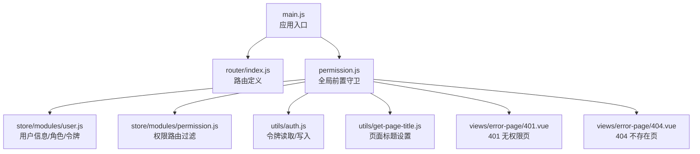
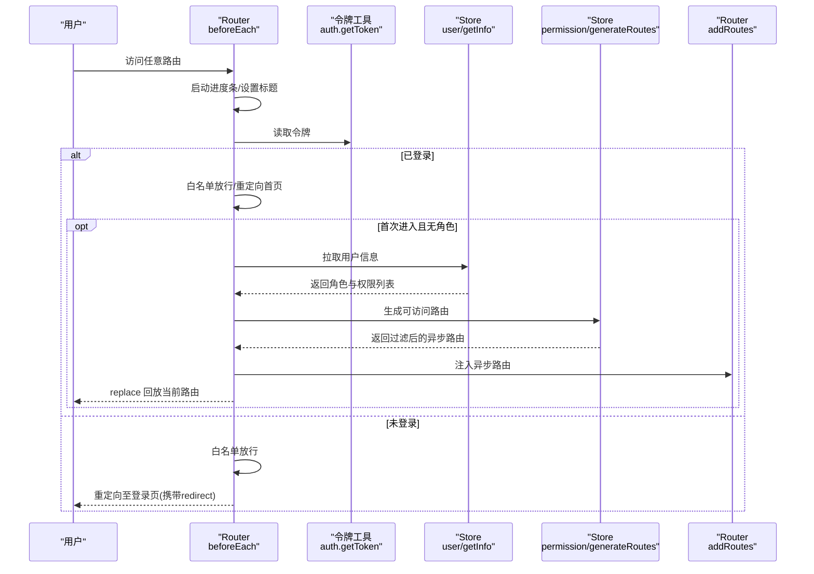
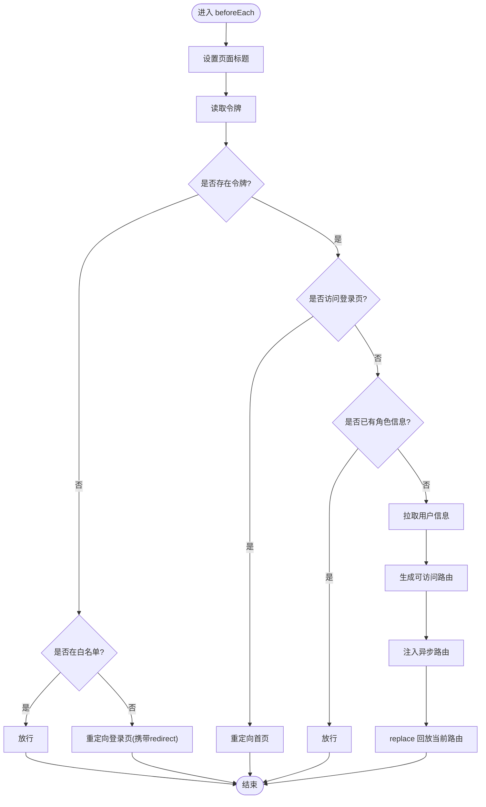
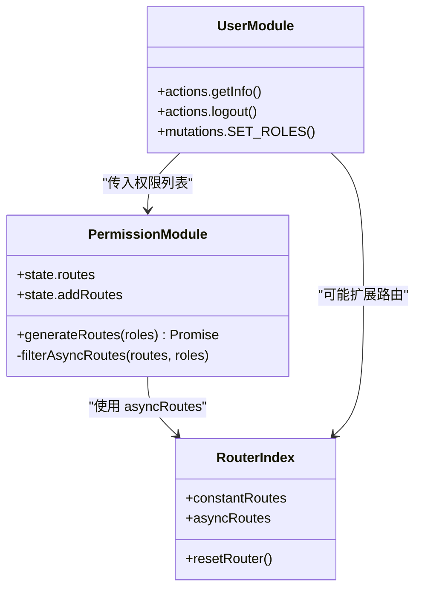
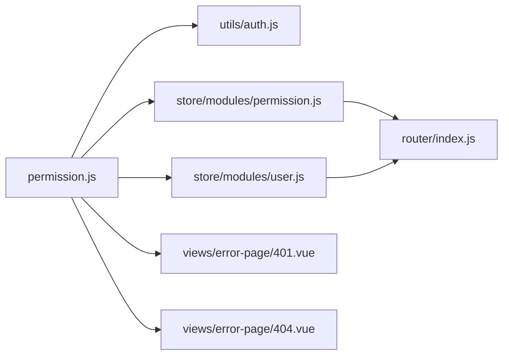

# 导航守卫机制

<cite>
**本文引用的文件**
- [src/main.js](file://src/main.js)
- [src/router/index.js](file://src/router/index.js)
- [src/permission.js](file://src/permission.js)
- [src/store/modules/permission.js](file://src/store/modules/permission.js)
- [src/store/modules/user.js](file://src/store/modules/user.js)
- [src/store/getters.js](file://src/store/getters.js)
- [src/utils/auth.js](file://src/utils/auth.js)
- [src/utils/get-page-title.js](file://src/utils/get-page-title.js)
- [src/utils/permission.js](file://src/utils/permission.js)
- [src/directive/permission/permission.js](file://src/directive/permission/permission.js)
- [src/views/error-page/401.vue](file://src/views/error-page/401.vue)
- [src/views/error-page/404.vue](file://src/views/error-page/404.vue)
- [src/router/children/member.js](file://src/router/children/member.js)
- [src/router/children/forum/index.js](file://src/router/children/forum/index.js)
- [src/views/login/index.vue](file://src/views/login/index.vue)
</cite>

## 目录
1. [简介](#简介)
2. [项目结构与入口](#项目结构与入口)
3. [核心组件](#核心组件)
4. [架构总览](#架构总览)
5. [详细组件分析](#详细组件分析)
6. [依赖关系分析](#依赖关系分析)
7. [性能考量](#性能考量)
8. [故障排查指南](#故障排查指南)
9. [结论](#结论)
10. [附录](#附录)

## 简介
本文件系统性梳理 Leisu Admin 的导航守卫机制，围绕 Vue Router 的全局前置守卫、路由白名单、权限路由动态加载、未授权访问处理、错误页跳转、以及性能优化与调试实践展开，帮助开发者在不直接阅读源码的情况下快速掌握守卫体系的设计与实现。

## 项目结构与入口
- 应用启动在根入口文件中引入路由、权限控制与全局状态，并挂载到 DOM。
- 权限控制通过全局前置守卫集中处理，结合 Vuex Store 的用户态与权限路由表，完成登录态校验、角色权限匹配与动态路由注入。
- 路由定义采用常量路由与异步路由分离，常量路由包含登录、重定向、错误页等基础路由；异步路由基于用户权限动态注入。

图表来源
- [src/main.js:23](file://src/main.js#L23)
- [src/router/index.js:31](file://src/router/index.js#L31)
- [src/permission.js:13](file://src/permission.js#L13)
- [src/store/modules/user.js:139](file://src/store/modules/user.js#L139)
- [src/store/modules/permission.js:37](file://src/store/modules/permission.js#L37)
- [src/utils/auth.js:5](file://src/utils/auth.js#L5)
- [src/utils/get-page-title.js:5](file://src/utils/get-page-title.js#L5)
- [src/views/error-page/401.vue:1](file://src/views/error-page/401.vue#L1)
- [src/views/error-page/404.vue:1](file://src/views/error-page/404.vue#L1)

章节来源
- [src/main.js:23](file://src/main.js#L23)
- [src/router/index.js:31](file://src/router/index.js#L31)

## 核心组件
- 全局前置守卫：负责登录态检查、白名单放行、权限路由生成与注入、错误处理与进度条控制。
- 权限模块：提供权限路由过滤算法与路由集合合并能力。
- 用户模块：负责登录、获取用户信息（含角色与权限列表）、登出与动态路由扩展。
- 工具模块：令牌读取、页面标题设置、按钮级权限指令与校验。
- 错误页组件：401 无权限与 404 不存在页，用于未授权或无效路由的展示。

章节来源
- [src/permission.js:13](file://src/permission.js#L13)
- [src/store/modules/permission.js:37](file://src/store/modules/permission.js#L37)
- [src/store/modules/user.js:139](file://src/store/modules/user.js#L139)
- [src/utils/auth.js:5](file://src/utils/auth.js#L5)
- [src/utils/get-page-title.js:5](file://src/utils/get-page-title.js#L5)
- [src/utils/permission.js:8](file://src/utils/permission.js#L8)
- [src/directive/permission/permission.js:4](file://src/directive/permission/permission.js#L4)
- [src/views/error-page/401.vue:1](file://src/views/error-page/401.vue#L1)
- [src/views/error-page/404.vue:1](file://src/views/error-page/404.vue#L1)

## 架构总览
全局前置守卫在每次路由切换前执行，主要流程如下：
- 启动进度条并设置页面标题
- 读取令牌判断登录态
- 若已登录且命中白名单，则重定向至首页
- 若已登录但未获取角色信息，则拉取用户信息并生成可访问路由
- 将异步路由注入到路由器，并以 replace 方式回放当前路由
- 若未登录，放行白名单，否则重定向至登录页并携带 redirect 参数
- 异常时清除令牌并提示错误

图表来源
- [src/permission.js:13](file://src/permission.js#L13)
- [src/utils/auth.js:5](file://src/utils/auth.js#L5)
- [src/store/modules/user.js:172](file://src/store/modules/user.js#L172)
- [src/store/modules/permission.js:50](file://src/store/modules/permission.js#L50)
- [src/router/index.js:169](file://src/router/index.js#L169)

## 详细组件分析

### 全局前置守卫实现逻辑
- 登录态检查：通过令牌工具读取本地存储中的令牌。
- 白名单机制：包含登录页与授权回调页，无需权限即可访问。
- 角色与路由生成：首次进入时拉取用户信息，基于权限列表生成可访问路由并注入路由器。
- 路由回放：注入完成后以 replace 方式回放当前路由，避免历史记录。
- 未授权与异常处理：未登录时重定向至登录页并携带目标地址；异常时清除令牌并提示错误。

图表来源
- [src/permission.js:13](file://src/permission.js#L13)
- [src/utils/auth.js:5](file://src/utils/auth.js#L5)
- [src/store/modules/user.js:172](file://src/store/modules/user.js#L172)
- [src/store/modules/permission.js:50](file://src/store/modules/permission.js#L50)
- [src/router/index.js:169](file://src/router/index.js#L169)

章节来源
- [src/permission.js:13](file://src/permission.js#L13)

### 路由白名单机制
- 白名单包含登录页与授权回调页，访问这些路由无需权限。
- 未登录访问非白名单路由会被重定向至登录页，并附带目标路径参数以便登录后回放。

章节来源
- [src/permission.js:11](file://src/permission.js#L11)
- [src/permission.js:67](file://src/permission.js#L67)

### 权限路由的动态加载
- 路由定义分为常量路由与异步路由两部分，常量路由始终存在，异步路由基于用户权限动态注入。
- 权限过滤：根据用户权限列表递归过滤异步路由树，仅保留具备访问权限的节点。
- 路由注入：将过滤后的异步路由注入路由器，并合并为完整路由表。
- 动态扩展：用户信息中可能动态扩展特定路由（如日志页面），注入后参与权限过滤。

图表来源
- [src/store/modules/permission.js:37](file://src/store/modules/permission.js#L37)
- [src/store/modules/permission.js:50](file://src/store/modules/permission.js#L50)
- [src/store/modules/user.js:172](file://src/store/modules/user.js#L172)
- [src/router/index.js:74](file://src/router/index.js#L74)

章节来源
- [src/store/modules/permission.js:37](file://src/store/modules/permission.js#L37)
- [src/store/modules/permission.js:50](file://src/store/modules/permission.js#L50)
- [src/store/modules/user.js:172](file://src/store/modules/user.js#L172)
- [src/router/index.js:74](file://src/router/index.js#L74)

### 路由跳转的安全控制
- 未授权访问：重定向至 401 无权限页或登录页，避免直接暴露受保护内容。
- 错误页面：404 不存在页用于兜底无效路由；401 无权限页提供返回首页与查看图片等交互。
- 登录页：支持验证码、自动聚焦与重定向参数，登录成功后回到原目标路由。

章节来源
- [src/views/error-page/401.vue:1](file://src/views/error-page/401.vue#L1)
- [src/views/error-page/404.vue:1](file://src/views/error-page/404.vue#L1)
- [src/views/login/index.vue:103](file://src/views/login/index.vue#L103)

### 组件内守卫与路由独享守卫
- 当前项目未在路由配置中使用组件内守卫与路由独享守卫，权限控制集中在全局前置守卫与按钮级指令。
- 如需在组件内部进行细粒度控制，可结合按钮级权限指令与组件生命周期钩子实现。

章节来源
- [src/directive/permission/permission.js:4](file://src/directive/permission/permission.js#L4)
- [src/utils/permission.js:8](file://src/utils/permission.js#L8)

## 依赖关系分析
- 全局前置守卫依赖令牌工具、用户模块、权限模块与路由实例。
- 用户模块在获取信息时可能扩展异步路由，影响权限过滤结果。
- 权限模块依赖异步路由表与用户权限列表，输出可访问路由集合。
- 错误页组件作为兜底页面，被路由系统在异常情况下渲染。

图表来源
- [src/permission.js:13](file://src/permission.js#L13)
- [src/utils/auth.js:5](file://src/utils/auth.js#L5)
- [src/store/modules/user.js:172](file://src/store/modules/user.js#L172)
- [src/store/modules/permission.js:50](file://src/store/modules/permission.js#L50)
- [src/router/index.js:74](file://src/router/index.js#L74)
- [src/views/error-page/401.vue:1](file://src/views/error-page/401.vue#L1)
- [src/views/error-page/404.vue:1](file://src/views/error-page/404.vue#L1)

章节来源
- [src/permission.js:13](file://src/permission.js#L13)
- [src/store/modules/permission.js:50](file://src/store/modules/permission.js#L50)
- [src/store/modules/user.js:172](file://src/store/modules/user.js#L172)
- [src/router/index.js:74](file://src/router/index.js#L74)

## 性能考量
- 守卫函数复用：全局前置守卫集中处理登录态与权限，避免在多个路由重复校验。
- 路由注入优化：仅在首次进入且无角色信息时拉取用户信息并注入路由，后续直接放行。
- 进度条与标题：在守卫中统一设置页面标题与进度条，减少组件内重复逻辑。
- 缓存与持久化：令牌存储于本地，避免频繁 IO；用户信息与权限列表在 Store 中缓存，减少重复请求。
- 动态扩展：日志页面等动态路由仅在满足条件时注入，降低初始路由体积。

章节来源
- [src/permission.js:13](file://src/permission.js#L13)
- [src/store/modules/user.js:172](file://src/store/modules/user.js#L172)
- [src/utils/get-page-title.js:5](file://src/utils/get-page-title.js#L5)

## 故障排查指南
- 无法进入受保护页面
  - 检查令牌是否正确写入与读取
  - 确认用户信息拉取成功且权限列表非空
  - 核对权限路由过滤是否正确返回可访问路由
- 登录后仍被重定向至登录页
  - 检查登录成功后是否正确写入令牌
  - 确认路由回放 replace 是否生效
- 401 或 404 页面频繁出现
  - 核对路由配置与权限列表是否匹配
  - 检查动态扩展路由是否按预期注入
- 按钮或菜单显示异常
  - 检查按钮级权限指令与权限校验函数是否正确使用
  - 确认 Store 中的角色与权限列表是否更新

章节来源
- [src/utils/auth.js:5](file://src/utils/auth.js#L5)
- [src/store/modules/user.js:172](file://src/store/modules/user.js#L172)
- [src/store/modules/permission.js:50](file://src/store/modules/permission.js#L50)
- [src/utils/permission.js:8](file://src/utils/permission.js#L8)
- [src/directive/permission/permission.js:4](file://src/directive/permission/permission.js#L4)

## 结论
Leisu Admin 的导航守卫机制以全局前置守卫为核心，结合常量与异步路由分离、白名单放行、令牌与用户信息驱动的权限过滤，实现了从登录态到权限路由的全链路安全控制。通过集中式的守卫与模块化的权限过滤，系统在保证安全性的同时兼顾了可维护性与性能。建议在后续迭代中进一步细化路由元信息与权限指令的边界，确保组件内与全局守卫的职责清晰、协同一致。

## 附录
- 路由示例：用户模块与社区模块的路由配置展示了如何在路由元信息中声明所需权限，配合权限模块进行过滤。
- 登录页：提供验证码、自动聚焦与重定向参数，登录成功后回到原目标路由。

章节来源
- [src/router/children/member.js:4](file://src/router/children/member.js#L4)
- [src/router/children/forum/index.js:5](file://src/router/children/forum/index.js#L5)
- [src/views/login/index.vue:103](file://src/views/login/index.vue#L103)