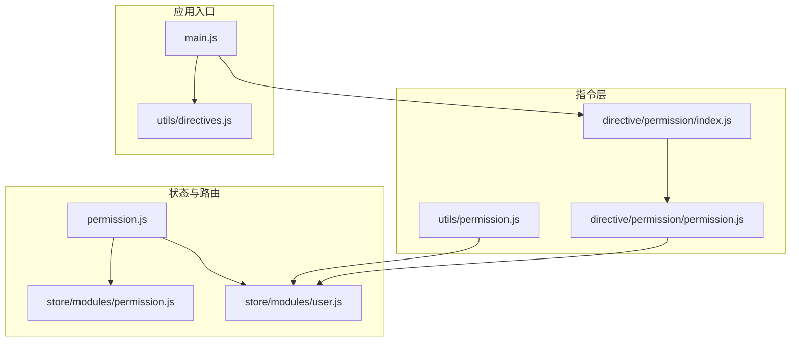
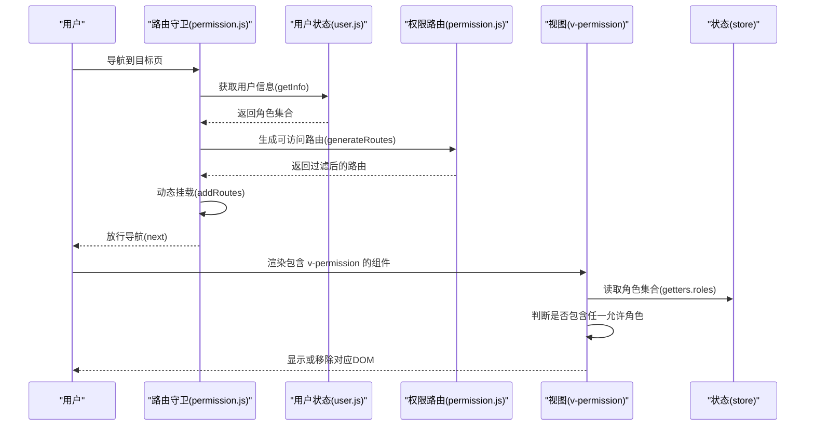
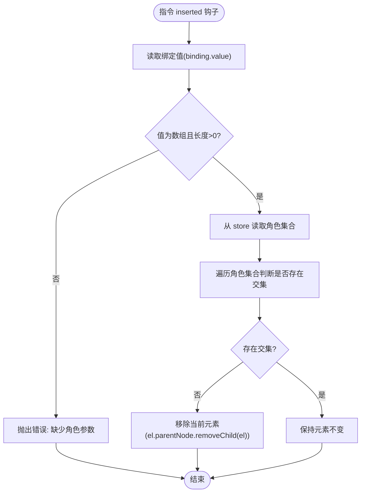
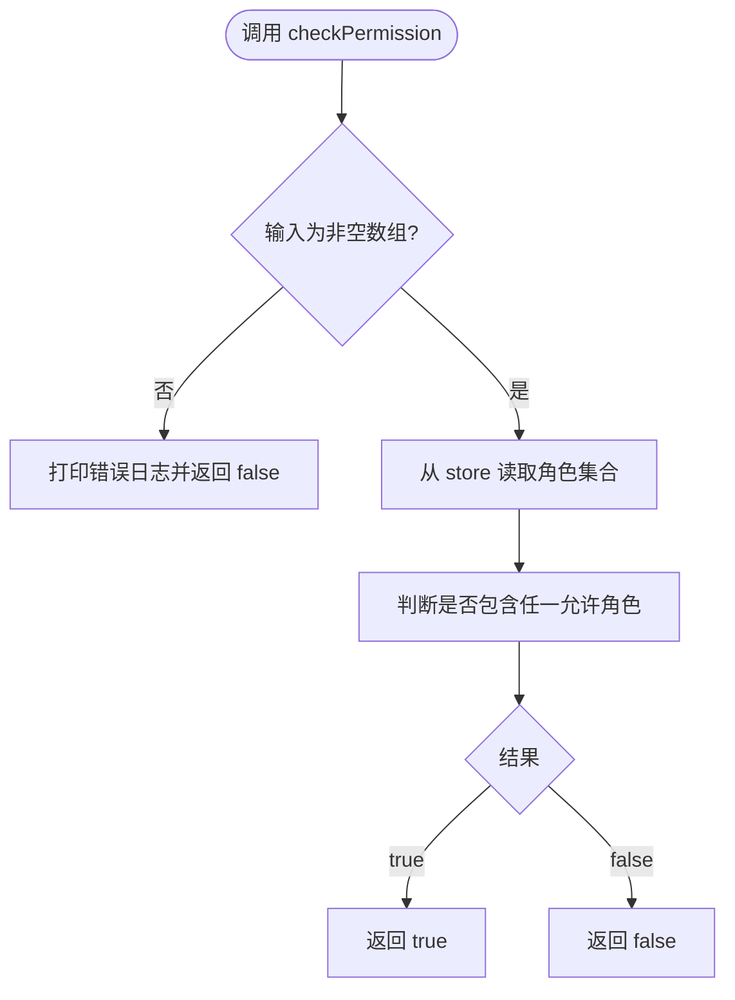
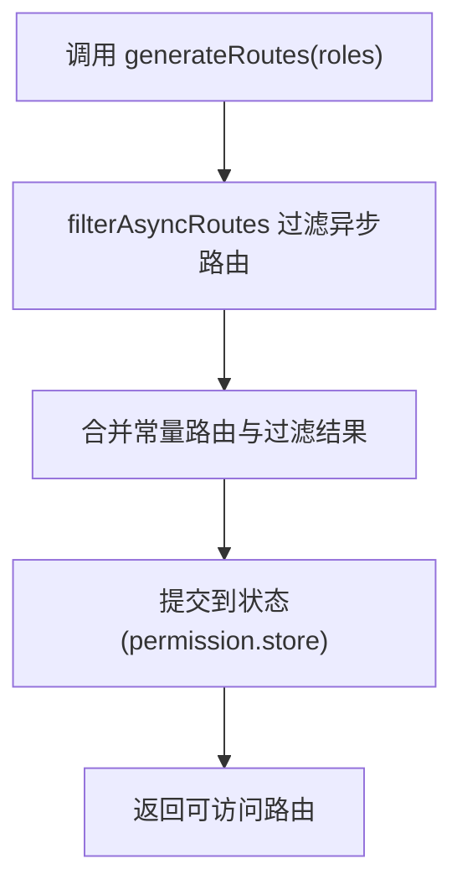
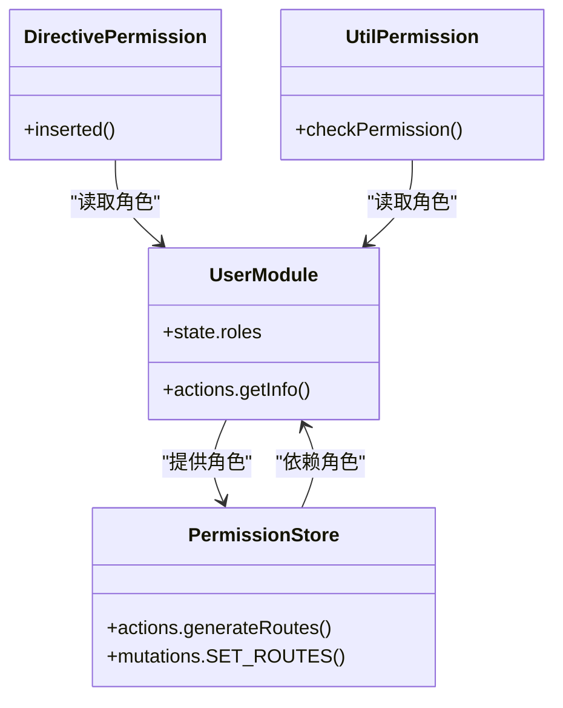
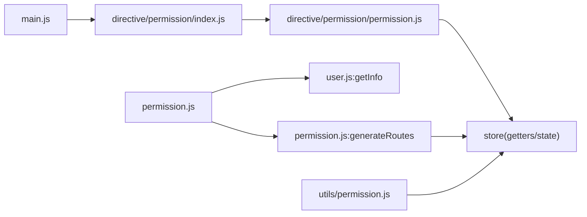

# 权限指令系统

<cite>
**本文引用的文件**
- [src/directive/permission/index.js](file://src/directive/permission/index.js)
- [src/directive/permission/permission.js](file://src/directive/permission/permission.js)
- [src/utils/permission.js](file://src/utils/permission.js)
- [src/permission.js](file://src/permission.js)
- [src/store/modules/permission.js](file://src/store/modules/permission.js)
- [src/store/modules/user.js](file://src/store/modules/user.js)
- [src/main.js](file://src/main.js)
- [src/utils/directives.js](file://src/utils/directives.js)
</cite>

## 目录
1. [简介](#简介)
2. [项目结构](#项目结构)
3. [核心组件](#核心组件)
4. [架构总览](#架构总览)
5. [详细组件分析](#详细组件分析)
6. [依赖关系分析](#依赖关系分析)
7. [性能考量](#性能考量)
8. [故障排查指南](#故障排查指南)
9. [结论](#结论)
10. [附录](#附录)

## 简介
本文件系统性梳理 Leisu Admin 的权限指令体系，重点覆盖以下内容：
- 自定义权限指令 v-permission 的实现与注册流程
- 指令的生命周期钩子与 DOM 控制机制
- 与权限模型（用户角色、路由权限、按钮权限）的集成方式
- 典型使用场景（按钮权限、菜单项显示隐藏、页面元素条件渲染）
- 扩展机制（自定义权限规则、复合权限判断）
- 性能优化建议与最佳实践

## 项目结构
围绕权限指令的相关文件主要分布在如下位置：
- 指令注册与实现：src/directive/permission
- 工具函数：src/utils/permission.js
- 路由守卫与权限生成：src/permission.js、src/store/modules/permission.js
- 用户信息与角色存储：src/store/modules/user.js
- 应用入口与全局指令挂载：src/main.js
- 其他通用指令：src/utils/directives.js

图表来源
- [src/directive/permission/index.js:1-14](file://src/directive/permission/index.js#L1-L14)
- [src/directive/permission/permission.js:1-23](file://src/directive/permission/permission.js#L1-L23)
- [src/utils/permission.js:1-26](file://src/utils/permission.js#L1-L26)
- [src/permission.js:1-82](file://src/permission.js#L1-L82)
- [src/store/modules/permission.js:1-66](file://src/store/modules/permission.js#L1-L66)
- [src/store/modules/user.js:1-542](file://src/store/modules/user.js#L1-L542)
- [src/main.js:1-526](file://src/main.js#L1-L526)
- [src/utils/directives.js:1-74](file://src/utils/directives.js#L1-L74)

章节来源
- [src/directive/permission/index.js:1-14](file://src/directive/permission/index.js#L1-L14)
- [src/directive/permission/permission.js:1-23](file://src/directive/permission/permission.js#L1-L23)
- [src/utils/permission.js:1-26](file://src/utils/permission.js#L1-L26)
- [src/permission.js:1-82](file://src/permission.js#L1-L82)
- [src/store/modules/permission.js:1-66](file://src/store/modules/permission.js#L1-L66)
- [src/store/modules/user.js:1-542](file://src/store/modules/user.js#L1-L542)
- [src/main.js:1-526](file://src/main.js#L1-L526)
- [src/utils/directives.js:1-74](file://src/utils/directives.js#L1-L74)

## 核心组件
- v-permission 指令：基于指令钩子 inserted，在插入 DOM 时根据当前用户角色集合与指令参数进行权限判断，决定是否移除元素。
- checkPermission 工具函数：提供与指令一致的权限判断逻辑，便于在非指令场景（如模板 v-if）中复用。
- 路由权限过滤模块：根据用户角色过滤异步路由表，生成可访问的路由集合并注入到路由系统。
- 路由守卫：在导航过程中拉取用户信息、生成可访问路由并动态挂载。

章节来源
- [src/directive/permission/permission.js:1-23](file://src/directive/permission/permission.js#L1-L23)
- [src/utils/permission.js:1-26](file://src/utils/permission.js#L1-L26)
- [src/store/modules/permission.js:1-66](file://src/store/modules/permission.js#L1-L66)
- [src/permission.js:1-82](file://src/permission.js#L1-L82)

## 架构总览
下图展示从登录到页面渲染期间，权限指令与路由守卫、状态管理之间的交互：

图表来源
- [src/permission.js:13-76](file://src/permission.js#L13-L76)
- [src/store/modules/user.js:172-335](file://src/store/modules/user.js#L172-L335)
- [src/store/modules/permission.js:49-58](file://src/store/modules/permission.js#L49-L58)
- [src/directive/permission/permission.js:4-21](file://src/directive/permission/permission.js#L4-L21)

## 详细组件分析

### v-permission 指令
- 注册方式：在入口文件中引入指令索引文件，完成全局注册。
- 生命周期钩子：在 inserted 钩子中执行权限判断。
- 判断逻辑：读取 store 中的角色集合，与指令参数（角色数组）做包含关系判断；若无匹配则移除该 DOM 节点。
- 参数要求：必须传入非空数组，否则抛出错误提示。

图表来源
- [src/directive/permission/permission.js:4-21](file://src/directive/permission/permission.js#L4-L21)

章节来源
- [src/directive/permission/index.js:1-14](file://src/directive/permission/index.js#L1-L14)
- [src/directive/permission/permission.js:1-23](file://src/directive/permission/permission.js#L1-L23)
- [src/main.js:83-83](file://src/main.js#L83-L83)

### checkPermission 工具函数
- 作用：提供与指令一致的权限判断逻辑，用于非指令场景（如 v-if）。
- 输入：角色数组
- 输出：布尔值
- 错误处理：当输入不符合规范时输出错误日志并返回 false

图表来源
- [src/utils/permission.js:8-25](file://src/utils/permission.js#L8-L25)

章节来源
- [src/utils/permission.js:1-26](file://src/utils/permission.js#L1-L26)

### 路由权限过滤与动态挂载
- hasPermission：依据路由 meta.roles 判断是否具备访问权限。
- filterAsyncRoutes：递归过滤异步路由表，保留满足权限的路由。
- generateRoutes：根据用户角色生成可访问路由，并合并到常量路由中。
- 路由守卫：在导航时拉取用户信息、生成路由并动态挂载，确保页面只渲染当前角色可见的菜单与页面。

图表来源
- [src/store/modules/permission.js:8-58](file://src/store/modules/permission.js#L8-L58)
- [src/permission.js:43-54](file://src/permission.js#L43-L54)

章节来源
- [src/store/modules/permission.js:1-66](file://src/store/modules/permission.js#L1-L66)
- [src/permission.js:1-82](file://src/permission.js#L1-L82)

### 与权限模型的集成
- 用户角色来源：用户信息接口返回的角色集合，包含 permission_list 等字段。
- 角色持久化：在用户信息成功后写入 store.state.user.roles。
- 指令与工具函数均从 store.getters.roles 或 store.state.user.roles 读取角色集合。
- 路由权限：通过 meta.roles 字段控制菜单与页面的可见性。

图表来源
- [src/store/modules/user.js:172-335](file://src/store/modules/user.js#L172-L335)
- [src/store/modules/permission.js:49-58](file://src/store/modules/permission.js#L49-L58)
- [src/directive/permission/permission.js:4-21](file://src/directive/permission/permission.js#L4-L21)
- [src/utils/permission.js:8-25](file://src/utils/permission.js#L8-L25)

章节来源
- [src/store/modules/user.js:1-542](file://src/store/modules/user.js#L1-L542)
- [src/store/modules/permission.js:1-66](file://src/store/modules/permission.js#L1-L66)
- [src/directive/permission/permission.js:1-23](file://src/directive/permission/permission.js#L1-L23)
- [src/utils/permission.js:1-26](file://src/utils/permission.js#L1-L26)

### 使用场景与最佳实践
- 按钮权限控制：在按钮上使用 v-permission 指定所需角色数组，未授权角色将无法看到按钮。
- 菜单项显示隐藏：结合路由 meta.roles 与动态路由生成，菜单项仅对具备相应权限的角色显示。
- 页面元素条件渲染：在模板中使用 v-if 并配合 checkPermission 工具函数进行判断，避免指令钩子未触发的边界问题。
- 最佳实践：
  - 指令参数必须为非空数组，避免运行时异常。
  - 对于复杂权限（如“与/或”组合），优先在后端或 store 层封装复合判断逻辑，前端仅消费结果。
  - 避免在指令中进行异步操作，权限判断应基于已加载的角色集合。

章节来源
- [src/directive/permission/permission.js:8-20](file://src/directive/permission/permission.js#L8-L20)
- [src/utils/permission.js:9-24](file://src/utils/permission.js#L9-L24)
- [src/permission.js:43-54](file://src/permission.js#L43-L54)

### 扩展机制
- 自定义权限规则：可在工具函数或 store 层增加复合判断逻辑（例如“至少拥有 A 或 B”、“排除某些角色”），前端仅需调用统一接口。
- 复合权限判断：在用户信息加载完成后，对 permission_list 做二次加工，补充派生权限，再统一写入 store。
- 指令扩展：如需支持“角色+资源级权限”，可在指令中读取额外上下文（如当前路由、资源 ID），并与角色集合共同参与判断。

章节来源
- [src/store/modules/user.js:232-249](file://src/store/modules/user.js#L232-L249)
- [src/utils/permission.js:8-25](file://src/utils/permission.js#L8-L25)
- [src/directive/permission/permission.js:4-21](file://src/directive/permission/permission.js#L4-L21)

## 依赖关系分析
- 指令依赖：v-permission 依赖 store 中的角色集合；checkPermission 提供独立判断能力。
- 路由依赖：路由守卫依赖用户信息与权限过滤模块；权限过滤模块依赖路由表与角色集合。
- 入口依赖：main.js 引入指令索引文件以完成全局注册。

图表来源
- [src/main.js:83-83](file://src/main.js#L83-L83)
- [src/directive/permission/index.js:1-14](file://src/directive/permission/index.js#L1-L14)
- [src/directive/permission/permission.js:1-23](file://src/directive/permission/permission.js#L1-L23)
- [src/utils/permission.js:1-26](file://src/utils/permission.js#L1-L26)
- [src/permission.js:1-82](file://src/permission.js#L1-L82)
- [src/store/modules/user.js:172-335](file://src/store/modules/user.js#L172-L335)
- [src/store/modules/permission.js:49-58](file://src/store/modules/permission.js#L49-L58)

章节来源
- [src/main.js:1-526](file://src/main.js#L1-L526)
- [src/directive/permission/index.js:1-14](file://src/directive/permission/index.js#L1-L14)
- [src/directive/permission/permission.js:1-23](file://src/directive/permission/permission.js#L1-L23)
- [src/utils/permission.js:1-26](file://src/utils/permission.js#L1-L26)
- [src/permission.js:1-82](file://src/permission.js#L1-L82)
- [src/store/modules/user.js:1-542](file://src/store/modules/user.js#L1-L542)
- [src/store/modules/permission.js:1-66](file://src/store/modules/permission.js#L1-L66)

## 性能考量
- 指令判断成本低：仅进行数组包含关系判断，时间复杂度 O(n)，n 为角色数组长度。
- 避免重复计算：在组件内复用 checkPermission 结果，减少多次读取 store 的开销。
- 路由过滤一次性：在用户登录后集中生成可访问路由，避免在渲染阶段反复过滤。
- DOM 操作最小化：仅在无权限时移除节点，尽量避免频繁插入/删除。

## 故障排查指南
- 指令报错“缺少角色参数”：检查 v-permission 绑定值是否为非空数组。
- 按钮/菜单始终不可见：确认用户信息已成功拉取，角色集合已写入 store；检查路由守卫是否已生成并挂载可访问路由。
- 权限变更后未生效：确认在角色变化后重新生成路由并挂载；必要时刷新页面或强制导航。

章节来源
- [src/directive/permission/permission.js:18-20](file://src/directive/permission/permission.js#L18-L20)
- [src/permission.js:38-61](file://src/permission.js#L38-L61)
- [src/store/modules/user.js:370-392](file://src/store/modules/user.js#L370-L392)

## 结论
Leisu Admin 的权限指令体系以 v-permission 为核心，结合工具函数与路由守卫、权限过滤模块，形成从前端指令到后端角色的完整闭环。通过统一的角色来源与权限判断逻辑，既能满足按钮级与菜单级的细粒度控制，又能在路由层面实现页面级的可见性控制。建议在复杂业务场景下，将复合权限判断前置到 store 层，前端仅消费最终结果，从而提升可维护性与性能。

## 附录
- 相关文件清单与职责概览
  - 指令注册与实现：src/directive/permission/index.js、src/directive/permission/permission.js
  - 权限工具函数：src/utils/permission.js
  - 路由守卫与权限生成：src/permission.js、src/store/modules/permission.js
  - 用户信息与角色存储：src/store/modules/user.js
  - 应用入口与全局指令挂载：src/main.js
  - 其他通用指令：src/utils/directives.js