# 权限控制模型

<cite>
**本文引用的文件**
- [src/store/modules/permission.js](file://src/store/modules/permission.js)
- [src/store/modules/user.js](file://src/store/modules/user.js)
- [src/store/modules/tagsView.js](file://src/store/modules/tagsView.js)
- [src/store/getters.js](file://src/store/getters.js)
- [src/permission.js](file://src/permission.js)
- [src/router/index.js](file://src/router/index.js)
- [src/router/children/intelligence.js](file://src/router/children/intelligence.js)
- [src/utils/permission.js](file://src/utils/permission.js)
- [src/utils/tool.js](file://src/utils/tool.js)
- [src/directive/permission/index.js](file://src/directive/permission/index.js)
- [src/directive/permission/permission.js](file://src/directive/permission/permission.js)
- [src/main.js](file://src/main.js)
- [src/layout/components/Sidebar/SidebarItem.vue](file://src/layout/components/Sidebar/SidebarItem.vue)
- [src/views/active/worldcup.vue](file://src/views/active/worldcup.vue)
- [src/views/login/index.vue](file://src/views/login/index.vue)
- [mock/role/routes.js](file://mock/role/routes.js)
</cite>

## 目录
1. [引言](#引言)
2. [项目结构](#项目结构)
3. [核心组件](#核心组件)
4. [架构总览](#架构总览)
5. [详细组件分析](#详细组件分析)
6. [依赖分析](#依赖分析)
7. [性能考虑](#性能考虑)
8. [故障排查指南](#故障排查指南)
9. [结论](#结论)
10. [附录](#附录)

## 引言
本文件系统性梳理 Leisu Admin 的权限控制模型，围绕基于角色的权限管理（RBAC）展开，覆盖用户角色定义、权限分配、菜单与按钮权限控制、权限状态管理与更新机制、以及权限验证流程。文档以代码为依据，辅以图示帮助不同背景读者理解。本次更新特别关注世界杯功能新增的权限角色和动态标签页权限控制功能。

## 项目结构
与权限相关的关键模块分布如下：
- 路由与权限表：router/index.js 定义常量路由与异步路由；router/children/intelligence.js 特别包含世界杯功能路由；mock/role/routes.js 提供示例异步路由与角色元信息。
- 权限状态管理：store/modules/permission.js 提供动态路由生成；store/modules/user.js 维护用户角色与登录态；store/modules/tagsView.js 管理标签页权限；store/getters.js 暴露权限相关 getter。
- 全局守卫与拦截：permission.js 实现路由前置守卫，完成登录态校验、角色加载与动态路由注入。
- 指令与工具：utils/permission.js 提供指令式权限校验工具；directive/permission/permission.js 为 v-permission 指令实现；main.js 注册全局指令与过滤器。
- 菜单渲染：layout/components/Sidebar/SidebarItem.vue 根据路由与隐藏字段动态渲染侧边栏菜单。
- 动态标签页权限：views/active/worldcup.vue 展示动态标签页权限控制；utils/tool.js 提供标签页权限工具函数。
- 登录入口：views/login/index.vue 触发登录并进入权限初始化流程。

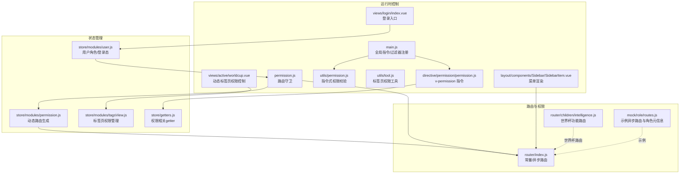

**图表来源**
- [src/router/index.js:1-177](file://src/router/index.js#L1-L177)
- [src/router/children/intelligence.js:151-155](file://src/router/children/intelligence.js#L151-L155)
- [mock/role/routes.js:1-526](file://mock/role/routes.js#L1-L526)
- [src/store/modules/permission.js:1-66](file://src/store/modules/permission.js#L1-L66)
- [src/store/modules/user.js:1-542](file://src/store/modules/user.js#L1-L542)
- [src/store/modules/tagsView.js:1-182](file://src/store/modules/tagsView.js#L1-L182)
- [src/store/getters.js:1-33](file://src/store/getters.js#L1-L33)
- [src/permission.js:1-82](file://src/permission.js#L1-L82)
- [src/main.js:179-192](file://src/main.js#L179-L192)
- [src/directive/permission/permission.js:1-23](file://src/directive/permission/permission.js#L1-L23)
- [src/utils/permission.js:1-26](file://src/utils/permission.js#L1-L26)
- [src/utils/tool.js:1030-1040](file://src/utils/tool.js#L1030-L1040)
- [src/layout/components/Sidebar/SidebarItem.vue:1-206](file://src/layout/components/Sidebar/SidebarItem.vue#L1-L206)
- [src/views/active/worldcup.vue:67-78](file://src/views/active/worldcup.vue#L67-L78)
- [src/views/login/index.vue:1-263](file://src/views/login/index.vue#L1-L263)

**章节来源**
- [src/router/index.js:1-177](file://src/router/index.js#L1-L177)
- [src/router/children/intelligence.js:1-194](file://src/router/children/intelligence.js#L1-L194)
- [src/store/modules/permission.js:1-66](file://src/store/modules/permission.js#L1-L66)
- [src/store/modules/user.js:1-542](file://src/store/modules/user.js#L1-L542)
- [src/store/modules/tagsView.js:1-182](file://src/store/modules/tagsView.js#L1-L182)
- [src/store/getters.js:1-33](file://src/store/getters.js#L1-L33)
- [src/permission.js:1-82](file://src/permission.js#L1-L82)
- [src/main.js:179-192](file://src/main.js#L179-L192)
- [src/directive/permission/permission.js:1-23](file://src/directive/permission/permission.js#L1-L23)
- [src/utils/permission.js:1-26](file://src/utils/permission.js#L1-L26)
- [src/utils/tool.js:1030-1040](file://src/utils/tool.js#L1030-L1040)
- [src/layout/components/Sidebar/SidebarItem.vue:1-206](file://src/layout/components/Sidebar/SidebarItem.vue#L1-L206)
- [src/views/active/worldcup.vue:1-180](file://src/views/active/worldcup.vue#L1-L180)
- [src/views/login/index.vue:1-263](file://src/views/login/index.vue#L1-L263)

## 核心组件
- 动态路由模块（permission）：负责根据用户角色过滤异步路由，生成可访问路由集合，并合并到全局路由中。
- 用户模块（user）：负责登录、获取用户信息（含角色与权限列表）、动态扩展权限、重置路由与缓存。
- 标签页权限模块（tagsView）：管理标签页的访问权限，支持动态添加、删除和缓存控制。
- 权限守卫（permission.js）：在路由跳转前校验登录态与角色，拉取用户信息并生成路由。
- 指令与工具：v-permission 指令与工具函数用于按钮级权限判断。
- 菜单渲染：侧边栏组件根据路由与隐藏字段动态生成菜单项。
- 动态标签页权限：worldcup.vue 展示基于权限的动态标签页生成与控制。
- 登录入口：登录页触发登录流程，随后进入权限初始化。

**章节来源**
- [src/store/modules/permission.js:1-66](file://src/store/modules/permission.js#L1-L66)
- [src/store/modules/user.js:1-542](file://src/store/modules/user.js#L1-L542)
- [src/store/modules/tagsView.js:1-182](file://src/store/modules/tagsView.js#L1-L182)
- [src/permission.js:1-82](file://src/permission.js#L1-L82)
- [src/directive/permission/permission.js:1-23](file://src/directive/permission/permission.js#L1-L23)
- [src/utils/permission.js:1-26](file://src/utils/permission.js#L1-L26)
- [src/layout/components/Sidebar/SidebarItem.vue:1-206](file://src/layout/components/Sidebar/SidebarItem.vue#L1-L206)
- [src/views/active/worldcup.vue:1-180](file://src/views/active/worldcup.vue#L1-L180)
- [src/views/login/index.vue:1-263](file://src/views/login/index.vue#L1-L263)

## 架构总览
下图展示从登录到权限生效的端到端流程，包括路由守卫、用户信息拉取、动态路由生成与菜单渲染。

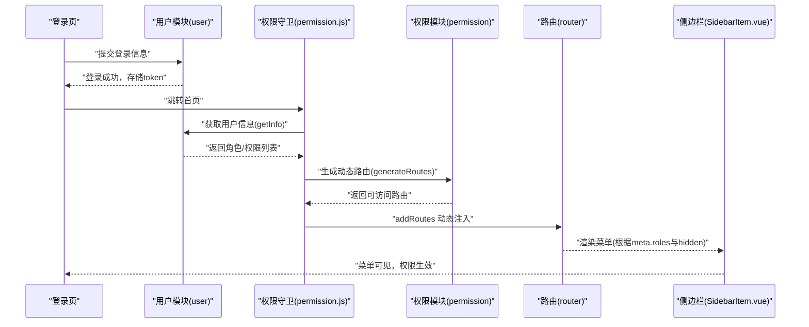

**图表来源**
- [src/views/login/index.vue:103-120](file://src/views/login/index.vue#L103-L120)
- [src/store/modules/user.js:173-335](file://src/store/modules/user.js#L173-L335)
- [src/permission.js:38-54](file://src/permission.js#L38-L54)
- [src/store/modules/permission.js:50-57](file://src/store/modules/permission.js#L50-L57)
- [src/router/index.js:162-177](file://src/router/index.js#L162-L177)
- [src/layout/components/Sidebar/SidebarItem.vue:29-51](file://src/layout/components/Sidebar/SidebarItem.vue#L29-L51)

## 详细组件分析

### 动态路由与权限过滤
- 过滤逻辑：hasPermission 通过 route.meta.roles 与用户角色集合比对，未声明 roles 的路由默认放行。
- 递归过滤：filterAsyncRoutes 对异步路由树进行深度遍历，保留满足条件的节点及其子树。
- 路由注入：generateRoutes 返回可访问路由，commit 合并到 state，再通过 router.addRoutes 注入。

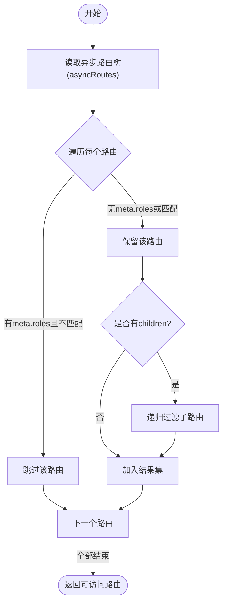

**图表来源**
- [src/store/modules/permission.js:8-35](file://src/store/modules/permission.js#L8-L35)

**章节来源**
- [src/store/modules/permission.js:1-66](file://src/store/modules/permission.js#L1-L66)

### 用户角色与权限数据流
- 登录成功后，调用 getInfo 拉取用户信息，其中包含角色与权限列表。
- 根据权限列表动态扩展额外报表权限，确保权限闭包一致。
- 将角色与权限写入 store，供守卫与指令使用。

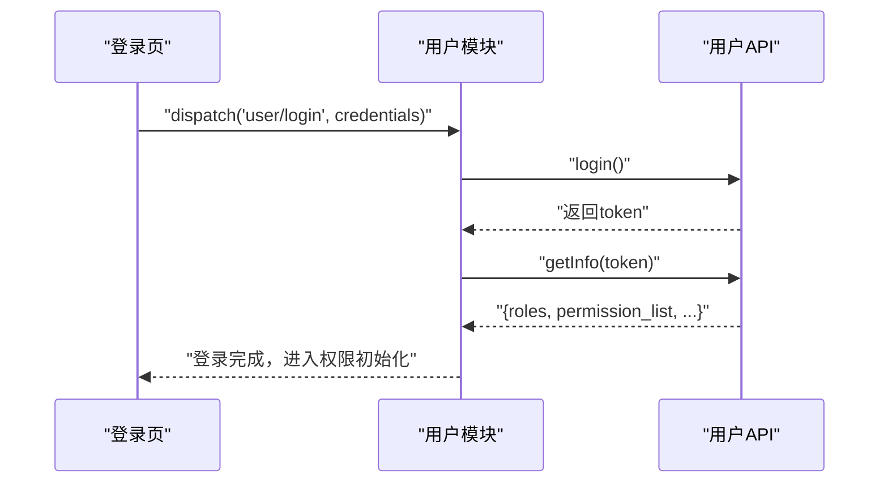

**图表来源**
- [src/views/login/index.vue:110-115](file://src/views/login/index.vue#L110-L115)
- [src/store/modules/user.js:141-154](file://src/store/modules/user.js#L141-L154)
- [src/store/modules/user.js:173-335](file://src/store/modules/user.js#L173-L335)

**章节来源**
- [src/store/modules/user.js:1-542](file://src/store/modules/user.js#L1-L542)
- [src/views/login/index.vue:1-263](file://src/views/login/index.vue#L1-L263)

### 路由守卫与权限初始化
- 白名单：无需登录即可访问的路径（如登录页）。
- 登录态校验：存在 token 才继续；否则重定向至登录页。
- 角色加载：若未获取到角色，则调用 getInfo 并生成动态路由。
- 路由注入：addRoutes 注入后，使用 replace: true 避免历史记录。

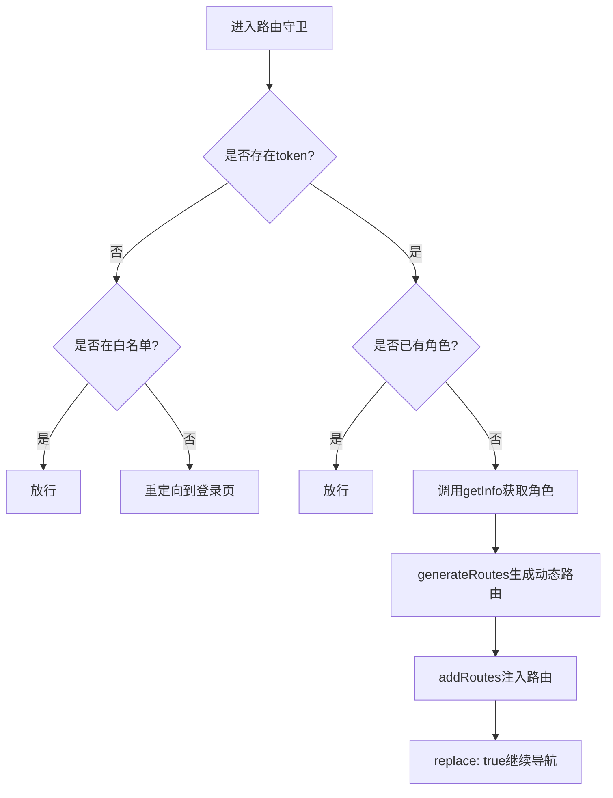

**图表来源**
- [src/permission.js:13-76](file://src/permission.js#L13-L76)

**章节来源**
- [src/permission.js:1-82](file://src/permission.js#L1-L82)

### 菜单权限控制（侧边栏）
- 菜单渲染：SidebarItem.vue 根据路由 children 与 hidden 字段决定是否渲染。
- 递归渲染：支持多级菜单，父级无子项时显示父级标题。
- 菜单隐藏：item.hidden 为真时整条目不渲染，配合权限过滤实现"菜单不可见"。

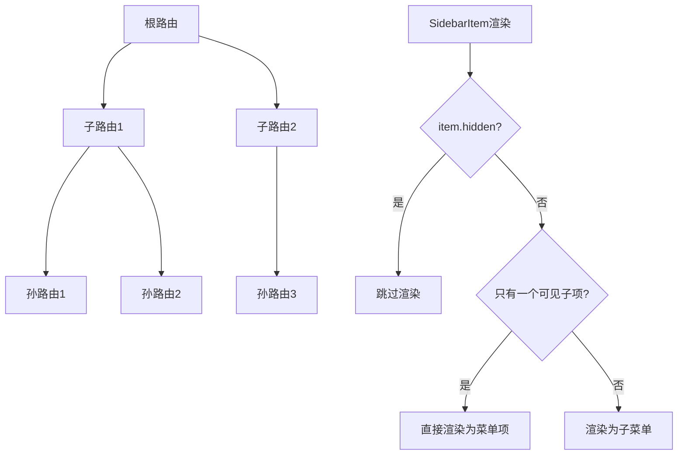

**图表来源**
- [src/layout/components/Sidebar/SidebarItem.vue:29-51](file://src/layout/components/Sidebar/SidebarItem.vue#L29-L51)

**章节来源**
- [src/layout/components/Sidebar/SidebarItem.vue:1-206](file://src/layout/components/Sidebar/SidebarItem.vue#L1-L206)

### 按钮权限控制（指令与工具）
- v-permission 指令：在 inserted 生命周期中读取绑定值（期望为角色数组），与当前用户角色比对，不满足则移除 DOM。
- 工具函数 checkPermission：提供指令式权限校验，便于在模板中以表达式方式判断。
- 全局指令：main.js 中注册 v-has 指令，基于 store.state.user.roles 实现按钮级权限。

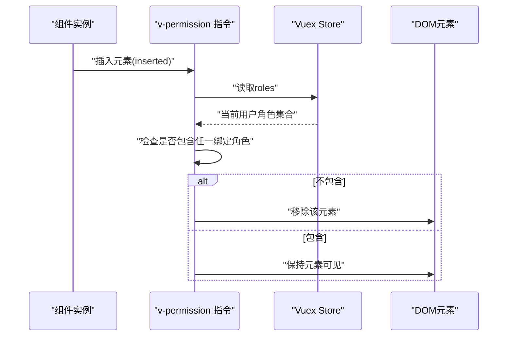

**图表来源**
- [src/directive/permission/permission.js:4-22](file://src/directive/permission/permission.js#L4-L22)
- [src/utils/permission.js:8-25](file://src/utils/permission.js#L8-L25)
- [src/main.js:492-497](file://src/main.js#L492-L497)

**章节来源**
- [src/directive/permission/permission.js:1-23](file://src/directive/permission/permission.js#L1-L23)
- [src/utils/permission.js:1-26](file://src/utils/permission.js#L1-L26)
- [src/main.js:492-497](file://src/main.js#L492-L497)

### 动态标签页权限控制
- 标签页权限：通过 hasPwer 函数动态生成标签页，仅显示用户具有相应权限的标签。
- 标签页管理：tagsView 模块管理标签页的访问权限、缓存和生命周期。
- 工具函数：getFirstPermissionTab 根据权限确定默认标签页。

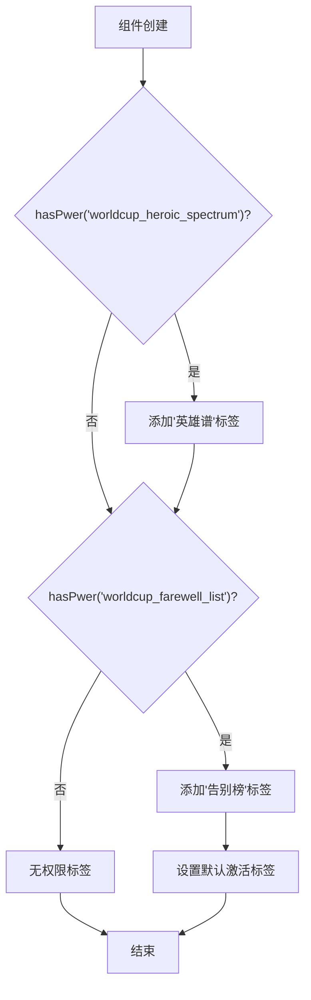

**图表来源**
- [src/views/active/worldcup.vue:67-78](file://src/views/active/worldcup.vue#L67-L78)
- [src/utils/tool.js:1030-1040](file://src/utils/tool.js#L1030-L1040)

**章节来源**
- [src/views/active/worldcup.vue:1-180](file://src/views/active/worldcup.vue#L1-L180)
- [src/store/modules/tagsView.js:1-182](file://src/store/modules/tagsView.js#L1-L182)
- [src/utils/tool.js:1030-1040](file://src/utils/tool.js#L1030-L1040)

### 权限数据结构与设计要点
- 路由元信息：meta.roles 定义可访问角色集合；meta.hidden 控制菜单显示；meta.icon/title 用于菜单渲染。
- 用户角色：roles 为字符串数组，通常对应后端返回的权限标识符集合。
- 权限树构建：异步路由树作为权限树，通过 hasPermission 与 filterAsyncRoutes 递归筛选。
- 权限标识符：示例异步路由中包含 roles 字段，用于演示 RBAC 角色到路由的映射。
- **新增**：世界杯功能权限标识符 worldcup_heroic_spectrum 和 worldcup_farewell_list。

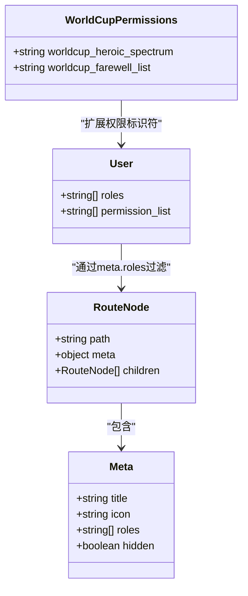

**图表来源**
- [src/router/index.js:74-160](file://src/router/index.js#L74-L160)
- [src/router/children/intelligence.js:151-155](file://src/router/children/intelligence.js#L151-L155)
- [mock/role/routes.js:81-113](file://mock/role/routes.js#L81-L113)
- [src/store/modules/user.js:183-191](file://src/store/modules/user.js#L183-L191)

**章节来源**
- [src/router/index.js:1-177](file://src/router/index.js#L1-L177)
- [src/router/children/intelligence.js:1-194](file://src/router/children/intelligence.js#L1-L194)
- [mock/role/routes.js:1-526](file://mock/role/routes.js#L1-L526)
- [src/store/modules/user.js:1-542](file://src/store/modules/user.js#L1-L542)

### 权限状态管理（Vuex）
- 状态划分：
  - permission 模块：state.routes/addRoutes，保存已生成的动态路由。
  - user 模块：state.roles/roles_id/name/mangeid 等，保存用户角色与基本信息。
  - tagsView 模块：state.visitedViews/cachedViews，管理标签页权限与缓存。
  - getters：暴露 roles、permission_routes 等常用派生状态。
- 更新机制：
  - 登录成功后 getInfo 写入 roles 与扩展权限。
  - 守卫中 generateRoutes 写入 permission.routes。
  - 退出登录时 resetRouter 与清空 roles，确保状态回退。

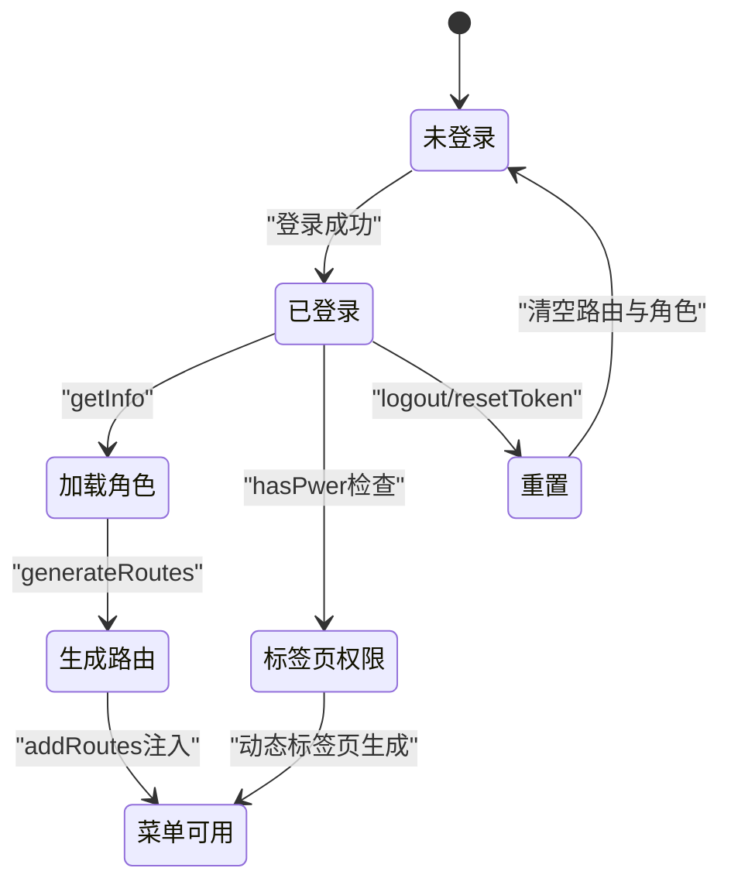

**图表来源**
- [src/store/modules/user.js:339-358](file://src/store/modules/user.js#L339-L358)
- [src/store/modules/permission.js:37-58](file://src/store/modules/permission.js#L37-L58)
- [src/store/modules/tagsView.js:1-182](file://src/store/modules/tagsView.js#L1-L182)
- [src/store/getters.js:12-13](file://src/store/getters.js#L12-L13)

**章节来源**
- [src/store/modules/permission.js:1-66](file://src/store/modules/permission.js#L1-L66)
- [src/store/modules/user.js:1-542](file://src/store/modules/user.js#L1-L542)
- [src/store/modules/tagsView.js:1-182](file://src/store/modules/tagsView.js#L1-L182)
- [src/store/getters.js:1-33](file://src/store/getters.js#L1-L33)

### 权限验证流程（登录后）
- 登录页提交凭据，成功后进入守卫。
- 守卫检测 token 与角色，若缺失则拉取用户信息并生成动态路由。
- 注入路由后，replace 导航避免历史记录污染。
- 菜单与按钮权限随之生效。

**章节来源**
- [src/views/login/index.vue:103-120](file://src/views/login/index.vue#L103-L120)
- [src/permission.js:38-54](file://src/permission.js#L38-L54)
- [src/store/modules/permission.js:50-57](file://src/store/modules/permission.js#L50-L57)

### 世界杯功能权限扩展
- 新增权限角色：
  - worldcup_heroic_spectrum：控制英雄谱功能访问权限
  - worldcup_farewell_list：控制告别榜功能访问权限
- 路由配置：在 intelligence.js 中定义了对应的路由和权限角色。
- 动态标签页：worldcup.vue 组件根据用户权限动态生成标签页。

**章节来源**
- [src/router/children/intelligence.js:151-155](file://src/router/children/intelligence.js#L151-L155)
- [src/views/active/worldcup.vue:67-78](file://src/views/active/worldcup.vue#L67-L78)

## 依赖分析
- 模块耦合：
  - permission.js 依赖 user 模块（getInfo）与 permission 模块（generateRoutes）。
  - permission 模块依赖 router（addRoutes）与 asyncRoutes。
  - tagsView 模块依赖 store 状态管理标签页权限。
  - worldcup.vue 依赖 hasPwer 函数和标签页权限工具。
  - SidebarItem.vue 依赖路由配置与隐藏字段。
  - v-permission 指令依赖 store.getters.roles。
- 外部依赖：
  - Element UI 的路由与菜单组件。
  - NProgress 进度条。
  - js-cookie 令牌存储。

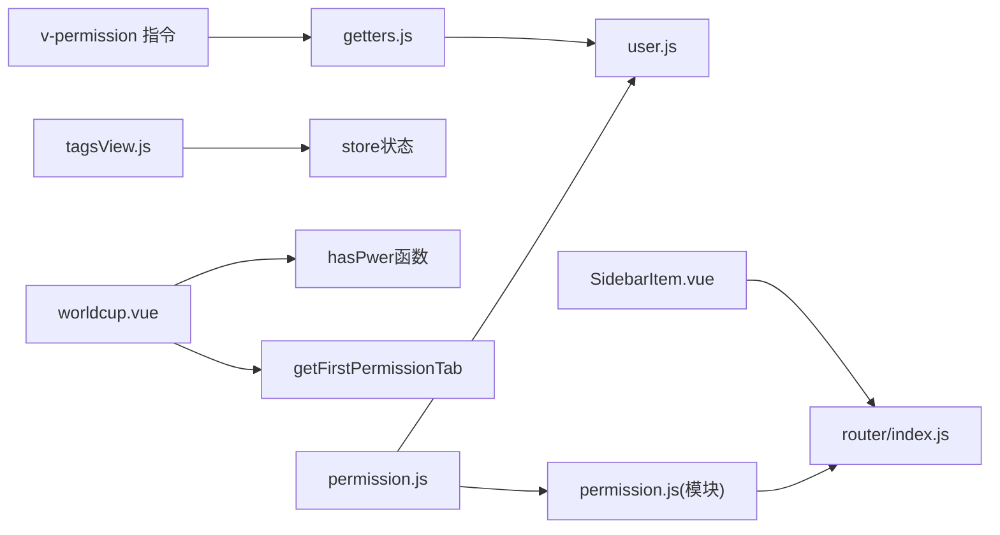

**图表来源**
- [src/permission.js:1-82](file://src/permission.js#L1-L82)
- [src/store/modules/permission.js:1-66](file://src/store/modules/permission.js#L1-L66)
- [src/store/modules/user.js:1-542](file://src/store/modules/user.js#L1-L542)
- [src/store/modules/tagsView.js:1-182](file://src/store/modules/tagsView.js#L1-L182)
- [src/layout/components/Sidebar/SidebarItem.vue:1-206](file://src/layout/components/Sidebar/SidebarItem.vue#L1-L206)
- [src/views/active/worldcup.vue:1-180](file://src/views/active/worldcup.vue#L1-L180)
- [src/utils/tool.js:1030-1040](file://src/utils/tool.js#L1030-L1040)

**章节来源**
- [src/permission.js:1-82](file://src/permission.js#L1-L82)
- [src/store/modules/permission.js:1-66](file://src/store/modules/permission.js#L1-L66)
- [src/store/modules/user.js:1-542](file://src/store/modules/user.js#L1-L542)
- [src/store/modules/tagsView.js:1-182](file://src/store/modules/tagsView.js#L1-L182)
- [src/layout/components/Sidebar/SidebarItem.vue:1-206](file://src/layout/components/Sidebar/SidebarItem.vue#L1-L206)
- [src/views/active/worldcup.vue:1-180](file://src/views/active/worldcup.vue#L1-L180)
- [src/utils/tool.js:1030-1040](file://src/utils/tool.js#L1030-L1040)

## 性能考虑
- 路由过滤复杂度：filterAsyncRoutes 为 O(N) 遍历，建议控制异步路由树规模，避免深层嵌套。
- 令牌与状态持久化：使用 token 与 Vuex 状态结合，减少重复请求。
- 菜单渲染优化：SidebarItem.vue 已通过 hidden 与单子项优化减少 DOM 层级。
- 指令开销：v-permission 在 inserted 阶段执行一次判断，适合静态按钮权限。
- **新增**：动态标签页权限检查：hasPwer 函数采用 indexOf 检查，时间复杂度 O(n)，在权限数量较少时性能良好。

[本节为通用指导，无需特定文件引用]

## 故障排查指南
- 登录后仍提示无权限：
  - 检查 getInfo 是否正确返回 roles 与 permission_list。
  - 确认 meta.roles 与用户角色集合是否匹配。
- 动态路由未生效：
  - 确认 generateRoutes 是否被调用并 addRoutes 注入。
  - 检查路由路径与命名是否唯一，避免重复注入。
- 菜单不显示：
  - 检查路由 meta.hidden 是否为真。
  - 确认异步路由树结构与 children 配置。
- 按钮不显示：
  - 检查 v-permission 绑定的角色是否存在于当前用户 roles。
  - 确认 v-has 指令的参数与用户权限一致。
- **新增**：动态标签页不显示：
  - 检查 hasPwer 函数是否正确返回权限状态。
  - 确认标签页权限角色是否在用户角色列表中。
  - 验证标签页权限工具函数 getFirstPermissionTab 的使用。

**章节来源**
- [src/store/modules/user.js:173-335](file://src/store/modules/user.js#L173-L335)
- [src/store/modules/permission.js:50-57](file://src/store/modules/permission.js#L50-L57)
- [src/layout/components/Sidebar/SidebarItem.vue:29-51](file://src/layout/components/Sidebar/SidebarItem.vue#L29-L51)
- [src/directive/permission/permission.js:18-20](file://src/directive/permission/permission.js#L18-L20)
- [src/views/active/worldcup.vue:67-78](file://src/views/active/worldcup.vue#L67-L78)

## 结论
Leisu Admin 的权限模型以 RBAC 为核心，通过路由元信息与用户角色的映射实现菜单与按钮级权限控制。登录后通过守卫与状态管理完成权限初始化，动态路由注入保证了菜单与功能的精确可控。本次更新特别增强了动态标签页权限控制能力，通过 hasPwer 函数实现了基于权限的动态界面生成，为世界杯等功能提供了灵活的权限控制方案。整体设计清晰、职责分离明确，具备良好的扩展性与可维护性。

[本节为总结，无需特定文件引用]

## 附录
- 扩展方案与最佳实践：
  - 权限标识符标准化：统一权限字符串命名规范，便于前端与后端协同。
  - 路由懒加载与权限：结合 webpack chunk 与权限树，按需加载模块。
  - 多租户/多组织：在用户信息中增加组织维度，过滤路由与数据。
  - 缓存策略：对用户权限与菜单树做本地缓存，提升二次进入速度。
  - 安全加固：前端仅作 UI 层控制，后端必须进行同等强度的鉴权。
  - **新增**：动态标签页权限扩展：利用 hasPwer 函数实现更细粒度的界面控制，支持复杂的权限组合场景。

[本节为通用指导，无需特定文件引用]