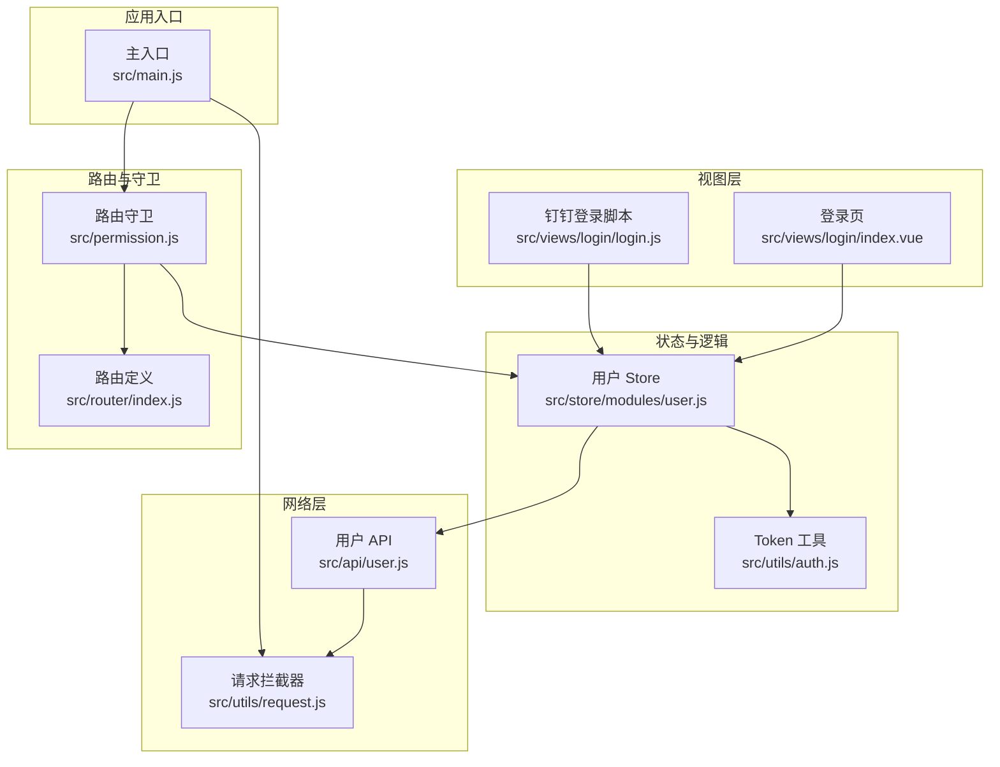
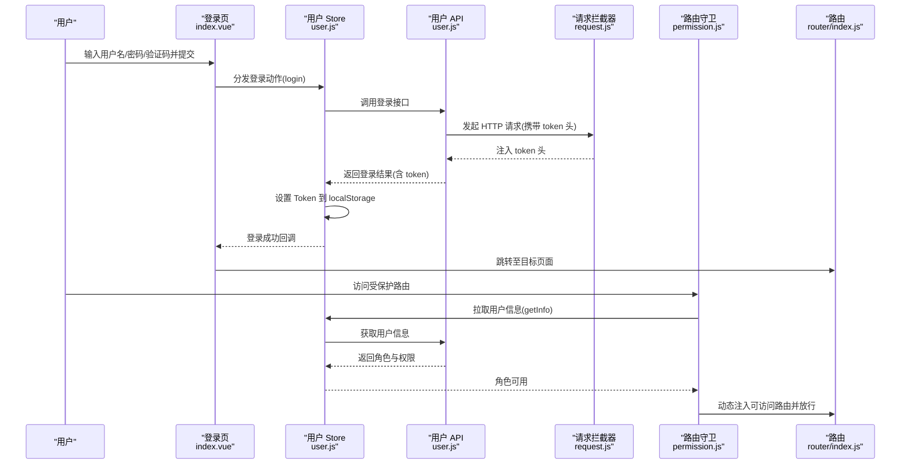
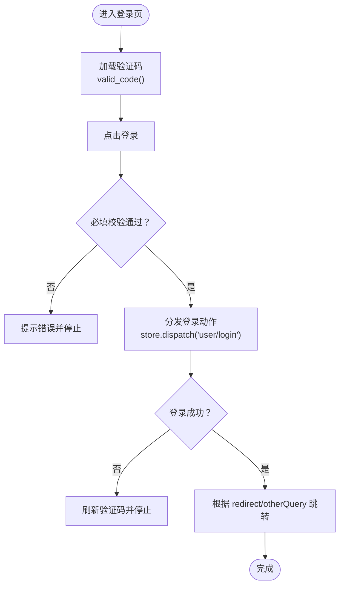
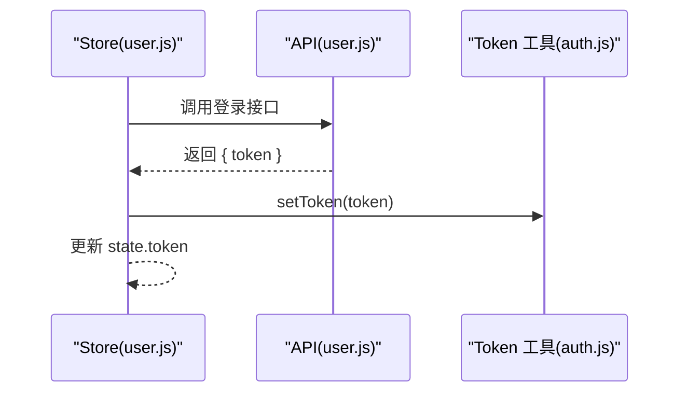
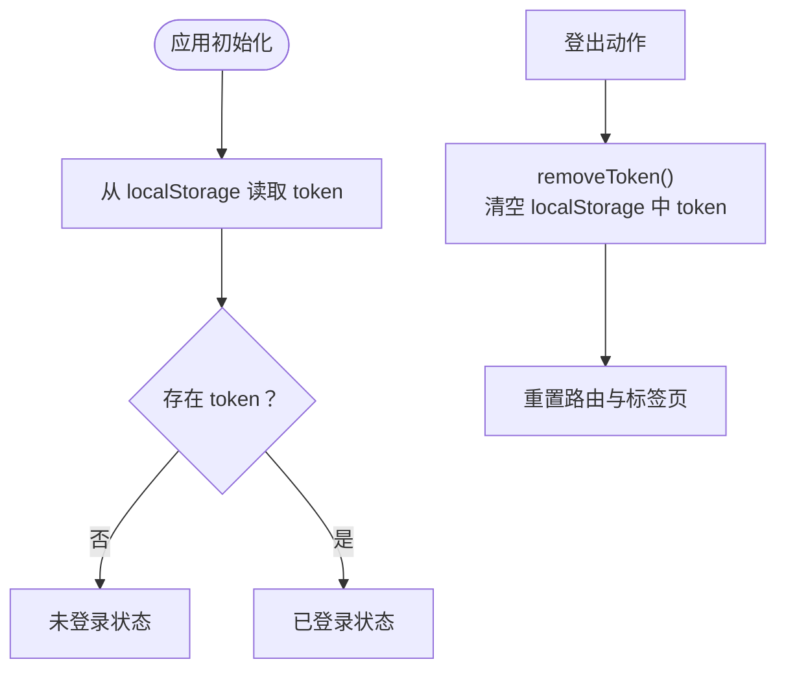
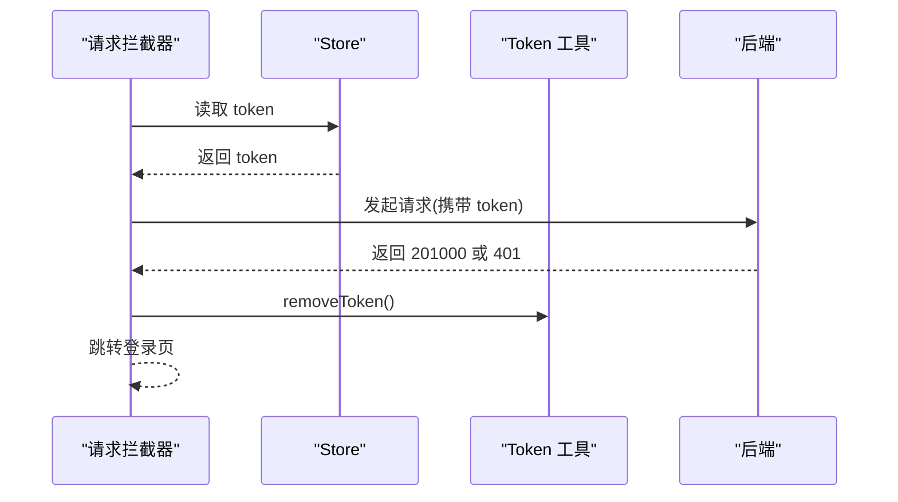
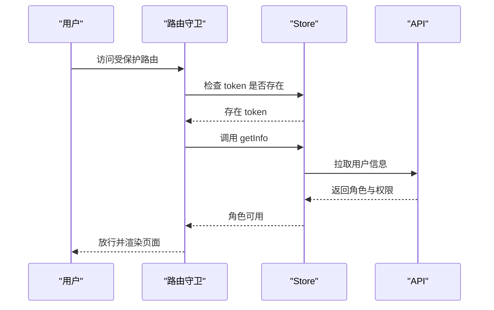
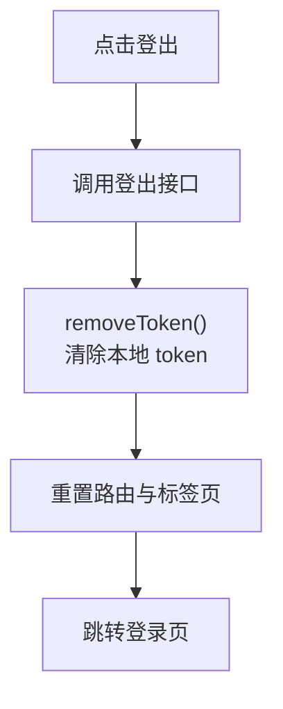
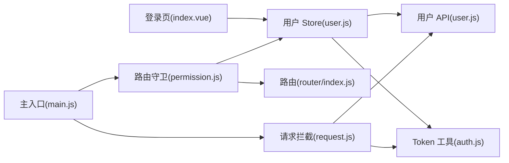

# 用户认证流程

<cite>
**本文引用的文件**
- [src/views/login/index.vue](file://src/views/login/index.vue)
- [src/store/modules/user.js](file://src/store/modules/user.js)
- [src/utils/auth.js](file://src/utils/auth.js)
- [src/api/user.js](file://src/api/user.js)
- [src/permission.js](file://src/permission.js)
- [src/router/index.js](file://src/router/index.js)
- [src/utils/request.js](file://src/utils/request.js)
- [src/main.js](file://src/main.js)
- [mock/user.js](file://mock/user.js)
- [src/views/login/login.js](file://src/views/login/login.js)
</cite>

## 目录
1. [简介](#简介)
2. [项目结构](#项目结构)
3. [核心组件](#核心组件)
4. [架构总览](#架构总览)
5. [详细组件分析](#详细组件分析)
6. [依赖关系分析](#依赖关系分析)
7. [性能考量](#性能考量)
8. [故障排查指南](#故障排查指南)
9. [结论](#结论)
10. [附录](#附录)

## 简介
本文件面向 Leisu Admin 项目的前端认证体系，系统性梳理从登录页到路由守卫、状态管理与请求拦截的整体流程，重点覆盖以下方面：
- 登录页面实现与表单校验
- 凭据提交与后端接口交互
- 认证状态维护与持久化
- Token 的获取、存储、携带与失效处理
- 自动登录与会话保持机制
- 多设备登录与并发控制策略
- 登出流程与状态清理
- 安全注意事项与调试方法

## 项目结构
围绕认证的关键文件分布如下：
- 登录页面：src/views/login/index.vue
- 钉钉登录脚本：src/views/login/login.js
- 用户状态与认证动作：src/store/modules/user.js
- Token 读写：src/utils/auth.js
- 用户相关 API：src/api/user.js
- 全局路由守卫：src/permission.js
- 路由定义：src/router/index.js
- 请求拦截器与全局错误处理：src/utils/request.js
- 主入口挂载与全局配置：src/main.js
- Mock 数据（示例）：mock/user.js

图表来源
- [src/views/login/index.vue:1-263](file://src/views/login/index.vue#L1-L263)
- [src/views/login/login.js:1-102](file://src/views/login/login.js#L1-L102)
- [src/store/modules/user.js:1-542](file://src/store/modules/user.js#L1-L542)
- [src/utils/auth.js:1-17](file://src/utils/auth.js#L1-L17)
- [src/api/user.js:1-37](file://src/api/user.js#L1-L37)
- [src/permission.js:1-82](file://src/permission.js#L1-L82)
- [src/router/index.js:1-177](file://src/router/index.js#L1-L177)
- [src/utils/request.js:1-130](file://src/utils/request.js#L1-L130)
- [src/main.js:1-526](file://src/main.js#L1-L526)

章节来源
- [src/views/login/index.vue:1-263](file://src/views/login/index.vue#L1-L263)
- [src/store/modules/user.js:1-542](file://src/store/modules/user.js#L1-L542)
- [src/utils/auth.js:1-17](file://src/utils/auth.js#L1-L17)
- [src/api/user.js:1-37](file://src/api/user.js#L1-L37)
- [src/permission.js:1-82](file://src/permission.js#L1-L82)
- [src/router/index.js:1-177](file://src/router/index.js#L1-L177)
- [src/utils/request.js:1-130](file://src/utils/request.js#L1-L130)
- [src/main.js:1-526](file://src/main.js#L1-L526)

## 核心组件
- 登录页组件：负责用户名/密码/验证码输入、触发登录动作、路由跳转与错误提示。
- 用户 Store：封装登录、获取用户信息、登出、重置 Token 等动作；通过 TokenKey 持久化在 localStorage。
- Token 工具：提供获取、设置、移除 Token 的统一方法。
- 用户 API：封装登录、钉钉登录、获取用户信息、验证码、登出等接口。
- 路由守卫：在进入受保护路由前检查 Token，拉取用户信息并动态注入可访问路由。
- 请求拦截器：统一在请求头注入 token，并处理 401/201000 等异常场景。

章节来源
- [src/views/login/index.vue:35-130](file://src/views/login/index.vue#L35-L130)
- [src/store/modules/user.js:139-368](file://src/store/modules/user.js#L139-L368)
- [src/utils/auth.js:5-16](file://src/utils/auth.js#L5-L16)
- [src/api/user.js:3-36](file://src/api/user.js#L3-L36)
- [src/permission.js:13-76](file://src/permission.js#L13-L76)
- [src/utils/request.js:29-68](file://src/utils/request.js#L29-L68)

## 架构总览
下面以序列图展示一次完整的登录与会话维持过程：

图表来源
- [src/views/login/index.vue:103-120](file://src/views/login/index.vue#L103-L120)
- [src/store/modules/user.js:141-154](file://src/store/modules/user.js#L141-L154)
- [src/api/user.js:3-9](file://src/api/user.js#L3-L9)
- [src/utils/request.js:33-35](file://src/utils/request.js#L33-L35)
- [src/permission.js:38-54](file://src/permission.js#L38-L54)
- [src/router/index.js:74-160](file://src/router/index.js#L74-L160)

## 详细组件分析

### 登录页实现与表单校验
- 表单项包含用户名、密码、验证码，支持回车提交。
- 登录前进行必填项校验，失败弹出提示并阻止提交。
- 登录成功后根据 redirect 与其它查询参数进行路由跳转。
- 验证码通过接口获取并以 Base64 图片形式展示，登录失败或刷新验证码。

图表来源
- [src/views/login/index.vue:84-120](file://src/views/login/index.vue#L84-L120)
- [src/api/user.js:24-29](file://src/api/user.js#L24-L29)

章节来源
- [src/views/login/index.vue:35-130](file://src/views/login/index.vue#L35-L130)
- [src/api/user.js:24-29](file://src/api/user.js#L24-L29)

### 用户凭据验证与登录动作
- 登录动作接收用户名、密码、uuid、验证码，调用登录接口。
- 成功后将 token 写入 localStorage，并更新用户状态中的 token 字段。
- 钉钉登录提供独立接口与脚本，便于企业组织单点登录集成。

图表来源
- [src/store/modules/user.js:141-154](file://src/store/modules/user.js#L141-L154)
- [src/api/user.js:3-9](file://src/api/user.js#L3-L9)
- [src/utils/auth.js:9-12](file://src/utils/auth.js#L9-L12)

章节来源
- [src/store/modules/user.js:139-170](file://src/store/modules/user.js#L139-L170)
- [src/api/user.js:3-16](file://src/api/user.js#L3-L16)
- [src/utils/auth.js:5-16](file://src/utils/auth.js#L5-L16)

### 认证状态维护与持久化
- TokenKey 固定为 aToken，存储于 localStorage。
- 应用启动时从 localStorage 读取 token 初始化状态。
- 登出时清除 token 并重置路由与标签页缓存。

图表来源
- [src/utils/auth.js:5-16](file://src/utils/auth.js#L5-L16)
- [src/store/modules/user.js:339-358](file://src/store/modules/user.js#L339-L358)
- [src/main.js:1-526](file://src/main.js#L1-L526)

章节来源
- [src/utils/auth.js:5-16](file://src/utils/auth.js#L5-L16)
- [src/store/modules/user.js:13-23](file://src/store/modules/user.js#L13-L23)
- [src/store/modules/user.js:339-358](file://src/store/modules/user.js#L339-L358)

### Token 管理机制
- 获取：应用启动时从 localStorage 读取。
- 存储：localStorage.setItem(TokenKey, token)。
- 携带：请求拦截器在请求头注入 token。
- 刷新与失效：当前实现未见自动刷新逻辑；当后端返回特定错误码时，拦截器移除 token 并跳转登录。

图表来源
- [src/utils/request.js:33-35](file://src/utils/request.js#L33-L35)
- [src/utils/request.js:55-59](file://src/utils/request.js#L55-L59)
- [src/utils/auth.js:14-16](file://src/utils/auth.js#L14-L16)

章节来源
- [src/utils/request.js:29-68](file://src/utils/request.js#L29-L68)
- [src/utils/auth.js:5-16](file://src/utils/auth.js#L5-L16)

### 自动登录与会话保持
- 自动登录：路由守卫检测到 token 存在即视为已登录，无需再次输入凭据。
- 会话保持：页面刷新后仍可从 localStorage 恢复登录状态；首次访问受保护路由时拉取用户信息并注入动态路由。

图表来源
- [src/permission.js:20-62](file://src/permission.js#L20-L62)
- [src/store/modules/user.js:173-336](file://src/store/modules/user.js#L173-L336)

章节来源
- [src/permission.js:13-76](file://src/permission.js#L13-L76)
- [src/store/modules/user.js:173-336](file://src/store/modules/user.js#L173-L336)

### 多设备登录与并发控制
- 当前代码未发现显式的“多设备互斥”或“强制下线”逻辑。
- 若需实现，可在登录接口返回中携带“会话状态”字段，前端在登录成功后根据策略决定是否踢掉旧会话；或在每次请求返回 401/201000 时触发统一登出流程。

章节来源
- [src/api/user.js:3-16](file://src/api/user.js#L3-L16)
- [src/utils/request.js:55-59](file://src/utils/request.js#L55-L59)

### 登出流程
- 调用登出接口后，清除本地 token、重置路由、清空标签页缓存，并回到登录页。
- 登出后所有受保护路由均需重新鉴权。

图表来源
- [src/store/modules/user.js:339-358](file://src/store/modules/user.js#L339-L358)
- [src/utils/auth.js:14-16](file://src/utils/auth.js#L14-L16)
- [src/api/user.js:31-36](file://src/api/user.js#L31-L36)

章节来源
- [src/store/modules/user.js:339-358](file://src/store/modules/user.js#L339-L358)
- [src/api/user.js:31-36](file://src/api/user.js#L31-L36)

### 钉钉登录集成
- 提供 iframe 嵌入式钉钉登录能力，通过 postMessage 接收授权码并回调。
- 登录成功后可走统一登录流程，将 token 写入本地并进入应用。

章节来源
- [src/views/login/login.js:48-101](file://src/views/login/login.js#L48-L101)
- [src/store/modules/user.js:156-170](file://src/store/modules/user.js#L156-L170)

## 依赖关系分析
- 登录页依赖用户 Store 与 API；Store 依赖 Token 工具与路由。
- 路由守卫依赖 Token 工具与用户 Store；用户 Store 依赖 API。
- 请求拦截器依赖 Token 工具与全局消息提示；API 封装基于请求拦截器。
- 主入口挂载路由守卫与请求拦截器，确保全局生效。

图表来源
- [src/views/login/index.vue:1-263](file://src/views/login/index.vue#L1-L263)
- [src/store/modules/user.js:1-542](file://src/store/modules/user.js#L1-L542)
- [src/utils/auth.js:1-17](file://src/utils/auth.js#L1-L17)
- [src/api/user.js:1-37](file://src/api/user.js#L1-L37)
- [src/permission.js:1-82](file://src/permission.js#L1-L82)
- [src/router/index.js:1-177](file://src/router/index.js#L1-L177)
- [src/utils/request.js:1-130](file://src/utils/request.js#L1-L130)
- [src/main.js:1-526](file://src/main.js#L1-L526)

章节来源
- [src/views/login/index.vue:1-263](file://src/views/login/index.vue#L1-L263)
- [src/store/modules/user.js:1-542](file://src/store/modules/user.js#L1-L542)
- [src/utils/auth.js:1-17](file://src/utils/auth.js#L1-L17)
- [src/api/user.js:1-37](file://src/api/user.js#L1-L37)
- [src/permission.js:1-82](file://src/permission.js#L1-L82)
- [src/router/index.js:1-177](file://src/router/index.js#L1-L177)
- [src/utils/request.js:1-130](file://src/utils/request.js#L1-L130)
- [src/main.js:1-526](file://src/main.js#L1-L526)

## 性能考量
- Token 持久化在 localStorage，读写开销低，适合高频鉴权场景。
- 请求拦截器统一注入 token，减少重复代码，提升一致性。
- 路由守卫在首次访问时才拉取用户信息并动态注入路由，避免不必要的初始化成本。
- 建议：对频繁刷新的页面可增加“令牌有效性预检”或“心跳保活”，降低无效请求比例。

## 故障排查指南
- 登录失败
  - 检查用户名/密码/验证码是否完整。
  - 查看接口返回与消息提示，必要时刷新验证码。
  - 参考：[src/views/login/index.vue:103-120](file://src/views/login/index.vue#L103-L120)，[src/api/user.js:24-29](file://src/api/user.js#L24-L29)
- 页面白屏或 401
  - 检查 localStorage 中 token 是否存在且有效。
  - 若返回 201000 或 401，拦截器会清除 token 并跳转登录。
  - 参考：[src/utils/request.js:55-59](file://src/utils/request.js#L55-L59)
- 无法进入受保护路由
  - 确认已登录且已成功拉取用户信息。
  - 检查路由守卫逻辑与动态路由注入。
  - 参考：[src/permission.js:38-54](file://src/permission.js#L38-L54)
- 登出后仍可访问
  - 确认登出动作已执行并清除 token。
  - 检查路由守卫是否正确拦截。
  - 参考：[src/store/modules/user.js:339-358](file://src/store/modules/user.js#L339-L358)

章节来源
- [src/views/login/index.vue:103-120](file://src/views/login/index.vue#L103-L120)
- [src/api/user.js:24-29](file://src/api/user.js#L24-L29)
- [src/utils/request.js:55-59](file://src/utils/request.js#L55-L59)
- [src/permission.js:38-54](file://src/permission.js#L38-L54)
- [src/store/modules/user.js:339-358](file://src/store/modules/user.js#L339-L358)

## 结论
Leisu Admin 的认证体系以“登录页 + Store 动作 + 请求拦截 + 路由守卫”为核心闭环，具备良好的可扩展性。当前实现侧重基础登录与会话维持，建议后续补充：
- Token 自动刷新与心跳保活
- 多设备互斥与强制下线
- 更细粒度的权限控制与审计日志
- 统一的错误处理与重试策略

## 附录
- Mock 示例：用于开发联调的用户登录、信息与登出接口示例。
  - 参考：[mock/user.js:26-84](file://mock/user.js#L26-L84)