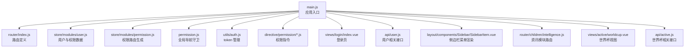
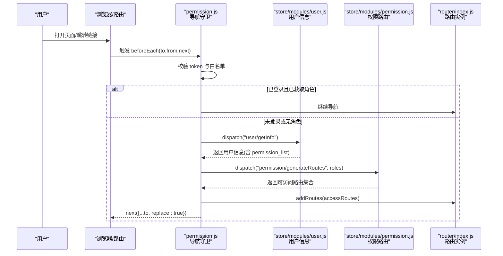
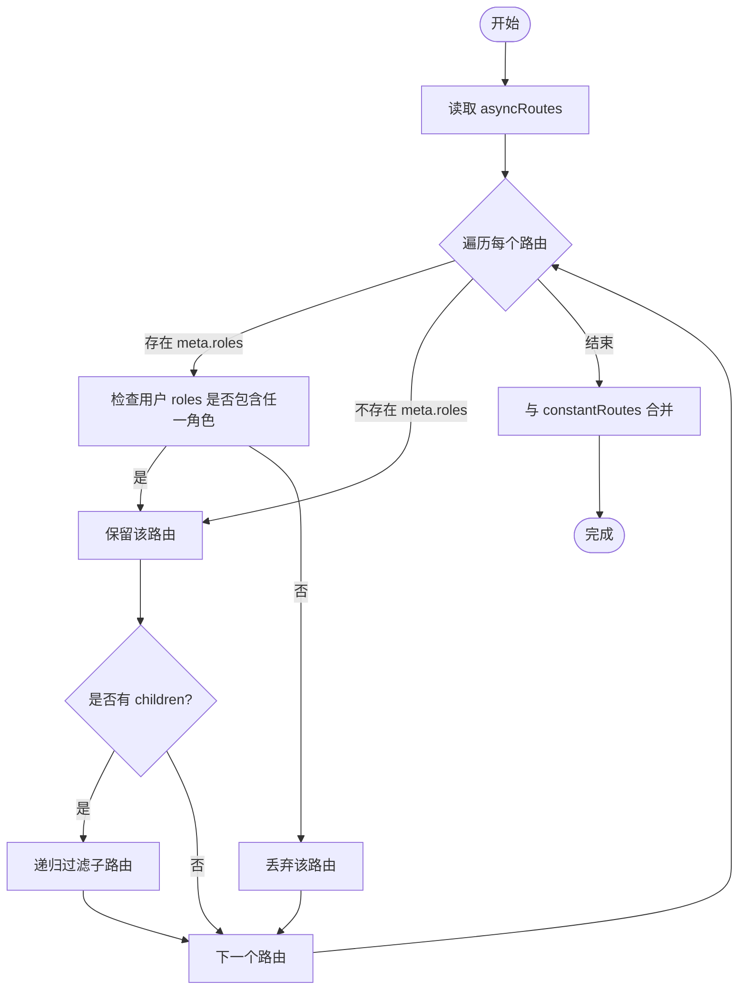
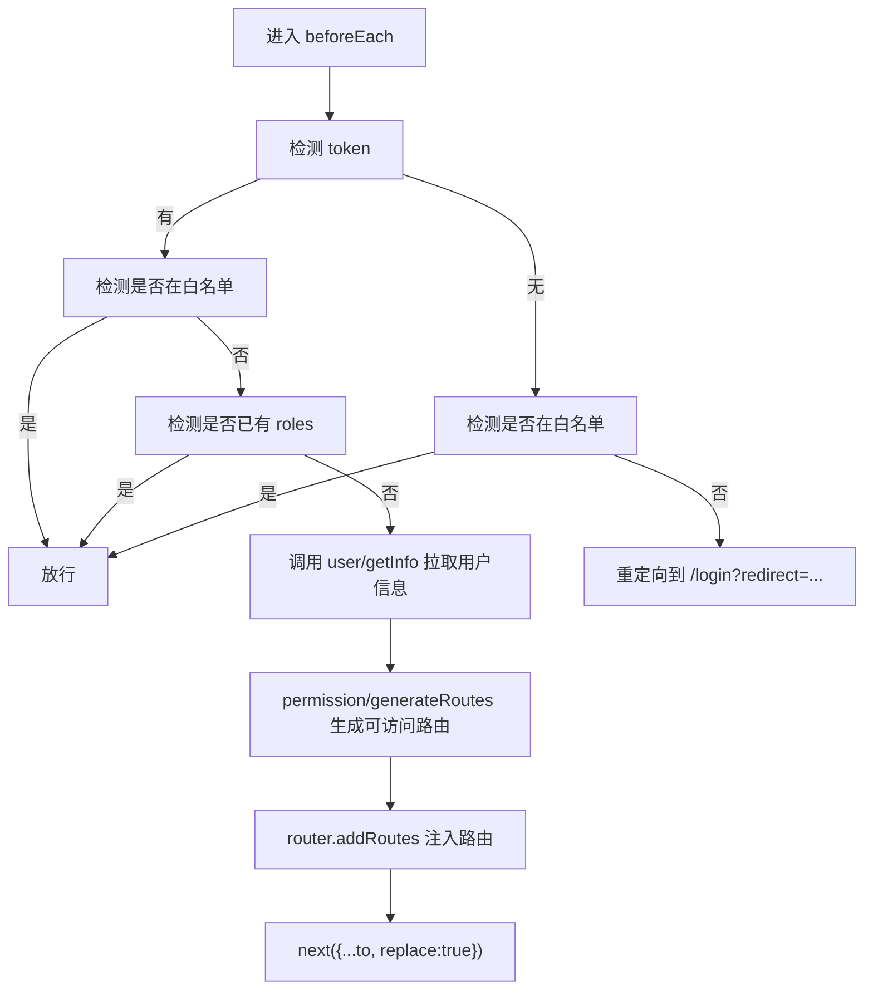
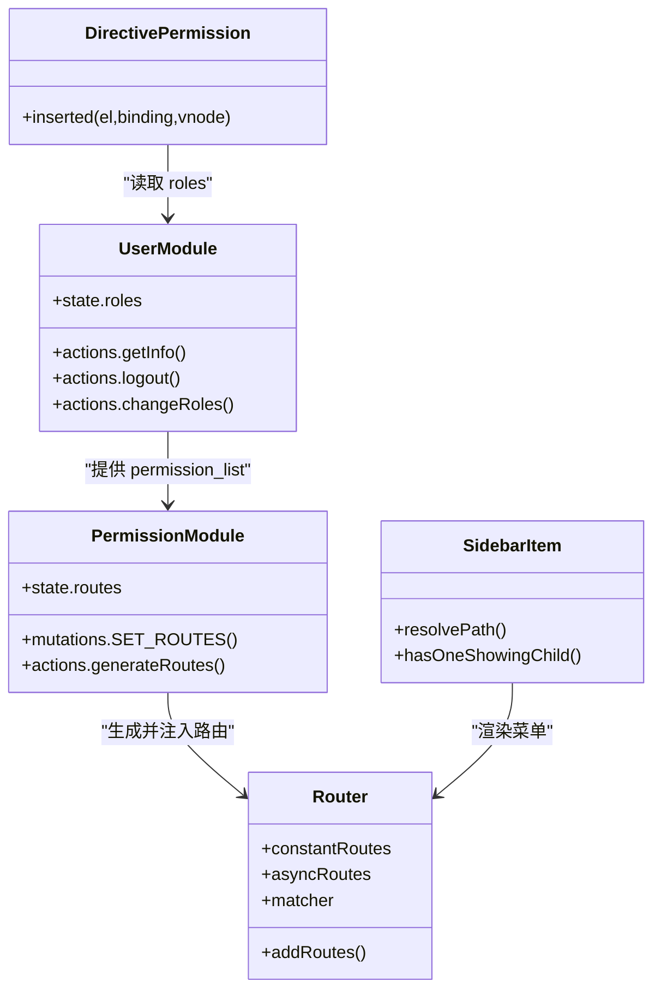
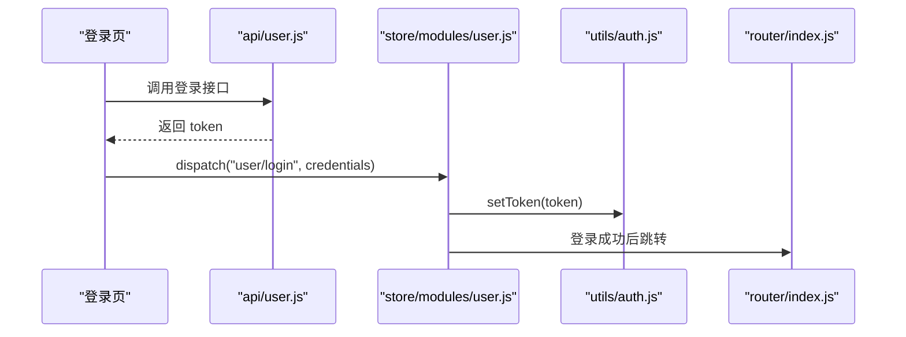
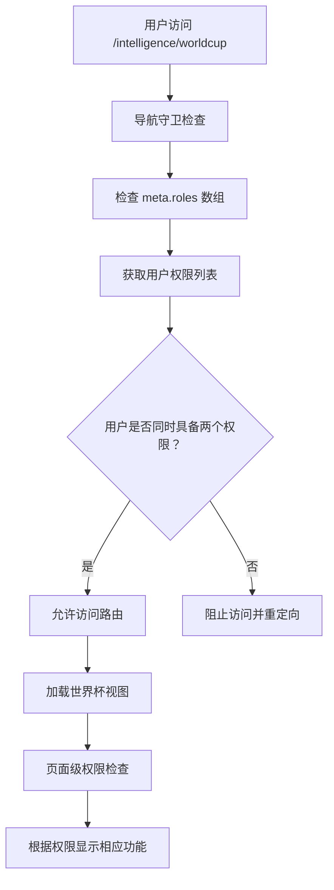
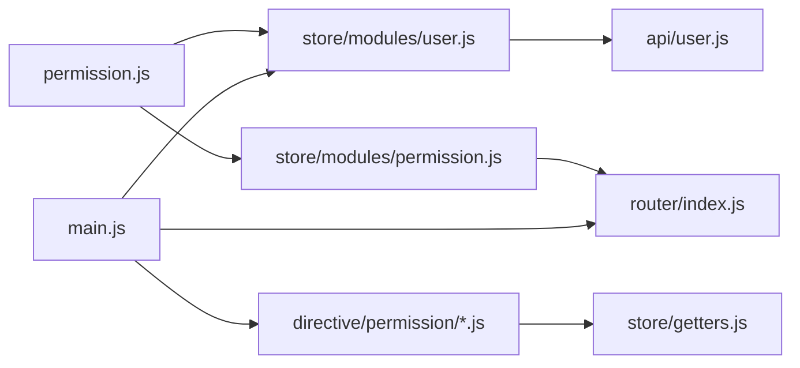

# 路由与权限

<cite>
**本文引用的文件**
- [src/router/index.js](file://src/router/index.js)
- [src/store/modules/permission.js](file://src/store/modules/permission.js)
- [src/permission.js](file://src/permission.js)
- [src/store/modules/user.js](file://src/store/modules/user.js)
- [src/utils/auth.js](file://src/utils/auth.js)
- [src/utils/permission.js](file://src/utils/permission.js)
- [src/directive/permission/permission.js](file://src/directive/permission/permission.js)
- [src/directive/permission/index.js](file://src/directive/permission/index.js)
- [src/main.js](file://src/main.js)
- [src/layout/components/Sidebar/SidebarItem.vue](file://src/layout/components/Sidebar/SidebarItem.vue)
- [src/views/login/index.vue](file://src/views/login/index.vue)
- [src/api/user.js](file://src/api/user.js)
- [src/store/getters.js](file://src/store/getters.js)
- [src/router/children/intelligence.js](file://src/router/children/intelligence.js)
- [src/views/active/worldcup.vue](file://src/views/active/worldcup.vue)
- [src/api/active.js](file://src/api/active.js)
- [mock/role/routes.js](file://mock/role/routes.js)
- [mock/user.js](file://mock/user.js)
</cite>

## 目录
1. [简介](#简介)
2. [项目结构](#项目结构)
3. [核心组件](#核心组件)
4. [架构总览](#架构总览)
5. [详细组件分析](#详细组件分析)
6. [依赖关系分析](#依赖关系分析)
7. [性能考量](#性能考量)
8. [故障排查指南](#故障排查指南)
9. [结论](#结论)
10. [附录](#附录)

## 简介
本文件面向 Leisu Admin 项目的前端工程，系统性梳理并说明基于 Vue Router 的动态路由与权限控制体系。内容涵盖：
- 动态路由配置与权限路由生成
- 导航守卫（全局前置、路由独享、组件内）的实现与使用场景
- 权限控制模型（RBAC）与多级权限（菜单、按钮）
- 自定义指令（v-permission、v-has）与按钮权限过滤
- 认证流程（登录、token 管理、路由守卫联动）
- 权限数据获取与更新（权限树、菜单动态加载、权限缓存）
- 最佳实践与安全注意事项

## 项目结构
围绕“路由与权限”的关键目录与文件如下：
- 路由定义与动态路由：src/router/index.js、src/router/children/intelligence.js
- 权限状态管理：src/store/modules/permission.js
- 全局导航守卫：src/permission.js
- 用户与权限数据：src/store/modules/user.js、src/store/getters.js
- 认证与 token：src/utils/auth.js
- 权限指令：src/directive/permission/*
- 主入口与全局指令注册：src/main.js
- 登录视图与 API：src/views/login/index.vue、src/api/user.js
- 世界杯视图与 API：src/views/active/worldcup.vue、src/api/active.js
- Mock 数据（演示 RBAC 与动态路由）：mock/role/routes.js、mock/user.js

图表来源
- [src/main.js:1-526](file://src/main.js#L1-L526)
- [src/router/index.js:1-177](file://src/router/index.js#L1-L177)
- [src/store/modules/permission.js:1-66](file://src/store/modules/permission.js#L1-L66)
- [src/permission.js:1-82](file://src/permission.js#L1-L82)
- [src/store/modules/user.js:1-542](file://src/store/modules/user.js#L1-L542)
- [src/utils/auth.js:1-17](file://src/utils/auth.js#L1-L17)
- [src/directive/permission/permission.js:1-23](file://src/directive/permission/permission.js#L1-L23)
- [src/views/login/index.vue:1-263](file://src/views/login/index.vue#L1-L263)
- [src/api/user.js:1-37](file://src/api/user.js#L1-L37)
- [src/layout/components/Sidebar/SidebarItem.vue:1-206](file://src/layout/components/Sidebar/SidebarItem.vue#L1-L206)
- [src/router/children/intelligence.js:1-194](file://src/router/children/intelligence.js#L1-L194)
- [src/views/active/worldcup.vue:1-180](file://src/views/active/worldcup.vue#L1-L180)
- [src/api/active.js:1-259](file://src/api/active.js#L1-L259)

章节来源
- [src/main.js:1-526](file://src/main.js#L1-L526)
- [src/router/index.js:1-177](file://src/router/index.js#L1-L177)

## 核心组件
- 路由系统
  - constantRoutes：常量路由（登录、404、401、重定向等）
  - asyncRoutes：异步路由（按模块划分的业务路由集合）
  - resetRouter：重置路由匹配器，用于登出后恢复初始路由
- 权限模块
  - hasPermission：判断当前用户是否具备访问某路由的权限
  - filterAsyncRoutes：递归过滤异步路由，生成可访问路由集
  - generateRoutes：对外暴露的动作，返回 Promise，生成并提交到 store
- 导航守卫
  - beforeEach：鉴权主流程，处理 token、白名单、角色拉取、动态注入路由
  - afterEach：进度条收尾
- 用户模块
  - getInfo：拉取用户信息，合并报表权限，动态注入"日志页面"子路由
  - logout/resetToken：登出与 token 清理，重置路由与标签页
  - changeRoles：动态切换角色并重建路由
- 权限指令
  - v-permission：在 DOM 层面按权限隐藏元素
  - v-has：在 DOM 层面按权限隐藏元素（全局注册）
- 认证工具
  - token 存储于 localStorage，键名统一管理

章节来源
- [src/router/index.js:31-177](file://src/router/index.js#L31-L177)
- [src/store/modules/permission.js:8-66](file://src/store/modules/permission.js#L8-L66)
- [src/permission.js:13-82](file://src/permission.js#L13-L82)
- [src/store/modules/user.js:173-392](file://src/store/modules/user.js#L173-L392)
- [src/utils/auth.js:5-16](file://src/utils/auth.js#L5-L16)
- [src/directive/permission/permission.js:3-22](file://src/directive/permission/permission.js#L3-L22)
- [src/main.js:492-497](file://src/main.js#L492-L497)

## 架构总览
下图展示从用户访问到路由注入、权限校验与界面渲染的整体流程。

图表来源
- [src/permission.js:13-82](file://src/permission.js#L13-L82)
- [src/store/modules/user.js:173-392](file://src/store/modules/user.js#L173-L392)
- [src/store/modules/permission.js:50-57](file://src/store/modules/permission.js#L50-L57)
- [src/router/index.js:171-176](file://src/router/index.js#L171-L176)

## 详细组件分析

### 动态路由与权限路由生成
- 路由拆分
  - constantRoutes：固定不变的页面（登录、404、401、重定向）
  - asyncRoutes：业务模块路由（仪表盘、用户、社区、媒体、专家、预测、聊天室、推送、比赛、资讯、支付、游戏中心、App 设置、系统、运维工具、内容安全等），通过模块化组织
- 权限过滤
  - hasPermission：若路由 meta.roles 存在，则要求用户 roles 中至少包含其一；否则默认放行
  - filterAsyncRoutes：递归遍历 asyncRoutes，保留满足权限的节点及其子树
  - generateRoutes：将过滤结果提交到 store，拼接 constantRoutes 形成最终可用路由表
- 路由重置
  - resetRouter：重建路由实例并替换 matcher，用于登出后恢复初始状态

图表来源
- [src/store/modules/permission.js:21-35](file://src/store/modules/permission.js#L21-L35)
- [src/router/index.js:31-160](file://src/router/index.js#L31-L160)

章节来源
- [src/store/modules/permission.js:8-66](file://src/store/modules/permission.js#L8-L66)
- [src/router/index.js:74-160](file://src/router/index.js#L74-L160)

### 导航守卫实现
- 白名单：登录页与授权回调页无需登录即可访问
- 已登录逻辑
  - 若目标路由为登录页，重定向至首页
  - 若已存在 roles，则直接放行
  - 否则调用用户模块 getInfo 拉取权限，生成可访问路由并 addRoutes 注入，最后以 replace: true 避免历史记录
- 未登录逻辑
  - 若在白名单内直接放行
  - 否则重定向至登录页，并携带 redirect 参数
- 进度条：beforeEach 开始，afterEach 结束

图表来源
- [src/permission.js:13-82](file://src/permission.js#L13-L82)

章节来源
- [src/permission.js:13-82](file://src/permission.js#L13-L82)

### 权限控制模型（RBAC）
- 角色与权限
  - 用户信息中包含 permission_list（权限码数组），作为权限判定依据
  - 部分报表权限会根据具体权限码自动补齐（例如媒体报表、专家报表、社区流水等）
- 菜单权限
  - 侧边栏菜单项由 asyncRoutes 生成，hasPermission 控制显示
  - SidebarItem.vue 通过 hasPermission 与 meta.roles 控制菜单项可见性
- 按钮权限
  - v-permission 指令：在 DOM 层按权限隐藏/显示
  - v-has 指令：全局注册，按权限隐藏元素
  - 页面级按钮权限：通过全局过滤器 hasPwer 或 store.getters.roles 判断

图表来源
- [src/store/modules/user.js:173-392](file://src/store/modules/user.js#L173-L392)
- [src/store/modules/permission.js:37-66](file://src/store/modules/permission.js#L37-L66)
- [src/router/index.js:31-177](file://src/router/index.js#L31-L177)
- [src/directive/permission/permission.js:3-22](file://src/directive/permission/permission.js#L3-L22)
- [src/layout/components/Sidebar/SidebarItem.vue:124-147](file://src/layout/components/Sidebar/SidebarItem.vue#L124-L147)

章节来源
- [src/store/modules/user.js:173-392](file://src/store/modules/user.js#L173-L392)
- [src/layout/components/Sidebar/SidebarItem.vue:124-147](file://src/layout/components/Sidebar/SidebarItem.vue#L124-L147)
- [src/directive/permission/permission.js:3-22](file://src/directive/permission/permission.js#L3-L22)
- [src/main.js:492-497](file://src/main.js#L492-L497)

### 权限指令系统
- v-permission
  - 指令内部读取 store.getters.roles，与绑定值（权限码数组）做交集判断
  - 无权限则移除对应 DOM 节点
- v-has
  - 全局注册，按权限码 arg 隐藏元素
- 使用建议
  - 指令绑定值应为字符串数组，避免运行时报错
  - 与菜单权限配合，确保界面元素与路由一致

章节来源
- [src/directive/permission/permission.js:3-22](file://src/directive/permission/permission.js#L3-L22)
- [src/directive/permission/index.js:1-14](file://src/directive/permission/index.js#L1-L14)
- [src/main.js:492-497](file://src/main.js#L492-L497)

### 认证流程与 token 管理
- 登录
  - 登录页发起登录请求，成功后写入 token 至 localStorage
  - 登录成功后跳转首页或原目标页
- token 管理
  - getToken/setToken/removeToken 统一封装，键名为 aToken
- 自动续期
  - 当前实现未见自动续期逻辑；可在拦截器或守卫中扩展
- 退出登录
  - 清空 token、重置路由、清空标签页、清除用户信息

图表来源
- [src/views/login/index.vue:103-120](file://src/views/login/index.vue#L103-L120)
- [src/api/user.js:3-16](file://src/api/user.js#L3-L16)
- [src/store/modules/user.js:141-155](file://src/store/modules/user.js#L141-L155)
- [src/utils/auth.js:9-11](file://src/utils/auth.js#L9-L11)
- [src/router/index.js:171-176](file://src/router/index.js#L171-L176)

章节来源
- [src/views/login/index.vue:103-120](file://src/views/login/index.vue#L103-L120)
- [src/api/user.js:3-16](file://src/api/user.js#L3-L16)
- [src/store/modules/user.js:141-155](file://src/store/modules/user.js#L141-L155)
- [src/utils/auth.js:5-16](file://src/utils/auth.js#L5-L16)

### 权限数据获取与更新
- 拉取用户信息
  - getInfo：校验 roles 与 permission_list，动态注入"日志页面"子路由
  - 合并报表权限：当具备特定报表权限时，自动补齐通用报表权限
- 动态注入日志页面
  - 若用户具备日志页面权限，则向 asyncRoutes 中追加"日志页面"路由树
- 缓存策略
  - 将部分数据写入 localStorage（如分类目录、情报标签、产品列表、渠道数据等），减少重复请求
- 动态切换角色
  - changeRoles：重置 token、拉取新角色、重置路由并重新注入

章节来源
- [src/store/modules/user.js:173-392](file://src/store/modules/user.js#L173-L392)

### 菜单渲染与权限联动
- 侧边栏菜单
  - SidebarItem.vue 递归渲染菜单，支持多级嵌套
  - hasOneShowingChild 与 resolvePath 控制显示与路径解析
  - 通过 hasPermission 与 meta.roles 控制菜单项可见性
- 与路由的关系
  - 菜单项与路由一一对应，权限一致，避免出现"能访问但菜单不可见"的情况

章节来源
- [src/layout/components/Sidebar/SidebarItem.vue:124-161](file://src/layout/components/Sidebar/SidebarItem.vue#L124-L161)
- [src/store/modules/permission.js:8-14](file://src/store/modules/permission.js#L8-L14)

### 世界杯路由权限配置示例
- 路由元信息配置
  - 在资讯模块路由中新增世界杯路由：`/intelligence/worldcup`
  - 路由元信息包含权限角色数组：`roles: ["worldcup_heroic_spectrum", "worldcup_farewell_list"]`
  - 该配置确保只有同时具备"英雄谱"和"告别榜"权限的用户才能访问此路由
- 权限角色详解
  - `worldcup_heroic_spectrum`：访问英雄谱功能的权限
  - `worldcup_farewell_list`：访问告别榜功能的权限
  - 两个权限均需具备才能完整访问世界杯页面
- 页面权限控制
  - 世界杯视图组件中使用 `hasPwer()` 方法进行页面级权限检查
  - 根据用户权限动态生成标签页和按钮显示
  - 编辑按钮权限：`worldcup_heroic_spectrum_save` 和 `worldcup_farewell_list_save`

图表来源
- [src/router/children/intelligence.js:150-155](file://src/router/children/intelligence.js#L150-L155)
- [src/views/active/worldcup.vue:67-78](file://src/views/active/worldcup.vue#L67-L78)

章节来源
- [src/router/children/intelligence.js:150-155](file://src/router/children/intelligence.js#L150-L155)
- [src/views/active/worldcup.vue:67-78](file://src/views/active/worldcup.vue#L67-L78)
- [src/api/active.js:230-259](file://src/api/active.js#L230-L259)

### Mock 数据与 RBAC 演示
- mock/role/routes.js
  - 定义了常量与异步路由，其中异步路由包含 meta.roles 字段，用于演示基于角色的页面权限
- mock/user.js
  - 提供登录与用户信息接口，返回不同角色与 token，便于本地联调

章节来源
- [mock/role/routes.js:75-127](file://mock/role/routes.js#L75-L127)
- [mock/user.js:26-84](file://mock/user.js#L26-L84)

## 依赖关系分析
- 模块耦合
  - permission.js 依赖 store.getters、store.dispatch、router 实例
  - store/modules/permission.js 依赖 asyncRoutes 与 constantRoutes
  - store/modules/user.js 依赖 api/user.js 与 router.resetRouter
  - directive/permission/* 依赖 store.getters.roles
- 外部依赖
  - Element UI（进度条、消息提示、菜单组件）
  - js-cookie（Cookie 读取）
  - NProgress（进度条）

图表来源
- [src/permission.js:1-82](file://src/permission.js#L1-L82)
- [src/store/modules/permission.js:1-66](file://src/store/modules/permission.js#L1-L66)
- [src/store/modules/user.js:1-542](file://src/store/modules/user.js#L1-L542)
- [src/directive/permission/permission.js:1-23](file://src/directive/permission/permission.js#L1-L23)
- [src/main.js:1-526](file://src/main.js#L1-L526)

章节来源
- [src/permission.js:1-82](file://src/permission.js#L1-L82)
- [src/store/modules/permission.js:1-66](file://src/store/modules/permission.js#L1-L66)
- [src/store/modules/user.js:1-542](file://src/store/modules/user.js#L1-L542)
- [src/directive/permission/permission.js:1-23](file://src/directive/permission/permission.js#L1-L23)
- [src/main.js:1-526](file://src/main.js#L1-L526)

## 性能考量
- 路由注入时机
  - 仅在首次获取用户信息后注入一次，避免重复 addRoutes
- 递归过滤复杂度
  - filterAsyncRoutes 为 O(N) 遍历，N 为路由节点总数；建议控制路由层级深度与节点数量
- 进度条与首屏
  - beforeEach 启动进度条，afterEach 结束，避免阻塞导航
- 缓存策略
  - 将常用数据写入 localStorage，减少重复请求，提升二次进入速度

## 故障排查指南
- 登录后仍被重定向到登录页
  - 检查 token 是否正确写入 localStorage
  - 确认 getInfo 是否成功返回 roles 与 permission_list
- 路由无法注入或刷新后丢失
  - 确认 resetRouter 是否在登出时调用
  - 确认 generateRoutes 是否返回了可访问路由
- 菜单不显示或按钮不可见
  - 检查 meta.roles 与 permission_list 是否一致
  - 检查 v-permission/v-has 绑定值是否为数组
- 401/404 页面未正确显示
  - 检查 constantRoutes 中 401/404 路由是否存在
  - 检查导航守卫中的白名单与重定向逻辑
- 世界杯页面权限问题
  - 确认用户是否同时具备 `worldcup_heroic_spectrum` 和 `worldcup_farewell_list` 两个权限
  - 检查路由元信息中的 roles 配置是否正确
  - 验证页面级权限检查逻辑是否正常执行

章节来源
- [src/permission.js:13-82](file://src/permission.js#L13-L82)
- [src/store/modules/user.js:173-392](file://src/store/modules/user.js#L173-L392)
- [src/store/modules/permission.js:8-66](file://src/store/modules/permission.js#L8-L66)
- [src/router/index.js:31-177](file://src/router/index.js#L31-L177)
- [src/router/children/intelligence.js:150-155](file://src/router/children/intelligence.js#L150-L155)
- [src/views/active/worldcup.vue:67-78](file://src/views/active/worldcup.vue#L67-L78)

## 结论
Leisu Admin 的路由与权限体系以 Vue Router 为基础，结合 Vuex 实现动态路由注入与权限过滤，辅以全局导航守卫完成鉴权闭环。通过 v-permission 与 v-has 指令实现菜单与按钮级别的细粒度控制。整体设计清晰、职责分离明确，具备良好的扩展性与维护性。

**更新** 新增世界杯路由权限配置示例，展示了如何在路由元信息中定义角色权限，包括：
- 路由元信息中的 roles 数组配置
- 多权限角色的组合使用
- 页面级权限检查与动态功能展示
- 世界杯相关 API 接口的权限控制

建议在现有基础上补充 token 自动续期、权限审计与更细粒度的按钮权限枚举，进一步提升安全性与可观测性。

## 附录
- 最佳实践
  - 权限粒度：尽量以"功能点"为最小权限单元，避免"超级权限"
  - 权限继承：通过角色聚合与权限补全，减少重复配置
  - 权限审计：记录用户登录、路由访问、按钮点击等行为
  - 安全加固：token 存储与传输加密、接口幂等与二次确认、敏感操作双因子
- 可选增强
  - 自动续期：在请求拦截器中检测过期并刷新
  - 权限树：将 permission_list 转换为树形结构，便于菜单渲染与权限计算
  - 按钮权限枚举：集中管理按钮权限码，统一校验与提示