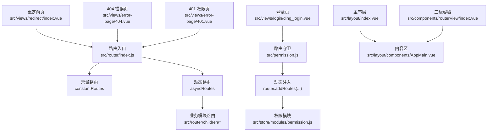
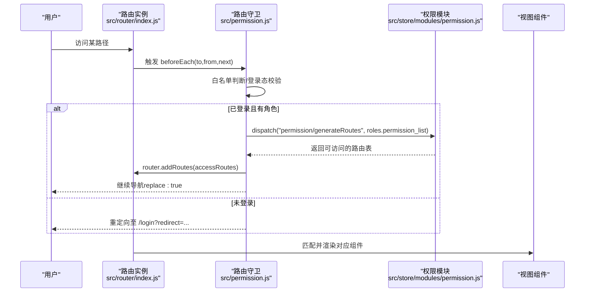
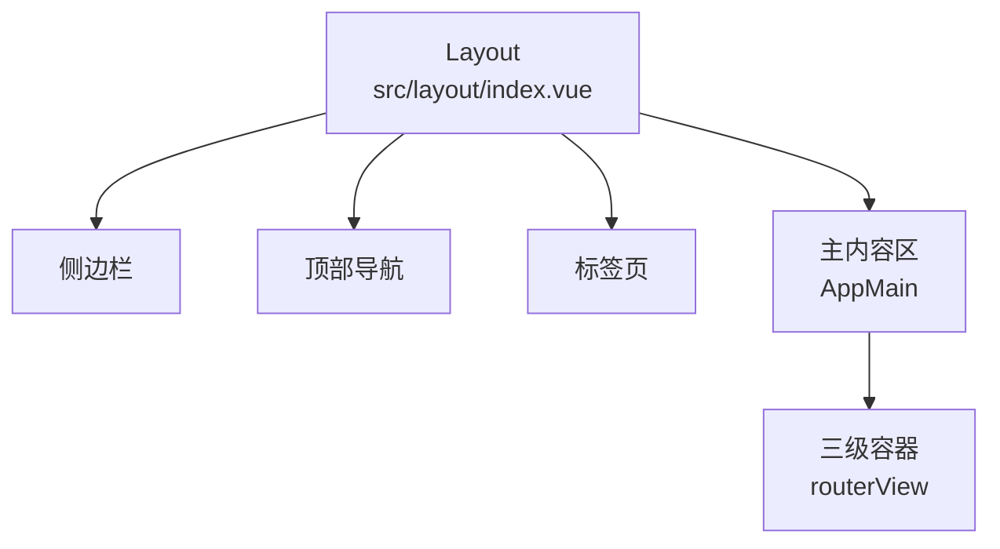
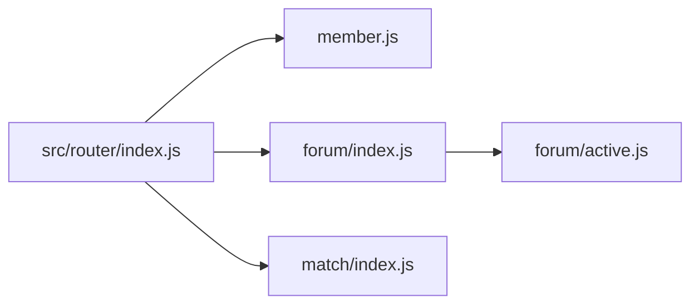
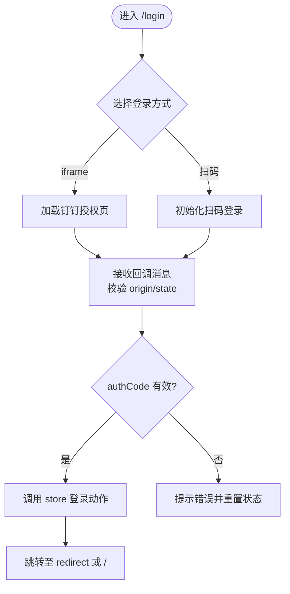
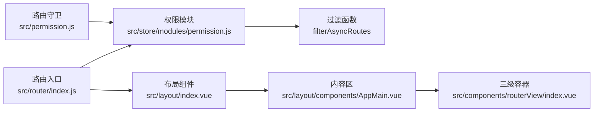

# 路由系统设计

<cite>
**本文档引用的文件**
- [src/router/index.js](file://src/router/index.js)
- [src/permission.js](file://src/permission.js)
- [src/store/modules/permission.js](file://src/store/modules/permission.js)
- [src/layout/index.vue](file://src/layout/index.vue)
- [src/layout/components/AppMain.vue](file://src/layout/components/AppMain.vue)
- [src/components/routerView/index.vue](file://src/components/routerView/index.vue)
- [src/views/error-page/404.vue](file://src/views/error-page/404.vue)
- [src/views/error-page/401.vue](file://src/views/error-page/401.vue)
- [src/views/login/ding_login.vue](file://src/views/login/ding_login.vue)
- [src/views/redirect/index.vue](file://src/views/redirect/index.vue)
- [src/router/children/member.js](file://src/router/children/member.js)
- [src/router/children/forum/index.js](file://src/router/children/forum/index.js)
- [src/router/children/forum/active.js](file://src/router/children/forum/active.js)
- [src/router/children/match/index.js](file://src/router/children/match/index.js)
</cite>

## 目录
1. [引言](#引言)
2. [项目结构](#项目结构)
3. [核心组件](#核心组件)
4. [架构总览](#架构总览)
5. [详细组件分析](#详细组件分析)
6. [依赖关系分析](#依赖关系分析)
7. [性能考量](#性能考量)
8. [故障排查指南](#故障排查指南)
9. [结论](#结论)
10. [附录](#附录)

## 引言
本设计文档围绕 Leisu Admin 的前端路由体系展开，系统性解析基于 Vue Router 的路由架构，重点覆盖静态路由 constantRoutes 与动态路由 asyncRoutes 的设计理念与实现方式；详解路由配置结构（path、component、meta 等）；阐述 Layout 布局系统（主框架、嵌套路由、routerView 使用）；说明路由模块化组织与导入机制；并给出重定向、错误页、登录页等特殊路由配置；最后总结懒加载与性能优化策略及最佳实践。

## 项目结构
路由系统主要分布在以下位置：
- 路由入口与常量/动态路由定义：src/router/index.js
- 路由守卫与白名单控制：src/permission.js
- 动态路由过滤与注入：src/store/modules/permission.js
- 主布局与内容渲染：src/layout/index.vue、src/layout/components/AppMain.vue
- 三级嵌套容器：src/components/routerView/index.vue
- 特殊页面：登录、重定向、404、401
- 模块化路由：src/router/children 下按业务域划分

图表来源
- [src/router/index.js:1-177](file://src/router/index.js#L1-L177)
- [src/permission.js:1-82](file://src/permission.js#L1-L82)
- [src/store/modules/permission.js:1-66](file://src/store/modules/permission.js#L1-L66)
- [src/layout/index.vue:1-124](file://src/layout/index.vue#L1-L124)
- [src/layout/components/AppMain.vue:1-122](file://src/layout/components/AppMain.vue#L1-L122)
- [src/components/routerView/index.vue:1-13](file://src/components/routerView/index.vue#L1-L13)
- [src/views/login/ding_login.vue:1-389](file://src/views/login/ding_login.vue#L1-L389)
- [src/views/redirect/index.vue:1-13](file://src/views/redirect/index.vue#L1-L13)
- [src/views/error-page/404.vue:1-229](file://src/views/error-page/404.vue#L1-L229)
- [src/views/error-page/401.vue:1-100](file://src/views/error-page/401.vue#L1-L100)

章节来源
- [src/router/index.js:1-177](file://src/router/index.js#L1-L177)
- [src/permission.js:1-82](file://src/permission.js#L1-L82)
- [src/store/modules/permission.js:1-66](file://src/store/modules/permission.js#L1-L66)

## 核心组件
- 路由入口与配置
  - constantRoutes：登录、重定向、404、401 等不受权限控制的基础路由
  - asyncRoutes：按角色动态加载的业务路由集合
  - createRouter/resetRouter：统一创建与重置路由实例，支持运行时更新
- 路由守卫
  - beforeEach：鉴权、白名单放行、动态注入、进度条与页面标题设置
  - afterEach：结束进度条
- 权限模块
  - filterAsyncRoutes：递归过滤异步路由，依据 meta.roles 与用户角色匹配
  - generateRoutes：对外暴露的动作，返回可注入的路由表
- 布局系统
  - Layout：侧边栏、顶部导航、标签页、右侧设置面板容器
  - AppMain：内容区，结合 keep-alive 缓存与路由 key 控制切换
  - routerView：三级嵌套路由容器，承载深层子路由
- 特殊路由
  - 重定向：/redirect/:path*
  - 登录：/login（钉钉登录）、/auth-redirect
  - 错误页：/404、/401

章节来源
- [src/router/index.js:31-177](file://src/router/index.js#L31-L177)
- [src/permission.js:13-82](file://src/permission.js#L13-L82)
- [src/store/modules/permission.js:8-66](file://src/store/modules/permission.js#L8-L66)
- [src/layout/index.vue:1-124](file://src/layout/index.vue#L1-L124)
- [src/layout/components/AppMain.vue:1-122](file://src/layout/components/AppMain.vue#L1-L122)
- [src/components/routerView/index.vue:1-13](file://src/components/routerView/index.vue#L1-L13)

## 架构总览
下图展示从用户访问到页面渲染的关键流程，以及权限控制与动态路由注入的交互：

图表来源
- [src/router/index.js:162-177](file://src/router/index.js#L162-L177)
- [src/permission.js:13-82](file://src/permission.js#L13-L82)
- [src/store/modules/permission.js:49-58](file://src/store/modules/permission.js#L49-L58)

## 详细组件分析

### 路由配置结构与设计理念
- 路径与组件
  - path：采用层级化路径，如 /member/list、/forum/list、/match/football 等，便于菜单与面包屑映射
  - component：使用函数式懒加载，配合 webpackChunkName 注释实现分包与命名
- 元信息 meta
  - title：页面标题与菜单文案
  - icon：菜单图标
  - roles：权限标识数组，用于动态过滤
  - hidden/affix/noCache/iframe/name 等：控制显示、固定标签、缓存策略、iframe 嵌入等
- 重定向与默认页
  - redirect：根路径重定向至 /sitemaps 或具体业务页
  - *：兜底 404
- 布局与嵌套
  - Layout 作为父级容器，children 定义二级路由
  - routerView 作为三级容器，承载深层子路由

章节来源
- [src/router/index.js:31-160](file://src/router/index.js#L31-L160)
- [src/router/children/member.js:3-165](file://src/router/children/member.js#L3-L165)
- [src/router/children/forum/index.js:4-230](file://src/router/children/forum/index.js#L4-L230)
- [src/router/children/match/index.js:25-277](file://src/router/children/match/index.js#L25-L277)

### Layout 布局系统
- 主框架
  - 侧边栏、顶部导航、标签页、右侧设置面板组合
  - 响应式与移动端适配
- 内容区
  - AppMain 结合 keep-alive 缓存已访问视图，通过 key 与 cachedViews 控制切换
  - 支持 iframe 场景（特定 name 的外部链接）
- 三级嵌套
  - routerView 作为深层子路由容器，配合 matched.splice 控制三级标签缓存

图表来源
- [src/layout/index.vue:18-78](file://src/layout/index.vue#L18-L78)
- [src/layout/components/AppMain.vue:19-71](file://src/layout/components/AppMain.vue#L19-L71)
- [src/components/routerView/index.vue:1-13](file://src/components/routerView/index.vue#L1-L13)

章节来源
- [src/layout/index.vue:1-124](file://src/layout/index.vue#L1-L124)
- [src/layout/components/AppMain.vue:1-122](file://src/layout/components/AppMain.vue#L1-L122)
- [src/components/routerView/index.vue:1-13](file://src/components/routerView/index.vue#L1-L13)

### 路由模块化设计
- 按业务域拆分
  - member、forum、media、expert、predictor、chat_room、push、match、intelligence、pay、game、app_set、system、ops_tools、contentSecurity 等
- 导入与聚合
  - src/router/index.js 中集中导入各模块路由，并在 asyncRoutes 中以变量形式挂载
- 嵌套路由组织
  - forum/index.js 内部再细分 active 等子模块，使用 routerView 承载深层子路由

图表来源
- [src/router/index.js:11-30](file://src/router/index.js#L11-L30)
- [src/router/children/member.js:131-165](file://src/router/children/member.js#L131-L165)
- [src/router/children/forum/index.js:165-230](file://src/router/children/forum/index.js#L165-L230)
- [src/router/children/match/index.js:80-277](file://src/router/children/match/index.js#L80-L277)
- [src/router/children/forum/active.js:60-70](file://src/router/children/forum/active.js#L60-L70)

章节来源
- [src/router/index.js:11-130](file://src/router/index.js#L11-L130)
- [src/router/children/forum/index.js:1-230](file://src/router/children/forum/index.js#L1-L230)
- [src/router/children/forum/active.js:1-70](file://src/router/children/forum/active.js#L1-L70)

### 特殊路由与页面
- 登录页
  - /login 采用钉钉登录组件，支持 iframe 与扫码两种方式，含 state 防 CSRF、回调校验、超时处理
- 重定向页
  - /redirect/:path* 将路径拼接后跳转，避免刷新丢失参数
- 错误页
  - /404、/401 分别渲染自定义错误页组件，401 提供返回逻辑

图表来源
- [src/views/login/ding_login.vue:135-278](file://src/views/login/ding_login.vue#L135-L278)
- [src/views/redirect/index.vue:2-12](file://src/views/redirect/index.vue#L2-L12)
- [src/views/error-page/404.vue:1-33](file://src/views/error-page/404.vue#L1-L33)
- [src/views/error-page/401.vue:37-58](file://src/views/error-page/401.vue#L37-L58)

章节来源
- [src/views/login/ding_login.vue:1-389](file://src/views/login/ding_login.vue#L1-L389)
- [src/views/redirect/index.vue:1-13](file://src/views/redirect/index.vue#L1-L13)
- [src/views/error-page/404.vue:1-229](file://src/views/error-page/404.vue#L1-L229)
- [src/views/error-page/401.vue:1-100](file://src/views/error-page/401.vue#L1-L100)

### 路由懒加载与性能优化
- 懒加载
  - 所有页面组件均使用函数式 import 实现按需加载
  - 配合 webpackChunkName 注释，实现稳定 chunk 命名与分包
- 缓存策略
  - AppMain 使用 keep-alive 缓存已访问视图，减少重复渲染
  - 三级标签页场景通过 matched.splice 控制缓存范围，避免深层标签影响性能
- 路由注入
  - 仅注入用户具备权限的路由，降低初始包体积与渲染压力
- 进度条与标题
  - beforeEach 中设置页面标题与进度条，提升用户体验

章节来源
- [src/permission.js:13-82](file://src/permission.js#L13-L82)
- [src/layout/components/AppMain.vue:4-8](file://src/layout/components/AppMain.vue#L4-L8)
- [src/router/index.js:62-67](file://src/router/index.js#L62-L67)

## 依赖关系分析
- 路由入口依赖各业务模块路由文件
- 路由守卫依赖权限模块与用户信息
- 权限模块依赖路由表进行过滤
- 布局组件依赖 store 状态与 mixins

图表来源
- [src/router/index.js:11-30](file://src/router/index.js#L11-L30)
- [src/store/modules/permission.js:21-35](file://src/store/modules/permission.js#L21-L35)
- [src/permission.js:13-82](file://src/permission.js#L13-L82)
- [src/layout/index.vue:18-34](file://src/layout/index.vue#L18-L34)
- [src/layout/components/AppMain.vue:19-41](file://src/layout/components/AppMain.vue#L19-L41)
- [src/components/routerView/index.vue:1-13](file://src/components/routerView/index.vue#L1-L13)

章节来源
- [src/router/index.js:1-177](file://src/router/index.js#L1-L177)
- [src/store/modules/permission.js:1-66](file://src/store/modules/permission.js#L1-L66)
- [src/permission.js:1-82](file://src/permission.js#L1-L82)

## 性能考量
- 代码分割：通过懒加载与命名分包，显著降低首屏体积
- 路由缓存：keep-alive 与 tagsView 缓存策略减少重复渲染
- 动态注入：仅加载用户所需路由，避免冗余
- 进度条与标题：提升导航体验，避免长时间无反馈
- 三级标签缓存控制：在深层嵌套时限制缓存范围，避免内存占用过高

## 故障排查指南
- 登录失败或状态异常
  - 检查钉钉回调 origin 与 state 校验是否通过
  - 确认 authCode 是否存在与 store 登录动作是否抛错
- 权限不足或页面空白
  - 确认用户角色是否包含 meta.roles
  - 检查 generateRoutes 是否正确注入
- 404/401 页面
  - 确认路径拼写与命名
  - 检查 redirect 逻辑与白名单
- 三级标签缓存异常
  - 确认 matched.splice 逻辑与 routerView 使用

章节来源
- [src/views/login/ding_login.vue:164-210](file://src/views/login/ding_login.vue#L164-L210)
- [src/permission.js:38-61](file://src/permission.js#L38-L61)
- [src/store/modules/permission.js:49-58](file://src/store/modules/permission.js#L49-L58)
- [src/views/error-page/404.vue:1-33](file://src/views/error-page/404.vue#L1-L33)
- [src/views/error-page/401.vue:37-58](file://src/views/error-page/401.vue#L37-L58)

## 结论
Leisu Admin 的路由系统以 Vue Router 为核心，采用“常量路由 + 动态路由”的双轨设计，结合权限模块与路由守卫实现细粒度的访问控制。Layout 布局与 AppMain 的缓存策略保证了良好的用户体验与性能表现。模块化路由组织清晰，便于扩展与维护。建议在新增路由时遵循 meta 规范与懒加载约定，并关注三级嵌套场景下的缓存与性能平衡。

## 附录
- 最佳实践
  - 路由命名与路径层级保持一致，便于菜单与面包屑映射
  - meta.roles 与菜单权限保持同步，避免出现“有路由无菜单”或“有菜单无权限”
  - 使用 webpackChunkName 为重要页面命名，便于调试与监控
  - 严格区分 constantRoutes 与 asyncRoutes，避免将受控路由放入常量表
  - 在深层嵌套路由中谨慎使用 keep-alive，必要时通过 matched.splice 控制缓存范围
- 常见问题
  - 路由无法显示：检查 meta.roles 与用户角色匹配
  - 登录后仍被重定向：确认白名单与登录页路径
  - 404 页面不生效：检查通配符路由与重定向逻辑