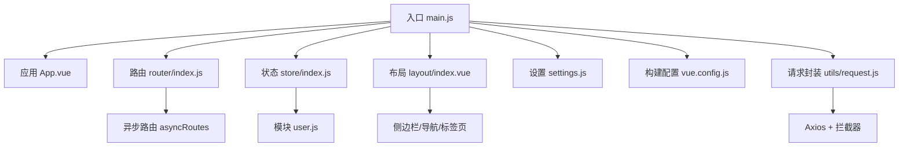
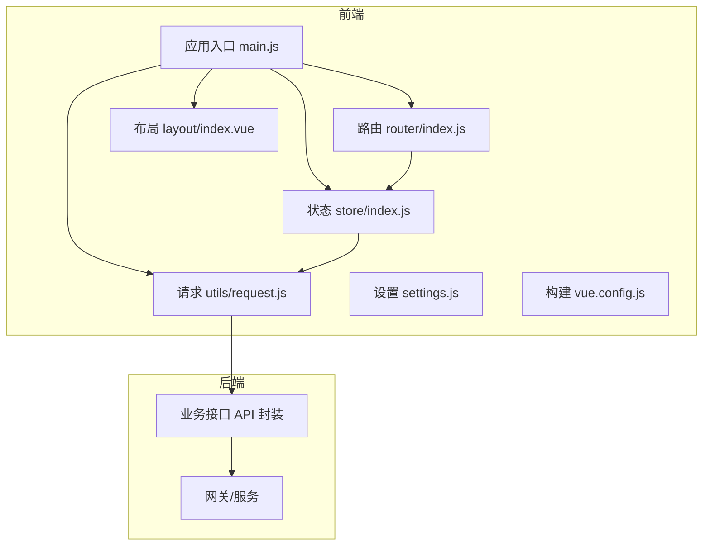
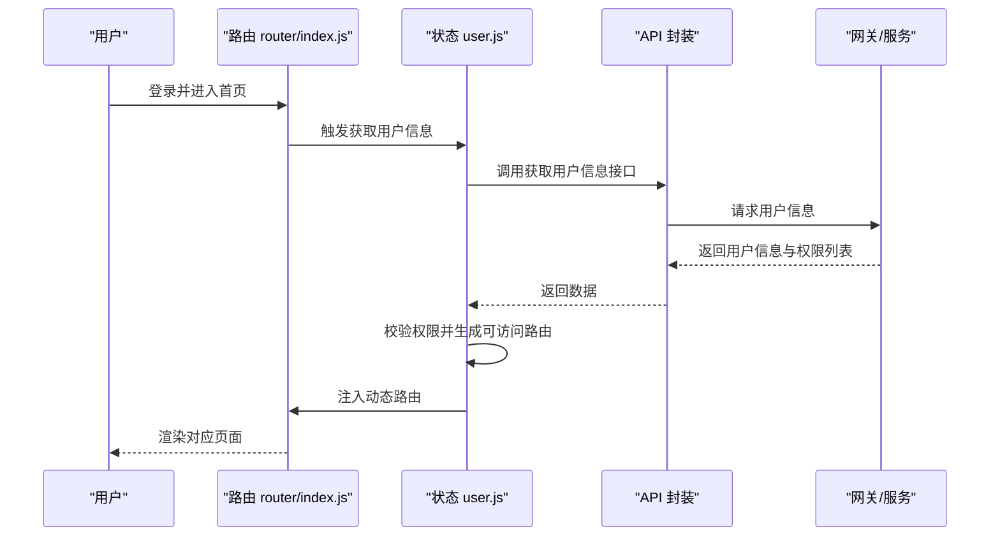
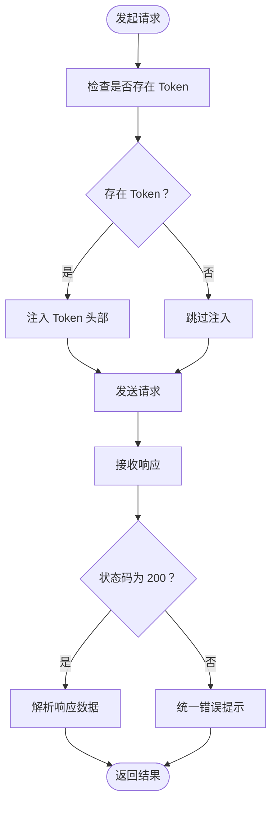
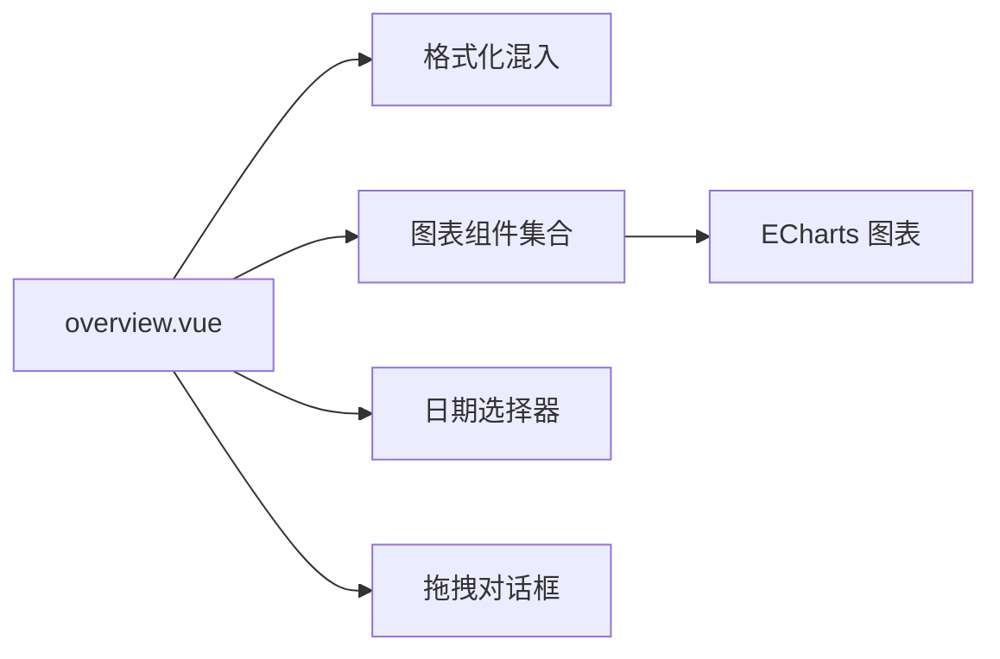
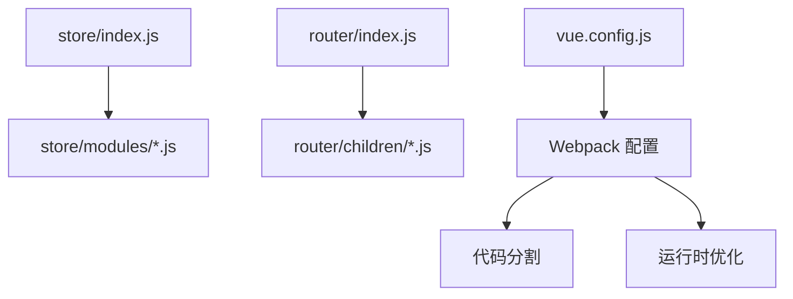

# 项目概述

<cite>
**本文引用的文件**
- [README.md](file://README.md)
- [package.json](file://package.json)
- [src/main.js](file://src/main.js)
- [src/App.vue](file://src/App.vue)
- [src/router/index.js](file://src/router/index.js)
- [src/store/index.js](file://src/store/index.js)
- [src/store/modules/user.js](file://src/store/modules/user.js)
- [src/settings.js](file://src/settings.js)
- [vue.config.js](file://vue.config.js)
- [src/layout/index.vue](file://src/layout/index.vue)
- [src/utils/request.js](file://src/utils/request.js)
- [src/views/dashboard/overview.vue](file://src/views/dashboard/overview.vue)
</cite>

## 目录
1. [引言](#引言)
2. [项目结构](#项目结构)
3. [核心组件](#核心组件)
4. [架构总览](#架构总览)
5. [详细组件分析](#详细组件分析)
6. [依赖关系分析](#依赖关系分析)
7. [性能考量](#性能考量)
8. [故障排查指南](#故障排查指南)
9. [结论](#结论)
10. [附录](#附录)

## 引言
Leisu Admin 是一个基于 Vue.js 的企业级体育赛事内容管理后台系统，面向体育内容运营、数据分析与多业务模块协同管理。项目以“后台前端解决方案”为核心定位，采用现代化前端技术栈，结合 Element UI 组件体系与 ECharts 图表能力，提供权限控制、动态路由、主题切换、全局错误日志、Mock 数据、富文本与可视化报表等丰富能力，适用于体育平台的综合管理后台建设。

- 项目背景与定位
  - 面向体育内容管理领域，覆盖用户、社区、媒体、专家、预测、支付、推送、运维工具、内容安全等多个业务域。
  - 支持多体育项目（足球、篮球、网球、羽毛球、棒球、排球、台球、冰球、橄榄球、英雄联盟、DOTA2、CS:GO 等），并提供实时数据展示与可视化分析。
  - 通过模块化与组件化设计，满足企业级后台对可扩展性、可维护性与可复用性的要求。

- 核心目标
  - 快速搭建企业级中后台产品原型，降低开发成本。
  - 提供统一的权限体系与动态路由，保障后台安全与灵活配置。
  - 以数据驱动的可视化仪表盘，支撑业务决策与运营监控。

- 主要功能特性
  - 权限验证：页面权限、指令权限、角色权限配置与二次登录。
  - 多环境发布：dev/sit/stage/prod 环境配置与构建。
  - 全局功能：国际化（v4.1.0+ 默认 master 不支持）、动态换肤、动态侧边栏、动态面包屑、快捷导航（标签页）、SVG 图标精灵、本地/后端 Mock 数据、全屏、自适应收缩侧边栏。
  - 编辑器：富文本、Markdown、JSON 等多格式编辑。
  - Excel：导入/导出、前端可视化、导出 zip。
  - 表格：动态表格、拖拽表格、内联编辑。
  - 错误页面：401/404。
  - 组件：头像上传、返回顶部、拖拽对话框、拖拽选择、拖拽看板、列表拖拽、SplitPane、Dropzone、Sticky、CountTo 等。
  - 综合实例：错误日志、Dashboard、引导页、ECharts 图表、剪贴板、Markdown2html。

- 技术价值
  - 前后端分离：通过 Axios 封装的请求拦截器与响应拦截器，统一处理鉴权、错误提示与跨域。
  - 组件化开发：大量通用组件与业务组件封装，提升复用性与一致性。
  - 模块化设计：Vuex 模块自动加载、路由按需引入、构建期代码分割优化。
  - 可视化与实时：ECharts 图表、MQTT 实时消息集成、CDN 资源前缀统一处理。

**章节来源**
- [README.md:29-121](file://README.md#L29-L121)

## 项目结构
项目采用“功能域 + 层次化”的组织方式，核心目录与职责如下：
- build：构建相关脚本与配置（由 Vue CLI 管理）。
- mock：本地 Mock 数据与服务端模拟。
- public：公共资源与静态资源（含动画样式、插件、图标等）。
- src：
  - api：各业务模块的接口封装（matchapi、ball、game、community、media、member、pay、predictor、push、robot、spider、system、user 等）。
  - assets：静态资源（图片、字体、样式等）。
  - components：通用组件与 Leisu 扩展组件（图表、上传、搜索、弹窗等）。
  - config：全局配置（如全局变量）。
  - directive：自定义指令（剪贴板、拖拽、高亮、权限指令等）。
  - filters：全局过滤器。
  - icons：SVG 图标与加载器。
  - layout：布局容器与侧边栏、导航、标签页等。
  - mixins：混入（格式化、图表数据格式化等）。
  - router：路由定义与动态路由注入（常量路由 + 异步路由）。
  - store：状态管理（模块化自动加载）。
  - styles：全局样式与主题变量。
  - utils：工具库（字典、OSS、MQTT、权限、请求、事件总线等）。
  - views：业务视图（dashboard、match、media、member、pay、predictor、chat_room、contentSecurity、intelligence、ops_tools 等）。
- 测试：单元测试（Jest）。
- 配置文件：package.json、vue.config.js、babel.config.js、postcss.config.js、tsconfig.json 等。

**图示来源**
- [src/main.js:1-526](file://src/main.js#L1-L526)
- [src/App.vue:1-18](file://src/App.vue#L1-L18)
- [src/router/index.js:1-177](file://src/router/index.js#L1-L177)
- [src/store/index.js:1-26](file://src/store/index.js#L1-L26)
- [src/layout/index.vue:1-124](file://src/layout/index.vue#L1-L124)
- [src/settings.js:1-36](file://src/settings.js#L1-L36)
- [vue.config.js:1-155](file://vue.config.js#L1-L155)
- [src/utils/request.js:1-130](file://src/utils/request.js#L1-L130)

**章节来源**
- [src/main.js:1-526](file://src/main.js#L1-L526)
- [src/router/index.js:1-177](file://src/router/index.js#L1-L177)
- [src/store/index.js:1-26](file://src/store/index.js#L1-L26)
- [vue.config.js:1-155](file://vue.config.js#L1-L155)

## 核心组件
- 应用入口与全局初始化
  - main.js 中完成 Element UI 注册、全局样式与图标引入、权限控制、错误日志、组件注册、全局过滤器、MQTT 与事件总线等初始化工作，并挂载根实例。
- 应用容器与布局
  - App.vue 作为顶层容器，绑定路由视图与全局加载状态。
  - layout/index.vue 提供侧边栏、导航栏、标签页、右侧设置面板等布局骨架。
- 路由与权限
  - router/index.js 定义常量路由与异步路由，支持动态注入与重置；配合权限模块实现菜单与页面级权限控制。
  - store/modules/user.js 管理用户信息、角色与权限列表，动态生成可访问路由并注入到路由系统。
- 请求与拦截
  - utils/request.js 基于 Axios，按环境区分 BaseURL，统一注入 token、错误提示与异常处理。
- 设置与构建
  - settings.js 控制标题、标签页、固定头部、侧边栏 Logo、错误日志开关等。
  - vue.config.js 配置别名、SVG 加载器、代码分割策略、运行时优化与外链依赖等。

**章节来源**
- [src/main.js:1-526](file://src/main.js#L1-L526)
- [src/App.vue:1-18](file://src/App.vue#L1-L18)
- [src/layout/index.vue:1-124](file://src/layout/index.vue#L1-L124)
- [src/router/index.js:1-177](file://src/router/index.js#L1-L177)
- [src/store/modules/user.js:1-542](file://src/store/modules/user.js#L1-L542)
- [src/utils/request.js:1-130](file://src/utils/request.js#L1-L130)
- [src/settings.js:1-36](file://src/settings.js#L1-L36)
- [vue.config.js:1-155](file://vue.config.js#L1-L155)

## 架构总览
系统采用“前端单页应用 + 后端网关/服务”的前后端分离架构。前端通过 Vue 生态与 Element UI 提供交互层，通过 Axios 与后端通信，借助 Vuex 管理全局状态，Vue Router 实现页面级路由与权限控制。构建阶段通过 Webpack 进行模块打包、代码分割与运行时优化。

**图示来源**
- [src/main.js:1-526](file://src/main.js#L1-L526)
- [src/router/index.js:1-177](file://src/router/index.js#L1-L177)
- [src/store/index.js:1-26](file://src/store/index.js#L1-L26)
- [src/layout/index.vue:1-124](file://src/layout/index.vue#L1-L124)
- [src/utils/request.js:1-130](file://src/utils/request.js#L1-L130)
- [src/settings.js:1-36](file://src/settings.js#L1-L36)
- [vue.config.js:1-155](file://vue.config.js#L1-L155)

## 详细组件分析

### 权限与路由控制流程
系统通过“用户信息 + 角色权限 + 动态路由”的组合实现细粒度的权限控制。用户登录后拉取权限列表，动态生成可访问路由并注入到路由系统，未授权页面跳转至 401/404。

**图示来源**
- [src/router/index.js:1-177](file://src/router/index.js#L1-L177)
- [src/store/modules/user.js:1-542](file://src/store/modules/user.js#L1-L542)
- [src/utils/request.js:1-130](file://src/utils/request.js#L1-L130)

**章节来源**
- [src/router/index.js:1-177](file://src/router/index.js#L1-L177)
- [src/store/modules/user.js:1-542](file://src/store/modules/user.js#L1-L542)

### 请求拦截与错误处理
请求封装基于 Axios，支持按环境切换 BaseURL、自动注入 token、统一错误提示与异常处理，确保前后端交互的一致性与可维护性。

**图示来源**
- [src/utils/request.js:1-130](file://src/utils/request.js#L1-L130)

**章节来源**
- [src/utils/request.js:1-130](file://src/utils/request.js#L1-L130)

### 仪表盘与可视化
仪表盘 overview.vue 展示多维度指标与图表，通过混入与组件化实现数据聚合与可视化渲染，支持时间范围选择、图表放大与多图表联动。

**图示来源**
- [src/views/dashboard/overview.vue:1-331](file://src/views/dashboard/overview.vue#L1-L331)

**章节来源**
- [src/views/dashboard/overview.vue:1-331](file://src/views/dashboard/overview.vue#L1-L331)

### 技术栈概览与应用场景
- 技术栈
  - 前端框架：Vue 2.6.10、Vue Router 3、Vuex 3
  - UI 组件库：Element UI 2.7.0
  - 图表：ECharts 5.6.0
  - 编辑器：wangEditor 5.x
  - 工具库：Axios、CryptoJS、js-cookie、pako、moment-like 时间处理、MQTT、v-viewer、xlsx、exceljs 等
  - 构建：Vue CLI 3、Webpack、SVG Sprite Loader、代码分割与运行时优化
- 适用场景
  - 体育内容管理后台：覆盖赛事、媒体、专家、预测、社区、支付、推送、运维工具、内容安全等模块。
  - 数据可视化与运营监控：仪表盘、趋势图、分布图、留存分析等。
  - 多体育项目支持：通过 matchapi 与 game 模块覆盖主流球类与电竞项目。
- 目标用户群体
  - 运营人员：内容审核、活动管理、数据监控。
  - 管理员：用户管理、权限配置、系统配置。
  - 技术团队：接口对接、日志追踪、性能优化。
- 业务价值
  - 提升运营效率：统一后台、可视化报表、自动化工具。
  - 强化安全与合规：权限控制、审计日志、敏感词检测。
  - 降低开发成本：组件复用、模块化设计、动态路由与权限解耦。

**章节来源**
- [package.json:1-139](file://package.json#L1-L139)
- [README.md:29-121](file://README.md#L29-L121)

## 依赖关系分析
- 模块化加载
  - store/index.js 通过 require.context 自动加载 modules 目录下的所有模块，减少手动引入。
- 路由模块化
  - router/index.js 将各业务模块路由拆分为 children 目录，便于维护与扩展。
- 构建期优化
  - vue.config.js 配置 SVG Sprite Loader、代码分割策略、运行时优化与外链依赖，提升首屏性能与可维护性。

**图示来源**
- [src/store/index.js:1-26](file://src/store/index.js#L1-L26)
- [src/router/index.js:1-177](file://src/router/index.js#L1-L177)
- [vue.config.js:1-155](file://vue.config.js#L1-L155)

**章节来源**
- [src/store/index.js:1-26](file://src/store/index.js#L1-L26)
- [src/router/index.js:1-177](file://src/router/index.js#L1-L177)
- [vue.config.js:1-155](file://vue.config.js#L1-L155)

## 性能考量
- 代码分割与懒加载
  - 通过 Webpack 的 splitChunks 与路由懒加载，减少初始包体积，提升首屏加载速度。
- 运行时优化
  - 生产环境启用运行时优化与 Source Map 控制，平衡调试与性能。
- 图片与资源
  - 统一 CDN 前缀与资源路径处理，减少跨域与资源加载问题。
- 请求层面
  - Axios 超时控制与错误提示，避免长时间阻塞与无响应。

[本节为通用性能讨论，无需特定文件引用]

## 故障排查指南
- 登录与权限
  - 若出现 401 未授权或跳转登录，检查 token 注入与用户信息拉取流程。
  - 若路由无法访问，确认权限列表是否包含对应路由元信息。
- 请求异常
  - 若接口报错，查看响应拦截器中的状态码与错误提示，核对 BaseURL 与环境变量。
- 构建与部署
  - 若构建失败或资源加载异常，检查 vue.config.js 中的 publicPath、externals 与别名配置。
- 图表与可视化
  - 若图表不显示或数据异常，检查 ECharts 初始化与数据格式化混入。

**章节来源**
- [src/utils/request.js:1-130](file://src/utils/request.js#L1-L130)
- [src/store/modules/user.js:1-542](file://src/store/modules/user.js#L1-L542)
- [vue.config.js:1-155](file://vue.config.js#L1-L155)

## 结论
Leisu Admin 以 Vue 生态为核心，结合 Element UI 与 ECharts，构建了面向体育内容管理的完整后台解决方案。其模块化与组件化设计、动态路由与权限控制、可视化仪表盘与多体育项目支持，使其既能满足初学者快速上手，也能为有经验的开发者提供足够的扩展空间与工程化实践参考。通过统一的请求封装、布局与设置体系，项目在可维护性、可扩展性与用户体验方面均具备良好表现。

[本节为总结性内容，无需特定文件引用]

## 附录
- 开发与构建
  - 安装依赖：npm install
  - 启动服务：npm run dev
  - 构建测试：npm run build:dev
  - 构建生产：npm run build:prod
- 浏览器支持
  - 现代浏览器与 IE10+（部分依赖可能需要 polyfill）

**章节来源**
- [README.md:123-153](file://README.md#L123-L153)