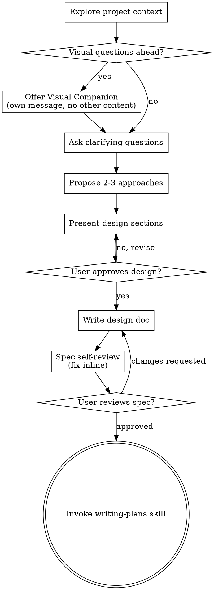

# 将创意脑暴为设计方案

通过自然的协作对话，将想法转化为完整的设计和规格说明。

先理解当前项目上下文，然后逐个提问来完善想法。一旦明确了要构建什么，呈现设计并获取用户批准。

<HARD-GATE>
在呈现设计并获得用户批准之前，不得调用任何实现技能、编写任何代码、搭建任何项目，或采取任何实现操作。这适用于每个项目，无论看起来多么简单。
</HARD-GATE>

## 反模式："这个太简单了，不需要设计"

每个项目都要经过这个过程。待办列表、单功能工具、配置变更——全都一样。"简单"项目正是未经检验的假设造成最多返工的地方。设计方案可以很短（真正简单的项目几句话就行），但**必须**呈现并获取批准。

## 检查清单

你必须为每一项创建任务并按顺序完成：

1. **探索项目上下文** — 检查文件、文档、最近的提交
2. **提供可视化伴侣**（如果主题涉及视觉问题）— 单独一条消息，不与澄清问题合并。见下方可视化伴侣章节。
3. **提问澄清问题** — 逐个提问，理解目的/约束/成功标准
4. **提出 2-3 种方案** — 附带权衡分析和你的推荐
5. **呈现设计** — 按复杂度分章节呈现，每章节获得用户批准
6. **编写设计文档** — 保存到 `docs/superpowers/specs/YYYY-MM-DD-<topic>-design.md` 并提交
7. **规格自查** — 快速内联检查占位符、矛盾、歧义和范围（见下方）
8. **用户审阅书面规格** — 请用户审阅规格文件后再继续
9. **过渡到实现** — 调用 writing-plans 技能创建实现计划

## 流程

**终端状态是调用 writing-plans。** 不要调用 frontend-design、mcp-builder 或任何其他实现技能。brainstorming 之后唯一调用的技能是 writing-plans。

## 流程详解

**理解想法：**

- 先查看当前项目状态（文件、文档、最近的提交）
- 在问细节问题之前，评估范围：如果需求描述包含多个独立的子系统（例如"构建一个包含聊天、文件存储、计费和分析的平台"），立即标记。不要把问题浪费在细化一个需要先拆分的项目细节上。
- 如果项目太大无法放在一个规格文档中，帮助用户拆分为子项目：哪些是独立的部分，它们之间如何关联，构建顺序是什么？然后按正常设计流程脑暴第一个子项目。每个子项目有自己的规格 → 计划 → 实现循环。
- 对于范围合适的项目，逐个提问来完善想法
- 尽可能用选择题，开放式问题也可以
- 每条消息只问一个问题——如果某个话题需要更多探索，拆分成多个问题
- 重点理解：目的、约束、成功标准

**探索方案：**

- 提出 2-3 种不同的方案，附带权衡分析
- 用对话方式呈现选项，附上你的推荐和理由
- 先推荐你的首选方案并解释原因

**呈现设计：**

- 一旦你确信理解了要构建什么，呈现设计
- 每个章节的篇幅与其复杂度对应：简单的几句话，复杂的 200-300 字
- 每个章节后询问"这样对吗？"
- 覆盖：架构、组件、数据流、错误处理、测试
- 准备好回溯和澄清不合理的地方

**为隔离性和清晰度设计：**

- 将系统分解为更小的单元，每个有明确的职责，通过定义良好的接口通信，可以独立理解和测试
- 对每个单元，你应该能回答：它做什么、怎么使用、依赖什么
- 别人能不看内部实现就理解一个单元做什么吗？你能在不影响调用者的情况下修改内部实现吗？不能则边界需要重新设计。
- 更小、边界清晰的单元也更容易让你工作——你能更好地推理能同时放在上下文中的代码，文件聚焦时你的编辑也更可靠。文件变大往往是职责过多的信号。

**在现有代码库中工作：**

- 在提议改动前探索现有结构。遵循已有模式。
- 当现有代码存在影响工作的问题时（例如文件过大、边界不清、职责交织），将有针对性的改进纳入设计——就好像优秀开发者在工作中改进代码一样。
- 不要提议不相关的重构。聚焦于服务当前目标的事情。

## 设计之后

**文档：**

- 将验证过的设计（规格）写入 `docs/superpowers/specs/YYYY-MM-DD-<topic>-design.md`
  - （用户对规格位置的偏好覆盖此默认值）
- 如果可用，使用 elements-of-style:writing-clearly-and-concisely 技能
- 将设计文档提交到 git

**规格自查：**
写完规格文档后，用全新的眼光审视：

1. **占位符扫描：** 有没有"TBD"、"TODO"、未完成的章节或模糊的需求？修复它们。
2. **内部一致性：** 各章节之间有无矛盾？架构是否匹配功能描述？
3. **范围检查：** 这个规格是否聚焦到可以做一个实现计划，还是需要进一步拆分？
4. **歧义检查：** 有没有任何需求有两种不同解读方式？如果有，选择一个并明确说明。

内联修复问题。不需要重新审阅——修复即可继续。

**用户审阅关卡：**
自查循环通过后，请用户审阅书面规格：

> "规格已编写并提交到 `<path>`。请审阅，如有修改请告知，我们再开始写实现计划。"

等待用户回复。如果用户要求修改，修改后重新运行自查循环。只有在用户批准后才继续。

**实现：**

- 调用 writing-plans 技能创建详细的实现计划
- 不要调用任何其他技能。writing-plans 是下一步。

## 关键原则

- **一次一个问题** — 不要用多个问题让人不知所措
- **优先选择题** — 比开放式问题更容易回答
- **严格执行 YAGNI** — 从所有设计中移除不必要的功能
- **探索备选方案** — 在确定之前总是提出 2-3 种方案
- **渐进验证** — 呈现设计，获得批准后再继续
- **保持灵活** — 当不合理时回溯和澄清

## 可视化伴侣

一个基于浏览器的伴侣工具，用于在脑暴过程中展示模拟图、图表和视觉选项。作为一个工具提供，不是一种模式。接受伴侣意味着它对需要视觉处理的问题可用；这并不意味着每个问题都要通过浏览器。

**提供伴侣：** 当你预见到即将提出的问题会涉及视觉内容（模拟图、布局、图表）时，提供一次获取同意：
> "我们正在做的一些事情如果我能通过浏览器展示给你看，可能会更容易解释。我可以在过程中制作模拟图、图表、对比和其他可视化内容。这个功能还比较新，并且可能会消耗大量 tokens。想试试吗？（需要打开本地 URL）"

**这条提供消息必须是单独的消息。** 不要将其与澄清问题、上下文总结或任何其他内容合并。消息中只包含上面的提供文本。等待用户回复后再继续。如果用户拒绝，用纯文本方式进行脑暴。

**每个问题单独决定：** 即使接受了，每个问题也要判断是用浏览器还是终端。判断标准：**用户通过看到它比读到它理解得更好吗？**

- **使用浏览器：** 用于本身就是视觉的内容——模拟图、线框图、布局对比、架构图、视觉设计对比
- **使用终端：** 用于文本内容——需求问题、概念选择、权衡列表、A/B/C/D 文本选项、范围决策

关于 UI 主题的问题不自动等于视觉问题。"在这个上下文中 personality 是什么意思？"是概念问题——用终端。"哪个向导布局更好？"是视觉问题——用浏览器。

如果用户同意使用伴侣，在继续之前阅读详细指南：
`skills/brainstorming/visual-companion.md`