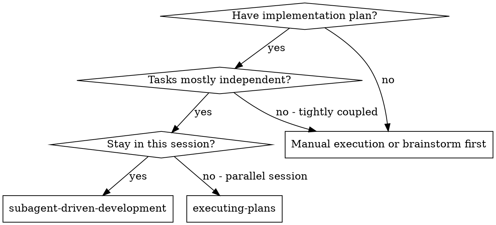
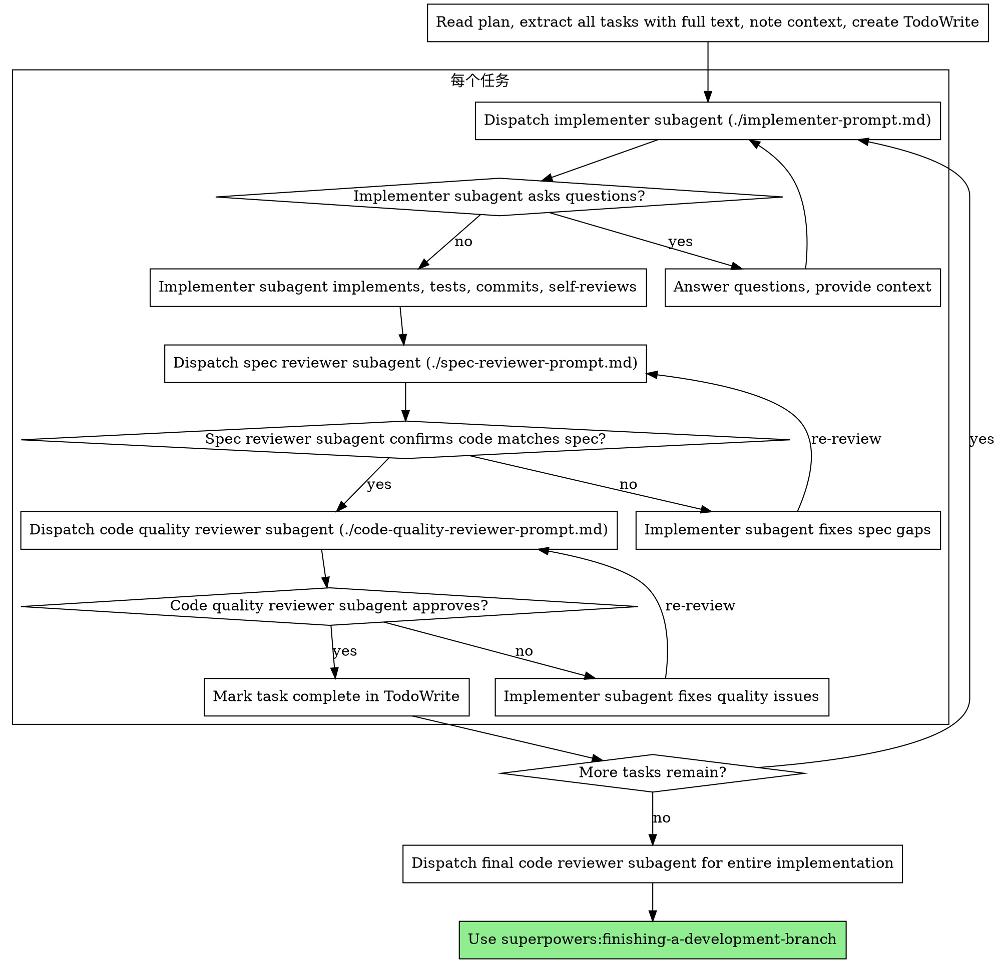

# 子代理驱动开发

通过每个任务派发一个全新子代理来执行计划，每个任务后进行两阶段审阅：先规格合规审阅，再代码质量审阅。

**为什么用子代理：** 你将任务委托给具有隔离上下文的专门代理。通过精确构造它们的指令和上下文，确保它们保持专注并成功完成任务。它们永远不应继承你会话的上下文或历史记录——你精确构造它们需要的内容。这也为你自己的协调工作保留了上下文。

**核心原则：** 每个任务一个全新子代理 + 两阶段审阅（规格质量） = 高质量、快速迭代

**持续执行：** 不要在任务之间暂停与你的用户伙伴确认。不间断地执行计划中的所有任务。唯一应该停止的原因是：你无法解决的 BLOCKED 状态、真正妨碍进展的歧义，或所有任务完成。"我该继续吗"的提示和进度总结浪费他们的时间——他们要求你执行计划，那就执行。

## 何时使用



**vs. 执行计划（并行会话）：**
- 同一会话（无上下文切换）
- 每个任务全新子代理（无上下文污染）
- 每个任务后两阶段审阅：先规格合规，再代码质量
- 更快的迭代（任务间不需要人工确认）

## 流程



## 模型选择

使用能胜任每个角色的最轻量模型，以节省成本和提高速度。

**机械性的实现任务**（隔离的函数、清晰的规格、1-2 个文件）：使用快速、廉价的模型。当计划充分指定时，大多数实现任务是机械性的。

**集成和判断任务**（多文件协调、模式匹配、调试）：使用标准模型。

**架构、设计和审阅任务**：使用可用的最强模型。

**任务复杂度信号：**
- 触碰 1-2 个文件，规格完整 → 廉价模型
- 触碰多个文件，有关联问题 → 标准模型
- 需要设计判断或广泛的代码库理解 → 最强模型

## 处理实现者状态

实现子代理报告四种状态之一。妥善处理每种：

**DONE:** 进入规格合规审阅。

**DONE_WITH_CONCERNS:** 实现者完成了工作但标记了疑虑。在继续之前阅读疑虑。如果疑虑涉及正确性或范围，在审阅之前处理。如果只是观察（例如"这个文件变大了"），记下来然后进入审阅。

**NEEDS_CONTEXT:** 实现者需要未提供的信息。提供缺失的上下文后重新派发。

**BLOCKED:** 实现者无法完成任务。评估阻塞原因：
1. 如果是上下文问题，提供更多上下文后用相同模型重新派发
2. 如果任务需要更多推理，用更强模型重新派发
3. 如果任务太大，拆分成更小的部分
4. 如果计划本身错了，升级给人类处理

**永远**不要忽略升级或强制相同模型不加改变地重试。如果实现者说卡住了，一定需要改变什么。

## 提示模板

- `./implementer-prompt.md` — 派发实现子代理
- `./spec-reviewer-prompt.md` — 派发规格合规审阅子代理
- `./code-quality-reviewer-prompt.md` — 派发代码质量审阅子代理

## 示例工作流程

```
你：我将使用子代理驱动开发来执行这个计划。

[读取计划文件一次：docs/superpowers/plans/feature-plan.md]
[提取所有 5 个任务的完整文本和上下文]
[创建包含所有任务的 TodoWrite]

任务 1：Hook 安装脚本

[获取任务 1 的文本和上下文（已提取）]
[用完整任务文本 + 上下文派发实现子代理]

实现者："开始之前——hook 应该安装在用户级还是系统级？"

你："用户级（~/.config/superpowers/hooks/）"

实现者："收到。正在实现……"
[稍后] 实现者：
  - 实现了 install-hook 命令
  - 添加了测试，5/5 通过
  - 自审：发现我漏掉了 --force 参数，已添加
  - 已提交

[派发规格合规审阅]
规格审阅者：✅ 规格合规 - 所有需求已满足，没有多余内容

[获取 git SHA，派发代码质量审阅]
代码审阅者：优点：测试覆盖好，代码干净。问题：无。已批准。

[标记任务 1 完成]

任务 2：恢复模式

[获取任务 2 的文本和上下文（已提取）]
[用完整任务文本 + 上下文派发实现子代理]

实现者：[没有问题，直接开始]
实现者：
  - 添加了验证/修复模式
  - 8/8 测试通过
  - 自审：一切正常
  - 已提交

[派发规格合规审阅]
规格审阅者：❌ 问题：
  - 缺少：进度报告（规格要求"每 100 条报告一次"）
  - 多余：添加了 --json 参数（未要求）

[实现者修复问题]
实现者：删除了 --json 参数，添加了进度报告

[规格审阅者重新审阅]
规格审阅者：✅ 现在规格合规

[派发代码质量审阅]
代码审阅者：优点：扎实。问题（重要）：魔数（100）

[实现者修复]
实现者：提取了 PROGRESS_INTERVAL 常量

[代码审阅者重新审阅]
代码审阅者：✅ 已批准

[标记任务 2 完成]

...

[所有任务完成后]
[派发最终代码审阅]
最终审阅者：所有需求已满足，可以合并

完成！
```

## 优势

**vs. 手动执行：**
- 子代理自然遵循 TDD
- 每个任务新上下文（无混淆）
- 并行安全（子代理不互相干扰）
- 子代理可以问问题（工作之前和之中）

**vs. 执行计划：**
- 同一会话（无需交接）
- 持续进展（无需等待）
- 审阅检查点自动化

**效率提升：**
- 无文件读取开销（控制器提供完整文本）
- 控制器精确策划需要什么上下文
- 子代理一开始就获得完整信息
- 问题在工作开始前就提出（而不是之后）

**质量关卡：**
- 自审在交接前发现问题
- 两阶段审阅：规格合规，然后代码质量
- 审阅循环确保修复真正有效
- 规格合规防止过度或不足构建
- 代码质量确保实现构建良好

**成本：**
- 更多子代理调用（每个任务一个实现者 + 2 个审阅者）
- 控制器做更多准备工作（提前提取所有任务）
- 审阅循环增加迭代次数
- 但在早期发现问题（比之后调试便宜）

## 红灯信号

**永远不要：**
- 未经用户明确同意在 main/master 分支上开始实现
- 跳过审阅（规格合规**或**代码质量）
- 在问题未修复时继续
- 并行派发多个实现子代理（冲突）
- 让子代理读取计划文件（改为提供完整文本）
- 跳过场景设置上下文（子代理需要理解任务所处位置）
- 忽略子代理的问题（先回答再让他们继续）
- 在规格合规上接受"差不多"（审阅者发现问题 = 还没完成）
- 跳过审阅循环（审阅者发现问题 = 实现者修复 = 再次审阅）
- 让实现者自审代替实际审阅（两者都需要）
- **在规格合规通过之前开始代码质量审阅**（顺序错误）
- 在任一审阅有未解决问题时移动到下一个任务

**如果子代理提问：**
- 清晰完整地回答
- 如果需要提供更多上下文
- 不要催促他们实现

**如果审阅者发现问题：**
- 实现者（同一子代理）修复它们
- 审阅者再次审阅
- 重复直到批准
- 不要跳过重新审阅

**如果子代理任务失败：**
- 用具体指令派发修复子代理
- 不要手动修复（上下文污染）

## 集成

**必需的流程技能：**
- **superpowers:using-git-worktrees** — 确保隔离的工作空间（创建一个或验证已有的）
- **superpowers:writing-plans** — 创建此技能要执行的计划
- **superpowers:requesting-code-review** — 审阅子代理的代码审阅模板
- **superpowers:finishing-a-development-branch** — 所有任务完成后完成开发

**子代理应使用：**
- **superpowers:test-driven-development** — 子代理对每个任务遵循 TDD

**替代工作流程：**
- **superpowers:executing-plans** — 用于并行会话替代同会话执行