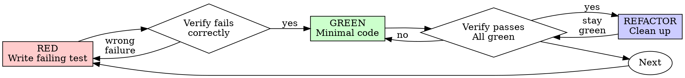

# 测试驱动开发（TDD）

## 概述

先写测试。观察它失败。编写最小代码让它通过。

**核心原则：** 如果你没有观察过测试失败，你就不知道它是否测对了东西。

**违反规则的文字即违反规则的精神。**

## 何时使用

**总是使用：**
- 新功能
- Bug 修复
- 重构
- 行为变更

**例外（询问你的用户伙伴）：**
- 一次性原型
- 生成的代码
- 配置文件

想着"就这一次跳过 TDD"？停下来。那是在狡辩。

## 铁律

```
没有失败的测试在前，就没有生产代码
```

先写了代码？删除它。重新开始。

**没有例外：**
- 不要保留为"参考"
- 不要在写测试时"适配"它
- 不要看它
- 删除就是删除

从测试开始重新实现。没有商量余地。

## 红-绿-重构



### RED - 编写失败的测试

编写一个最小的测试来展示应该发生什么。

<Good>
```typescript
test('retries failed operations 3 times', async () => {
  let attempts = 0;
  const operation = () => {
    attempts++;
    if (attempts < 3) throw new Error('fail');
    return 'success';
  };

  const result = await retryOperation(operation);

  expect(result).toBe('success');
  expect(attempts).toBe(3);
});
```
清晰命名，测试真实行为，一件事
</Good>

<Bad>
```typescript
test('retry works', async () => {
  const mock = jest.fn()
    .mockRejectedValueOnce(new Error())
    .mockRejectedValueOnce(new Error())
    .mockResolvedValueOnce('success');
  await retryOperation(mock);
  expect(mock).toHaveBeenCalledTimes(3);
});
```
命名模糊，测试 mock 而不是代码
</Bad>

**要求：**
- 一个行为
- 清晰命名
- 真实代码（除非不可避免，不要用 mock）

### 验证 RED - 观察它失败

**强制。永远不要跳过。**

```bash
npm test path/to/test.test.ts
```

确认：
- 测试失败（不是报错）
- 失败消息符合预期
- 因为功能缺失而失败（不是拼写错误）

**测试通过了？** 你在测试已有的行为。修正测试。

**测试报错了？** 修复错误，重新运行直到正确失败。

### GREEN - 最小代码

编写最简单的代码让测试通过。

<Good>
```typescript
async function retryOperation<T>(fn: () => Promise<T>): Promise<T> {
  for (let i = 0; i < 3; i++) {
    try {
      return await fn();
    } catch (e) {
      if (i === 2) throw e;
    }
  }
  throw new Error('unreachable');
}
```
刚好够通过
</Good>

<Bad>
```typescript
async function retryOperation<T>(
  fn: () => Promise<T>,
  options?: {
    maxRetries?: number;
    backoff?: 'linear' | 'exponential';
    onRetry?: (attempt: number) => void;
  }
): Promise<T> {
  // YAGNI
}
```
过度设计
</Bad>

不要添加功能、重构其他代码或"改进"超出测试范围。

### 验证 GREEN - 观察通过

**强制。**

```bash
npm test path/to/test.test.ts
```

确认：
- 测试通过
- 其他测试仍通过
- 输出干净（无错误、无警告）

**测试失败？** 修复代码，不是测试。

**其他测试失败？** 立即修复。

### REFACTOR - 清理

仅在绿灯后：
- 消除重复
- 改进命名
- 提取辅助函数

保持测试为绿。不添加行为。

### 重复

下一个功能的下一个失败测试。

## 好的测试

| 质量 | 好 | 差 |
|------|-----|-----|
| **最小** | 一件事。名称中有"and"？拆分它。 | `test('validates email and domain and whitespace')` |
| **清晰** | 名称描述行为 | `test('test1')` |
| **展示意图** | 展示期望的 API | 模糊了代码应该做什么 |

## 为什么顺序很重要

**"我之后写测试来验证它有效"**

之后写的测试立即通过。立即通过证明不了什么：
- 可能测错了东西
- 可能测的是实现，不是行为
- 可能遗漏了你忘记的边界情况
- 你从未看到它捕获 bug

先测迫使你看到测试失败，证明它确实在测试东西。

**"我已经手动测试了所有边界情况"**

手动测试是临时的。你以为测试了全部，但实际上：
- 没有记录你测试了什么
- 代码变化后无法重新运行
- 压力下容易遗漏
- "我试的时候能工作" ≠ 全面覆盖

自动化测试是系统性的。每次以相同方式运行。

**"删除 X 小时的工作是浪费"**

沉没成本谬误。时间已经过去了。你现在可以选择：
- 删除并用 TDD 重写（X 多小时，高置信度）
- 保留并在之后加测试（30 分钟，低置信度，很可能有 bug）

真正"浪费"的是保留你不能信任的代码。没有真实测试的工作代码就是技术债务。

**"TDD 是教条的，务实意味着适应"**

TDD 本身就是务实的：
- 在提交前发现 bug（比之后调试快）
- 防止回归（测试立即捕获破坏）
- 记录行为（测试展示如何使用代码）
- 支持重构（自由修改，测试捕获破坏）

"务实"的捷径 = 在生产中调试 = 更慢。

**"之后测试可以达到相同目标——这是精神不是仪式"**

不。之后测试回答"这做了什么？" 先测回答"这应该做什么？"

之后测试被你的实现偏差污染。你测试了你构建的东西，不是需要的东西。你验证了你记得的边界情况，不是你发现的那些。

先测迫使你在实现之前发现边界情况。之后测试验证你记得所有事情（但你做不到）。

30 分钟的之后测试 ≠ TDD。你获得了覆盖率，但失去了测试有效的证明。

## 常见狡辩

| 借口 | 真相 |
|------|------|
| "太简单了不需要测试" | 简单代码也会坏。测试只要 30 秒。 |
| "我之后测试" | 测试立即通过证明不了什么。 |
| "之后测试达到相同目标" | 后测 = "这做了什么？" 先测 = "这应该做什么？" |
| "已经手动测试了" | 临时 ≠ 系统性。没有记录，不能重跑。 |
| "删除 X 小时是浪费" | 沉没成本谬误。保留未验证的代码是技术债务。 |
| "保留作参考，先写测试" | 你会适配它的。这还是后测。删除就是删除。 |
| "需要先探索一下" | 可以。扔掉探索结果，用 TDD 开始。 |
| "测试难写 = 设计不清晰" | 听测试的。难测 = 难用。 |
| "TDD 会拖慢我" | TDD 比调试快。务实 = 先测。 |
| "手动测试更快" | 手动不证明边界情况。每次改动都要重新测。 |
| "现有代码没有测试" | 你在改进它。为现有代码添加测试。 |

## 红灯信号 - 停下来重新开始

- 代码在测试之前
- 测试在实现之后
- 测试立即通过
- 不能解释为什么测试失败
- 测试"稍后"再添加
- 狡辩"就这一次"
- "我已经手动测试过了"
- "之后测试也能达到相同目的"
- "这是关于精神不是仪式"
- "保留作参考"或"适配现有代码"
- "已经花了 X 小时，删了浪费"
- "TDD 是教条的，我是务实的"
- "这个不一样因为……"

**所有这些意味着：删除代码。用 TDD 重新开始。**

## 示例：Bug 修复

**Bug:** 空邮箱被接受

**RED**
```typescript
test('rejects empty email', async () => {
  const result = await submitForm({ email: '' });
  expect(result.error).toBe('Email required');
});
```

**验证 RED**
```bash
$ npm test
FAIL: expected 'Email required', got undefined
```

**GREEN**
```typescript
function submitForm(data: FormData) {
  if (!data.email?.trim()) {
    return { error: 'Email required' };
  }
  // ...
}
```

**验证 GREEN**
```bash
$ npm test
PASS
```

**REFACTOR**
如果需要为多个字段提取验证逻辑。

## 验证检查清单

在标记工作完成之前：

- [ ] 每个新函数/方法都有测试
- [ ] 观察了每个测试在实现之前失败
- [ ] 每个测试因预期原因失败（功能缺失，不是拼写错误）
- [ ] 编写了最小代码让每个测试通过
- [ ] 所有测试通过
- [ ] 输出干净（无错误、无警告）
- [ ] 测试使用真实代码（除非不可避免才用 mock）
- [ ] 覆盖了边界情况和错误处理

不能打完全部勾？你跳过了 TDD。重新开始。

## 卡住时

| 问题 | 解决方案 |
|------|----------|
| 不知道怎么测 | 写出你想要的 API。先写断言。问你的用户伙伴。 |
| 测试太复杂 | 设计太复杂。简化接口。 |
| 什么都要 mock | 代码耦合太紧。用依赖注入。 |
| 测试设置太庞大 | 提取辅助函数。仍然复杂？简化设计。 |

## 调试集成

发现了 bug？编写复现它的失败测试。遵循 TDD 循环。测试证明了修复并防止回归。

永远不要在没有测试的情况下修复 bug。

## 测试反模式

当添加 mock 或测试工具时，阅读 @testing-anti-patterns.md 以避免常见陷阱：
- 测试 mock 行为而不是真实行为
- 在生产类中添加仅测试用的方法
- 在不了解依赖的情况下 mock

## 最终规则

```
生产代码 → 存在测试并且先失败
否则 → 不是 TDD
```

没有例外，未经你的用户伙伴许可。