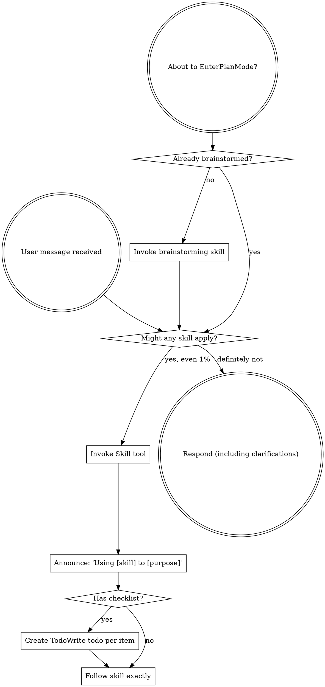

<SUBAGENT-STOP>
如果你作为子代理被派去执行特定任务，跳过此技能。
</SUBAGENT-STOP>

<EXTREMELY-IMPORTANT>
如果你觉得有哪怕 1% 的可能性某个技能适用于当前任务，你**绝对必须**调用该技能。

**如果某个技能适用于你的任务，你没有选择。你必须使用它。**

这不是讨价还价的，也不是可选的。你不能用任何理由绕过这一点。
</EXTREMELY-IMPORTANT>

## 指令优先级

Superpowers 技能覆盖默认系统提示行为，但**用户指令始终优先**：

1. **用户的明确指令**（CLAUDE.md、GEMINI.md、AGENTS.md、直接请求）— 最高优先级
2. **Superpowers 技能** — 在其与默认行为冲突时覆盖默认行为
3. **默认系统提示** — 最低优先级

如果 CLAUDE.md、GEMINI.md 或 AGENTS.md 说"不要用 TDD"，而某个技能说"总是用 TDD"，遵循用户的指令。用户说了算。

## 如何访问技能

**在 Claude Code:** 使用 `Skill` 工具。调用技能后，其内容被加载并展示给你——直接遵循它。永远不要用 Read 工具读取技能文件。

**在 Copilot CLI:** 使用 `skill` 工具。技能从已安装的插件中自动发现。`skill` 工具与 Claude Code 的 `Skill` 工具工作方式相同。

**在 Gemini CLI:** 技能通过 `activate_skill` 工具激活。Gemini 在会话启动时加载技能元数据，并在需要时激活完整内容。

**在其他环境:** 查看平台文档了解技能加载方式。

## 平台适配

技能使用 Claude Code 的工具名。非 CC 平台：查看 `references/copilot-tools.md`（Copilot CLI）、`references/codex-tools.md`（Codex）了解工具对应关系。Gemini CLI 用户通过 GEMINI.md 自动加载工具映射。

# 使用技能

## 规则

**在任何回复或操作之前调用相关或被要求的技能。** 即使只有 1% 的可能性某个技能适用，你也应该调用该技能检查。如果调用的技能最终不适用于当前情况，不需要使用它。

## 红灯信号

这些想法意味着停下来——你正在狡辩：

| 想法 | 真相 |
|------|------|
| "这只是个简单的问题" | 问题也是任务。检查技能。 |
| "我需要更多上下文" | 技能检查在澄清问题**之前**。 |
| "我先探索一下代码库" | 技能告诉你**如何**探索。先检查。 |
| "我快速看看 git/文件" | 文件缺少对话上下文。检查技能。 |
| "我先收集点信息" | 技能告诉你**如何**收集信息。 |
| "这个不需要正式技能" | 如果技能存在，就用它。 |
| "我记得这个技能" | 技能会演变。读当前版本。 |
| "这不算是任务" | 有行动 = 有任务。检查技能。 |
| "这个技能杀鸡用牛刀" | 简单的事也会变复杂。用它。 |
| "我就先做这一件事" | 在做任何事情之前检查。 |
| "这感觉挺高效的" | 没纪律的乱干浪费时间。技能防止这个。 |
| "我知道那是什么意思" | 知道概念 ≠ 使用技能。调用它。 |

## 技能优先级

当多个技能可能适用时，按此顺序：

1. **先流程技能**（brainstorming、debugging）— 决定**如何**处理任务
2. **后实现技能**（frontend-design、mcp-builder）— 指导执行

"我们来构建 X" → 先 brainstorming，再实现技能。
"修复这个 bug" → 先 debugging，再领域技能。

## 技能类型

**刚性**（TDD、debugging）：精确遵循。不要绕过纪律。

**灵活**（模式）：将原则适配到上下文。

技能本身会告诉你属于哪种。

## 用户指令

指令说**做什么（WHAT）**，不是说**怎么做（HOW）**。"加 X"或"修 Y"不代表可以跳过流程。