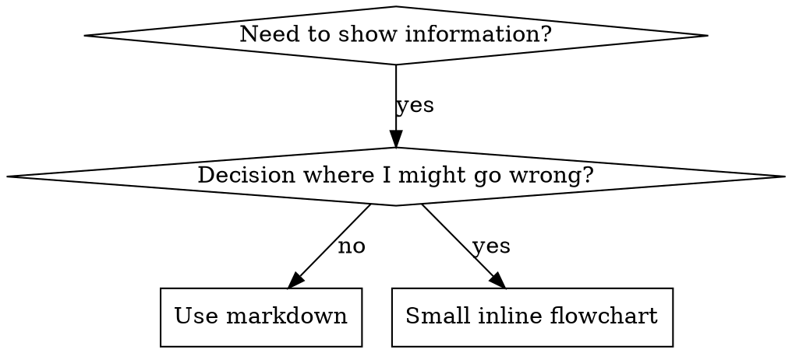

# 编写技能

## 概述

**编写技能就是将测试驱动开发应用于流程文档。**

**个人技能位于代理专属目录（Claude Code 在 `~/.claude/skills`，Codex 在 `~/.agents/skills/`）。**

你编写测试用例（带子代理的压力场景），观察它们失败（基线行为），编写技能（文档），观察测试通过（代理遵守），然后重构（堵住漏洞）。

**核心原则：** 如果你没有观察过代理在无技能时失败，你就不知道技能是否教会了正确的东西。

**必需的先修知识：** 在使用此技能之前，你必须理解 superpowers:test-driven-development。那个技能定义了基本的 RED-GREEN-REFACTOR 循环。本技能将 TDD 适配到文档编写。

**官方指南：** Anthropic 的官方技能编写最佳实践，见 anthropic-best-practices.md。本文档提供了额外的模式和指导，与本技能的 TDD 聚焦方法互补。

## 什么是技能

**技能**是对经过验证的技术、模式或工具的参考指南。技能帮助未来的 Claude 实例找到并应用有效的方法。

**技能是：** 可复用的技术、模式、工具、参考指南

**技能不是：** 关于你如何解决过一次问题的叙述

## 技能的 TDD 映射

| TDD 概念 | 技能创建 |
|----------|----------|
| **测试用例** | 带子代理的压力场景 |
| **生产代码** | 技能文档（SKILL.md） |
| **测试失败（RED）** | 无技能时代理违反规则（基线） |
| **测试通过（GREEN）** | 有技能时代理遵守规则 |
| **重构** | 保持合规的同时堵住漏洞 |
| **先写测试** | 在编写技能之前先运行基线场景 |
| **观察失败** | 记录代理使用的确切狡辩 |
| **最小代码** | 编写针对性解决这些违规行为的技能 |
| **观察通过** | 验证代理现在合规 |
| **重构循环** | 发现新的狡辩 → 堵住 → 重新验证 |

整个技能创建过程遵循 RED-GREEN-REFACTOR。

## 何时创建技能

**创建时机：**
- 某技术对你来说不是直观明显的
- 你会跨项目再次参考它
- 模式广泛适用（非项目特定）
- 其他人会受益

**不要创建：**
- 一次性的解决方案
- 其他地方已有完善文档的标准实践
- 项目特定的约定（放在 CLAUDE.md 中）
- 机械约束（如果可以用正则/验证自动执行，就用自动化——把文档留给需要判断的地方）

## 技能类型

### 技术
有具体步骤可遵循的确定方法（condition-based-waiting, root-cause-tracing）

### 模式
思考问题的方式（flatten-with-flags, test-invariants）

### 参考
API 文档、语法指南、工具文档（office docs）

## 目录结构

```
skills/
  skill-name/
    SKILL.md              # 主要参考（必需）
    supporting-file.*     # 仅在需要时
```

**扁平命名空间** — 所有技能在同一个可搜索的命名空间中

**单独文件用于：**
1. **重量级参考**（100+ 行）— API 文档、综合语法
2. **可复用工具** — 脚本、工具、模板

**保持内联：**
- 原则和概念
- 代码模式（< 50 行）
- 其他所有内容

## SKILL.md 结构

**Frontmatter（YAML）：**
- 两个必需字段：`name` 和 `description`（所有支持的字段见 agentskills.io/specification）
- 总长度不超过 1024 字符
- `name`：仅使用字母、数字和连字符（无括号、特殊字符）
- `description`：第三人称，只描述何时使用（不是做什么）
  - 以"Use when..."开头聚焦触发条件
  - 包含具体的症状、情境和上下文
  - **永远不要总结技能的过程或工作流程**（见 CSO 章节了解原因）
  - 尽量控制在 500 字符以内

```markdown
---
name: Skill-Name-With-Hyphens
description: Use when [specific triggering conditions and symptoms]
---

# 技能名称

## 概述
这是什么？1-2 句话的核心原则。

## 何时使用
[如果决策不明显，用小型内联流程图]

带有症状和用例的列表
何时不使用

## 核心模式（用于技术/模式）
之前/之后代码对比

## 快速参考
表格或列表用于快速浏览常见操作

## 实现
简单模式用内联代码
重量级参考或可复用工具链接到文件

## 常见错误
什么会出错 + 修复方法

## 真实影响（可选）
具体成果
```

## Claude 搜索优化（CSO）

**对发现至关重要：** 未来的 Claude 需要找到你的技能

### 1. 丰富的描述字段

**目的：** Claude 通过描述来决定在给定任务中加载哪些技能。让它回答："我现在应该读这个技能吗？"

**格式：** 以"Use when..."开头聚焦触发条件

**关键：描述 = 何时使用，不是技能做什么**

描述应仅描述触发条件。不要在描述中总结技能的过程或工作流程。

**为什么这很重要：** 测试发现，当描述总结了技能的工作流程时，Claude 可能会遵循描述而不是阅读完整的技能内容。一个说"任务间代码审查"的描述导致 Claude 只做了一次审查，尽管技能的流程图清晰显示了两次审查（先规格合规，再代码质量）。

当描述改为"Use when executing implementation plans with independent tasks"（没有工作流程总结）时，Claude 正确地阅读了流程图并遵循了两阶段审查流程。

**陷阱：** 总结工作流程的描述创建了 Claude 会走的捷径。技能正文变成了 Claude 跳过的文档。

```yaml
# ❌ 错误：总结了工作流程 —— Claude 可能遵循这个而不是阅读技能
description: Use when executing plans - dispatches subagent per task with code review between tasks

# ❌ 错误：过多过程细节
description: Use for TDD - write test first, watch it fail, write minimal code, refactor

# ✅ 好：只描述触发条件，没有工作流程总结
description: Use when executing implementation plans with independent tasks in the current session

# ✅ 好：只有触发条件
description: Use when implementing any feature or bugfix, before writing implementation code
```

**内容：**
- 使用具体的触发器、症状和表明该技能适用的情境
- 描述**问题**（竞态条件、不一致行为）而不是**语言特定的症状**（setTimeout、sleep）
- 保持触发器技术中立，除非技能本身是技术特定的
- 如果技能是技术特定的，在触发器中明确说明
- 用第三人称写（注入到系统提示中）
- **永远不要总结技能的过程或工作流程**

```yaml
# ❌ 错误：太抽象、模糊、没有说明何时使用
description: For async testing

# ❌ 错误：第一人称
description: I can help you with async tests when they're flaky

# ❌ 错误：提到了技术但技能并非针对该技术
description: Use when tests use setTimeout/sleep and are flaky

# ✅ 好：以"Use when"开头，描述问题，没有工作流程
description: Use when tests have race conditions, timing dependencies, or pass/fail inconsistently

# ✅ 好：技术特定技能，明确触发器
description: Use when using React Router and handling authentication redirects
```

### 2. 关键词覆盖

使用 Claude 会搜索的词语：
- 错误消息："Hook timed out"、"ENOTEMPTY"、"race condition"
- 症状："flaky"、"hanging"、"zombie"、"pollution"
- 同义词："timeout/hang/freeze"、"cleanup/teardown/afterEach"
- 工具：实际命令、库名、文件类型

### 3. 描述性命名

**使用主动语态，动词优先：**
- ✅ `creating-skills` 而不是 `skill-creation`
- ✅ `condition-based-waiting` 而不是 `async-test-helpers`

### 4. Token 效率（关键）

**问题：** 入门指南和频繁引用的技能会加载到每个对话中。每个 token 都很重要。

**目标字数：**
- 入门指南工作流程：每个 <150 词
- 频繁加载的技能：合计 <200 词
- 其他技能：<500 词（仍要简洁）

**技巧：**

**将细节移到工具帮助：**
```bash
# ❌ 错误：在 SKILL.md 中记录所有参数
search-conversations supports --text, --both, --after DATE, --before DATE, --limit N

# ✅ 好：引用 --help
search-conversations 支持多种模式和过滤器。运行 --help 查看详情。
```

**使用交叉引用：**
```markdown
# ❌ 错误：重复工作流程细节
When searching, dispatch subagent with template...
[20 lines of repeated instructions]

# ✅ 好：引用其他技能
Always use subagents (50-100x context savings). REQUIRED: Use [other-skill-name] for workflow.
```

**压缩示例：**
```markdown
# ❌ 错误：冗长的示例（42 词）
your human partner: "How did we handle authentication errors in React Router before?"
You: I'll search past conversations for React Router authentication patterns.
[Dispatch subagent with search query: "React Router authentication error handling 401"]

# ✅ 好：最小示例（20 词）
Partner: "How did we handle auth errors in React Router?"
You: Searching...
[Dispatch subagent → synthesis]
```

**消除冗余：**
- 不要重复交叉引用的技能中已有的内容
- 不要解释命令已经显而易见的内容
- 不要包含同一模式的多个示例

**验证：**
```bash
wc -w skills/path/SKILL.md
# 入门指南工作流程：每个目标 <150
# 其他频繁加载：合计目标 <200
```

**按做什么或核心洞察命名：**
- ✅ `condition-based-waiting` > `async-test-helpers`
- ✅ `using-skills` 而不是 `skill-usage`
- ✅ `flatten-with-flags` > `data-structure-refactoring`
- ✅ `root-cause-tracing` > `debugging-techniques`

**动名词（-ing）适合流程：**
- `creating-skills`、`testing-skills`、`debugging-with-logs`
- 主动态，描述你正在采取的行动

### 4. 交叉引用其他技能

**在编写引用其他技能的文档时：**

只使用技能名称，带显式的必需标记：
- ✅ 好：`**必需的子技能：** 使用 superpowers:test-driven-development`
- ✅ 好：`**必需的先修知识：** 你必须理解 superpowers:systematic-debugging`
- ❌ 错误：`See skills/testing/test-driven-development`（不清楚是否必需）
- ❌ 错误：`@skills/testing/test-driven-development/SKILL.md`（强制加载，浪费上下文）

**为什么不用 @ 链接：** `@` 语法立即强制加载文件，在你需要它们之前就消耗 200k+ 上下文。

## 流程图使用



**只在以下情况使用流程图：**
- 非显而易见的决策点
- 可能过早停止的流程循环
- "何时用 A vs B"的决策

**永远不要在以下情况使用流程图：**
- 参考资料 → 表格、列表
- 代码示例 → 代码块
- 线性指令 → 编号列表
- 没有语义含义的标签（step1、helper2）

图表的图样式规则见 graphviz-conventions.dot。

**为你的用户伙伴可视化：** 使用此目录中的 `render-graphs.js` 将技能的流程图渲染为 SVG：
```bash
./render-graphs.js ../some-skill           # 每个图表单独
./render-graphs.js ../some-skill --combine # 所有图表在一个 SVG 中
```

## 代码示例

**一个优秀的样例胜过多个平庸的**

选择最相关的语言：
- 测试技术 → TypeScript/JavaScript
- 系统调试 → Shell/Python
- 数据处理 → Python

**好的示例：**
- 完整可运行
- 有好的注释说明**为什么**
- 来自真实场景
- 清晰展示模式
- 可直接适配（不是通用模板）

**不要：**
- 用 5+ 种语言实现
- 创建填空模板
- 编写牵强的示例

你擅长移植——一个优秀的示例就够了。

## 文件组织

### 自包含技能
```
defense-in-depth/
  SKILL.md    # 所有内容内联
```
适合：所有内容都放得下，不需要重量级参考

### 带可复用工具的技能
```
condition-based-waiting/
  SKILL.md    # 概述 + 模式
  example.ts  # 可适配的工作辅助工具
```
适合：工具是可复用的代码，不只是叙述

### 带重量级参考的技能
```
pptx/
  SKILL.md       # 概述 + 工作流程
  pptxgenjs.md   # 600 行 API 参考
  ooxml.md       # 500 行 XML 结构
  scripts/       # 可执行工具
```
适合：参考资料太大无法内联

## 铁律（同 TDD）

```
没有失败的测试在前，就没有技能
```

这适用于新技能**和**对现有技能的编辑。

先写技能再测试？删除它。重新开始。
编辑技能不测试？同样的违规。

**没有例外：**
- "简单添加"也不例外
- "只是加一节内容"也不例外
- "文档更新"也不例外
- 不要把未经测试的改动保留为"参考"
- 不要在运行测试时"适配"
- 删除就是删除

**必需的先修知识：** superpowers:test-driven-development 技能解释了为什么这很重要。相同原则适用于文档。

## 测试所有技能类型

不同类型的技能需要不同的测试方法：

### 纪律执行型技能（规则/要求）

**示例：** TDD、verification-before-completion、designing-before-coding

**测试方式：**
- 学术问题：他们理解规则吗？
- 压力场景：他们在压力下会遵守吗？
- 多重压力组合：时间 + 沉没成本 + 疲劳
- 识别狡辩并添加明确的反驳

**成功标准：** 代理在最大压力下遵循规则

### 技术型技能（操作指南）

**示例：** condition-based-waiting、root-cause-tracing、defensive-programming

**测试方式：**
- 应用场景：他们能正确应用该技术吗？
- 变体场景：他们能处理边界情况吗？
- 信息缺失测试：指令有空白吗？

**成功标准：** 代理成功将技术应用于新场景

### 模式型技能（思维模型）

**示例：** reducing-complexity、information-hiding concepts

**测试方式：**
- 识别场景：他们能识别模式何时适用吗？
- 应用场景：他们能使用该思维模型吗？
- 反例：他们知道何时**不**应用吗？

**成功标准：** 代理正确识别何时/如何应用模式

### 参考型技能（文档/API）

**示例：** API 文档、命令参考、库指南

**测试方式：**
- 检索场景：他们能找到正确的信息吗？
- 应用场景：他们能正确使用找到的信息吗？
- 空白测试：常见的用例都覆盖了吗？

**成功标准：** 代理找到并正确应用参考信息

## 跳过测试的常见狡辩

| 借口 | 真相 |
|------|------|
| "技能显然很清楚" | 你觉得清楚 ≠ 其他代理觉得清楚。测试它。 |
| "只是参考资料" | 参考资料也可能有空白、不清晰的章节。测试检索。 |
| "测试小题大作" | 未经测试的技能总有问题。永远如此。15 分钟测试节省数小时。 |
| "如果出问题再测试" | 出问题 = 代理不会用技能。在部署之前测试。 |
| "测试太繁琐了" | 测试比在生产中调试有问题的技能要省事得多。 |
| "我确信它很好" | 过度自信保证会有问题。无论如何都测试。 |
| "学术审查就够了" | 阅读 ≠ 使用。测试应用场景。 |
| "没时间测试" | 部署未经测试的技能稍后要花更多时间修复。 |

**所有这些意味着：部署前测试。没有例外。**

## 让技能对狡辩免疫

执行纪律的技能（如 TDD）需要抵抗狡辩。代理很聪明，在压力下会找到漏洞。

**心理学注：** 了解为什么说服技巧有效有助于你系统地应用它们。关于权威、承诺、稀缺、社会认同和团结原则的研究基础，见 persuasion-principles.md（Cialdini, 2021; Meincke et al., 2025）。

### 明确封堵每一个漏洞

不要只陈述规则——禁止特定的变通方法：

<Bad>
```markdown
Write code before test? Delete it.
```
</Bad>

<Good>
```markdown
Write code before test? Delete it. Start over.

**No exceptions:**
- Don't keep it as "reference"
- Don't "adapt" it while writing tests
- Don't look at it
- Delete means delete
```
</Good>

### 处理"精神 vs 文字"的争论

尽早加入基本原则：

```markdown
**违反规则的文字即违反其精神。**
```

这切断了整个"我在遵循精神"的狡辩类别。

### 构建狡辩表

从基线测试中捕获狡辩（见下方测试章节）。代理的每个借口都放进表中：

```markdown
| 借口 | 真相 |
|------|------|
| "太简单了不需要测试" | 简单的代码也会坏。测试只要 30 秒。 |
| "我之后再测试" | 测试立即通过证明不了什么。 |
| "之后再测试达到同样的目标" | 后测 = "这做了什么？" 先测 = "这应该做什么？" |
```

### 创建红灯信号列表

让代理在狡辩时能自检：

```markdown
## 红灯信号 - 停下来重新开始

- 代码在测试之前
- "我已经手动测试过了"
- "之后再测试也能达到相同目的"
- "这是关于精神不是仪式"
- "这个不一样因为..."

**所有这些意味着：删除代码。用 TDD 重新开始。**
```

### 为违规症状更新 CSO

在描述中添加：你即将违反规则的征兆：

```yaml
description: use when implementing any feature or bugfix, before writing implementation code
```

## RED-GREEN-REFACTOR 用于技能

遵循 TDD 循环：

### RED：编写失败的测试（基线）

在没有技能的情境下用子代理运行压力场景。记录确切行为：
- 他们做了什么选择？
- 他们用了什么狡辩（逐字记录）？
- 什么压力触发了违规？

这是"观察测试失败"——在编写技能之前，你必须看到代理自然的行为。

### GREEN：编写最小技能

编写针对那些特定狡辩的技能。不要为假设性的情况添加额外内容。

在有技能的情况下运行相同场景。代理现在应该遵守。

### REFACTOR：封堵漏洞

代理发现了新的狡辩？添加明确的反驳。重新测试直到无懈可击。

**测试方法：** 完整的测试方法见 @testing-skills-with-subagents.md：
- 如何编写压力场景
- 压力类型（时间、沉没成本、权威、疲劳）
- 系统性地封堵漏洞
- 元测试技术

## 反模式

### ❌ 叙述式示例
"In session 2025-10-03, we found empty projectDir caused..."
**为什么不好：** 太具体，不可复用

### ❌ 多语言稀释
example-js.js, example-py.py, example-go.go
**为什么不好：** 质量平庸，维护负担

### ❌ 流程图中的代码
```dot
step1 [label="import fs"];
step2 [label="read file"];
```
**为什么不好：** 不能复制粘贴，难以阅读

### ❌ 通用标签
helper1, helper2, step3, pattern4
**为什么不好：** 标签应该有语义含义

## 停下来：在进入下一个技能之前

**在编写任何一个技能之后，你必须停下来完成部署流程。**

**不要：**
- 批量创建多个技能而不测试每个
- 在当前技能验证之前移到下一个
- 因为"批量更高效"而跳过测试

**下面的部署检查清单对每个技能都是强制的。**

部署未经测试的技能 = 部署未经测试的代码。这是对质量标准的违反。

## 技能创建检查清单（TDD 适配）

**重要：使用 TodoWrite 为下方每个检查项创建任务。**

**RED 阶段 - 编写失败的测试：**
- [ ] 创建压力场景（纪律型技能需要 3+ 种压力组合）
- [ ] 在**没有**技能的情况下运行场景——逐字记录基线行为
- [ ] 识别狡辩/失败的模式

**GREEN 阶段 - 编写最小技能：**
- [ ] 名称仅使用字母、数字、连字符（无括号/特殊字符）
- [ ] YAML frontmatter 包含必需的 `name` 和 `description` 字段（最多 1024 字符）
- [ ] 描述以"Use when..."开头，包含具体的触发器/症状
- [ ] 描述用第三人称编写
- [ ] 全文有关键词用于搜索（错误、症状、工具）
- [ ] 清晰的概述，包含核心原则
- [ ] 针对 RED 阶段识别的具体基线失败
- [ ] 代码内联或链接到单独文件
- [ ] 一个优秀的示例（不要多语言）
- [ ] **有**技能的情况下运行场景——验证代理现在遵守

**REFACTOR 阶段 - 封堵漏洞：**
- [ ] 识别测试中发现的**新的**狡辩
- [ ] 添加明确的反驳（如果是纪律型技能）
- [ ] 从所有测试迭代构建狡辩表
- [ ] 创建红灯信号列表
- [ ] 重新测试直到无懈可击

**质量检查：**
- [ ] 仅当决策不明显时使用小型流程图
- [ ] 快速参考表格
- [ ] 常见错误章节
- [ ] 没有叙述式故事
- [ ] 仅当需要工具或重量级参考时使用辅助文件

**部署：**
- [ ] 将技能提交到 git 并推送到你的 fork（如果已配置）
- [ ] 如果广泛有用，考虑通过 PR 贡献回去

## 发现工作流程

未来的 Claude 如何找到你的技能：

1. **遇到问题**（"测试不稳定"）
2. **找到技能**（描述匹配）
3. **浏览概述**（这个相关吗？）
4. **阅读模式**（快速参考表格）
5. **加载示例**（只在实现时）

**为此流程优化** — 早期并且频繁地放置可搜索的术语。

## 底线

**创建技能就是将 TDD 应用于流程文档。**

同样的铁律：没有失败的测试在前就没有技能。
同样的循环：RED（基线）→ GREEN（编写技能）→ REFACTOR（封堵漏洞）。
同样的好处：更好的质量、更少的意外、无懈可击的结果。

如果你在代码上遵循 TDD，在技能上也遵循它。这是同样的纪律应用于文档。